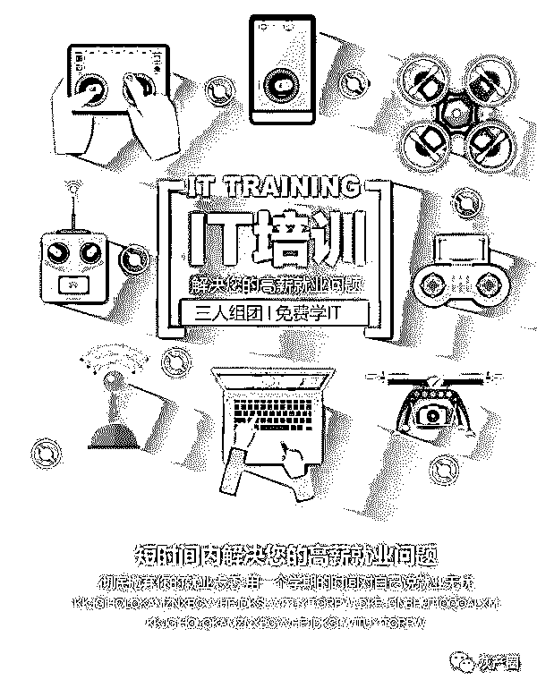

# IT 培训的背后，是“韭菜”的躺赚梦！

> 原文：[`mp.weixin.qq.com/s?__biz=MzIyMDYwMTk0Mw==&mid=2247496631&idx=1&sn=e04ae5426a85e5616f5c290aaa1d1ef5&chksm=97cb388fa0bcb19943590c6ee022484aeb2858d5c50833766d2a0348a13a749f2800f11c5f54&scene=27#wechat_redirect`](http://mp.weixin.qq.com/s?__biz=MzIyMDYwMTk0Mw==&mid=2247496631&idx=1&sn=e04ae5426a85e5616f5c290aaa1d1ef5&chksm=97cb388fa0bcb19943590c6ee022484aeb2858d5c50833766d2a0348a13a749f2800f11c5f54&scene=27#wechat_redirect)

**点击上方蓝色字体免费订阅“灰产圈”**

本文只谈"骗局"，不谈其他，绝不引战，如有错误，希望指出我会及时改正，想要讨论的可以在留言区写下你的观点和经历。

导语

为什么要写这篇文章呢，近些年培训这个话题也比较火，很多在看这篇文章的朋友身边也应该有从培训机构出来的同事或者同学，所以大家应该对培训机构并不陌生，刚好最近也在招人，也面试了不少人，过程暂且不表，就说说看法吧。

首先是水平不高，其次是造假包装；然后就是简历雷同、项目经验惊人的相似。

不止如此，面完后我也跟其中的一些人私信聊过，他们的经历也类似，毕业没找到工作。

看到培训机构的宣传及各种诱人的保证进了培训机构，交了不少学费，学了一段时间之后从机构毕业，但是最终结果则是依然很难找工作…

就业压力

现在国内产业升级，很多行业的路举步维艰，尤其是近些年高校毕业生越来越多。对于新人来说，面临的就业压力越来越大，互联网行业近些年异常火爆，很多人都想在互联网时代分一杯羹，由此催生出了众多的培训机构。

数量方面嘛，可以说是燎原之势，至于质量，只能说鱼龙混杂、泥沙俱下。本人也经常逛各种论坛或者群，由于写了几个项目和博客的原因，也认识了不少的行业内的朋友，在潜水和闲聊中也看到好多想入互联网这一行的初学者，被各种机构坑蒙拐骗，损失了时间和金钱却没有得到自己想要的结果，所以写这篇文章，帮初学者甄别下常见骗局，避一避坑。

以下内容可能会给你带来不适，不过现实往往就是这么残酷，有些事情就是这么发生了，文中也只是提到几种情况，并不是每个人都会遇到，写这篇文章也只是给新人提个醒，没有其他的想法了。

骗局一：包就业

今年都已经是 2019 年了，哪还有这一说，还说包就业的地方，非坑即骗。中国的几大高校也没说可以包就业了吧，一个培训机构，凭什么给你包就业？给你包到哪里？

我也听说过一些情况，要么就是班里大部分人都选择了其他行业，要么就是机构安排了不相干的职业，客服、销售、内勤等不相干的工作，要么就是进了外包公司，工资不高加班多，要么就是干脆不管了，只能自己投简历，这些都是真实发生的事情。

还有一种情况，岗前培训，这个大家应该都知道，不少的机构都是这个套路，投了简历，然后也有面试，最后被告知技术能力不行，不过可以通过交钱培训后再进行入职。（如果有朋友遇到这种公司，可以评论区留言，给新人少踩一些坑）

真的是无所不用其极！

招人的时候满嘴的高薪、好工作，花言巧语，收完钱之后就成了大爷。这些招人时所用的文案是不具备任何法律效益的，或者说语句中有漏洞的，只是一碗迷魂汤罢了，报名前的承诺的和实际相差甚远，我个人并不太了解相关的法律规定，描述有误的话会及时改正。

骗局二：与各种部门合作

谎称与国家教育部门合作办学、或者是跟各种知名大学合作办学、或者与 BAT 等类似的知名企业合作办学。

这种事情本人是亲身经历过的，记得当时是在大四的时候，被学校分配到一个实训基地，确实学校和培训机构有些合作，不过学校方面是为了就业率之类的数据，而培训机构则是为了趁机拉新，他们其实是利益双方，无非是把学生推来推去罢了，待了不到一个月完成学分之后，大部分同学就回学校了，不过也有人留了下来培训。

当然，如果有时间的话，也可以对照着合作单位，只要哪家机构说它跟什么单位合作，比如说跟中国平安合作，就去中国平安的官网找到客服电话，打过去问一下是不是真的有合作，我想这应该是一个很崩溃的场景。

骗局三：颁发各种证书

反正是各种忽悠，什么高级工程师、DBA、初级架构师….可以肯定的说，这些证证书作用几乎为 0，如果你把这些证写到简历上，你很有可能连面试电话都收不到，有些人一眼就能看出其中的猫腻。

收到简历，首先是看学历和你的毕业学校，其次是看你的项目经验，程序员，基本上是不需要什么证的，你又不是司机、律师、医生这些行业，需要一个资格证才能上岗。（极少数含金量高的证书除外，这种级别的证书培训机构是给不了的）

就像去年比较火的一个证书哥，拿了 n 多的证却找不到工作，为什么呢？含金量差太多了，100 张一毛钱的纸币也抵不了一张百元钞票的价值！最有用的证，就是大学毕业证、学位证，而不是其他乱七八糟的证书，这些就只是一张张的白纸一样，价值极低。

这里我要说一下，卖证书这个做法是培训机构让我最讨厌的一种行为，因为里面的学生不懂，所以就安利这些证书。虽然只有几百块，与高额学费相比的话显得很廉价，但是通过这种方式去剥削学生，无异于吸学生的血，这是在压榨他们最后的利用价值。为了利益连这种事情都做得出来，从一个还没有收入来源的学生身上榨取价值，我该以什么样的文字和表述来宣泄我的愤怒呢！！

骗局四：培训期间不收费

不能说是骗局，只能说是培训机构的手段吧，招收学员的时候说保证找到工作后再交学费，甚至有的机构还给补贴。有的学生就信了，还以为是培训机构为了他着想，殊不知这只是一种手段而已--分期付款，你放心，钱是一分都不会让你少交的，当你签了合同之后就不由得你说了算了。

想一想，有些同学从培训机构出来后，找不到工作，或者找到一份工资不高的工作，本就艰难的生活，还得去偿还分期贷款，他们踏入社会上的第一站太痛苦了。

骗局五：培训各种新技术

比如现在什么比较火？大数据、人工智能，VR，机器学习，物联网，云计算等等，什么东西火，培训机构就培训什么课程，那么培训机构中的老师水平如何呢？

我不止一次的听说过，有些班级的培训老师根本就是刚毕业的大学生或者毕业一年的大学生，官网介绍上的名师一个没有，那么这些人他自己会这些东西吗？无非是利用了一些噱头挂羊头卖狗肉罢了，进去也就是学习 Java、Python、前端、安卓这些课程。

零基础能够学习大数据吗？大多数零基础去培训大数据的，出来都找不到工作。一般能够从事大数据工作的，都是需要有个两三年的 Java 开发经验，通过学习大数据相关知识再转的。亦或者学历高，985/211 名校出身。零基础学历不高培训大数据只会找不到工作。

结尾

以上只是简单的说了一些，还有很多值得推敲和分析的东西，比如说培训机构官网上都会有的学员故事、就业薪资、就业率和平均就业薪资，如果认真对待的话，你应该会看到一些猫腻，言尽于此吧，水太深了，文章中其实是想放一些截图的，后来想了想也没放。

至于说对新人的建议，本来打了一大段字，但是全是鸡汤，最终又一行一行删掉，无非就是认清自己，要知道每一条路的开头都不好走，熬个一年半载也就好了，大多数人都是这么过来的。

倒不是对培训机构中的人有偏见，大家都是满怀希望、对未来充满憧憬的人，既然选择了培训，多多少少证明你是一个有梦想并愿意为之付出努力而奋斗的人，对于努力的人，我只有尊重。

而真正让人讨厌的是某些人的行为，最忍受不了的就是过度包装，大家都懂我说的是什么意思，但是不包装又找不到工作，找不到工作就只能听信培训机构的教唆，去包装简历，所以，这貌似是一个死循环，解不开，这里就不讨论了，每个人都有每个人的想法和评价吧。

← 向右滑动与灰产圈互动交流 →

**阅读原文加入灰产圈高端社群**