# 但凡有吃一粒花生米，也不会醉成这个样子

> 原文：[`mp.weixin.qq.com/s?__biz=MzIyMDYwMTk0Mw==&mid=2247496625&idx=1&sn=0f419d20773586ff06d8591b9c0308ab&chksm=97cb3889a0bcb19fddb819fa76eebc5c237c88adc6c74235699c61843e5649b2eead2e93f1d5&scene=27#wechat_redirect`](http://mp.weixin.qq.com/s?__biz=MzIyMDYwMTk0Mw==&mid=2247496625&idx=1&sn=0f419d20773586ff06d8591b9c0308ab&chksm=97cb3889a0bcb19fddb819fa76eebc5c237c88adc6c74235699c61843e5649b2eead2e93f1d5&scene=27#wechat_redirect)

**点击上方蓝色字体免费订阅“灰产圈”**

心理学上有“展望理论”：
它认为吃过亏的人，更容易为了利益而忽视眼前的风险，做出错误判断。在骗子眼里，这些人就是更容易上当的肥羊。
2019 年 10 月 29 日，趣步发布公告，将 APP 内的糖果明细进行归档处理，数据归档后，以往明细将不显示。这标志着趣步对糖果和 GHT 挂钩的数据进行删除。因为此前趣步发行的糖果和 GHT 是在第三方平台交易的，数据删除后，从此这些交易就成了参与者们的自发行为，与趣步官方责任脱钩。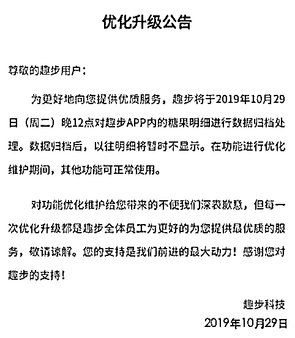话说趣步自 5 月份被多平台下架、7 月份被吊销营业执照，8 月份被立案调查以来，参与者人心惶惶，带头人士开始组建各种趣步难民收留群，二八于其中早早安排了一个卧底席位。
“趣步难民互助第 73 号群”，就是二八卧底所在。这里魔幻至极，充满了组织者的谎言和韭菜们的自嗨，堪称大型韭菜批发市场，智商在这里是稀罕物，韭菜在此可以论吨卖。10 月 16 日当天扫码进群，正好遇到群主在做日常洗脑，一股清新的洗脑味扑面而来：

“如果有一天，趣步科技招聘推广的大门关闭了，请不要奇怪，因为它给了你足够多的时间；是你没有把握。如果有一天，部分人成功了，请不要惊讶，因为虽然他了解的比你晚，但他行动比你快，敢于尝试一下，所以他得到了......”（洗脑原文节选）

↓

↓

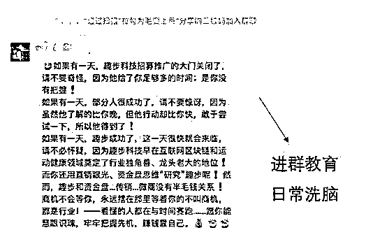

“有人给我说，趣步负面很多。我说是的，趣步从成立那天起就一直伴随着负面在成长，都一年多时间了，你才知道......”（洗脑原文节选）

↓

↓

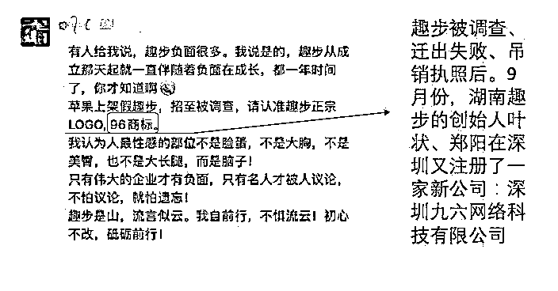

目前扒出来趣步创始人在深圳注册了新公司“96”，有些媒体认为是叶总可能要开展新业务，实际上看目前起的作用是转移和保存韭菜。

毕竟趣步发展至今，最大的价值就是建成了国内最大的韭菜基地。二八进入卧底的那天正好在糖果 GHT 跌跌不休期间，面对铺天盖地的官方媒体曝光，很多的轻型参与者都迷途知返了，但凡看清事实的人都知道 GHT 很快就要一文不值了，而群里的反应让我咂舌！两个字：别问！问就是抄底！ 

↓

↓

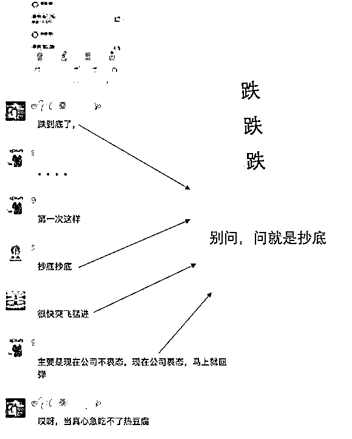

原来这一个个难民群都是世外桃源，组织者通过“难民互助的旗号”把他们聚集起来，然后天天洗脑、怡然自乐。

除了早中晚的洗脑鸡汤文和快讯外，更有每日洗脑音频

↓

↓

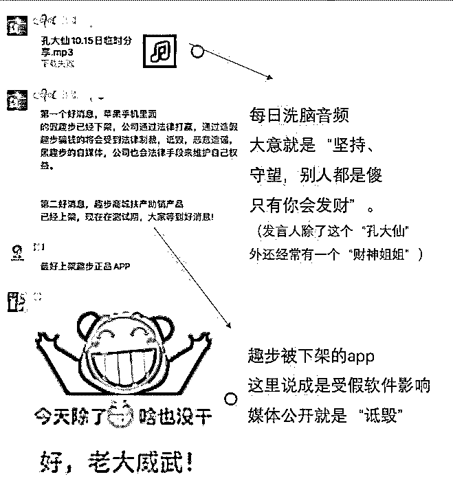不时散布苹果重新上架趣步 APP 的消息，被质疑后马上有文章解释，脑洞很大很专业。

↓

↓

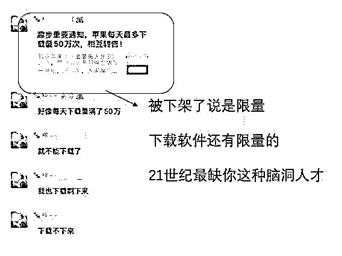除了谣传趣步 APP 重新上架意外，还有更劲爆的，传趣步要上市了。。有心直口快的群友质疑“应用商城，APP 都下架了，还上市个毛”
竟然回答“有可能趁着这波负面上市”。。。

↓

↓

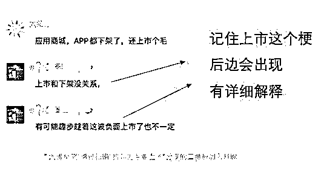对智商起码的尊重，这里是没有的随便找来一个小摊做地推，就是“全面对接实体经济”

↓

↓

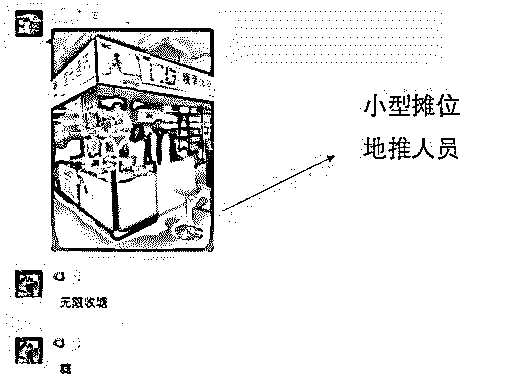问今是何世，不知 2019 年

* * *

至于被中字头官媒点名，被有关部门调查这些绕不过的黑点。则有前辈大哥的励志故事——“5 月份云集赴美国上市”，出来挡箭。

↓

↓

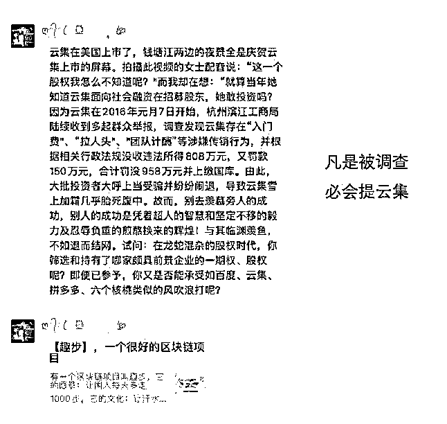
云集这个事，好多人不懂，前脚才因涉嫌传销被罚款，后脚怎么就能去美国上市，还成功了呢？这事要认真说起来，写个一万字不为过。这里不长篇大论，只讲云集在被调查后的举措，一个是整改后规避掉了触及传销的法律条文，另一个是选择条件宽松的美国上市。而实际上上市后的云集，也逃不掉持续空转，吸血会员最后消亡的命运，至于参与者们，除了早早就被薅掉一层厚羊毛外，上市后更被绑架吸血，各种意义上看都完全是受害者。所以举云集上市的例子，还是一贯忽悠韭菜的作风。由于难民群里总是飘着诱人的韭菜香，所以时不时就会有各种进来打广告的

↓

↓

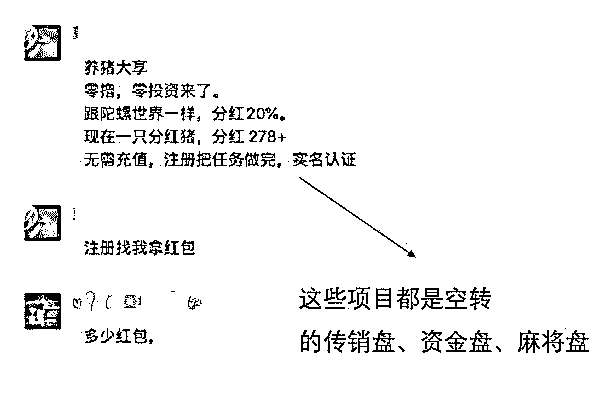

责任心重的，会先骂两句趣步，再打广告。

↓

↓

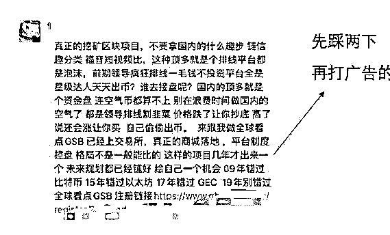

还有一种很闲的人，则专门进来调侃难民

↓

↓

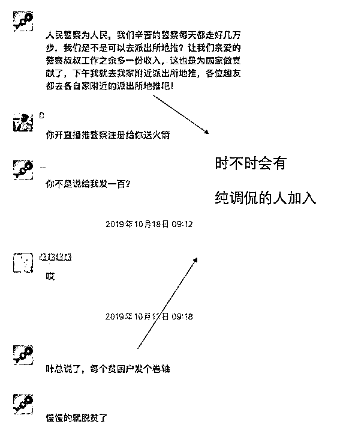  出于合理猜测，可能是他身边有亲人朋友被趣步坑了。群里定期清人，像这些打广告的、调侃的，很快就会被群主踢走。  

↓

↓

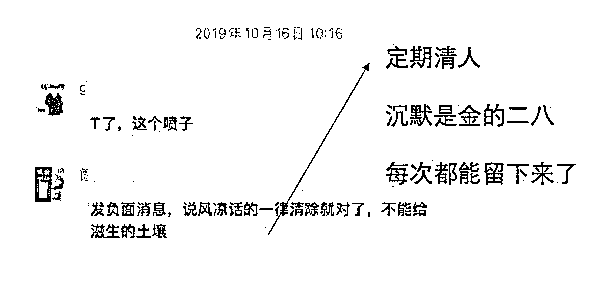根据观察，这个群的组织者，是一个在趣步被曝光时候来不及下车的大户，所以他组织人力，想要千方百计拖住时间，盼着趣步起死回生，求下车。可是等不来这一天了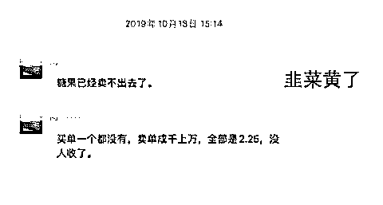连续 10 几天 GHT 跌跌不休啊，终于连群主也失去了耐心。亲口承认“趣步就是传销”

↓

↓

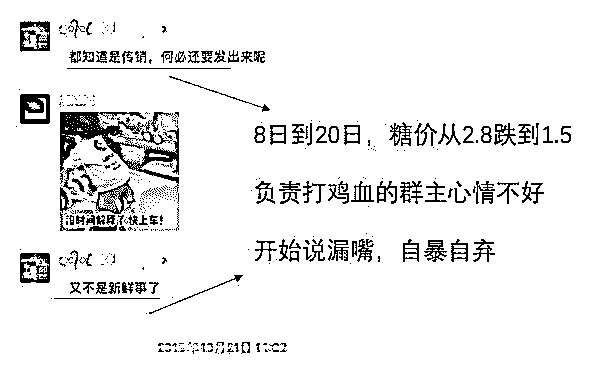

难民群从这下开始热闹了！！

大家伙“咦，原来你们都知道是传销啊”！

↓

↓

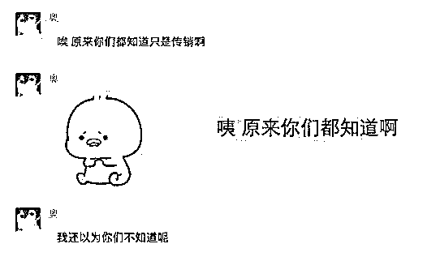

开始摊牌！我是趣步难民我怕谁？

↓

↓

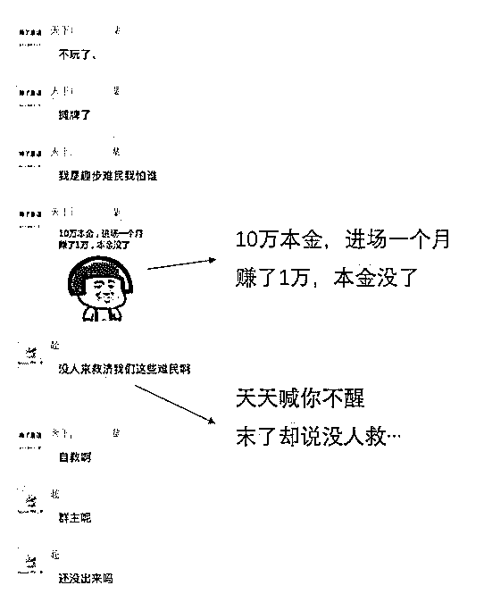

。。。“兄弟你回本了吗？”

“没有呢” 

。。。“信用卡、支付宝钱都拿完了”

↓

↓

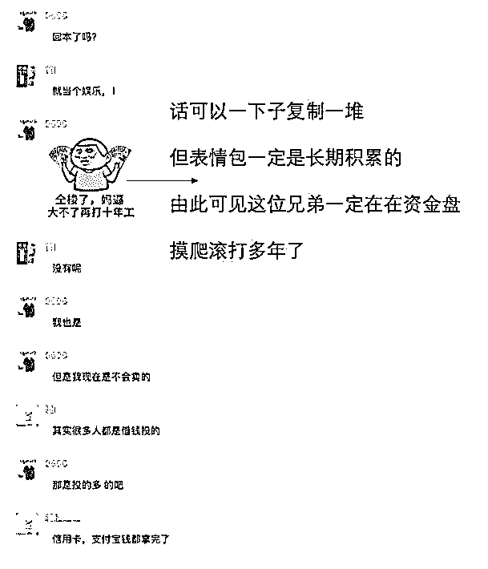抱怨“不看好机会下车，自己下车还要怂恿别人”

↓

↓

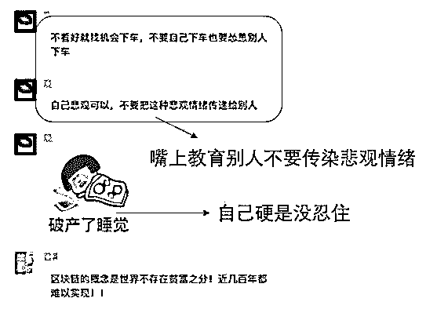“终于上网查查资料，什么是传销”

↓

↓

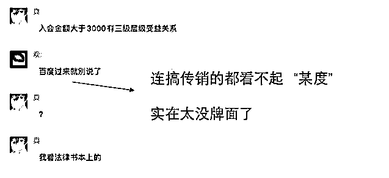难民们终于有点难民的样子了，可是哭完、盘点完损失，多少还是要再挣回点面子啊。
于是大型迷惑现场来了，刚刚还是哭爹喊娘的气氛，现在一个个看破红尘般自我开解。 

开启看破模式

↓

↓

“损失万把块，玩玩而已”
“这东西就是信仰”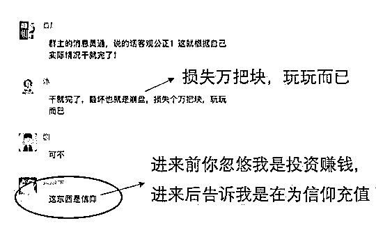“亏了等于交学费”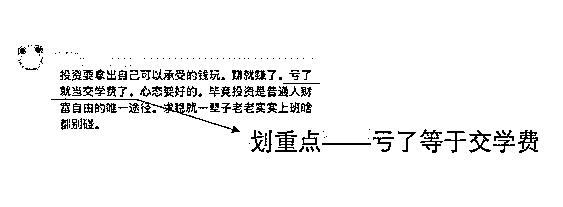“亏钱只是个爱好”
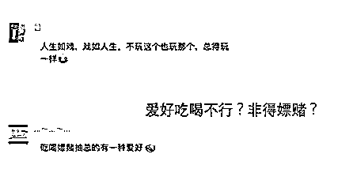

甚至开始自嗨

↓

↓

（为这种人生境界鼓掌）
可以的，大家有这心态，警察叔叔们就放心多了。
本以为难民嗨完就此解散，闹剧结束，想不到最后群主还是念念不忘这帮生死韭菜，临走之际，不忘放出自己在新资金盘里拉下线的二维码。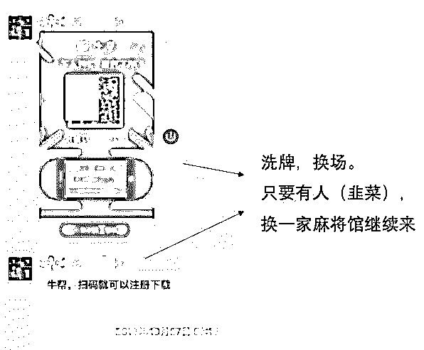兄弟们，咱们韭菜江湖里再见！据悉，一个组织者手里，这样的群数量在几十到几百个，一样的鸡汤一样的洗脑，一键转发。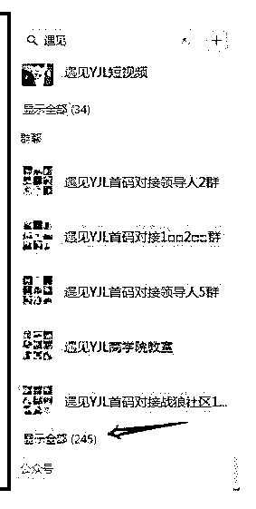

* * *

**心理学上有“展望理论”：**

它认为吃过亏的人，更容易为了利益而忽视眼前的风险，做出错误判断。

打个比方，现在有两个选项，

选项一：直接给你 1000 块钱；

选项二：剪刀石头布，赢了给你 3000，输了不给你钱；

你怎么选？

正常情况下，人们会选择一，直接拿走 1000 块钱，毕竟没有任何风险。

可是在另一种情况下，人们会选择第二，那就是在已经亏损 2000 块的情况下。

比起得到利益，人们更在意遭受损失。

这就是被割过老韭菜更容易加入新的资金盘的原因。
普通人 

但凡有吃一粒花生米，也不会醉成这个样子。

这粒花生米，可能就是终结诈骗的一篇文章。

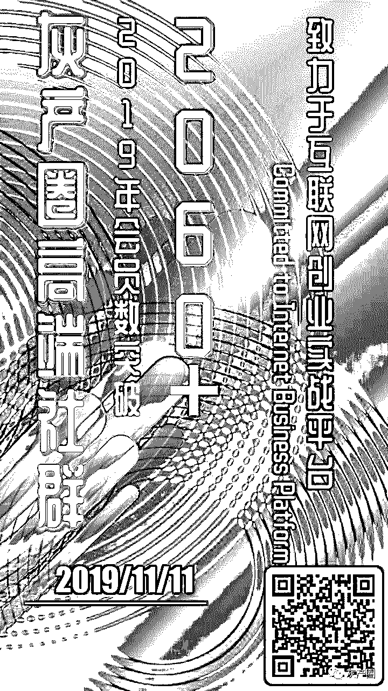

← 向右滑动与灰产圈互动交流 →

**阅读原文加入灰产圈高端社群**