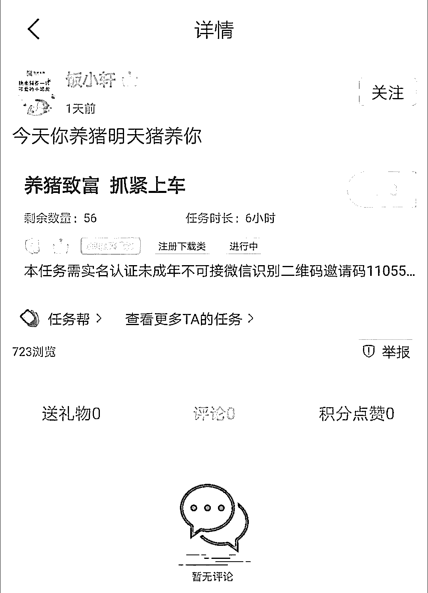
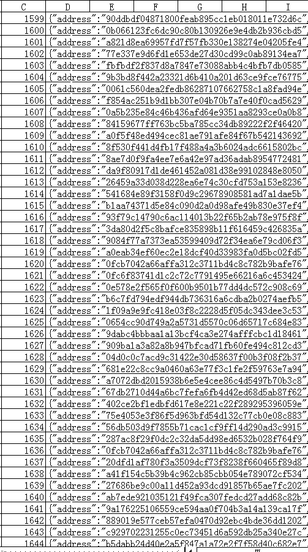

# 专业羊毛党：炒币亏损 50 万，薅羊毛赚回 30 万

> 原文：[`mp.weixin.qq.com/s?__biz=MzIyMDYwMTk0Mw==&mid=2247496593&idx=1&sn=ac3840c95312c8948279b30fae2855d6&chksm=97cb38a9a0bcb1bf16b45a183010284fca59e47fe742b209a6033a8a5e3c8de3945593f97239&scene=27#wechat_redirect`](http://mp.weixin.qq.com/s?__biz=MzIyMDYwMTk0Mw==&mid=2247496593&idx=1&sn=ac3840c95312c8948279b30fae2855d6&chksm=97cb38a9a0bcb1bf16b45a183010284fca59e47fe742b209a6033a8a5e3c8de3945593f97239&scene=27#wechat_redirect)

**点击上方蓝色字体免费订阅“灰产圈”**

 在币圈的生态中，除了项目方、媒体、投资者等常见角色以外，还有一种不为大众关注，但对项目产生重要影响的工种——羊毛党。 

他们单兵或者团队作战，在不违反项目方设定的规则下，进行大规模的操作，所到之处往往“片草不生”，往往令项目方闻风丧胆。

区块链项目初期启动的时候，通常会出台一些拉新优惠措施，例如每邀请一个用户注册账号，邀请者获得 XX 代币（某个项目的原生代币或者 USDT 等），交易所则采用返还一部分被邀请者等手续费等等。其中比较著名的几个项目包括：2018 年 Enumivo 对使用以太坊钱包向某个智能合约转账 0 ETH 的用户空投 ENU 代币；本体向每个在官网订阅了邮件的用户空投 1,000 个 ONT（本体的代币），以及最近非常火热、导致 EOS 网络资源紧缺的 EIDOS 空投。

以上的项目都有羊毛党的身影，他们控制着成百上千个账号，获得远超普通用户的代币，并创造了通过薅羊毛暴富的神话。

“做一个羊毛党挺好的：白薅总不会亏钱，最多伤点时间。”专业羊毛党「王二」（化名）向 31QU 表示自己的态度。

下文我们通过王二的阐述，来一窥其中的门道。

文 / 深度炼丹

** 羊毛党的作战流程 **

币圈竞争最激烈的一个赛道是“交易所”，因此很多交易所推出的优惠措施很大，王二也认为：“交易所羊毛，是大毛最常发生的地方。比如畅思，一个账号几千块。鲸交所的羊毛也不错。但是交易所是最难薅的，它们的安全监测多，爱封号。特别是小交易所，一言不合就跑路，根本就没想送。”同时他一气呵成地介绍了羊毛党的常规作战流程：第一步就是寻找羊毛。好的羊毛只能凭运气。例如最常见的就是交易所羊毛，有些实在小的不能再小的交易所或者项目，就放过吧，大多数浪费时间。找到可薅的项目后，接着观察他们的认证难度。交易所的认证方式主要有以下 3 种：1． 手持身份证；2． 人脸识别；3． 综合认证。手持认证是最简单的，很容易通过。人脸认证也算简单，可以找到任务平台发布任务，一单大约 5-10 元。

*某任务平台的实名认证服务*

综合性认证的则是手持+人脸视频识别+刷交易量认证+数据监控。这种不推荐薅，因为多数都是被封号的。有了这些资料后，就可以开始薅了。不过这时候还需要准备一些切换 IP 的工具和浏览器的工具。因为交易所通常都会记录登记 IP 和设备，如果同一个 IP 注册大量账号，很容易触发风控，导致被封号。工具准备好以后，换了 IP，浏览器打开匿名模式，清楚 COOKIES，严格风控的项目甚至要开虚拟机，就可以正式开始注册账号了。其中要注意的是手机号问题，有条件的自己多养些手机号，没条件的可以使用接码平台，大概 1 毛钱可以接到一条短信。最后就是风控问题，如果一个账号邀请了几百人，那么是很容易被封号的。因此最好分批进行，比如一个号邀请十来个以后，换成别的号。最终就是听天命了：要么白干，要么暴富。白干和暴富的比例，需要看眼光了。我看中的项目，60%都没白干。记得第一时间把薅到的币变现，不要有感情。卖卖卖。

最后王二作了补充：

> 羊毛党要有职业操守。
> 
> 坚决不对任何项目产生情感，绝不被反薅。 
> 
> 一个项目跨了就速度换下一个，被浪费时间维权。

根据王二的说法，坚持“卖卖卖”原则下来，他从没亏过。在微信群里，由于这一策略，王二又被群友称为“卖总”。

** 一个专业羊毛党堪比一个军团 **

王二给羊毛党做了一个简单的分门别类：

> 有些是专门地推的；有些是发任务，例如通过邀请链接注册，补贴多少钱给你；有些是靠编程纯技术薅的；有些是设备型的，一个人控制一片手机墙。

而王二则属于“靠编程纯技术薅羊毛”，也可以划分为“技术性专业羊毛党”。其他邀请真实用户的羊毛党可以简单归结为“普通羊毛党”。基本上专业的羊毛党所控制的账号（手机号/钱包地址等）在几十到上千甚至上万个，王二表示：“一个人控制几百个账号，群控的感觉还是挺过瘾的”。而他的以太坊账号达 1,600 多个，“因为很容易注册”，能控制的手机和电脑也达十几台。

*王二掌握的以太坊钱包地址*

但是他表示自己的段位还不够高级，另外一个「X 老板」（化名）才“威水”：“X 老板他不仅限于币圈，是全领域薅。楼盘开业抽奖，他去薅别人空调沙发。银行 APP 啥的他把优惠券、满减额度全薅了。至于币圈抽奖活动之类的，他一个人占抽奖名额一半以上。”除此之外，王二还介绍了 X 老板的两件牛逼往事，“之前有个安装软件的推广，大致是在一台上安装一个软件送多少钱这样的。结果，他跑去当地各大网吧，跟网管沟通好，把全市的机器全部安装上这个软件。”Brave 是一款无广告、响应速度快，植入代币激励的浏览器，但它的代币 BAT 也遭到了 X 老板的“毒手”：“ 还有个叫 BAT 币的，中国区起码有一大半他的团队薅走的，逼迫别人升级了好多次验证。甚至还有项目方发邮件给他，说项目已黄，别薅了。”王二还介绍了一个“更可怕”的羊毛党，是 X 老板的朋友：“什么项目他朋友一知道，一周内必黄。他有一大堆黑科技设备，和一大堆专业网络设备。”最后心有余悸地加了一句：“幸好，他们现在的目光大部分在传统互联网行业，放过了币圈。毕竟那个市场更大，项目更多。他们设备多，经验足，玩互联网项目优势更大。”一个专业羊毛党堪比一个军团，因此对项目方机制的设计非常考验，稍有不慎，项目方可能会因此出现重大的问题。

** 对羊毛党爱恨交加的项目方 **

当问及是否有平台是被羊毛党撸倒时，王二首先表示，“一个项目永远不是靠一个羊毛党就能玩垮的。如果它真的倒了，根本肯定是那个项目有问题。羊毛党只不过加速了进程而已。”但随后他补充：“确实有些项目是被羊毛党玩垮的，例如 POB、区分、支点、32 知……Steem 上的好几个小项目，也瞬间被薅黄了。”至于项目被玩垮背后的原因，王二归纳了几个原因：1\. 币价跌了。2\. 币的分配不均衡，认真玩的抱怨币都被薅走了。3\. 治理力度过大，玩家羊毛一通全杀光，导致没人气。4\. 本来穷，抠门不发币，全跑了。因此对项目方而言，项目启动时的拉新鼓励机制设计要非常非常谨慎。即然羊毛党的罪行如此“恶劣”，项目方是否应该赶尽杀绝呢？这个问题的答案不能一棍子打死：众多普通羊毛党活跃地邀请用户，为项目方创造了很好看的数据，例如注册用户、日活、使用时长等等。而且很重要的一点是，普通羊毛党和用户之间没有一个明确的界限，它们之间可以转化，例如为了获得交易所奖励的用户被邀请过来，如果有买币的需求，他们很有可能产生实际的购买行为；内容平台的羊毛党在为平台提供内容，可能也会在平台上停留，进行真实的看内容等行为。对此，王二的建议是：“羊毛在左，资金盘在右。羊毛党和权重党的界限要清晰，他们最好不要碰在一起并且各自有各自的空间。封杀羊毛其实很简单，数据上是很清晰的，但是封杀完毕后平台很可能就没人气了。”最后关于羊毛党的活跃是否遵循牛熊规律时，王二说：“无论牛熊，只要有机会，他们马上过来，毕竟人员设备都是现成的。”“比如这次 EIDOS，X 老板轻轻投入了几十台手机，也薅了不少 EOS 走。”“当然，EIDOS 我也薅了。”王二补充，“但是薅的不多”。

[`v.qq.com/iframe/preview.html?vid=e3018d1ihmg&auto=0`](https://v.qq.com/iframe/preview.html?vid=e3018d1ihmg&auto=0)

**《UP 主召集粉丝“薅羊毛”26 元买两吨橙子 律师：属于可撤销合同》**

← 向右滑动与灰产圈互动交流 →

**阅读原文加入灰产圈高端社群**