# 「陈安之」重现江湖：“我”花 118 万参加培训，到头来却家破人亡…

> 原文：[`mp.weixin.qq.com/s?__biz=MzIyMDYwMTk0Mw==&mid=2247496584&idx=1&sn=15a1f6a785786ab72915928f5d4119b9&chksm=97cb38b0a0bcb1a6d276bf1d24c96748a8b1292212662317eb2da6b1fb4e30b422db8d161d91&scene=27#wechat_redirect`](http://mp.weixin.qq.com/s?__biz=MzIyMDYwMTk0Mw==&mid=2247496584&idx=1&sn=15a1f6a785786ab72915928f5d4119b9&chksm=97cb38b0a0bcb1a6d276bf1d24c96748a8b1292212662317eb2da6b1fb4e30b422db8d161d91&scene=27#wechat_redirect)

**点击上方蓝色字体免费订阅“灰产圈”**

> 曾经有一个笑话，有个人说：谁给我 10 块钱，我就能告诉谁，赚 100 块钱的办法。真有人不信邪，给了 10 块钱。答案是：再找 10 个像你这样的傻子就可以了。
> 
> 感觉走到人生尽头的“成功者们”  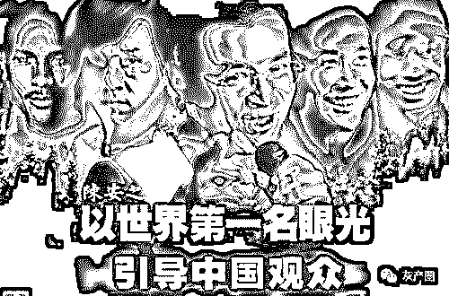
> 
> 2019 年 7 月的黄浦江边，热浪滚滚，人潮涌动的游人脸上，无不洋溢着幸福的笑容。 
> 
> 然而，对于来自贵州的牛芳芳（化名）和四川的秦雪（化名），这两位曾经梦想通过花百万巨款，参加陈安之的成功学培训、拜师走向成功的女人来说，这个炎热的夏天，他们几乎已经走到了自己人生的尽头。偌大的上海他们不知道该求助谁？十几天的奔波他们没有得到陈安之成功学培训机构的任何回复，他们也跑遍了应该求助的部门，也没有得到任何帮助。住在 80 块钱一天的青年旅馆里，秦雪每天的饭钱被严格控制在了 8 元钱以内，几乎是馒头加开水撑过每一天，已经是一贫如洗，债台高筑，婚姻破裂，她实在是再没有能力去，哪怕是超过 8 元的“奢侈”。秦雪说：家庭情况稍好点的大姐牛芳芳，看她实在是太节省，给她买回来两个火腿肠，这曾令她热泪盈眶。牛芳芳和秦雪曾经两次前往黄浦江畔，看着涛涛的江水，准备结束自己的生命，一走了之。这一切的不幸，都源于他们花了 100 多万，参加了陈安之成功学的培训、拜师，一切都开始变得万劫不复。陈安之 108 万的“终极弟子”牛芳芳
> 
> 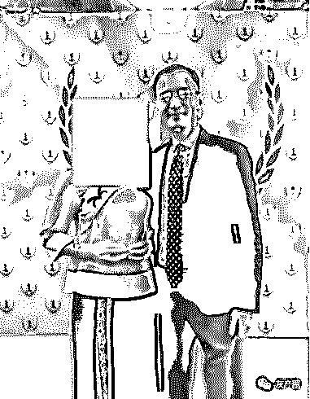
> 
> 108 万的“终极弟子”牛芳芳和大师陈安之合影家住贵州遵义的牛芳芳，在 2018 年 5 月份以前，是一个普普通通的农村养殖户，靠贷款，她和丈夫在村里养着 300 多只羊和几十头牛，生活也算平淡满意，过得波澜不惊。渴望成功是中国人的天性，人到中年的马芳芳，也毫不例外。一个偶然机会，她看到有人在微信上向她推荐陈安之的成功学培训，并且说的神乎其神，抱着好奇心，牛芳芳交了 1680 元，参加了在河南郑州皇冠大酒店举办的，所谓的陈安之成功学培训大会。
> 
> 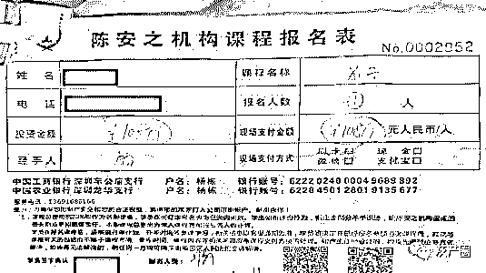牛芳芳的 108 万元的“终极弟子”拜师费收据
> 
> 头一次出门，并且到达省会一级大城市的牛芳芳，彻底被大会的规模和陈安之的演讲所深深折服。
> 
> 牛芳芳说：事后细想，两天的大会基本都是陈安之和弟子们在吹嘘他们的过往成就，和不断地灌输心灵鸡汤、喊口号、励志、洗脑的豪言壮语，很像传销的大会，并没有具体、务实的，能够指导企业如何发展的灵丹妙药。大会的一项重要内容便是，数目众多的所谓陈安之的助理们，在会上会下，配合陈安之不厌其烦地说服参会的人员拜陈安之为师，保证在陈安之的教导下，更快地走向成功。陈安之许诺，依靠他的人脉资源和名望，拜他为师后，随便指点几个项目，都能让他们赚上几千万。在已经废弃的养殖场里，牛芳芳夫妇痛苦地说：正是基于陈安之的承诺欺骗和自己的无知，他们卖掉了自己的 300 多头羊，50 多头牛，又东借西挪，凑够了 108 万拜师费，交给了陈安之的“上海成功新天地商务咨询有限公司”。
> 
> 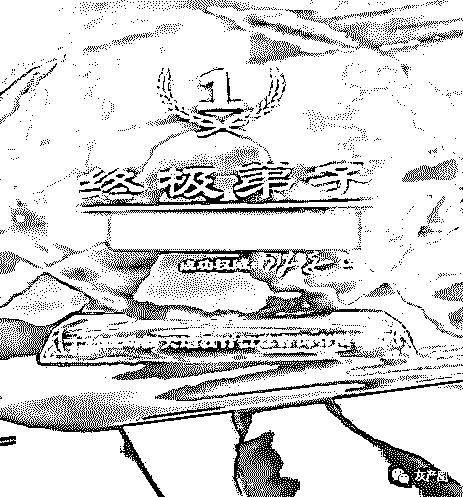
> 
> 牛芳芳 108 万购买的“终极弟子”牌匾 108 万是陈安之“终极弟子”拜师的费用；“入门弟子”的拜师费用是 31 万；最高的“接班弟子”的拜师费用是 308 万。
> 
> 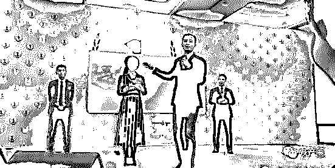
> 
> 这位女士交了 408 万（含 100 万的出书费用）成为陈安之大师的“接班弟子”。但令牛芳芳困惑的是，这位交了 408 万，成为陈安之“接班弟子”的女士，在几次培训中，他们都始终没有见到。倾尽所有，交了 108 万的拜师费，成为陈安之的“终极弟子”后，牛芳芳到上海又培训了 9 次，但从第 2 次开始，她和丈夫就感觉上当了，并且是上了一个冠冕堂皇、精心布局的高级“当“”。尽管培训了 9 次，但每次的内容，几乎和 1680 元的大会培训内容全部一样，就是不断地重复灌输心灵鸡汤、洗脑、心理暗示、喊口号，没有任何新鲜内容。每一次培训，占用一半时间的重要内容是，陈安子的各种助理和弟子们们登台，推销他们的贵得离奇的各种产品，如：海外公司的原始股票、数字货币、海参、玉石、易经八卦、起名改名、各种真假的难辨的奢侈品等等，应有尽有，忽悠学员和弟子们踊跃购买。
> 
> 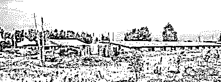
> 
> 马元琴已经破败的养殖场
> 
> 架不住陈安子的忽悠，牛芳芳又借了 10 万块钱，**投资了一个他的台湾地区公司股票和数字货币，至今，一直告诉她在亏损。**请大师改了自己的名字，交了 3 万多的改名费。
> 
> 牛芳芳靠在破败的牛栏上，望着空空的牛场，满面愁容地说：参加完最后一次培训，还有的一点希望，彻底破灭，知道这就是一个骗彻头彻尾的骗局。
> 
> 好好的养殖场，落到如此地步，债主堵门要债，生活难以为继。牛芳芳夫妇不得已，又借了几万块钱，一边开始养殖兔子和小鸡，维持生计，一边开始走上维权的道路。
> 
> 陈安之 41 万的“入门弟子”秦雪
> 
> 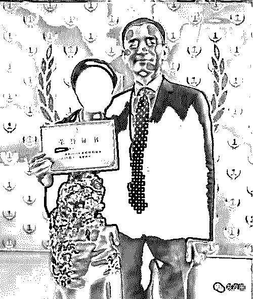
> 
> 交了 41 万“入门弟子”费用的秦雪
> 
> 殊途同归，秦雪的陈安之成功学培训、拜师不幸之路，和牛芳芳是如此的相似。秦雪说：自己本来有一个和谐幸福的家庭，满意的职业。自从参加了陈安之的成功学培训，可以说是跌入了万劫不复的深渊。
> 
> 秦雪说：和牛芳芳一样，开始也是被陈安之的助理，从微信上忽悠到西安的一家郊区温泉度假酒店，参加培训大会的。
> 
> 事后知道，这样的陈安之成功学培训大会，几乎每个月在各个省会城市都有召开，门票 1680 元、1980 元、3800 元不等。
> 
> 讲课内容无一例外的都是，陈安之吹嘘他的过往成就，和不断地灌输心灵鸡汤、喊口号、励志、洗脑的豪言壮语，很像传销的大会，并没有具体、务实的，能够指导企业或创业如何发展的灵丹妙药。
> 
> 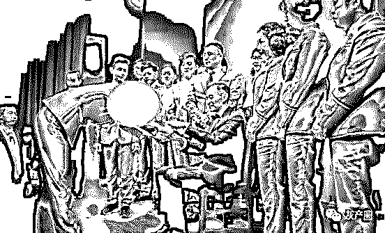
> 
> 秦雪成为“入门弟子”的拜师仪式
> 
> 秦雪成为陈安之的“入门弟子”更有神奇的经历。
> 
> 在西安的培训会场，各种洗脑演讲进入高潮后，陈安之当场要求有意成为她弟子的人举手上台，上台有几十个人，秦雪便是其中之一。后来，知道上当后，秦雪意识到这里面大部分人，应该是“托”。
> 
> 陈安之通过易经八卦、气质、属相、名字等等，一通忽悠，最后竟挑中了秦雪和另外两人，秦雪当时感觉非常荣幸和激动。感觉这是上天给予自己的一次重要的命运转折机会。
> 
> 秦雪夫妇过得是小城市的小市民生活，并没有多余的钱财。为了交上 31 万的拜师费，她不顾丈夫的阻止，辞了工作，抵押了房产，贷款 30 万，交了 31 万的拜师费，荣幸地成为陈安之的“入门弟子”。
> 
> 在上海参加第一次弟子培训课时，一样被陈安之忽悠，买了 10 万元的台湾地区公司的股票。
> 
> 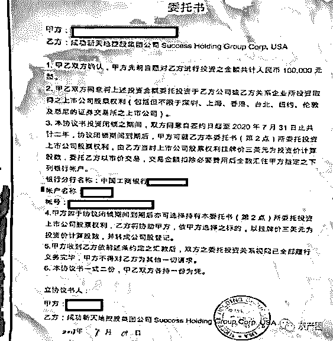
> 
> 投资陈安之公司的协议书
> 
> 秦雪的美好愿望，也是从第二次上海培训后，开始破灭的，她和牛芳芳也是在弟子培训班上认识的。每次的讲课内容就是不断地重复洗脑、心灵鸡汤、心里暗示、喊口号……，没有任何新意。
> 
> 培训课堂一项重要的内容就是，陈安之的各路助理和弟子们，不断上台，推销他们的股票、投资项目、比特币、海参、易经八卦、玉石等产品，吹得神乎其神，价格却贵得离奇。
> 
> 秦雪说：他在西安第一次培训时，看到有揭露陈安之的维权者，带着高帽，举着牌子，被陈安之的助理们拖出门外痛打，自己感觉一定是他没有好好学习，还来怪罪老师。
> 
> 现在终于明白，自己不过是后来的上当者而已。
> 
> 和牛芳芳一样，陈安之承诺，拜他为师，随便给几个项目，就能让她们赚个几千万，不是任何人都能拜他为师的，要看缘分。
> 
> 几千万没有赚到，秦雪几乎落了个家破人亡，丈夫因为她一意孤行，辞工作、贷款交拜师费，和她离了婚。现在他独自带着孩子，背着 40 多万的沉重债务，拮据地生活着。
> 
> 7 月的上海滩，不是考虑到孩子，也许她和牛芳芳已在黄泉路上。
> 
> 陈安之的成功学培训产业链
> 
> 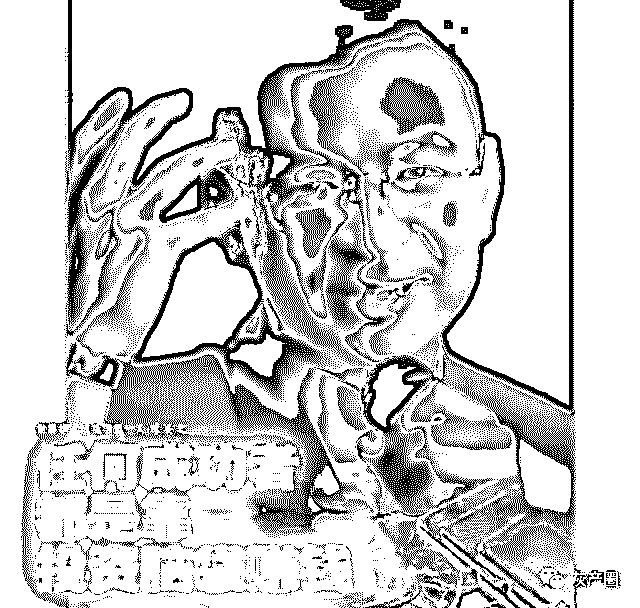
> 
> 在看完陈安之诈骗的事件后，问问妹忍不住在雪球 App 内发问：如此显而易见的诈骗，为何不断有人上当？为什么在这个年代，陈安之们还能公然行骗！
> 
> 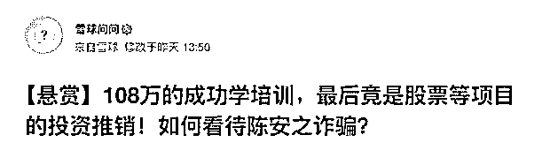
> 
> 雪球用户回答：渴望成功是人类的天性，很多普通人都希望找到捷径快速成功。越迫切，越容易上当。陈安之的成功学抓住了这个社会上浮躁的人群，这群焦虑不安的人，不被陈安之骗也会被王安之骗。陈安之大师们的所谓成功学培训，其实是一个长长的食物链，这个链条上的分食者各得其所，榨干学员们的每一分钱。雪球用户三线游资说：如果真想跟陈安之学成功学，不用交学费，直接办个陈安之成功学分店就可以了！如果他能成功，他为什么不用他的“成功学”赚钱。而实际上，他正在用他的成功学赚钱。
> 
> 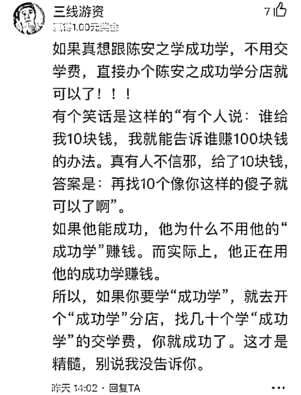
> 
> 实际上，这就是一个诈骗团伙，他们挂着成功学培训的名义，以非法占有为目的，虚构事实，虚假承诺，诈骗别人的巨额钱财，非常符合诈骗罪的要件。另外，他们吸收投资资金的行为，已经具备非法集资的犯罪要件。什么培训？什么内容？有什么价值？可以动辄收费 400 多万？100 多万？40 多万？他们培训成功了多少人？成功的概率是多少？**雪球用户佑霄**说：成功若能通过培训获得，大学早就开设这门课程了。
> 
> 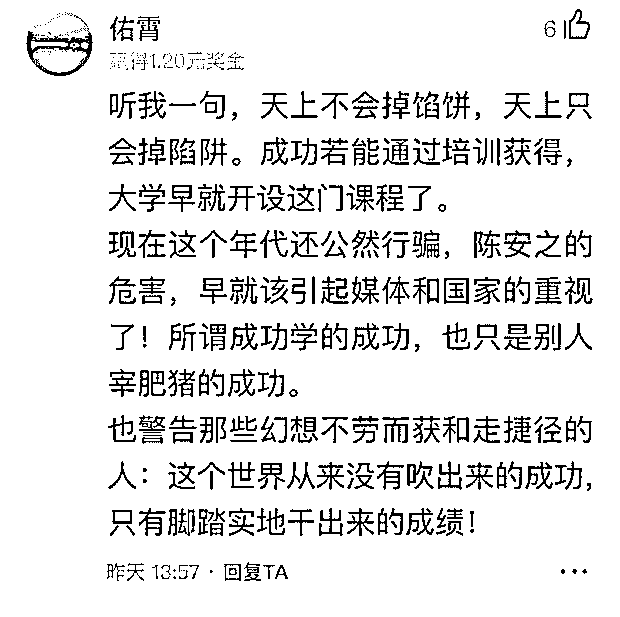
> 
> 大部分受害者都是和牛芳芳、秦雪一样的小微企业业主。经济形势下滑的当下，坑骗这些小微企业，无异于使他们雪上加霜。
> 
> 如何成为“成功者”？
> 
> 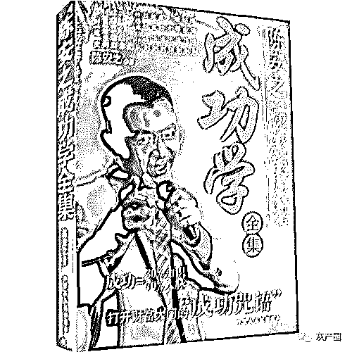
> 
> 在和牛芳芳、秦雪的交流中，问他们，你们感觉如何通过学习陈安之的培训、拜师，来取得成功？他们说：只有一种可能。那就是成为他培训课程的代理商或合作者，也忽悠更多的人来培训、上课、拜师，卖产品、非法集资，然后拿到分成，这样就有可能成功。陈安之的弟子“徐鹤宁”、“余博雅”就是这样的成功者，他们靠背陈安之设计好的“话术”，自立门户，行走江湖。陈安之也在课堂上不断地教导学员们，拉来人头参加培训、拜师，就给高额提成，或者背“话术”成为徐鹤宁、余博雅这样的弟子，独立门户，行走江湖，但他们不想干违法、骗人的事。陈安之的众多弟子和代理商，正是由学员和弟子，依靠这种“捷径”而变成“成功者的”！除了中小企业者，散户股民也是“成功学”的坑骗对象。股市江湖的骗子，卖课程或者卖软件的，套路基本上都十年如一没有变过，如果遇上这种套路的，肯定就是骗子了。**雪球用户@Ricky 总结了股市“成功学”的套路：**第一步——给自己带上成功光环，基本上思路就是先说自己在类似海外华尔街某些牛逼机构待过，会把那段经历描述得栩栩如生，然后就学到了什么大招，从此顿悟了，当然这个经历一般是不可验证的；第二步——说明自己的成功是可以复制的，一般会说有多少学员跟着自己操作，有多少学员都成功实现了盈利，并且盈利水平是有吸引力的；第三步——开始讲自己的炒股绝招，一般会找几只股价走势非常漂亮的图形，进行炒股图解，单边上涨的股票，打开后视镜看股价走势图进行点评，每个点位都可以精准预测，再加上一通指数指标解释，简直神奇，炒股如此简单；第四步——再进一步理论上拔高自己，一般会把市面上其他炒股方式都埋汰一遍，比如基本面分析，会说看财报、做研究都是浪费时间，怎么比得过大机构，顺便可能也会埋汰下普通的 K 线技术分析，然后说自己是有套神奇的独创指标，操作性非常高，根据这个指标来炒股非常简单；第五步——强化成功套路，一般会打开自己的炒股软件进行案例教学，当然案例肯定也是找几个股价走势符合教学套路的图，按照自己的指标跑一遍，在过程中反复强化可以简单上手快速赚钱；第六步——让你掏钱！套路一般是，炒股这么简单，让你少走弯路，买炒股软件和炒股课程的钱，做几笔操作就赚回来了。这就是股市成功学的基本套路，和陈安之的成功学没有太大区别，虽然看着很 low，但是总能忽悠一批又一批人，尤其是在牛市的时候，很多股民不知道该如何操作，又急于入市。股市成功学贩卖者往往会利用新股民想快速致富的预期，把软件或者课程贩卖给新股民，但是股市没有成功学，当你就这他们贩卖的炒股软件操作以后，估计都不知道自己是怎么亏钱的。
> 
> 聪明的投资者，首先要意识到炒股赚钱没有这么傻瓜的成功学！
> 
> **作者：丁新伟****来源：消费日报，雪球网 **
> 
> [`v.qq.com/iframe/preview.html?width=500&height=375&auto=0&vid=g0153i3fxbn`](https://v.qq.com/iframe/preview.html?width=500&height=375&auto=0&vid=g0153i3fxbn)
> 
> **《老梁故事汇之“大师”就这么忽悠你》**
> 
> 
> 
> 
> 
> 
> 
> 
> 
> ← 向右滑动与灰产圈互动交流 →
> 
> 
> 
> **阅读原文加入灰产圈高端社群**