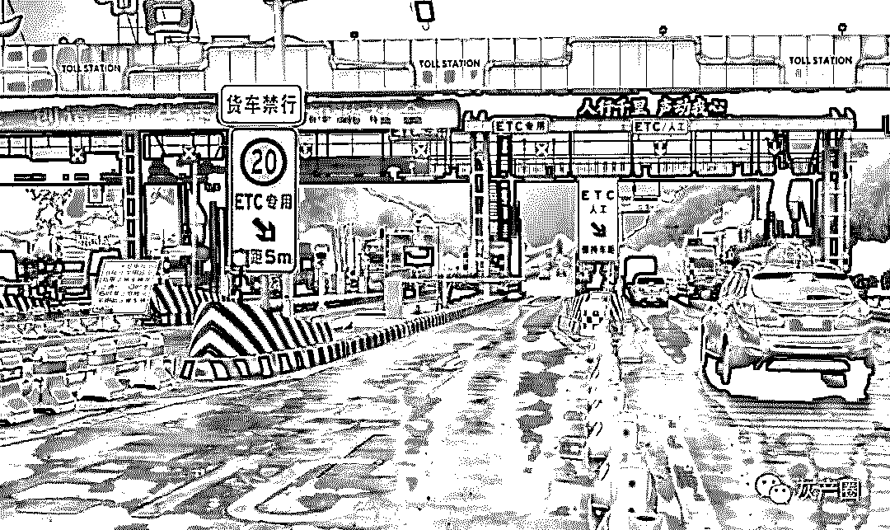
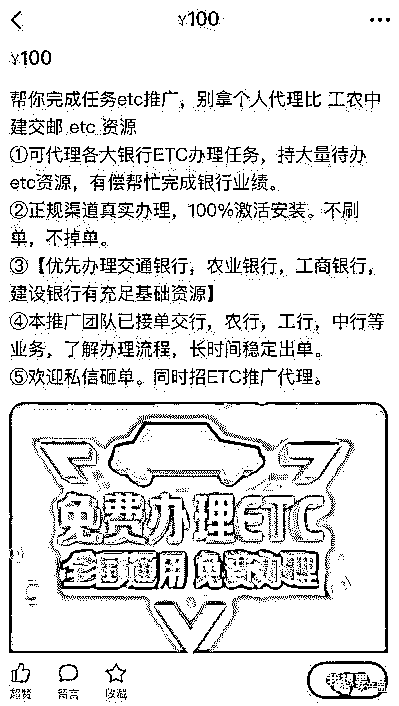
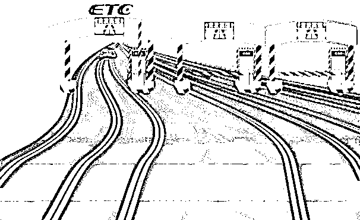
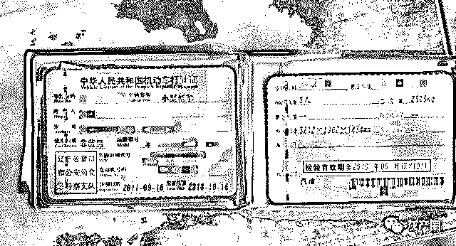
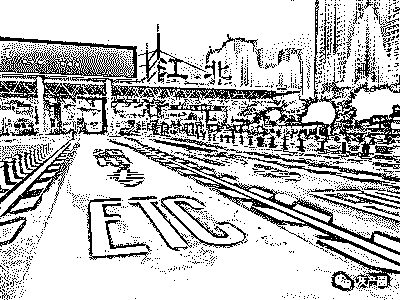
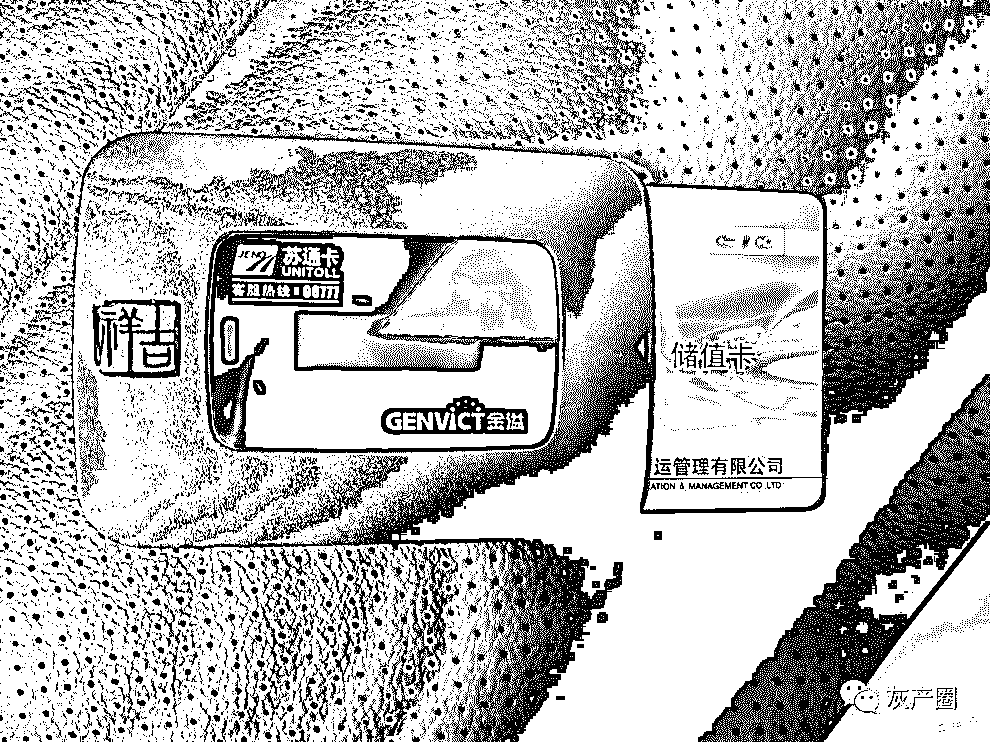

# ETC 背后的黑产江湖：代接推广拼业绩，一单结算 180 元！

> 原文：[`mp.weixin.qq.com/s?__biz=MzIyMDYwMTk0Mw==&mid=2247496572&idx=1&sn=87177f47e7be5c2a3c3d49c47837d5d9&chksm=97cb3844a0bcb152b3d0eee148623768e2c00a1e29401c0e839d70ec7c96c20419ec8bad7c03&scene=27#wechat_redirect`](http://mp.weixin.qq.com/s?__biz=MzIyMDYwMTk0Mw==&mid=2247496572&idx=1&sn=87177f47e7be5c2a3c3d49c47837d5d9&chksm=97cb3844a0bcb152b3d0eee148623768e2c00a1e29401c0e839d70ec7c96c20419ec8bad7c03&scene=27#wechat_redirect)

**点击上方蓝色字体免费订阅“灰产圈”**

导语

在市场火热的背景之下，除了各大银行，微信、支付宝等第三方支付机构也纷纷入局，布局 ETC 业务。

为完成银行下发的推广任务，有偿帮忙完成任务的专业“代推广员”诞生，一单结算达 180 元；

利用当前 ETC 注册程序漏洞，非法售卖车主个人信息的中介横行，ETC 办理市场现注册灰色产业链……

代接推广拼业绩 一单结算 180 元

各大银行线上线下“跑马圈地”推广 ETC。为了吸引客户，各家银行都推出了一系列优惠活动，比如 ETC 设备免费发放，赠送油卡、免费洗车、以及通行费折扣等等，通行费折扣也从原本的 9.5 折，一路下调。

除此之外，各银行还给职工下发了营销任务，员工可以生成专属推广码，成功推广有一定佣金。不过，在很多银行、高速公路员工看来，银行下发的任务指标较重，“亲戚朋友不够用了”。临近年底，如何完成银行下发的推广任务？代接推广 ETC 业务由此而生。

“代接各大银行完成 ETC 任务指标，‘五大行’均可办理，可包激活，效率高！”在二手商品交易平台“闲鱼”上，搜索“ETC”字眼，类似这样的商品简介有上千条。商家声称能够有偿帮忙完成银行或者高速公路集团的业绩任务。这些商家也就是所谓的 ETC“代推广员”。

这些商家如何帮忙完成 ETC 推广任务？我们在该平台调查发现，目前“代推广员”分层级，一级“代推广员”负责发布任务，而以下层级的“代推广员”完成推广任务，领取推广佣金。“代推广员”可兼职可专职，“代推广员”接受任务叫“接单”。他们代接推广主要有“地推”方式和“网推”方式。“网推”有专门的佣金结算系统，发放应得佣金。目前一单“五大行”的 ETC 推广任务，结算的佣金大概在 150 元至 200 元之间。“代推广员”得其中 50 元至 100 元。

**某商家表示代接 ETC 推广任务，100 元一单**

其中一个天津的商家告诉我们，他可以承接北京市各大银行任务，量大量小都能接。并且可以等客户查到真实数据后再确认收货，完成的任务都是真实有效数据，不存在售后问题。“我们在天津有个 100 到 200 人的推广团队，可以接地推任务，也可以在网络中介系统接受任务。一个单在 180 元左右，看你发布多少量。”我们表示要推广 100 个左右，他表示“吃的下这些量”。

该商家表示：“我们团队主要去农村或者郊区乡镇这些平时少有人上高速的地区推广，拿到的客户都是平时不怎么上高速的真实车主。到时候扫银行的推荐二维码就行。”

车主信息遭贩卖 打包销售每套百元

“去年年底才购买的新车，至今未亲自办理过 ETC。想帮银行朋友忙装一下，才发现自己名下车辆已经注册过 ETC。”近日，一位江苏网友在当地论坛发帖表示，自己车辆未办理 ETC，却莫名其妙已被注册。他质疑道，“现在办理 ETC，仅需身份证和行驶证就可以。接触过我这些信息的，只有贷款银行、车辆 4S 店和车管所，究竟是谁泄露了我的信息呢？”

这位网友的遭遇并非孤例，随着 ETC 的加速推广营销，不仅催生“新职业”，更孳生着注册灰色产业链。

根据当前各大高速公路集团的规定，ETC 设备实行一车一卡，设备和车辆绑定，同时无论线上线下办理都必须提供车辆行驶证、车主身份证和车头照片等资料。对不法商贩来说，掌握这些资料就有了贩卖的“商机”。

在“闲鱼”平台上，出售和收购“未办理 ETC 车辆资料”的商家横行。这些资料一般包括车辆行驶证和车主身份证，通常批量销售，大多以 50 套以上起售。这其中，有商家将两种资料拆分开单独出售，也有商家将其打包销售。拆分的价格在 20 元到 30 元间，打包售价达到 60 元至 120 元。这些资料最终流向有 ETC 推广需求的客户。

我们联系了其中一个行业内颇有“名气”的商家“曹先生”，表达了购买意向。“曹先生”表示，目前行业内出售的上述注册资料都是分区域的，大多集中在一个市或者县。因为办理 ETC 是全国通用的，所以不存在地域限制。“我主要出售辽宁营口市的注册资料，90 元一套。不过想要北京的资料的话我也可以弄到，价格稍贵，120 元一套。我手头上还存有大概 2 万套资料。”

这些车辆行驶证和车主身份证的资料从哪里弄到的呢？“曹先生”回应我们说，车辆行驶证都是最近一年报废的真实行驶证，身份证都是原车主的。“都是从二手车市场收购的，不过也有些商家从各地车管所收购。”

为表示他在“业界”实力，他还给我们发了一套车辆行驶证和车主身份证资料图片供验证。我们发现，车辆行驶证和车主身份证是配套的，车主是辽宁营口市人，车牌号为“辽 H0P7XX”。车辆行驶证显示，该车于 2011 年 9 月 16 日注册，发证日期是 2018 年 10 月 16 日，检验有效期到 2019 年 9 月。随后，在中国农业银行 ETC 注册网页中，我们发现这套注册资料竟然是真实有效且能够成功办理 ETC 业务。

**非法中介“曹先生”提供的真实有效行驶证原件**

“曹先生”的客户一般都是各大银行职工来购买，因为他们都有推广业绩要求。“一个客户 200 套都买过。”“曹先生”自称他都是一手资源，各种类型的资料都有。“目前农行、建行的业务都在做，最多的时候一天能够做上千个。”

利用报废时间差黑中介盯上回炉号

报废的行驶证为什么能注册 ETC？“曹先生”解释，报废车的车牌并没有立即作废，还有一段时间才会回到号牌回收系统。而 ETC 注册主需要车牌信息，只要车牌能用就可以办理 ETC。“我们从渠道商那里收购的都是最近一年报废的行驶证资料。都没有办理过报废手续，办理 ETC 当然可以正常使用。”

我们查询到，车牌报废后至“回炉”系统，各地均规定有半年至一年的保留期。在此期间年若购买新车，原车牌仍然可以继续使用。

结尾

北京市交管局热线“12122”客服人员告诉我们，根据北京市相关法规规定，机动车所有人拥有原机动车 3 年以上，在办理转移登记或注销登记后的 6 个月内，可以申请使用原机动车号牌。这也就表示，北京车主在汽车报废后其车牌将自动保留半年，这期间购置新车或者二手车都可以用原牌照。因此，这段“回炉”号牌系统的时间差，被非法中介“瞄准”利用上。

那么“曹先生”们不担心被投诉吗？“首先，在选号系统选择该汽车号牌的新车主查询 ETC 的注册信息不太方便，需要去高速 ETC 服务中心查询，查出信息后还要去注册的渠道解绑。有的还是外省注册，投诉和解绑都不容易。另外，原车主使用了新汽车号牌了，跟我们售卖的车辆行驶证上记载的不一致，根本没办法找到源头。”

← 向右滑动与灰产圈互动交流 →

**阅读原文加入灰产圈高端社群**