# 囚禁、虐待、性侵、威胁、自杀……豫章书院藏着多少人性的恶！

> 原文：[`mp.weixin.qq.com/s?__biz=MzIyMDYwMTk0Mw==&mid=2247496566&idx=1&sn=80e6adb572fbb37ece5791d13135434f&chksm=97cb384ea0bcb158c8ad9df60b1bdfd38574917725419b897210762a64dc290463372d507acd&scene=27#wechat_redirect`](http://mp.weixin.qq.com/s?__biz=MzIyMDYwMTk0Mw==&mid=2247496566&idx=1&sn=80e6adb572fbb37ece5791d13135434f&chksm=97cb384ea0bcb158c8ad9df60b1bdfd38574917725419b897210762a64dc290463372d507acd&scene=27#wechat_redirect)

**点击上方蓝色字体免费订阅“灰产圈”**

两年前，被爆出殴打、虐待、囚禁学生的戒网瘾学校“豫章书院修身教育专修学校”，经历过被举报、被调查、被注销办学资格后，再次泛起波澜。

在多方浏览之后才知道，当年的举报者联合受害学生一直在做维权工作。但是曾经的志愿者被报复到自杀，举报者也遭受了死亡威胁。

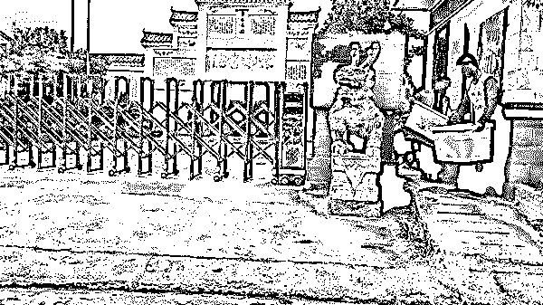

01

**豫章书院“起死回生”？**

2017 年 10 月 26 日，一篇《中国到底有多少个杨永信》全网刷屏，在杨永信恐怖的 13 号诊室后，曾全网一片赞誉的豫章书院被揭开了肮脏的遮羞布。

2017 年 11 月 3 日，央视做了一期名为《“问题少年”怎能交给“问题学校”？》的节目，彻底的将豫章书院里的“恶行”曝光。

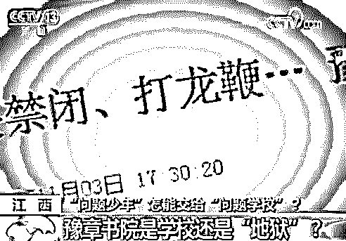

2017 年 11 月 8 日，在各大媒体、志愿者的支持和曝光下，豫章书院主动申请了停办。同年 12 月 7 日，在遭受过伤害的多名学生的联合报案下，豫章书院被立案调查。

但几个月之后，因为“证据不足”，没有对校长吴军豹作出逮捕决定，退回继续补充调查，之后两年，再无消息。

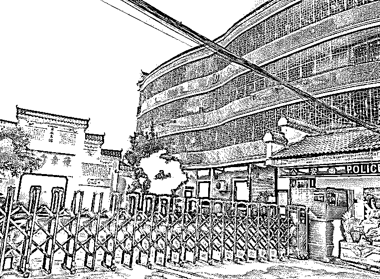

原本大家以为，事情已被解决，**可在两年之后，豫章书院的名字却以一种更加丑恶的方式出现在我们面前！**

10 月 5 日，知乎大 V“温柔 JUNZ”发表文章《因为曝光豫章书院，我朋友被他们报复到自杀》。

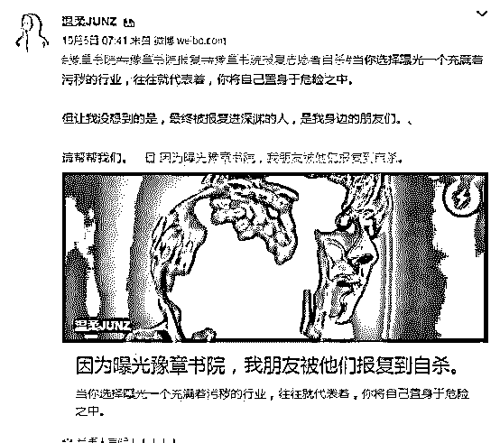

时隔两天，原豫章书院的校长针对该文在微博作出回应，文中所说内容皆为编造，并称自己并无报复想法。

**紧接着 10 月 24 日，“温柔 JUNZ”和一名志愿者却遭到了死亡威胁。**

来自于知乎用户@人间大炮，的多条私信内容带着浓浓的恶意。**举报豫章书院的志愿者接到了死亡电话。**

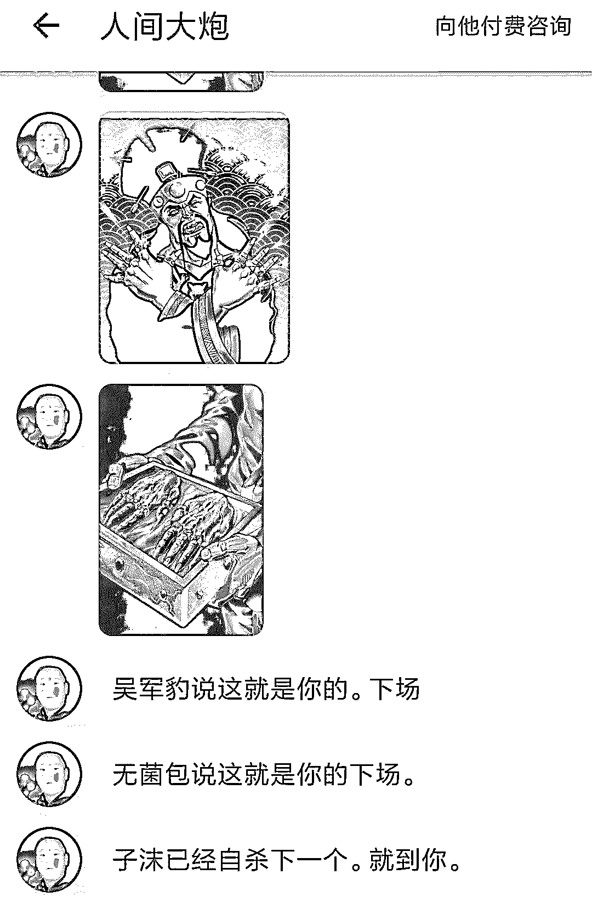

嚣张的程度，可见一斑！

这两年里：

**志愿者遭遇了死亡威胁后自杀；**

**随身携带着折叠刀，因为害怕被报复；**

**威胁、恐吓、被退学、丢工作，**

**......**

**曝光罪恶的人，敢于讲真话的人，不仅没有受到足够的尊敬，反而人身受到威胁。**

没办法，英雄总是在事后被清算，谁叫他们动了那些人的奶酪。

03

“杨永信”、“吴军豹”不是一个人，“豫章书院”不是一个孤立的机构，它们没有办法自生，是需求创造了它们。

那些头疼于孩子的家长们管教不好自己的孩子，便把他们交给别人，过程对于他们来说并不重要，只要能还给他们一个“听话”的孩子就够了。

“吴军豹”们、“杨永信”们便是看准了家长们的需求，收取高额的费用，赚的盆满钵满。

**事实上，这是一条产业链，几百亿的生意！**

**在这条恶臭的产业链上，民间资本、私人教育机构、商人、家长都是上面一个又一个重要节点，他们整齐的划拉地站在一面，而他们的对立面是孩子。**

在这笔交易中，“吴军豹”们、“杨永信”们得到了他们想要的，家长们得到他们想要的，那么，在这个交易中最为重要的孩子又将面临着什么？

下面这个姑娘@姗尼玛大王丶，曾爆料过自己在豫章书院内的遭遇。

**每一个进入豫章书院的新生都要在小黑屋关 7 天，赤身裸体。**

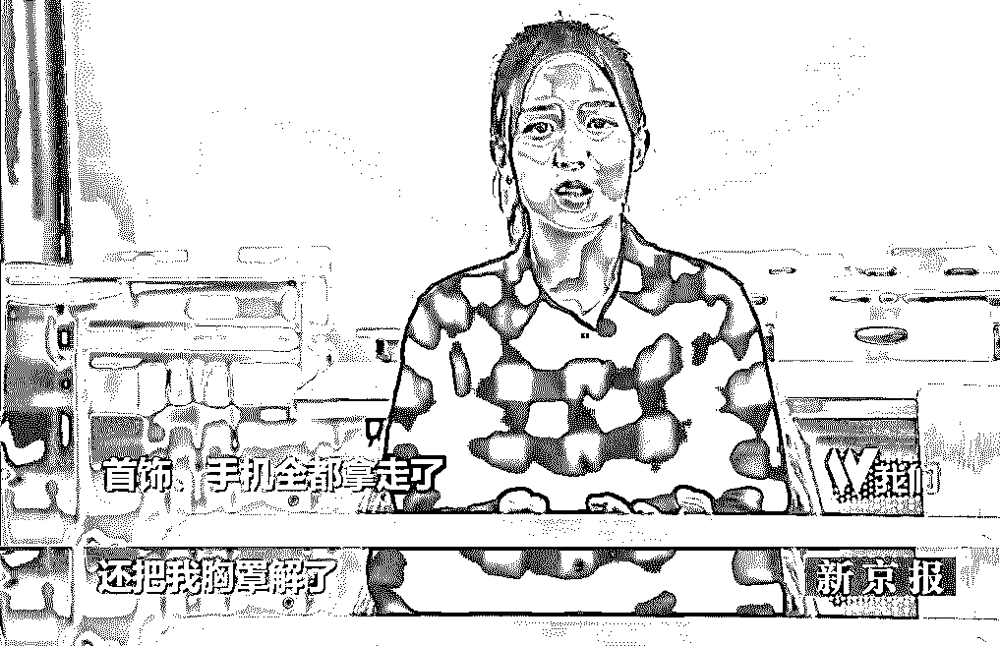

除了心理施虐，他们暴打孩子更是家常便饭。

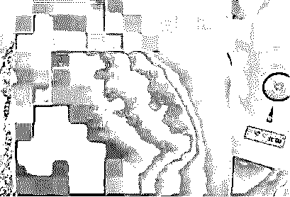

**甚至性侵。**

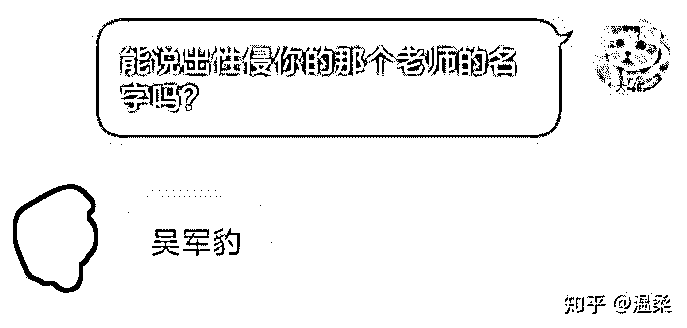

孩子们在这种非人的虐待下胆战心惊，精神萎靡，终于成为家长眼中的“好孩子”。

**人间炼狱，大概如此。**

不管是成年还是未成年，只要家长觉得你“不听话”，豫章书院的人就能去把你“抓”进来。接下来，你会被抢走一切东西，甚至扒光衣服，推进小黑屋里关禁闭。

这个黑屋里什么都没有，你要在南昌夏天 40 度的高温里慢慢地消磨时间。

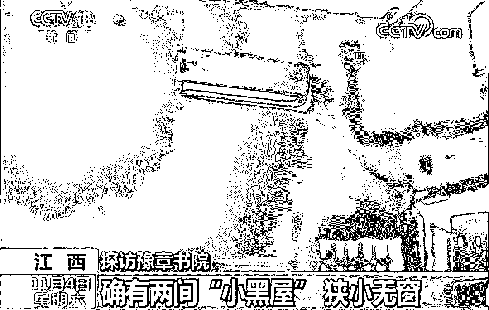

**在豫章书院里，挨打是最常见的。**

打人的工具有两种，一种是戒尺，短戒尺长 33 厘米，用来惩戒学生较轻的错误；另一种是龙鞭，也就是用来建房子用的钢筋。

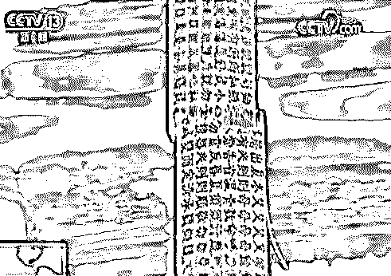

戒尺

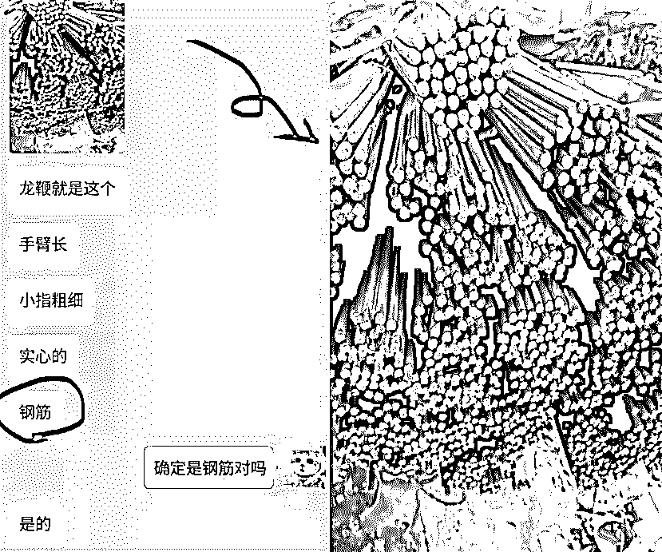

龙鞭

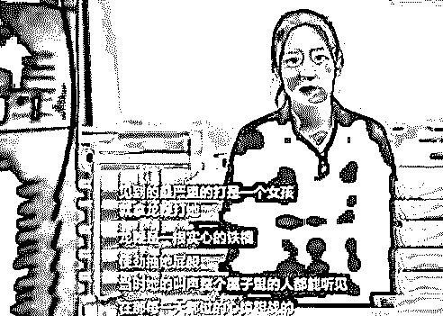

豫章书院前学生@姗尼玛大王丶揭露真相

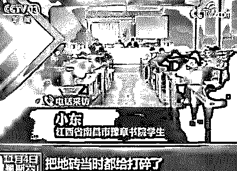

豫章书院前学生小东表示：看到一个小女孩儿被打龙鞭，老师亲手拿龙鞭去打她，使劲地抽，抽了至少有三四十下，那小女孩发出那种惨叫声特别吓人，**有几鞭子没打准打到地砖上，地砖都打碎了。**

豫章书院的学生稍有不慎就会遭受一顿毒打，毒打原因也许是因为铅笔盒，也许是因为一句话，也许是因为一个动作。

**经过豫章书院“教育”后的孩子们会怎样？**

**忍受不了虐待的孩子们都曾在里面自杀过，有用塑料杯碎片割腕的，有吃牙膏的，有喝洗衣液的，这是在豫章书院里普遍存在的事情。**

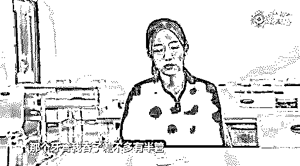

对于孩子的遭遇家长们知道吗？

**有的家长不知道，有的家长知道不在意。**

**他们要的是孝顺、懂礼貌、努力学习的好孩子，他们坚信着老祖宗流传下来的“棍棒底下出孝子”的信条。**

他们也坚定不移地维护着这些“豫章书院”，阻碍记者调查，阻碍公安机关调查，甚至“团结互助”，把那些跑出去的孩子抓回来.......

这些家长的心态就跟当年送孩子去杨永信的网络成瘾戒治中心的家长如出一辙：

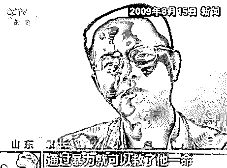

**很难相信伤害自己的人，往往是最亲的人，然而，现实总是比较讽刺！**

豫章号称要重塑年轻人，实际上他们也做到了。

经过他们的重塑，这些年轻人精神抑郁，对社会和家庭有着强烈的不信任感他们的梦中一直充斥着被龙鞭和戒尺殴打，被孔子右眼的摄像头监视的恐惧，**这些噩梦也许会陪伴他们终生。**

04

杨永信后来，关掉了网戒中心，可还一直在精神病院上班。

豫章书院旧址现在成为了画室，可志愿者们遭受的恐吓威胁，也没中断过。

而豫章书院这个公司，悄悄改名堂渊文，依旧是从事着教育相关，而吴军豹也仍在股东名单之内，谁也不知道未来是否又会有另一个豫章书院出现。

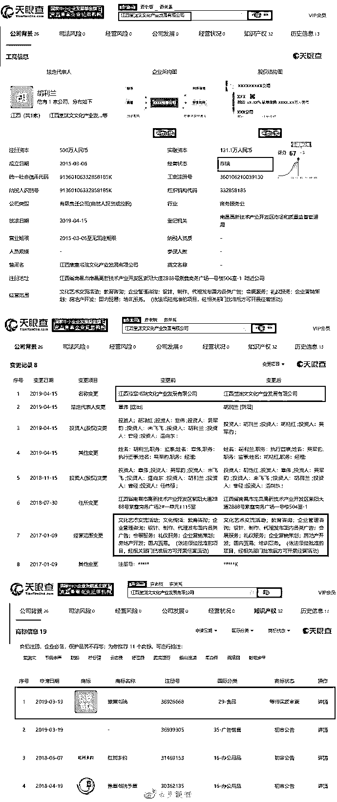

搅乱了别人的一生，造成了无法抹去的伤害，甚至间接剥夺了他人的生命。可发声的人遭到恐吓，被逼闭嘴，坏人继续着自己的生活，赚的盆满钵满。

**讽刺至极。**

**两年，一切好像都变了，一切好像都没变。**

“豫章风波”依旧未平，案件一直处在补充侦查阶段；

另一边，志愿者小组人数越来越少，但仍有人不想放弃，也仍有人活在它的阴影之下。

**好人被逼上了绝境，但坏人却可以躲在黑暗里任意玩弄着别人的人生。**

**我想这是我不想看到的，我想这更是大家，我们每一个人都不希望看到的。**

[`v.qq.com/iframe/preview.html?vid=o3017yseacc&auto=0`](https://v.qq.com/iframe/preview.html?vid=o3017yseacc&auto=0)

《**人间炼狱豫章书院卷土重来,举报者又遭死亡威胁》**

← 向右滑动与灰产圈互动交流 →

**阅读原文加入灰产圈高端社群**