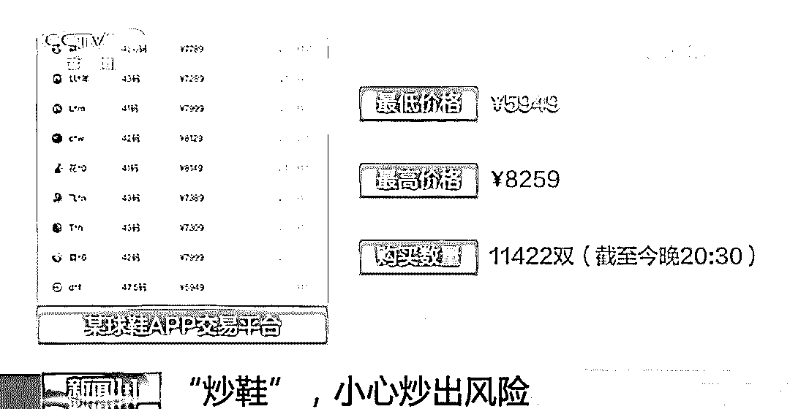
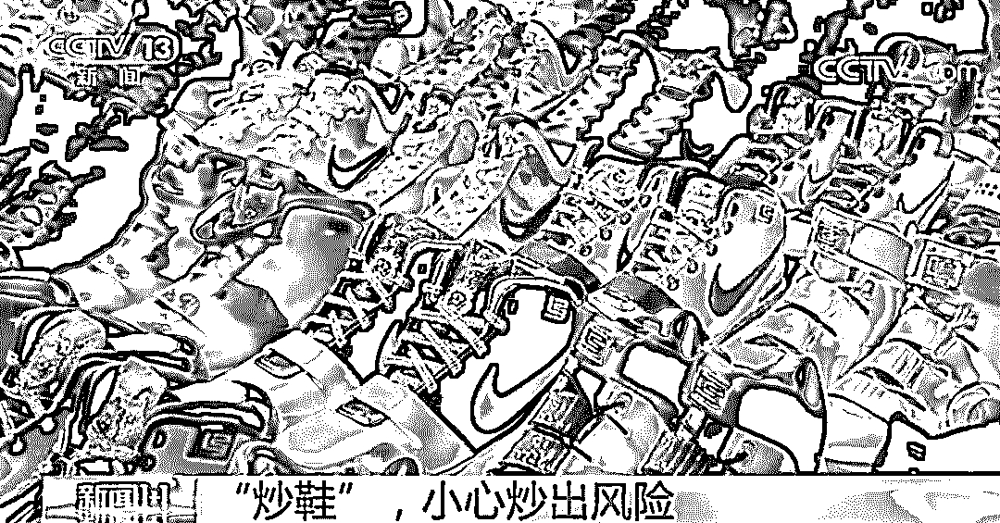
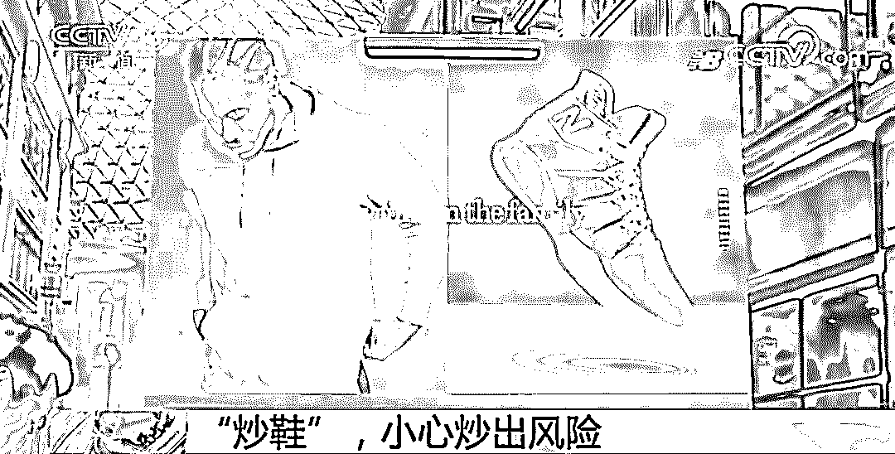
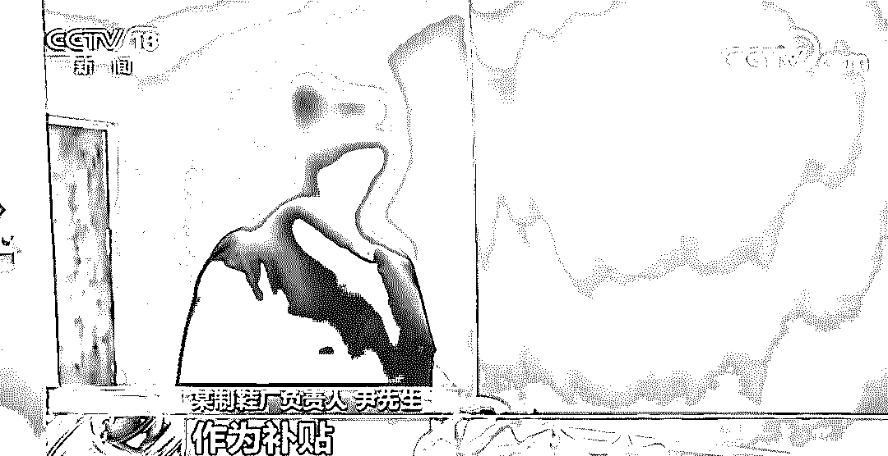
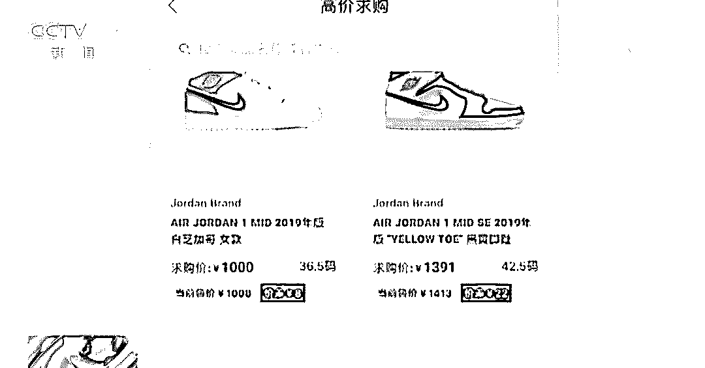
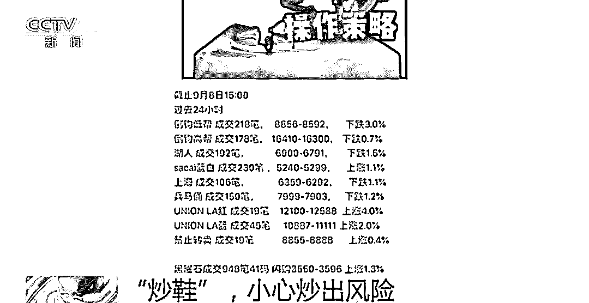
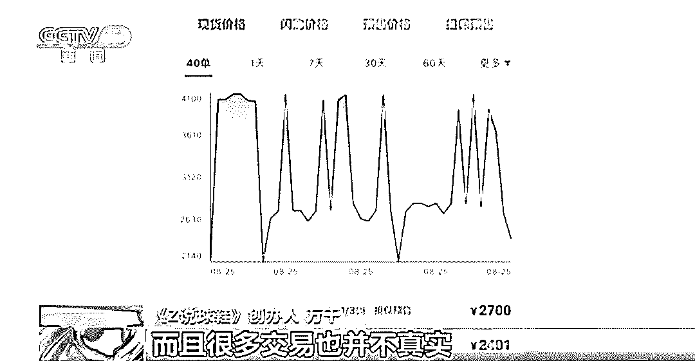
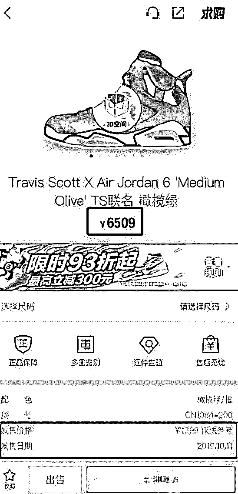
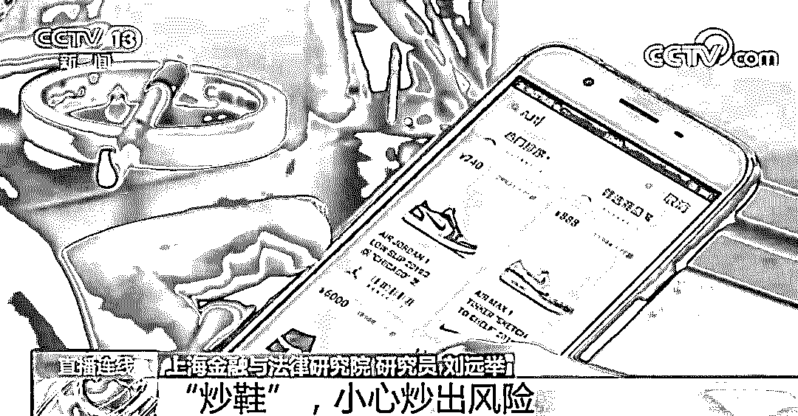
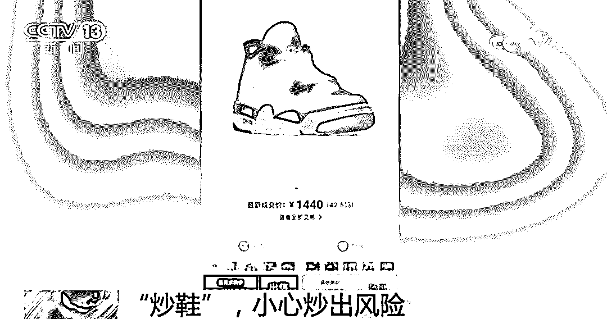

# 年轻人，我劝你别“炒鞋”！

> 原文：[`mp.weixin.qq.com/s?__biz=MzIyMDYwMTk0Mw==&mid=2247496515&idx=1&sn=a7c17abe175701b9a0ab1ca2492cf84f&chksm=97cb387ba0bcb16dfadaac14a9e7251fa427a3e8ae104c950fc68e4fd3eaffb542058f8a469c&scene=27#wechat_redirect`](http://mp.weixin.qq.com/s?__biz=MzIyMDYwMTk0Mw==&mid=2247496515&idx=1&sn=a7c17abe175701b9a0ab1ca2492cf84f&chksm=97cb387ba0bcb16dfadaac14a9e7251fa427a3e8ae104c950fc68e4fd3eaffb542058f8a469c&scene=27#wechat_redirect)

**点击上方蓝色字体免费订阅“灰产圈”**

近日，中国人民银行上海分行发布了一份以《警惕“炒鞋”热潮 防范金融风险》为标题的金融简报，指出

国内球鞋转卖出现“炒鞋热”，“炒鞋”实为击鼓传花式资本游戏，

提醒各机构防范此类风险。

一双球鞋，会牵出怎样的金融风险？

我们又该如何防范？

[`v.qq.com/iframe/preview.html?vid=y301377g6pt&auto=0&width=500px&height=375px`](https://v.qq.com/iframe/preview.html?vid=y301377g6pt&auto=0&width=500px&height=375px)

视频来源：《新闻 1+1》

**“炒鞋”背后可能存在金融违法问题**

央行上海分行在金融简报中提到，国内目前已有 10 余个“炒鞋”平台。“炒鞋”交易出现了一些值得关注的问题： 

**一是“炒鞋”交易呈现证券化趋势，日交易量巨大；**

****二是部分第三方支付机构为“炒鞋”平台提供分期付款等加杠杆服务，杠杆资金入场助长了金融风险；****

******三是操作黑箱化，平台一旦“跑路”，容易引发群体性事件****。******

******金融简报还提示，需警惕可能存在的**非法吸收公众存款、非法传销等涉众型经济金融违法问题。********

********

****各义务机构需加强对涉及“炒鞋”平台的资金交易监测，强化对“炒鞋”平台风险特征的识别，发现或有合理理由怀疑平台参与洗钱等犯罪活动的，应及时提交可疑交易报告。****

********

******“炒房不行，炒股不行，就炒鞋”******

******炒什么鞋？****** 

****所谓“炒鞋”，炒作的就是鞋子。但是不是所有鞋子都能炒，**大多是一些限量版的球鞋。****收藏喜爱的球鞋，本属兴趣爱好，然而，“炒鞋”暴富的神话以及资本市场的推波助澜，让“炒鞋”市场愈发疯狂。******

************

********谁在“炒鞋”？******** 

****据了解，北京、上海、广州、以及江浙是球鞋收藏爱好者聚集的热点地区。主要构成人员是**大学生和已经参加工作的年轻人，**年龄集中在 18 岁到 35 岁之间。此外，**一些制鞋企业的老板**也加入了进来。**** 

********

****某制鞋厂****

****负责人尹先生****

****“因为现在生意不好做，炒点鞋，赚点利润，补贴工厂。‘炒鞋’一年来赚了应该有十多万、二十万。”****

******怎么“炒鞋”？****** 

****因为要发售某限量版球鞋，上海一家鞋店外排起了长队。不少消费者直言，排队买鞋并不是为了自己穿，而是为了在二级市场上卖掉，赚一笔钱。****

********

****随着球鞋交易平台的建立，球鞋的收藏者和炒卖者可以通过手机，随时查询任何一款球鞋的交易价格。****

********

****此前网络上出现了价格曲线、“炒鞋”指数。尽管近来很多平台陆续取消了这些曲线图和指数，但像证券市场发行新股一样，市场上不断推出各种限量版的球鞋，还是让“炒鞋”圈一次次疯狂。****

********

****在“炒鞋”热潮中，还出现了扮演“专家”角色的博主，像荐股一样开始荐鞋。发布他们对何时买入、何时抛售以及球鞋行情的判断。**** 

********

****对此，业内人士认为，一些有资金优势的庄家会在其中故意引导散户购买，从而拉动价格，将自己的囤货在高价时销售出去。****

********

******“炒鞋”并非“遍地黄金” ******

******小心成了“活韭菜”******

****在某 App 上，Air Jordan 6 一款联名鞋刚刚以 1399 元的价格发售。短短几天时间，在平台的售价已经是 6509 元起，是发售价格的 4 倍以上，并且有近万人购买。****

********

****但是业内人士指出，“炒鞋”并非“遍地黄金”。在少数人一夜暴富的背后，是更多人的亏损。当把“炒鞋”作为理财手段，分期贷款、借钱“炒鞋”，甚至是集资去“炒鞋”，并指望以此一夜暴富，大家就需要小心了。****

********

****专家分析，近年来，由于经济下行压力加大，可炒品种越来越少，一些民间投机资金盯上了“鞋圈”等过去比较小众的投资圈。**** 

****“炒鞋”圈资金量越大的人，就能接近更上游的经销商直接拿货，从而形成垄断、哄抬鞋价，最终形成“割韭菜”的“杀猪盘”。散户、小贩、乃至很多没有收入的学生就被裹挟其中，成了“活韭菜”。****

********

****这款 9 月 1 日刚刚发售的新鞋，价格从五千多元跌回了原价一千多元。****

****除此之外，一旦“炒鞋”失败，贷款逾期归还，还会影响个人征信记录。同时银行账面也会出现坏账。坚决遏制“炒鞋”风气蔓延，需要牢固树立“鞋穿不炒”的定位，让潮流文化回归文化本身。****

****来源：福建共青团****

****综合整理自微信公众号“学校共青团”“央广新闻”“央视新闻”等****

********

********

********

****************

****← 向右滑动与灰产圈互动交流 →****

********

**************阅读原文加入灰产圈高端社群******