# “一元云购”死灰复燃，打着“特惠商城”和“集悦缤纷购”的名义，宰你没商量！

> 原文：[`mp.weixin.qq.com/s?__biz=MzIyMDYwMTk0Mw==&mid=2247496455&idx=1&sn=dc63712a1afa92c89a7157c5b6118c4d&chksm=97cb383fa0bcb129697e0c6efd58f91ba4924c5bf8f82bfb16aebac26af55698a3e6e20ffdfe&scene=27#wechat_redirect`](http://mp.weixin.qq.com/s?__biz=MzIyMDYwMTk0Mw==&mid=2247496455&idx=1&sn=dc63712a1afa92c89a7157c5b6118c4d&chksm=97cb383fa0bcb129697e0c6efd58f91ba4924c5bf8f82bfb16aebac26af55698a3e6e20ffdfe&scene=27#wechat_redirect)

**点击上方蓝色字体免费订阅“灰产圈”**

没有人能轻易从一家赌场赢的盘满钵满然后全身而退，再好的运气也会因为人为的控制最后满盘皆输。骗子总喜欢用花样百出的招数去圈钱，一旦有人入坑，他们的结果只有一个，那就是十赌十输。<sectiont>1 <sectiont>**披着羊皮的“恶狼”**</sectiont> 大家还记得“一元购”、“一元夺宝”吗？这种以众筹名义实为私彩或变相赌博的游戏，曾毁人三观，让人倾家荡产。直到司法解释的出台，确认“一元购”涉嫌诈骗，属于变相赌博行为，相关平台才将此下架。小编最近好像又嗅到了熟悉的味道，甚至比原来的配方更加“浓郁”了。你只要在苹果手机的“APP Store”搜索下载一个叫**“特惠商城”**和**“集悦缤纷购”**的 APP，就马上可以体验到这种熟悉的套路。

01

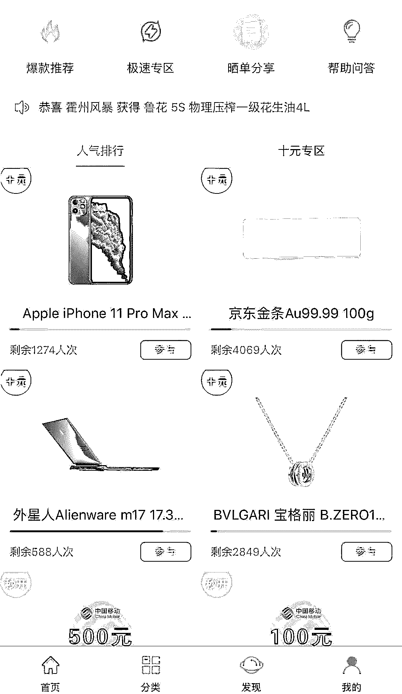

“特惠商城”APP 首页图

“特惠商城”APP 对外自称主要以“众筹”销售模式为各类商品的销售提供网络空间。在该平台，支持者可以使用幸运豆（1 元等于 1 幸运豆）支持一份或者多份，系统根据平台规则计算出最终获得商品的支持者。中奖得来的商品可以由平台发货给支持者，也可以在平台进行回收从而折现，金额直接返回支持者绑定的银行卡。简单地说，**它的运营模式就是：****充值——抽奖——未中奖——结束/中奖——获得奖品、奖品可在平台折现。**

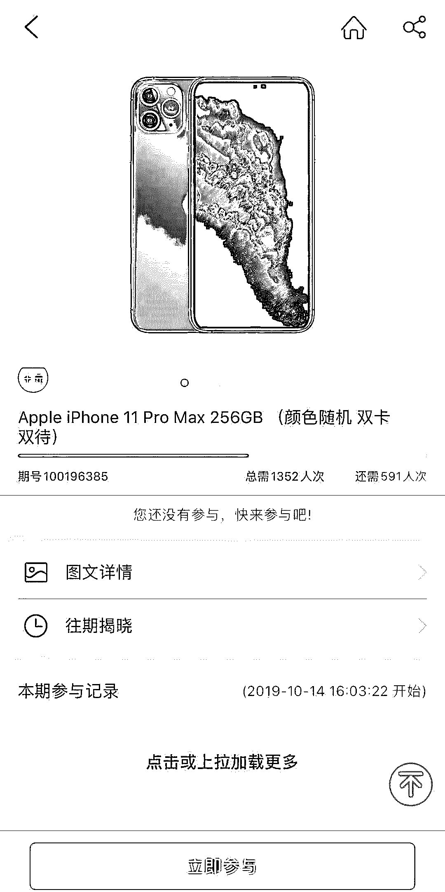

注册成功后，用户可以选择自己心仪的商品后立即参与抽奖，使用“幸运豆”可以获得其中一个号码，等待参与人数达到了平台设置的人数后，即可等待开奖。该平台自称采用由中国福利彩票中心发行的一种彩票“北京快乐 8”作为参考数据，以示公平。在“特惠商城”APP 上用户每充值一块钱就可以获得一颗“幸运豆”，拿着这些“幸运豆”可以参加抽奖，也就是花 1 元或者 10 元抽取价值更高的奖品。在该平台还有个看起来特别“人性化”的设置，就是抽中的奖品你可以选择让平台正常发货，也可以选择在平台折现获得现金。小编在摸清套路后恍然大悟，这不就是跟在澳门赌场买筹码才能参加赌局，赌局结束之后可以把筹码换回现金一个道理吗？

02

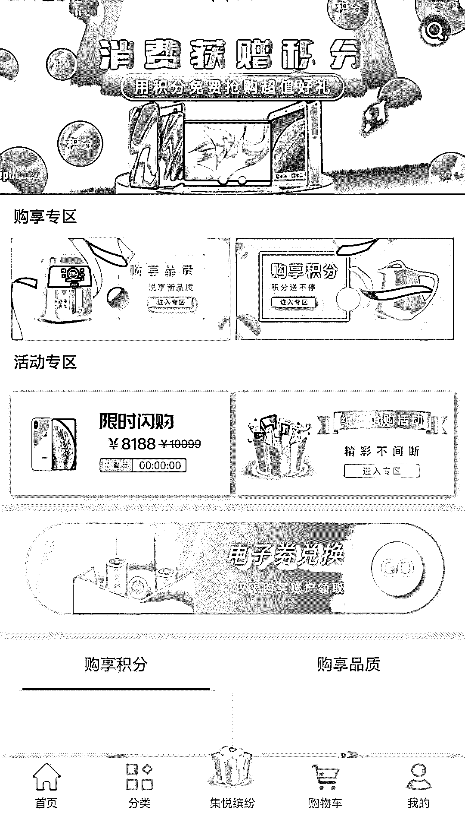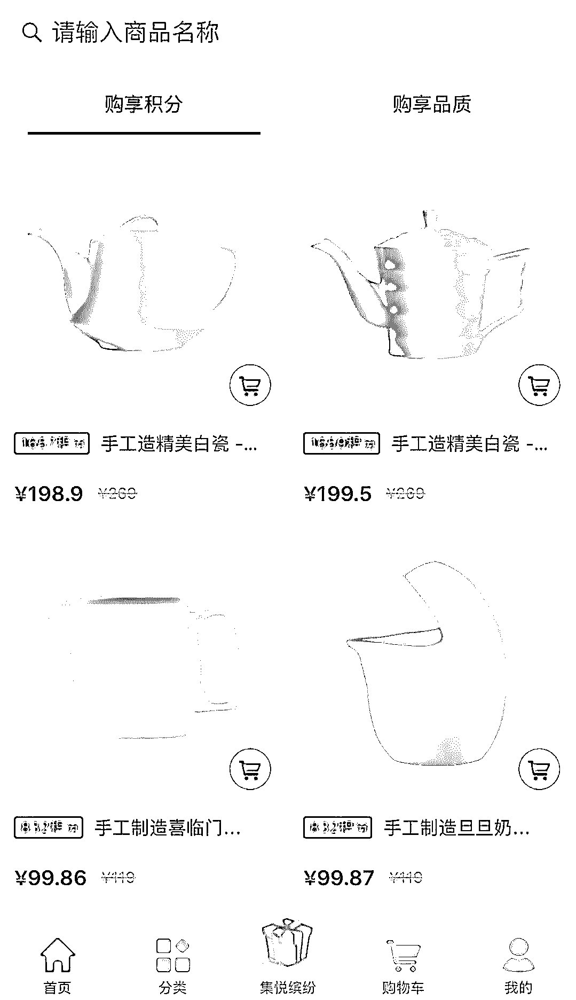

“集悦缤纷购”APP 首页图 

“集悦缤纷购”APP 自称是一款全新打造的家居电商平台，用户通过平台成功消费，将免费获得积分（每消费 100 元将免费获赠不同数量的积分），所获积分可用于活动商品的兑换以及积分抽奖。简单地说，**它的运营模式就是：****购买商品——获得商品和积分——积分兑换活动商品/积分抽奖获得更丰厚商品——未中奖——结束/中奖——获得奖品。**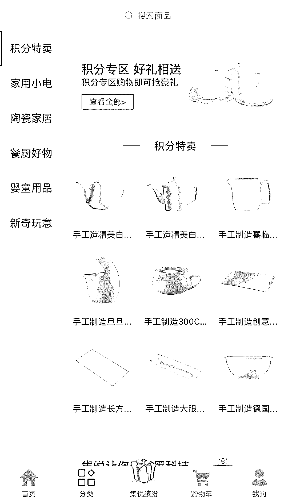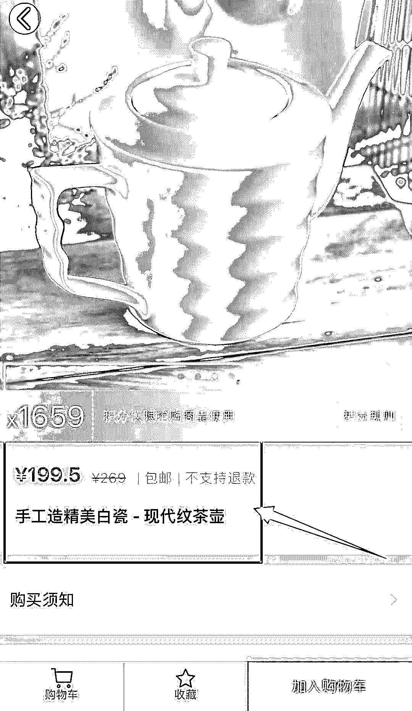注册成功后，跟“特惠商城”APP 不同的是，用户可以选择自己想购买的商品，购买完商品后可获得一定的积分，该积分仅限抢购商品使用，实际上就是诱导用户拿积分参加抽奖获得其他商品。在“集悦缤纷购”APP 上，一个“精美的白瓷茶壶”需要近 200 元人民币，小编以为是什么名家亲手制作或者是有历史来头的艺术品，仔细一看关于产品的简介，就是一厂家制作的普通陶瓷。“多么划算的买卖啊，东西虽然是贵了点，但不仅可以得到自己满意的商品，又可以获取抽奖的机会，说不定还能中块大金砖，何乐而不为呢！”。很多受害者就此深陷其中，认知出现偏差，屡次三番的充钱。

03

如果说网上博彩的套路属犯法，是诈骗，那么这些平台打着法律的擦边球，利用大部分人内心深处的原始赌性，提供非法赌博平台，导致一部分缺乏自制力的人深陷其中，也同样涉嫌违法犯罪。这两个平台看起来运营模式不同，使用规则也不同，但是两个平台的手法却大同小异，就是都有**“赌注”——特惠商城 APP 里一元一颗的“幸运豆”和集悦缤纷购 APP 通过购买各种精美商品获得的积分。**<sectiont>2 <sectiont>**不能自拔的“赌性”**</sectiont> **参与抽奖游戏只需要动动手指几秒钟，再加上“幸运豆、积分”的出现又大大降低了人对金钱的敏感度，导致很多用户的赌性被激发了出来，对这类玩法上瘾，不停的买“豆”或者买商品得“积分”，心甘情愿参加抽奖并期待中“大奖”。**一位匿名的受害者下载了这两个 APP 给我们提供了不少资料，他表示经常收到很多关于积分抢购的推销短信，2019 年 9 月 3 日开始点击收到的短信链接，在 APP Store 下载了“集悦缤纷商城”APP 和“特惠商城”APP。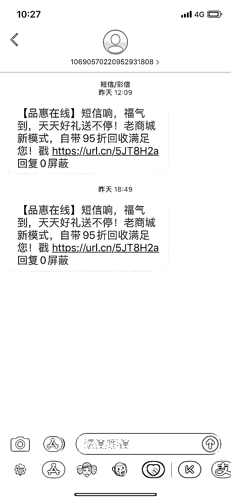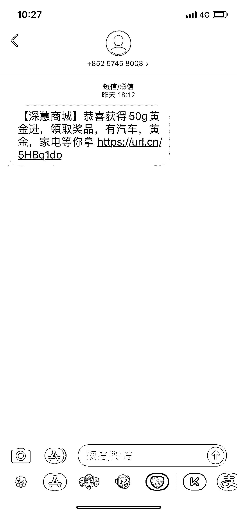受害者在使用后一个多月发现蹊跷，他表示**中奖率极低**，第一次在“集悦缤纷商城”APP 中了一部 iphoneXR 128G，当时已经在该平台充值了 9000 元人民币，要知道 iphoneXR 128G 在苹果官网只需要 5299 元啊！更扎心的是，受害者收到商品时，拿到某北电子交易市场卖掉被告知这部手机是被开封使用过的**翻新机**。截止到 2019 年 10 月 8 日，受害者先后在两个平台共充值了 253723.85 元。使用期间在“特惠商城”APP 被抽中三次，选择在平台折现换回 74135 元；在“集悦缤纷购”APP 被抽中十多次收到商品后拿到某北电子交易市场卖掉换回 80000 元左右。10 月 11 日，受害者想要查询自己中奖记录的时候发现，两个平台的中奖记录却被后台清空了。令小编不解的是，受害者明明疑心平台有套路却仍选择继续充值，并且当天就在“集悦缤纷购”APP 里 2.5 小时充值了 3091.55 元（如下图）：

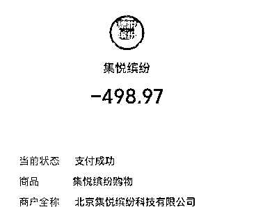

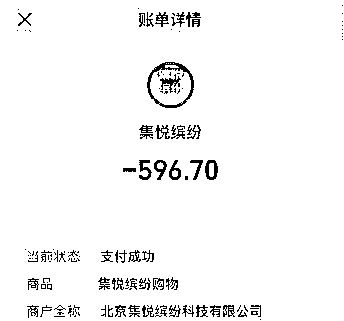

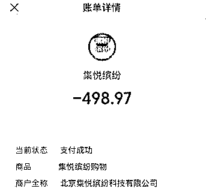在下载“特惠商城”和“集悦缤纷购”APP 前，小编也看到有不少玩家在下面留言表示中奖率低、开奖结果不公开公正、类似“一元购”套路等差评。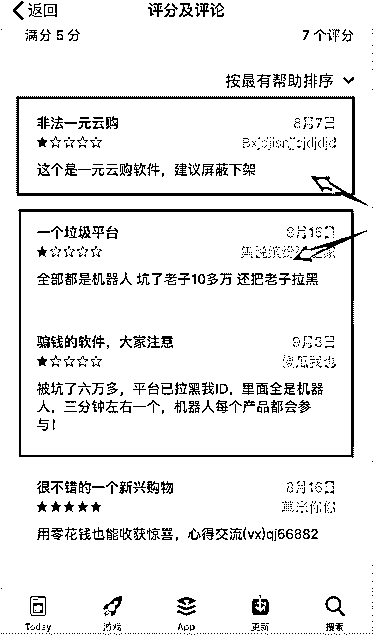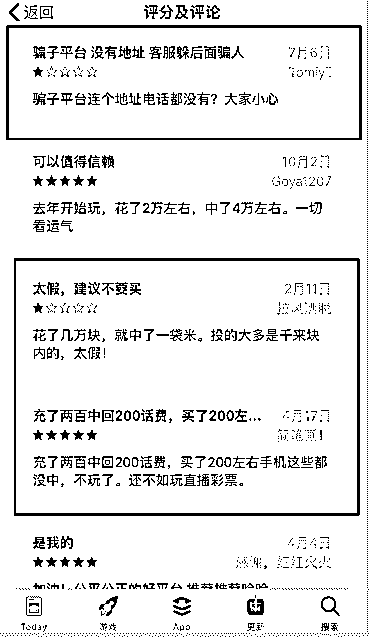<sectiont>3 <sectiont>**嗜血成性的“赌场”**</sectiont> 为什么我们看到的赌徒大部分都是身负巨额债务，只见输不见赢？为什么他们明明输了钱，不能吸取教训，非要一而再再而三的投钱进去？正是因为赌博可以激发人体内最原始的赌性。很多人只记得赢的过程，只记得赢的时候带来的快感，却不曾预计输光之后所带来的痛苦和绝望。

01

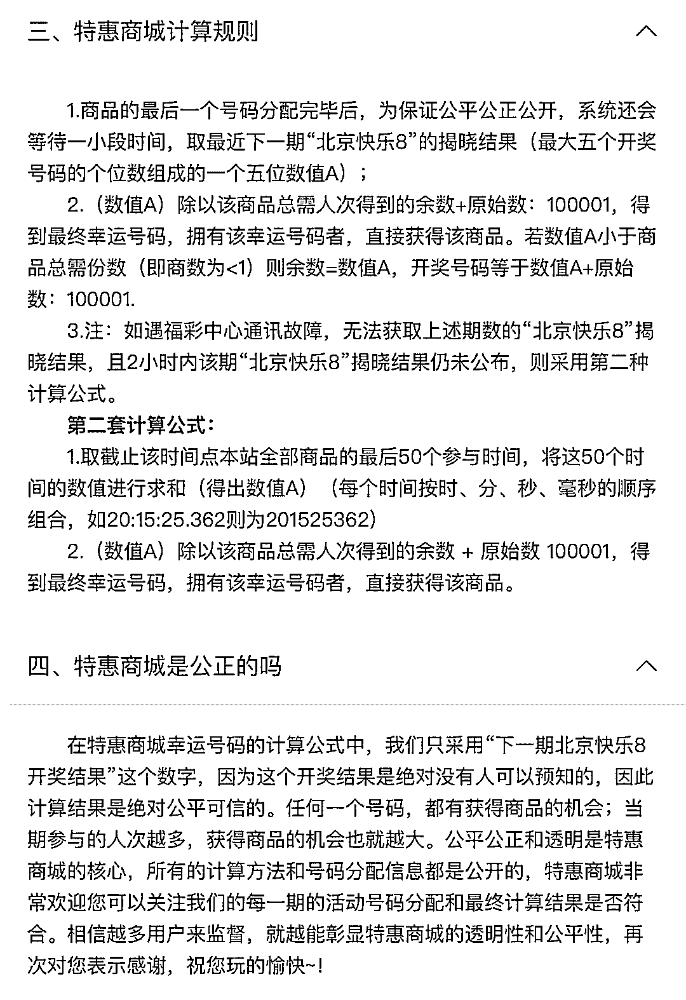

这个“特惠商城”APP 取名为商城，本质却并非购物平台，而是一个类似博彩平台，它出售的不是商品而是抽奖机会，并且抽奖**规则自定**。规则看起来公平公正，实际上完全可以通过**添加虚拟参与者、在分配号码上做手脚。**我们经常可以看到有些人天天中奖，实际上大部分都是平台的“机器人”。

02

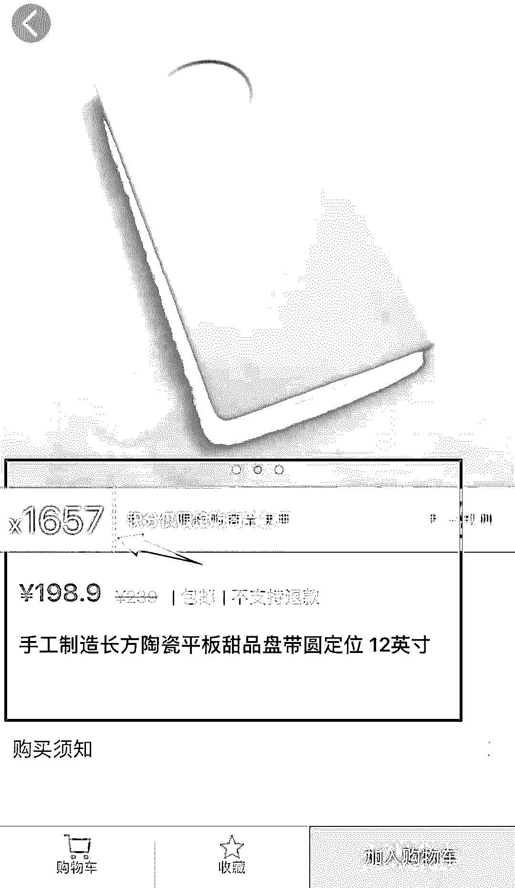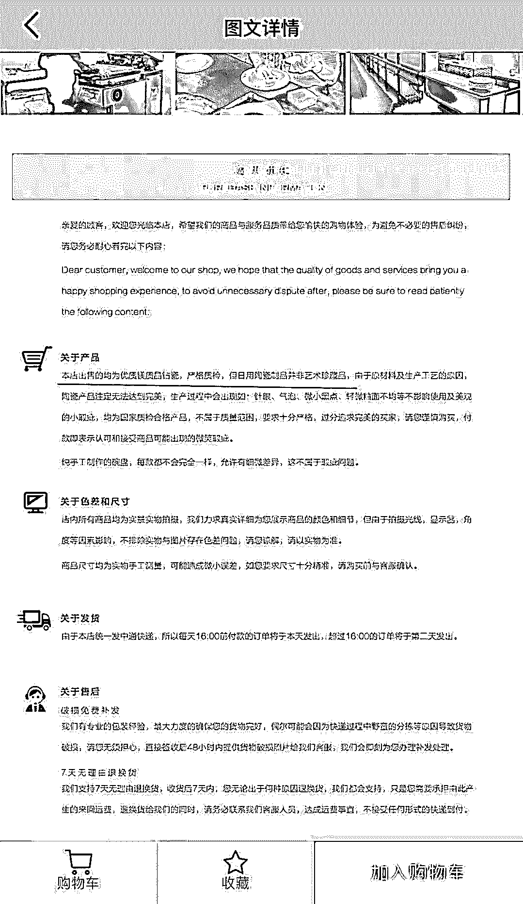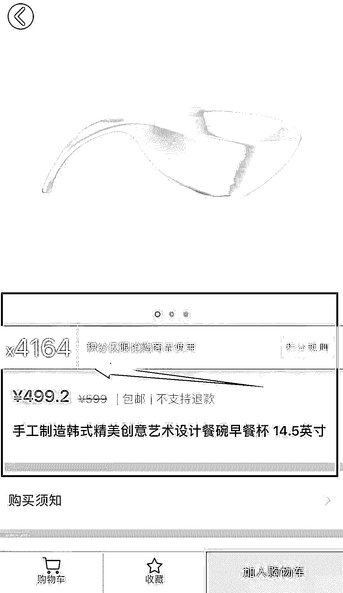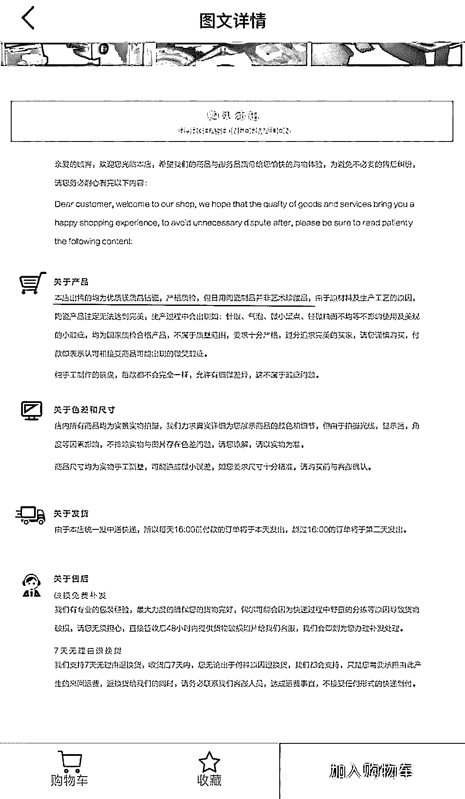“集悦缤纷购”APP 里面的商品可以看出来定价虚高，类似的产品，定价不同，赠送的积分也大大不同。也就是购买的产品价格越高，赠送的积分越多。先不提这个“精美陶瓷”的质量到底如何，且说平台的最终目的，就是引诱用户去赚取积分参加抽奖。**披着购物平台的外皮，实际上做着赌博平台的勾当，实际上就是一家家嗜血的赌场。**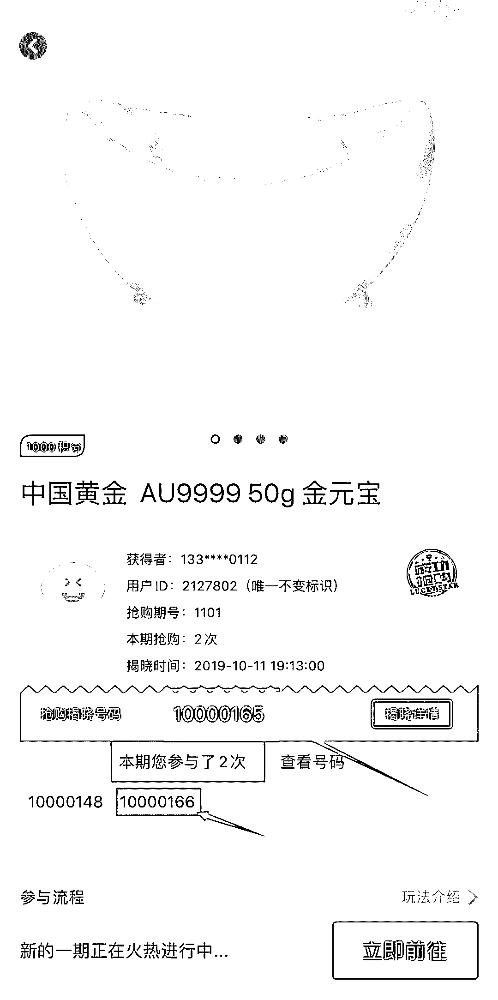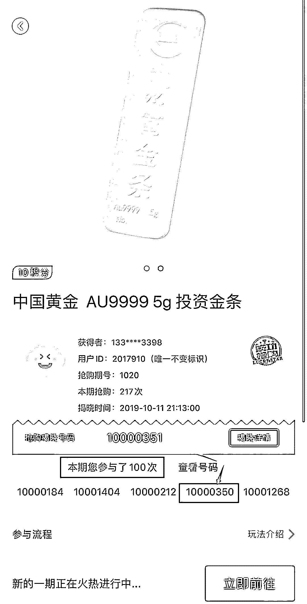这是受害者给我们提供的当时参加抽奖公布结果时的截图，并表示该平台多次公布的中奖号码都与自己的号码差一位数，收到的奖品大多以次充好，曾经中到的那部手机就是一部翻新机。每一次的“差点点”，都能让人冲动地想要再博一次，于是三番五次地下注。如果经历了两次“差点点”，就会有人认为是自己的运气差，那就参与够一百次，可未曾想到的是，依旧是“差点点”。真的是自己运气不够好吗？不，你只是斗不过一开始就设置好让你输的赌场，就如同开头说的，没有人能从一家赌场赢的盘满钵满然后全身而退，再好的运气也会因为人为的控制最后满盘皆输。<sectiont>4 <sectiont>**变本加厉的招数**</sectiont> 曾经让人家破人亡的“一元购”，在 2017 年国家互联网金融风险专项整治领导小组办公室发布《关于网络“一元购”业务的定性和处置意见》，就明确定性为变相赌博或者诈骗。以“特惠商城”和“集悦缤纷购”为代表的这些平台依然抱着侥幸心理，屡试不爽，不仅可以一元投注，还可以十元投注，甚至以商品为介质获得更大的投注机会，以充多少送多少等活动来诱惑你，保证你前期可以赢钱，从而上瘾，你下的赌注越来越大，他们圈的钱越来越多，带来了更加恶劣的性质。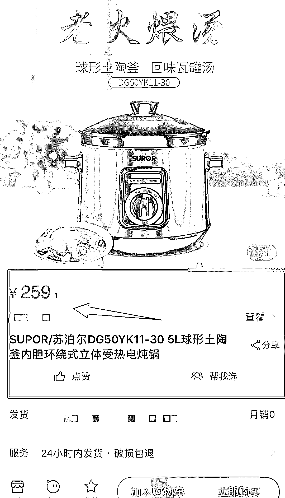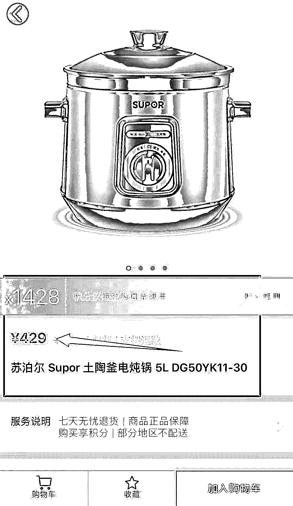同样牌子类似的商品，与某知名电商品牌销售的价格对比，集悦缤纷购售价翻倍 这些平台的营销模式打着“购物商城、积分抢购”等旗号，跟当初的“一元购”套路一样，表面上是销售实物商品，实际上销售的是中奖机会，中奖结果由偶然性决定，在法律上属于射幸合间，具有赌博性质，是一种变相的赌博行为。由于不公开、不透明且缺乏监管，这些平台踩着法律边界去压榨老百姓血汗钱。这些“吸血鬼”稳赚不赔主要靠以下方式：**第一，商品定价虚高，奖品质量以次充好；****第二，平台规则自定，运营模式缺乏监管；****甚至更加恶劣是，这场赌局的押注越来越大，这些无良平台未经允许还会定期将玩家数据清空，一旦平台被举报，平台可能直接下架圈钱就跑，老百姓投入的钱就这么付之东流。甚至有些人为了中大奖，前后投入二三十万，不惜去借贷最后导致负债累累、倾家荡产，事后发现不对劲后，才想到报警。**小编提醒那些想靠运气一夜暴富的人，万不可为了博那一分甜，吃其九分苦，万不可为了追求一时的中奖率而把自己的所有投入进去。如果我们不能控制这些平台上线，那就控制自己贪婪的欲望。**记住，在赌博中，不管是何种形式，赌到最后输的永远都是赌徒，而不是庄家，不赌为赢，回首是岸！**

← 向右滑动与灰产圈互动交流 →

**阅读原文加入灰产圈高端社群**</sectiont></sectiont></sectiont></sectiont>