# 一场新媒体巨头导演的“僵尸舞台剧”，真实还原现场，导火线：一条一夜爆红的视频，我们流量却为 0!

> 原文：[`mp.weixin.qq.com/s?__biz=MzIyMDYwMTk0Mw==&mid=2247496421&idx=1&sn=7f96d00adac5a5961a7651de20f6efba&chksm=97cb39dda0bcb0cbb26d9725ab710603e4ae26dc1fa29b2f00a737ebdee65605a3f81f70dff0&scene=27#wechat_redirect`](http://mp.weixin.qq.com/s?__biz=MzIyMDYwMTk0Mw==&mid=2247496421&idx=1&sn=7f96d00adac5a5961a7651de20f6efba&chksm=97cb39dda0bcb0cbb26d9725ab710603e4ae26dc1fa29b2f00a737ebdee65605a3f81f70dff0&scene=27#wechat_redirect)

**点击上方蓝色字体免费订阅“灰产圈”**

近期，一篇《一场新媒体巨头导演的“僵尸舞台剧”，真实还原现场，导火线：一条一夜爆红的视频，我们流量却为 0!》火爆全网，灰产圈联系到了文章作者，经作者授权转载，作者为大家揭示了微博大 V 机构流量注水的真实诈骗黑幕，下图为知名媒体关于此事的相关报道。

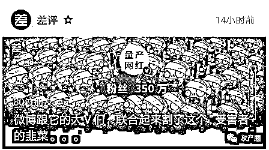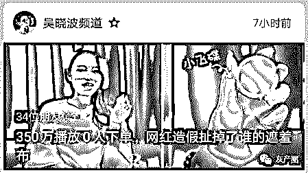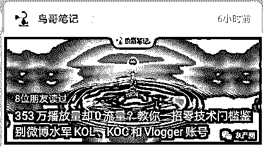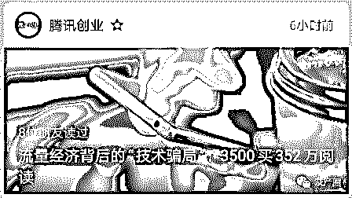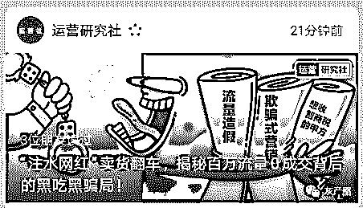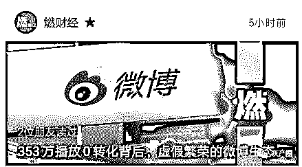

← 左右滑动查看知名媒体报道 →

****蜂群传媒，作为微博领域流量的头部机构，手持这么多的微博大号，一条微博几十万的价格，居然让我看到是这样的一种场景，真是有点让人细思极恐。****

**首先做个自我介绍，我不是一个小编，我是一位中国深圳的创业青年，希望可以跟大家分享一些我在创业过程中发生的匪夷所思的事情，最近发生一件我认为很“戏剧性”的事情，我现在来告诉大家，希望这样的事情以后不会发生在你们身上。** 

**我一步一步来跟大家说一下这个故事：**

**首先我从 2016 年到 2019 年花了 3 年时间联合我的合作伙伴通过香港的专利技术一起打造了一系列新的科技产品，当然这次创业目的有两个，第一个是造福社会，通过我们的努力创造一些有价值的东西，第二更重要，就是赚钱，毕竟用爱发电，也不现实。**

**到 2019 年下半年，我开始着手做市场开发，直到今年 9 月份，通过同事介绍和了解，接触到了同在深圳，号称微博头部机构的“大公司”蜂群传媒。****不好意思蜂群，既然事情发生了，我想我也不用避讳什么，毕竟就事论事。**

 **跟蜂群传媒接触了一小段时间，确实不得不说他们的人真的很会捧场，说什么都鼓掌，我感到很开心，感觉很好，设计了一个预计 100 万左右的微博平台的话题推广全案，主要围绕着我们线下网红实体店，实验室进行互动式的，矩阵式的宣传推广，但是我因为第一次尝试市场推广项目，所以当时犹豫了一下，提出了先在 9 月 27 号晚上 7 点让她们其中一个博主，进行一波原创 VLOG 视频发布，看看效果怎么样，于是我们根据推荐加上自己的判断，选了一位粉丝 380 万的上海时尚博主，微博 ID:张雨晗 YuHan，为什么选择她呢，第一是她价格不便宜，第二也是主要看过她以往的视频和图文，看到都是 100 多万的浏览量，以及上千的正面评论，虽然我早有耳闻，微博的水分比较大，但是当时的想法是，毕竟是微博头部机构，就算有水分，应该也还是会有部分真实的数据存在。**

**然后一周时间，我通过蜂群的媒介和博主张雨晗之间保持着还不错的沟通，我也传递了我的很多想法给到张雨晗，我觉得大家态度不错，我们也史无前例为她的粉丝设置了优惠卷，希望她能真正的为粉丝带来一些福利。**

**9 月 27 日**

**按照约定时间，张雨晗会在晚 19 点发出准备好的原创 VLOG 视频，视频我看过，其实觉得成品一般，主要就是这个博主，哎~大家去看看就知道我什么意思了。****关于我们的内容我还是基本满意的，至少话说清楚了。****文末我会 Po 出张雨晗微博传送门。**

**但是这都不是重点!不是重点!重点是当晚 19 点以后，视频发出后发生的事情，真的是让我大开眼界！**

**2019 年 09 月 27 日 当晚 18：****00**

**我们这边已经做好了所有的准备，等待这次的流量冲进来我们的指定的线上店铺来检测我们的产品及内容，一阵耐心的等待后，终于到了 19 点，蜂群告知博主已经发文，我也迫不及待的关注整个流量增长的全过程。**

**49 分钟时间，12.1 万的观看量，几百的评论，几千的赞，一百多次转发，看的我满心欢喜，再给大家看看评论是什么样子的，现在微博应该也有保留下来欢迎大家观摩，我这里先还原现场这几张截图。**

**我个人觉得挺真实的评论，很多还都是 VIP 账号，心中暗喜，我们辛苦做出的内容好像很受欢迎的，没有白费我们的努力。****接下来连续高能！**

**不到 20 分钟，观看量达到了 23.2 万，不愧是人气博主，评论点赞转发持续增加，很棒，再给大家看看整体评论是怎么样子的。**

**OMG~！****买它买它，简直是一片美好，此刻张雨晗犹如李 XX 附体，让我对于我们的未来充满信心，多年的努力的确没有白费!于是我淡定的喝了口 82 年的卡布奇洛。**

**评论内容如下~**

**大家注意看时间点，接着在短短的十来分钟，又增加十万的阅读量，评论，点赞和转发都在不停的疯涨，我感觉张雨晗这次可以破自己的往日的记录，因为我对她以前 VLOG 视频的了解，大概平均的阅读量在 150 万左右。****下面的评论也几乎全是正面积极的评论，这个时候其实我已经偷偷的在查看我们的库存是否充足。****。****。**

**这时的我显得非常的得意，我认为一切都不负所望，我走出了办公室，去到了我们的电商部门，接下来我看到事情，那真的是让我无比震惊！****前方高能预警!**

**   当我来到电商部门的时候，我开心的问同事，今天的流量情况怎么样？****当时的场面是这样的。**

**然而我的表情是这样的。**

**今晚所有的电商部门同事都做好了准备，来看看这一次的效果，部门所有人都在关注着我们的店铺，但我进来得到的消息居然是截至目前为止我们的流量近乎为 0！****成交数为 0！****直接上图吧。**

**然后我对我们往日进行了一些对比，当晚我们除了同事不断关注，并且来回进入着店铺，当晚也开了流量直通车，我们能明显的看出今晚的流量还不如往常!而且往常我们并没有做任何的推广行为!**

**这真是让我口目结舌,这个时候有个疯狂的想法冒了出来，难道这几个小时内发生的都是一出设计好的戏？****所有的流量都是假的？****没有一点真的？****我感觉我此刻对整个世界都产生了怀疑。****于是我做了一个对比，果然实锤了我的推测!**

**我还能说什么，我觉得我现在说不出话，我只觉得我成长了，学习了，原来微博的头部机构这么个玩法吗？****到此刻为止，两小时产生几十万的观看量，给我们的结果居然是 0 的流量？**

**评论里面不是很多粉丝已经安排了？****领卷了？****下单了？****这些都是怎么回事？****莫非我是发的僵尸卷?对了优惠卷，优惠卷呢？****然后我的同事告诉我，有领卷 2 张！****很好，居然还有两个人，但是我坐不住了，我需要沟通，跟蜂群沟通！**

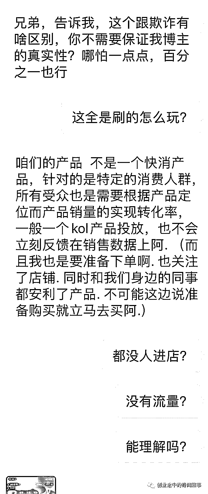

**很好，蜂群传媒，沟通失败，当我知道仅有的两个领卷的人还是他们公司的同事的时候，我真的心寒，他却到此再也不回复我…**

**微博可以刷数据这个事情，我都知道，他们蜂群居然告诉我不知道？****这到底是人性的沦丧还是道德的缺失？****难道我在他们眼里就这么的愚蠢吗？****那一夜我彻夜无眠。**

****          第二天，当我再次打开张雨晗的微博的时候，呵呵，真是被安排的明明白白。****看样子这次可能是我们钱给多了。****

**原来，电影里面真的不是骗人的，僵尸果然是不需要睡觉的。353 万观看！上千的评论，上千的赞!一定是钱给足了，我到这时候我依然怀揣着一点点的希望，希望这个世界是善良的！但是蜂群和雨晗果然没有给我一丝的希望。**

****蜂群传媒，作为微博领域流量的头部机构，手持这么多的微博大号，一条微博几十万的价格，居然让我看到是这样的一种场景，真是有点让人细思极恐。****

****难道我就这么任人宰割了？****不行，我决定要律师函警告!****

**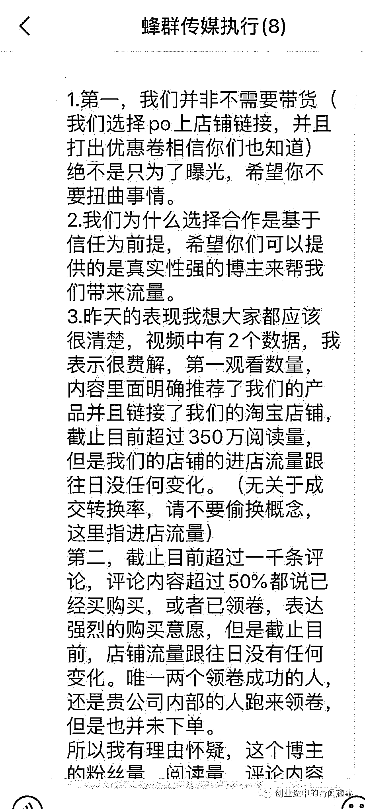** 

****然而这次警告换来了他们对我们祖国真挚的祝福，我很感动，这样一出戏剧性的表演之后，依然不忘祖国的生日，这样的嘴脸真是在深圳已经不多见了，但是他们却让我感觉到了他们莫名的自信，难道发生了这样的一件场纯正的商业剧本我还不能让他们法庭见?****

**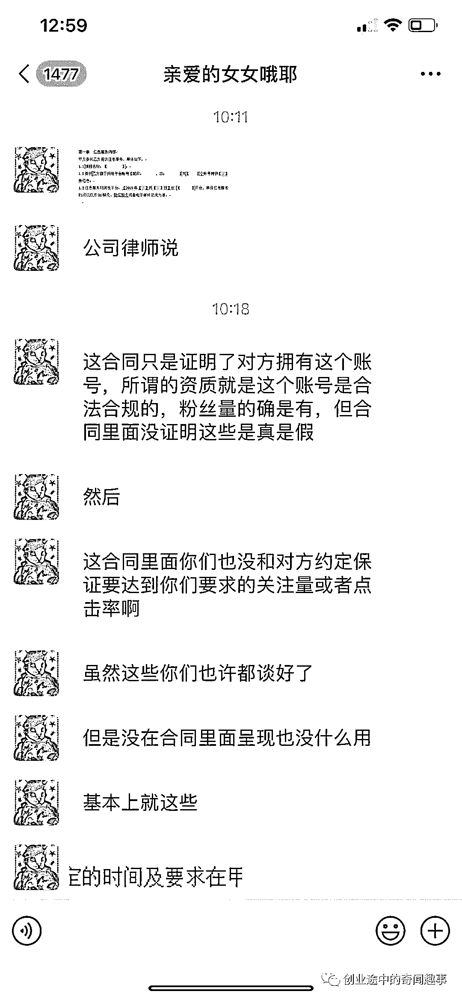**

 ****此刻的我彷佛觉得有点迷茫，难道中国的主流的平台的流量都是假的吗？****所有的点赞评论都是有人暗箱操作?我怀着对于这些的好奇，开始了一些对于这个行业的探索，我想看看到底多少钱可以模拟出昨晚的这样的一场戏。****

****果然简简单单的就被我扒了出来，不过我觉得这里面提到的价格对于蜂群传媒来说，这个价格可能有点贵，毕竟他们应该是长期批量合作，但是我觉得对于我花出去给到蜂群的钱来说，这里面提到的价格可真是太便宜了！****前方持续高能！****

****3500 元你给我安排得明明白白？****难道现在微博 MCN 公司已经是这样的一种买卖了吗？****卖一场自己自导自演的秀给客户去看？****然后让客户沉浸在这样的一种幻觉当中？****我真的难以想象这样的事情到底发生在多少人的身上过，中国到底有多少的人吃过这样的哑巴亏？****到底中国的传媒，有哪些是真的？****哪些是假的?****

****从 2016-2019，三年时间，我们一直投入在品牌产品研发领域，一直认为是只要做出好的品牌，好的产品就一定可以在这个移动互联网繁荣的流量时代交出一份好的答卷，没想到的是，刚刚进入市场就遇到来自顶级机构的戏剧式的调侃，让我开始怀疑这个时代，怀疑中国最大的流量平台，怀疑市场上这一切又一切的承诺，其实我的了解，这些机构演戏也可以演全套的，完全可以花费点钱让流量进来我们这里，但是他们都没有做，难道是那天那个部门的人不愿意加班，提前下班？****还是那天机器坏掉了？****或者说不装了，摊牌了?我也不能拿你怎么样？****

****确实，对不起，我还真的不能拿你们怎么样，我们依然还要为了我们的梦想继续前行，继续我们的创业之路，但是我可以做到的就是把我们的故事记录下来，告诉大家，希望每一个有梦想的年轻创业者，不要再发生这样的“趣味”事件，希望大家可以转发，关注我，如果有相同经历的伙伴，欢迎向我投稿，我可以为大家爆出一些更猛的料，我对于做战地记者还是非常兴趣的，我将会把更猛烈的料留给我们的下一期!感谢大家的关注与转发!希望能对你们每一个人都有帮助！****

****故事主角张雨晗微博传送门：****https://weibo.com/u/1955868350****

****张雨晗的一夜“爆红”视频：****

 **[`mp.weixin.qq.com/mp/readtemplate?t=pages/video_player_tmpl&action=mpvideo&auto=0&vid=wxv_1026628665611780097`](https://mp.weixin.qq.com/mp/readtemplate?t=pages/video_player_tmpl&action=mpvideo&auto=0&vid=wxv_1026628665611780097)** 

****

**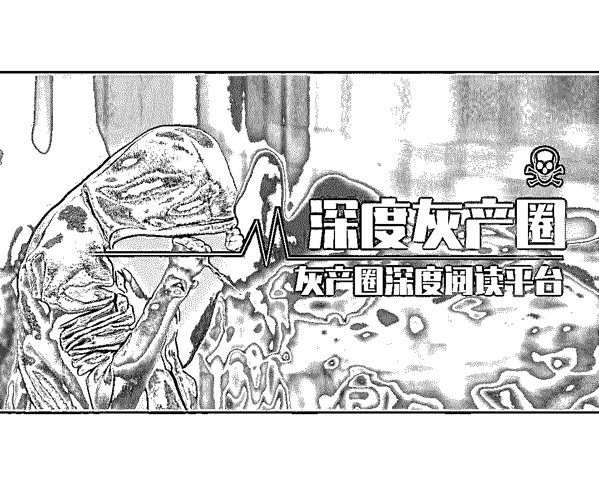**

**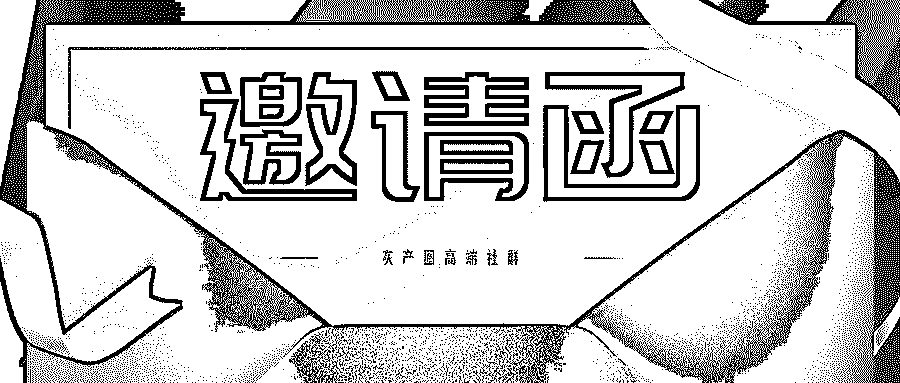** 

****

**← 向右滑动与灰产圈互动交流 →**

****

********阅读原文加入灰产圈高端社群****