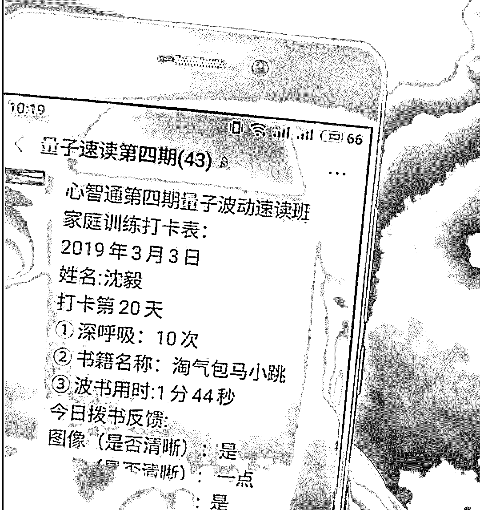

# 量子波动阅读：让孩子智商瞬间增到 250！

> 原文：[`mp.weixin.qq.com/s?__biz=MzIyMDYwMTk0Mw==&mid=2247496397&idx=1&sn=14acdbb3cb2574166357391bb5f2f92c&chksm=97cb39f5a0bcb0e302e61e8a2d39ad20c0b4e7bc045be6c7f96be728dab12923bf4d6fc11978&scene=27#wechat_redirect`](http://mp.weixin.qq.com/s?__biz=MzIyMDYwMTk0Mw==&mid=2247496397&idx=1&sn=14acdbb3cb2574166357391bb5f2f92c&chksm=97cb39f5a0bcb0e302e61e8a2d39ad20c0b4e7bc045be6c7f96be728dab12923bf4d6fc11978&scene=27#wechat_redirect)

**点击上方蓝色字体免费订阅“灰产圈”**

最近有一项来自日本的研究，震惊世人！！这个研究是基于量子力学研究，通过 HSP 高感知能力去感受人脑和知识之间的量子波动，瞬间激活右脑。

**这项技术简直比肩可控核聚变，是人类文明目前研究中最具有颠覆性的一个**，有了这个技术我们可以闭眼快速读书，九年义务教育浓缩成三个月快速课程，人类文明直接往前推进一千年！

最重要的是，这项技术还将成为我们探索宇宙的重要杀器！当人脑和知识产生量子波动的空气流动性越大，我们就离宇宙越近！！！

**神秘的“量子波动”力量**

**这个神奇的阅读技术是前所未有的开创性技术——“量子波动速读”，这种阅读技术不需要人眼观看，利用 HSP 高感知就可以在 1-5 分钟内读完一本 10 万字的书籍。**

简单来说，就是你可以不用人眼看书，手动疯狂翻书，用某种神秘的量子波动力量去感知这些知识。

[`mp.weixin.qq.com/mp/readtemplate?t=pages/video_player_tmpl&action=mpvideo&auto=0&vid=wxv_1031006954535256067`](https://mp.weixin.qq.com/mp/readtemplate?t=pages/video_player_tmpl&action=mpvideo&auto=0&vid=wxv_1031006954535256067)

而这背后的原理是基于量子力学的波粒二象性，看似静态的文字实际上也是以波的形式在传播。这种方式期望迅速激活右脑，通过想象训练、视觉训练、高速度视读训练等，全面提升信息转换成图像的能力。

**我们可以通过疯狂翻书快速接收书本文字传播的“波”，迅速唤醒自己的高感知力，激活右脑。而你翻书翻的越快，效果就越好，越凉快。**

这个「量子波动阅读」方法最早是由严谨的日本人飞谷由美子提出的，这种通过高级感知力学习的方法瞬间火遍大江南北。

老外也在学习

飞谷由美子自己在日本创建了机构，全球各个国家相继出现相关培训机构。经过一番学习了解，**我发现这个「量子波动速读」方法实在是太牛叉了，多种功能特性完全不是正常人能想出来的。**

** |  不用眼睛，直接复述**

这种「量子波动阅读」最大的特点就是不用眼睛看，调动 HSP 高感知力去学习。这个 HSP 高感知力（Highly Sensitive People）心理学上的一个概念，主要指的是对于一系列事物敏感度非常高的人所具有的心理特质。

是的，就是这个**心理学上的特质能够帮助我们在物理世界直接感受知识传播的波**，所以即便你带着眼罩也没关系，迅速翻完书之后都能够直接复述。

** |  不分语言都能读**

这个技能真的太牛了，真是不知道我们花了那么多年搞什么学习外语啊、机器翻译啊。就该早点一起全民学习这个「量子波动阅读」，**因为就在你呼吸之间，它就能在你的感知中自动翻译，别说你读英语原文了，即便你读甲骨文都木问题啊！！！**

**翻的越快，离宇宙越近**

老师还说了，要快点翻，**因为你翻书的速度越快，你离这个宇宙就越近。**

**这个理论实在是太厉害了！**我们为什么要花那么多时间去探索宇宙呢？？？我们应该都翻书啊，不仅要手动翻书，还要研究机器人快速翻书，通过把握翻书与量子波动之间的关系，一下子就可以实现人类对于宇宙的探索！

**宇宙再大又怎么样！看我们翻书迟早把你感知完！！**

** |  只有小孩能感知到**

「量子波动阅读」仅针对儿童，**“大人无法理解，只有小孩才能感受到”。**

果然儿童才是未来的希望，那些科学家每天研究到秃头的“量子”，我们儿童简简单单翻书就能感知。**不过家长不用担心自己没存在感，你可以每天监督孩子去感知量子波动，间接的感受这种神奇的力量。**

这种学习方法实在是太好，有网友表示她还有一个类似的独家读书方法——“**顺浓度梯度读书法”**。就是把书放在头上，根据生物学原理，知识从高浓度流向低浓度，从而达到获取知识效果。

我觉得这个效果应该也不错！

** 量子接生到量子“开天眼”**

**这个「量子波动阅读」方法实在是太震撼我了**，为了搞清楚理念提出者的想法，我了解了一下飞谷由美子，还找到了他们机构的官网——「飛谷こども研究所」。

看起来非常专业，创始人一直都是儿童教育相关的从业经历，发明了“波速阅读”等所谓创新式教育方式。

还找了不少物理学、医学等相关人员支持：

而且，他们的业务远比我想象的要丰富，从胎教到成年人，各种开脑课程应有尽有。

**最阔怕的是他们竟然还有「量子接生」技术！让宝宝在量子水平下出生，这样妈妈可以直接和婴儿进行高感知交流，还会让宝宝更聪明。**

至于背后的原理，也是在雷氏运动力场的作用下，让妈妈和婴儿量子纠缠，满足甘永超矩阵和甘永超变化......

**我编不下去了！！这些都是个什么鬼？？？？？**

看来老话说的没错：

遇事不决，量子力学；解释不通，穿越时空；脑洞不够，平行宇宙；风格跳跃，虚拟世界；不懂配色，赛博朋克；画面老土，追求复古；不清不楚，致敬克苏鲁。

这种交智商税的，光一个“量子”就数不胜数，**什么“功能强大”的量子水、量子袜、量子眼镜，“包治百病”的量子医疗仪器，“一本万利”的量子投资机会……**

这次的「量子波动阅读」不就是前几年的“蒙眼识字”和“开天眼”吗？背后也是特殊眼罩和学习卡片不同气味等猫腻，这次披上“量子”高大上的外衣，就又骗了一大批人。

在我看来，家长根本不需要送这些孩子去上什么“量子学习课程”，**应该自己先放下不切实际的幻想，走近科学去学习一波。**

**作者：极验**

← 向右滑动与灰产圈互动交流 →

**阅读原文加入灰产圈高端社群**