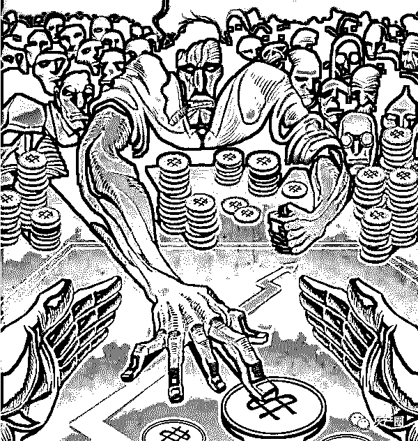
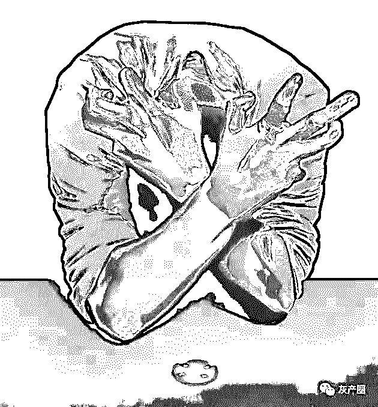
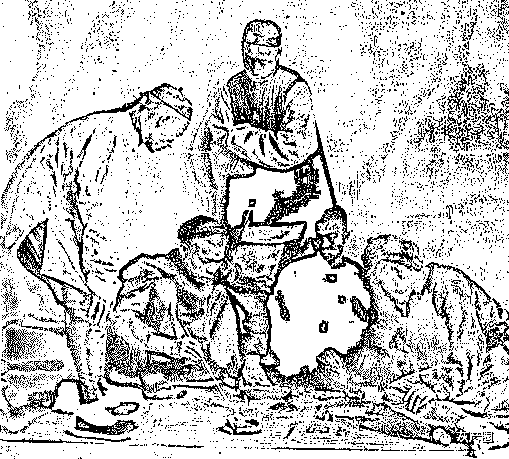

# 赌徒都是人傻钱多？

> 原文：[`mp.weixin.qq.com/s?__biz=MzIyMDYwMTk0Mw==&mid=2247496356&idx=1&sn=26efea05b9bdebae1815d45004967cf0&chksm=97cb399ca0bcb08a872a7de6927843a8e2ae89d61f50ae6ae675aa3efe14c320701f28f25e93&scene=27#wechat_redirect`](http://mp.weixin.qq.com/s?__biz=MzIyMDYwMTk0Mw==&mid=2247496356&idx=1&sn=26efea05b9bdebae1815d45004967cf0&chksm=97cb399ca0bcb08a872a7de6927843a8e2ae89d61f50ae6ae675aa3efe14c320701f28f25e93&scene=27#wechat_redirect)

**点击上方蓝色字体免费订阅“灰产圈”**

01

昨天看到一篇有关游戏商人的文章，讲述的是有一款游戏进驻了大批的游戏商人，而且都赚钱了，其中有一个商人这样说：“这一款游戏赌徒比较多，要知道赌徒都是人傻钱多，所以很赚钱的。”当我看到这里也是一阵无奈，原来别人都是这样看待我们这些赌徒的呀！

赌徒真的很傻吗？其实一开始赌徒不傻，反而非常聪明，但是慢慢的就变傻了，这样的一个过程，让人很是费解，就好比一个输钱的赌徒，明明知道自己回不了本，别人劝诫的道理其实也很明白，但是自己就偏偏的把钱送给庄家，这不是傻吗？每一次都去悔恨自己，事后又去做傻事。

02

赌徒很傻，可是在一些事情上非常聪明，就好比一串没有规律的数字，赌徒就能奇迹般地找出所谓的“规律”，在一个只有输赢的游戏里，赌徒可以创造出上百种的玩法，甚至在一个无懈可击的程序里，找到一些“漏洞”，但是这些聪明的创举，反而把自己给坑惨了。赌徒不是傻，而是聪明过了头。

有句名言说的好：“时间从来不语，却回答了所有问题。”但是这句话对于赌徒无用，**有的人输钱输了好几年，但是他一直坚信网赌能赢钱，就算事实摆在面前又如何，你认为赌徒会认输吗？**如果有一个庄家，告诉赌徒这一切都是骗你钱的，你认为赌徒会怎么做？告诉你，赌徒依然不相信，他们会说：“既然你是骗子，那么我换一家玩不就行了吗。”

03

赌徒的思维真的很令人费解，说傻吧，看样子又像一个正常人，说不傻吧，白白给别人去送钱，什么道理也都懂，但是却总去做傻事。网赌害得自己负债累累了，脑子里却还认为网赌能回本，这真是不仅傻，还是一根筋。人人都说：赌徒人傻钱多。这句话一点都不冤枉赌徒。

比如一些诱导赌博的评论，其实就是很简单的一句谎话，就连一个小孩都不相信的话，可是就有赌徒相信，曾经和一个刷评论的代理聊天，人家就很坦诚地告诉我：“如果我有能力可以轻松的挣大钱，至于在这里费时费力的刷评论吗？如果我真的有方法挣大钱，我会告诉别人吗？如果我把挣钱的方法告诉别人，那么就不是别人傻了，而是我傻了。”

04

别人都是揣着明白装糊涂，而赌徒是揣着明白真糊涂，一字之差，却是两种命运。

人生的路还很长，何去何从都是自己的选择，赌徒你是愿意继续傻下去呢？还是想明明白白活一世呢？

“赌徒都是人傻钱多”你是如何看待这句话呢？欢迎**写留言**讨论。

← 向右滑动与灰产圈互动交流 →

**阅读原文加入灰产圈高端社群**