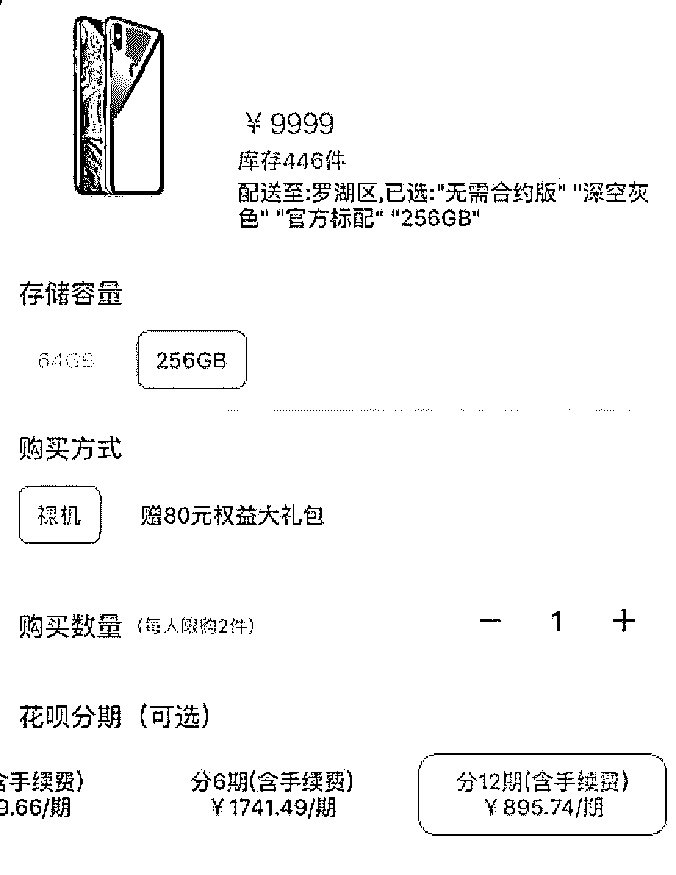
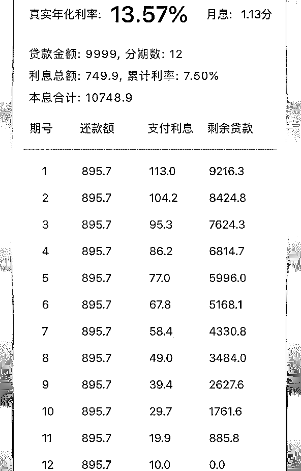
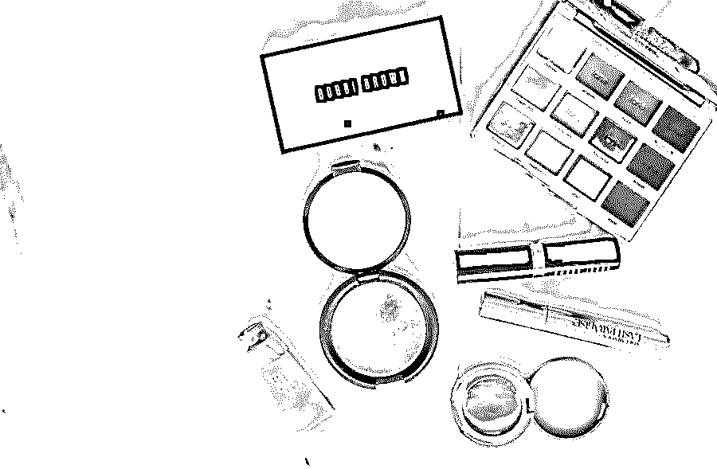
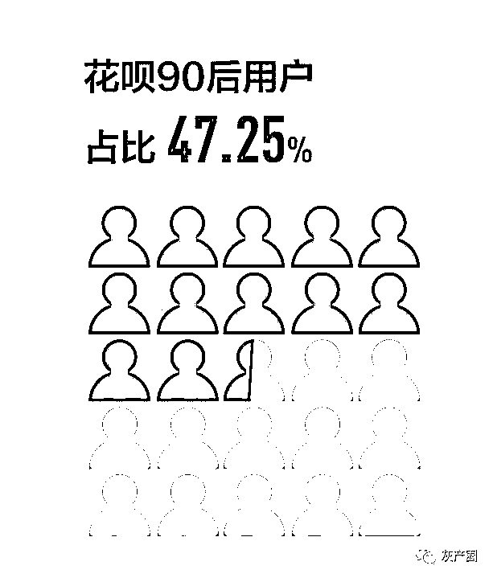
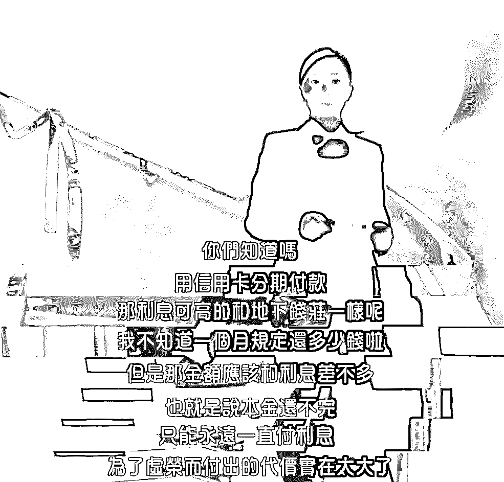
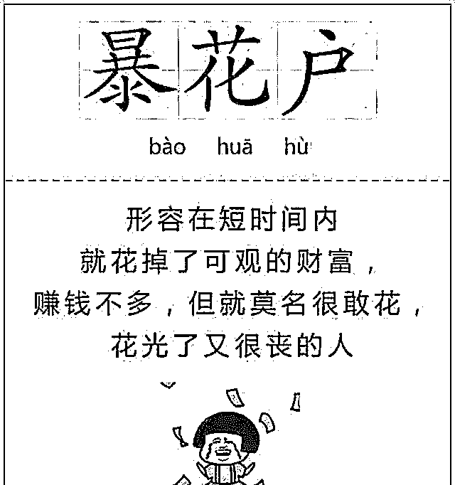

# “自杀式”人生，从分期支付开始！

> 原文：[`mp.weixin.qq.com/s?__biz=MzIyMDYwMTk0Mw==&mid=2247496340&idx=1&sn=ed8171649002b54e74679a5afd950c99&chksm=97cb39aca0bcb0ba1745fc6ef77cacdcc7c3013e0243e69a46b7250b94827639dc05e056ea00&scene=27#wechat_redirect`](http://mp.weixin.qq.com/s?__biz=MzIyMDYwMTk0Mw==&mid=2247496340&idx=1&sn=ed8171649002b54e74679a5afd950c99&chksm=97cb39aca0bcb0ba1745fc6ef77cacdcc7c3013e0243e69a46b7250b94827639dc05e056ea00&scene=27#wechat_redirect)

**点击上方蓝色字体免费订阅“灰产圈”**

分期付款，看似简单、方便，但却是一个大坑。

不仅让你透支明天的金钱，更是在透支你的人生。

你分期时有多爽

还款时泪就有多咸

最近，闺蜜小贾特别缺钱，每次工资没发几天，就开始四处借钱要周转。

问了好几次，她才吞吞吐吐告诉我，因为前段时间买东西有点狠，现在，每个月工资一发下来就得还 4000 多的分期。其实，像小贾这样的人不在少数。甚至网上都有段子说，现在人跟人之间的问候，应该是“花呗还了吗？”“分期还剩多少？”“白条还有余额吗？”分期消费太常见了，在一二线城市中，有 70%以上的年轻人都曾用过分期。轻轻松松就缓解了经济压力，穷人也能买得起。哪怕最新款的 iPhone，只要分 12 期、每个月还 895.74 元，一个普通白领也能用上苹果的顶配手机。即使这样，我今天还是想要怼一怼分期，让你们看一看，这个看上去如此便捷的方式，实际上暗藏玄机。对于很多人来说，分期并不能让他们利用通货膨胀的红利省一大笔钱，反而很容易会变成一个坑。你要相信，你分期时有多爽，还款时泪就有多咸。**省钱，只不过是看上去而已!******

************

******只要你购物，商家就在变着花样鼓动你分期。************购物时，各种 0 息分期的广告，不断诱惑你去买买买；************付款时，一键分期的按钮，只要额度够就能分期；************刷卡后，立马就有短信提示，你可以选择快速分期；************还款时，也有账单分期的选项，告诉你还款不必太辛苦……************如此大张旗鼓，就是为了能在你身上赚钱。************因为，看上去 0 息的分期，实际上真得是很贵。************虽然，在分期的时候，金融机构都会强调没有利息，但他依旧会收取手续费，其实就是变相的利息。************就拿前文说的手机来说，在官网，它的售价是 9999，如果你分 12 期，每个月的还款 895.74, 总还款额就是 10748.88，手续费就是 749.88。************按照分期的宣传，一年手续费只有 7.5%，就算是利息也是很低了。************但如果你相信了，就太天真了。************因为你每个月都在还款，欠款一直都在减少，在最后一个月的时候，本金就只有 833.25 元了，但手续费还是按照欠款 9999 元来计算的。************为了算清它真正的利率，我专门请教了在银行工作的同学，结果一算才知道，**真正的月利率是 1.13%，真正的年利率是 13.57%，都快接近 15%了。****************************你以为分期很划算，实际上都快直逼高利贷了。**************而且，还有很多银行，哪怕你中断了分期，想要一次性还清，手续费该收的还是会收，而且一分钱都不少。************曾看过一组数据，靠着这种分期业务，某银行在一年的个人贷款业务就达到了 5454.07 亿元。************这下你明白了，为什么这些金融机构，总是变着法子让你来分期，还不是因为这中间的利润很客观。************很简单啊！明面是让你提前实现梦想，暗地里是业务员的业绩有了保障。**********分期好还，欲望却难填！************

********

****也许，你会说，没有利息、没有手续费的分期，就是白借钱给你花，这样的机会千万不能错过。********即使如此，我的态度还是坚决不！********因为你一旦尝到了分期的甜头后，日后哪怕有了利息和手续费，你还是会去分的。********经济学家 Prelec 发现，人们在用信用支付时，能够体会到强烈的“消费快乐”。********这种拿别人钱买买买的快感，很容易感到一种痛快。********虽然，还款时会肉疼，但比起快感来说，根本就算不上什么。********跟所有女孩子一样，小贾喜欢买一些好东西犒劳自己。********因为工资不高，为了早早用上心仪的东西，她开始用分期。“提前实现愿望，压力还可以分摊，这多好！”********只需要一点钱，就能用上戴森吹风机、lamer 面霜、前男友面膜，很快，小贾就陷入了分期的自嗨中。****************一开始，她还会在意手续费，后来索性不管了，觉得多花一点钱也值。********结果一年多过去了，很多好东西搁置了，网上吹爆了的贵妇护肤品，也没有让她变成林青霞。********在心理学有一个名词，叫**棘轮效应**，就是指人的欲望会不断膨胀，一开始只是要一支口红，后来想要的是整个色号的口红了。********很多商家就是利用人的这种心理，先用 0 息 0 手续费让你尝个甜头，等你欲罢不能时，就开始渔翁得利，坐收手续费了。**********千万，不要把自己的意志力想得有多么强大。************很多时候，我们不过就是池塘里的小鱼儿，明明都已经看到了同伴因为一时贪心丧命了，可是当鱼钩下来的时候，还是会毫不犹豫地咬上去。******

******你不光是在花明天的钱 ******

******还在断明天的路******

************

********

****也许你会说，人生的乐趣就在买买买，那我也劝你不要依赖分期。********在贴吧上，看到这样一个故事：********网友准备买房，定金交了、合同签了，结果房贷批不下来，最后房子没买成，白白损失了几万块钱。********银行拒贷的理由是，她的征信不好。********网友挺郁闷的，之前有刷信用卡的习惯，虽会分期，但每次都是按时还款，怎么征信就不好了。********结果，她一问专业人士才知道，自己的征信就是被她之前的分期习惯给搞坏了。********分期实际上是属于贷款，如果借款机构是正规的银行、金融机构，那征信报告上就会体现为贷款。********但如果，你是买手机、美容、上英语课办了分期，那你欠的大多都是一些民间的小贷公司，它们不仅利息高，在征信上还显示为小贷，这比正规银行的要更损耗一点。********而且，很多时候每办一次分期，征信上都会有一次查询记录。**********所以，哪怕你是按时还，但对于审核人员来说，他会觉得，你得多穷啊，就连几千块钱的东西都买不起，还要分期才能还得清。************不良征信需要 5 年才能消除，一般房贷参考的都是五年内的记录。不要以为自己以后不买房，征信没有什么关系，等到你用征信的时候，那时后悔也晚了。************那时，就只能找更坑人的小贷公司了。******************

******不要被外界迷惑******

******是时候该逃离了******

************

************

******去年双十一，网上出现了一个新词“暴花户”。指的是一些人，本身没有什么钱，但特别敢消费，经常莫名其妙地就能花掉一大笔钱。************这些人之所以这么敢花，最主要的就是整个社会都在鼓吹“买买买”。************************“包能治百病，如果一个包治不好，那就买两个”、“过有品质的生活，这才能对得起自己”、“不涂口红的女人，是没有未来的”……************没钱了，只要小手点一点，几秒钟账户就多了几千块钱；只要小手点一点，再贵的东西，分期也能买得起。************身处这样的环境下，年轻人买得心安理得，欠得光明正大。************这就像是泡在温水中的青蛙，当水温一点点上升的时候，它们不但没有逃离，反而还享受着温水中的快感。**************自以为很安逸，实际危机重重，最后，只能是在快乐中被煮熟。**************其实，人跟青蛙一样。在一个大环境中，不会居安思危，只会因为跟大众步调一致，就压根不会考虑风险。************就跟着周围的人一起在自嗨中过活，压根不知道再不逃离，就要死了。************这就是现在年轻人的现状，被各种买买买裹挟，被触手可及的分期诱惑。但越是在这样的时刻，年轻人就越该保持一种清醒，越要远离这种太容易获得的快感。******

******所谓的诱惑******

******不过是被你放大了而已******

************

************

******曾有一群经济学家，对印度穷人做了几年的跟踪调查，**发现越是穷的人，越容易冲动消费。**************道理很简单，得不到的永远在骚动。人性就是这样，会不自觉地放大得不到东西的优点。************小贾就说，她分期买的第一个东西，是一套贵妇护肤品，当时花了 10000 多。************当时，各大美容博主都在推荐这个护肤品，说是用完皮肤特别好，人都能瞬间年轻 10 多岁。************看多了这样的推荐后，小贾当时就心动了，咬了咬牙买了一套，分了 24 期。************终于得了心心念念的东西，小贾高兴坏了，可是没多久，她发现效果很一般，并没有让她的皮肤改善多少。************不是因为那个东西有多好，会让你心心念念；而是因为你在心心念念的时候，不自觉地夸大了拥有它的幸福感，夸大了它的作用。************就像你的男/女神，在没有得到的时候，你就戴着滤镜去看对方，觉得他/她就是世界上最好的人。************结果，当你费尽心思得到后，才发现也都不过只是普通人而已，一样会打嗝、一样会放屁、一样会在厕所里便秘。**************对生活有追求是好事，但千万不能被自己的欲望奴役了。****尤其是，当你把诱惑放大后，更要保持一点冷静和理智。**************不然，你就会发现，欲望这个怪兽是永远都满足不了的，在它跟前，你不过只是一个小渣渣，咬一口连牙缝都不够填的。******

******每个人都在负重前行******

******但别让自己压死******

************

************

******曾在知乎上，看到这样一个告诫，是说**年轻人要趁早明白自己和别人不一样。**************也许，你的同事跟你都拿着 8000 的月薪。但你不能看着同事买买买，自己也跟着肆无忌惮地买买买。************因为，每个人身上背负的东西不一样，也许，他的女朋友不需要他来买房；他的父母都有养老金，不需要他来赡养……************而你的女朋友，不仅要车房，还要一笔不菲的彩礼钱；你的父母，再过几年就丧失了劳动力，只能靠着你养活。************一个人最怕的不是负担大，而是认不清自己，盲目从众，最后却被负担压垮了。************当然，也不是要把分期一竿子打死，只要你足够理性、利率恰当，分期也是一个配置资源的一种方式。**************但在分期前，请一定保证三点：************① **看清分期利率，**不要自己辛辛苦苦赚得钱，白白给别人做了奖金；********②**购买前要理性，**千万别把自己的信用额度当成自己的钱来花；********③ 如果一定要分期，每个机构的利率不同、各个期限的利率也不同，**多对比几家再下手。************分期确实爽，但这种爽终究只是地上的影子，它永远不长久，有时候只需要一片乌云就能消失地无踪无影。******

******如果，你这短暂的青春，被这虚无缥缈的东西毁了，我都替你感到不值当。******

******来源：支付界（ID：payworld）****** 

************

************

******← 向右滑动与灰产圈互动交流 →******

************

********************阅读原文加入灰产圈高端社群********