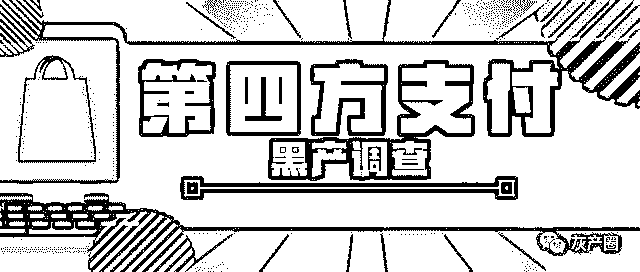
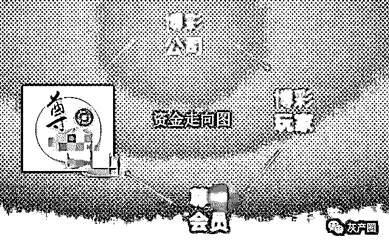
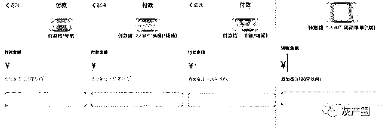
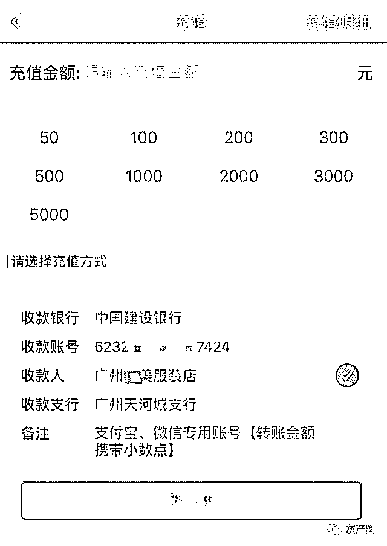
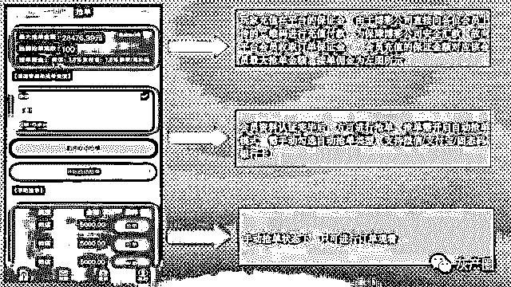
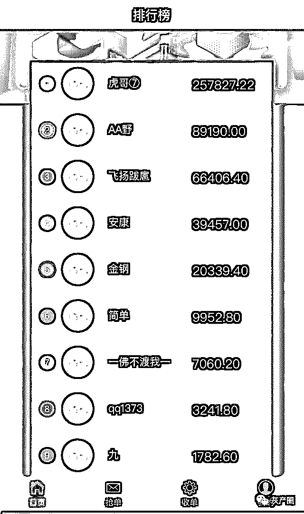

# 第四方支付黑产调查：以轻松日入千元诱人跑分，实为赌博电诈洗钱

> 原文：[`mp.weixin.qq.com/s?__biz=MzIyMDYwMTk0Mw==&mid=2247496265&idx=1&sn=f9ea0a1d84f0672f9cae645c15b6c901&chksm=97cb3971a0bcb06761bacfdc63d0fb1183d365b6c0e3872f4c293200c0f7d3cc30a4eeb90b74&scene=27#wechat_redirect`](http://mp.weixin.qq.com/s?__biz=MzIyMDYwMTk0Mw==&mid=2247496265&idx=1&sn=f9ea0a1d84f0672f9cae645c15b6c901&chksm=97cb3971a0bcb06761bacfdc63d0fb1183d365b6c0e3872f4c293200c0f7d3cc30a4eeb90b74&scene=27#wechat_redirect)

**点击上方蓝色字体免费订阅“灰产圈”**

导语

“轻松日入千元”、“本金越多，佣金就越多”，网上广告宣称只需要提供个人微信、支付宝等收款二维码，就能收取高额佣金，并将这种行为称为“跑分”。然而，这种看似轻易的赚钱方式，或将提供个人收款码的网民卷入犯罪活动中。

记者向警方了解到，跑分是“第四方支付”为躲避公安机关的打击衍生而来的、利用大量普通网民收款码来运作资金流转的一种黑产手段。所谓“第四方支付”，是相对微信支付、支付宝等第三方支付而言、介于第三方支付和商户之间的网络支付平台，没有经营支付结算业务的许可牌照，属于违法网络支付途径，常被犯罪分子用于诈骗、网络赌博、洗钱等非法用途，是网络黑产犯罪链条中的支付环节。

记者调查发现，跑分平台大量收集普通个人或商铺第三方支付收款码，化整为零，搭建了赌博网站与赌客之间的资金流通渠道，躲避有关部门的监管和打击，为之洗钱，搭建了一条完整的黑色产业链。

值得注意的是，有不少网友向记者反映，投入跑分平台的钱迟迟无法提现，被平台以各种理由扣取，并未获得其承诺的所谓“高额佣金”，还有人向跑分平台交了所谓保证金后，平台就关停了，钱也打了水漂。

此外，今年 7 月，广东警方还发布了侦破全国首例打击“跑分”平台帮助信息网络犯罪活动案，抓获犯罪嫌疑人 103 人，捣毁窝点 10 个，冻结涉案金额 1645 万元，缴获手机、银行卡、电脑、帐单等涉案物品一大批。

9 月 19 日，广东公安机关“净网 2019”专项行动新闻发布会上，广东省公安厅网警总队总工程师郭宏伟在回答记者提问时介绍，普通网民参与跑分存在资金损失、个人信息泄露甚至涉嫌帮助犯罪等风险。

现象：赌博平台藏身网络广告，投注后收款方另有其人

赌博网站通过各类广告推广引流，点击进入则被告知是“给彩票公司刷单”，也就是赌博网站招募玩家、赌客充值下注，然而投注的收款方却并不显示为赌博网站，而是个人或者服装店、建材店。

记者在调查中发现，这些通过各种网络广告推广引流，吸引赌客的赌博网站、线上博彩平台，其与玩家之间的转账交易并不是直接进行，而是经过了层层转手。

记者在一个由“网赚”广告引流的赌博 App 页面看到，一款名为“55 彩票”的 App 首页上，铺满了“幸运飞艇”、“香港六合彩”、“福彩 3D”等各类赌博游戏，投注充值渠道十分齐全，不仅支持微信、支付宝等方式下注，玩家还可以通过银行转账下注。

以微信充值下注的选项为例，根据所充值金额的大小，共有六个微信收款码供玩家选择。下注 10 元至 100 元，扫描收款码显示的收款方为“清 X 阁茶庄”，投注 301 元至 2000 元，收款方则为个人账号，如**杰、**健等。

# 网络赌博平台收款方显示为个人。

而在支付宝充值下注选项中，7 个收款码中有 4 个收款方为个人支付宝账户，如*守航、*杨杨等，其余 3 个为淘宝商品代付二维码，收款方也为个人。除此之外，银行转账的收款方多为商铺，如广州 X 美服装店、广州东 X 建材部，该 App 客服“瑶瑶”私信发来的微信充值下注收款码，收款方则显示为某日用百货店。

# 网络赌博平台收款方显示为商户。

记者在“网赚”广告引流的另一赌博 App“乐 8 彩票”上也发现，其收款方也并非显示为其赌博平台，而是商贸公司、服装店或个人。

对此，“乐 8 彩票”的客服解释称，“这些收款方的名称只是充值下注的渠道名而已，玩家不用担心受骗”，并承诺其团队“投资了目前全网最火爆的彩票来做网赚，有专业的计划师和顶尖的分析团队预测，中奖率达到 90%，一天赚个 300 元至 500 元很稳定的”。

记者根据客服指引实测发现，这些转账给个人或其他商铺的款项最后的确出现在了上述 App 的个人账户余额中。

也就是说，赌博 App 并不直接收取赌客的投注资金，而是各式各样的商铺或者的第三方支付或银行收款码，这些下注的金额虽不显示直接打给赌博 App，但最终玩家在赌博 App 的账户上却能如实显示下注金额。

黑产：跑分平台聚合第三方收款码，为赌博平台提供资金流转渠道

赌博 App 上下注的收款方除了个人、普通商家之外，记者还调查发现，其收款方还显示有“国美电器”、“中国移动”等商家。

有报料人向记者反映，在赌博 App 上付款下注后，现实的收款方为国美电器。随后，记者致电国美电器，查询报料人提供的支付商家订单号，国美电器客服告诉记者，此前向赌博平台所充值“下注”的金额实际上是手机话费，在了解到这笔支付的目的并不是充话费后，国美客服向记者表示，“这是被诈骗了，是帮别人充了手机话费，已经付款成功，无法退款。”

那么，这些赌客们没有直接支付给赌博平台却最终显示在玩家赌博平台个人账户上的钱，如何流转到赌博平台、诈骗分子手上？

记者调查发现，有一条聚合大量个人、店铺收款码的“跑分平台”黑色产业链，为赌博网站提供了资金流转、结算的渠道，是非法“第四方支付”平台中的一种类型。需要洗钱、逃避监管的赌博网站、诈骗团伙等成为了跑分平台的客户。

“诚接 BC 行业所有代理、商户！”在一跑分平台卖家展示的服务品类中，该卖家告诉记者，“BC”也就是“博彩”的拼音首字母缩写，这些跑分平台卖家还推出“转卡”（即微信、支付宝向银行卡转账）、“固码”（即聚合至少两个以上的支付通道生成一个聚合固定的收款二维码）、“原生”（即直接在微信、支付宝官方渠道申请的支付通道）、“H5”（即 H5 网页可以跳转至微信支付宝支付）支付等多样选择。

“充值秒到账”、“专人客服”、“24 小时服务”…这些跑分平台卖家手上有各种各样的跑分渠道，标明所持跑分平台的“成功率”也是跑分平台卖家们的推销话术。在网上发布广告，吸引需要洗钱的博彩甚至诈骗分子，以支付宝、微信、云闪付、淘宝代付等多种多样的合法支付渠道，为赌博平台甚至电信网络诈骗分子，提供资金流转途径，躲避监管。据广东警方披露的案例显示，还有犯罪团伙将这种“第四方支付”平台用于网络诈骗。

9 月 19 日，广东警方发布了“净网 2019”专项行动典型案例中，就有一个由“第四方支付”平台、金融诈骗平台、诈骗团伙组成的犯罪产业全链条。涉案的两个“第四方支付”平台与第三方支付平台或者银行合作，成为这些合作机构的客户或者代理商，成功开通资金通道，通过中介大肆发展下线客户，在明知下线的客户实施诈骗或者赌博等犯罪行为时，仍向犯罪分子提供资金通道。

实测：跑分平台需跑分者提前支付保证金，交钱后看不到收款详情

有了下游客户，那么这些“跑分平台”上的大量的个人、店铺收款码从何而来？记者在调查中发现，在网上有不少人以“跑分挣钱”“发展下线还能拿抽成和奖励金”等网络兼职广告，以所谓高额汇报佣金，吸引普通网民参与跑分。

在一跑分网络兼职 QQ 群里，网友“沉默是金”称“群里大佬跑分一天挣个几百上千”，并介绍，加入跑分平台不仅可以跑分挣钱，每发展一个下线还能拿取抽成和 300 元奖励金。

为此，“沉默是金”试图将记者发展为下线，并把下线介绍给一名为“尊 X”的跑分平台的客服人员，该客服向记者介绍了相关情况。

# 尊 X 跑分平台教程。

该客服发来的项目介绍中称，该跑分平台的操作思路即“尊 X 平台对接赌博公司，由赌博玩家向尊 X 会员上传的首款码进行充值付款”。

所谓的“尊 X 会员”，就是该“尊 X”跑分平台上参与跑分的人，会员需向平台上传个人收款二维码并绑定银行卡，当赌博公司有玩家需要充值时，这些充值需求就会以“订单”的形式在“尊 X”平台列出，会员抢单后赌博平台便会把尊 X 会员的个人收款二维码提供给赌客，收款成功后会员即可获得 1.5%-1.8%的佣金。

为了避免会员收取赌博公司转账后跑路，“尊 X”要求会员提前向平台充值至少 3000 元“保证金”，并声称“尊 X”系统会根据会员充值的保证金额自动抢跑分金额少于保证金的订单，会员成功收款后，其在“尊 X”跑分平台上的账户余额相应减少。

也就是说，“尊 X”平台的跑分者要为赌博玩家提前垫付赌资。

记者发现，实际操作中，支付了保证金后会员却无法在该平台查看所谓的赌博公司的待付款订单（即跑分者的待收款订单）详情，只能全权交由系统自动配单。对此客服解释称，“陈列所有的待付款订单风险太高，我们为保证上家资金安全已将平台更新。”

# 尊 X 跑分平台每日跑分金额排行榜。

在另一个跑分平台“自 X 联盟”上，参与跑分的人则被称为“码商”，码商若想参与跑分，也必须绑定银行卡号、填写个人真实姓名，并充值不低于 1000 元保证金。

风险：宣称每天获利上万实际上迟迟无法提现，交钱后平台跑路

跑分平台为了招揽跑分者，除了超高佣金等噱头，还有宣称发展下线可以层层代理提成。

“拉一个宝妈，整个小区都是你的下级；拉一个学生，整个学校都在为你战斗；拉一个工人，整个工厂都投入你怀抱！”“自 X 联盟”的宣传栏中介绍，“上线”可抽取直属“下线”总收款额的 0.25%，至第六级下线仍可抽取 0.01%。

该平台声称，按照每个用户推荐 5 个激活用户且每个用户每天收款 5000 元、每 5 天会向下发展一级的情况计算，一个月后每天可得利润为 12462 元，单月可获得抽佣 386337 元。

该平台还称，当码商每日收款达到 30 万元，平台称还将会返还开户费 198 元。并表示，由于对接的“上家”平台多在夜间活动，“自 X 联盟”的夜间收款总量大概在 100 万元至 500 万元之间，参与熬夜跑分的码商佣金会增长 0.3%。

“尊 X”平台也有类似的抽成模式。其称，可抽取直属下线收款额的 0.15%，间接下线的 0.08%，同时直属下线首次充值的 3000 元保证金中，会有 300 元直接返给上线。

记者发现，两家跑分平台的资金管理模式均为”宽进严出”，平台一方面向跑分者提前收取保证金保障平台资金不受损，甚至以此为筹码在跑分者提现时设限；但另一方面，跑分者一旦缴纳所谓保证金后，资金安全毫无保障。

有不少参与过跑分的网友均表示，遇到了交给跑分平台的保证金无缘无故被扣掉、提不了现等情况，甚至有人还遭到了跑分平台的威胁。

在“尊 X”跑分平台的网络交流群中，网友“像疯子一样”向客服反映，称自己充值 3000 元保证金后，还未开始接单收款，就被平台扣了 500 元，客服表示收款总额达到一万才能将这 500 元退回其平台账户，但“跑”够一万元后，此条件上升为三万，最后则称要“跑”十万才可以退回。

“像疯子一样”说。对此“尊 X”客服回应称，扣了 500 元是因为这名跑分者的上线领取了 300 元奖励金，并称“你可以问一下领走你奖励金的上线”，将原本平台承诺给上线的奖励金划归为下线的支出，并将纠纷责任推卸给上线。

另一位跑分者”无涯”告诉记者，“充值 3000 元后，平台说，如果‘跑’不到 10000 元的单就提现，平台要扣除我 500 元，我后来等了一个半小时才接了 300 元的单”，其反映接不到单后，客服则解释称，这是因为她交给跑分平台的保证金额太低，“系统没有那么多小单可以匹配”。“这个平台把充值交钱了的人套住了”，“无涯”说。

网友秦某报料称，本想做网络兼职赚钱就加入了跑分平台，其向平台充值了一万元后，平台不允许其提现，在秦某向客服人员表示要报警后，平台客服则恐吓秦某“你自己做跑分就是违法的，要抓也先抓你。”

网友兰某也经历了类似的情况，其表示自己参与跑分的平台突然就关停了，自己充值的“保证金”也就全部打了水漂。

背后：自称对接博彩不会“死码”，220 元可代开商户收款码

上述赌博网站的收款方不仅有个人网络账户，还有服装店、建材店商户收款码等。记者调查发现，在这背后，有人专门为跑分者躲避第三方支付平台以及相关部门的监管，提供代开商户收款码的服务。

“我们对接的上家是 BC，不是 DZ，所以你们的二维码不会直接死码”，“尊 X”客服向记者解释，“BC”也就是“博彩”的拼音首字母缩写代号，“DZ”则是“电诈”的代号，“死码”则是被微信支付、支付宝等第三方支付平台采取限制收款、冻结等措施。

“尊 X”平台的客服像记者介绍称，一个二维码的收款饱和度在一万五千元到两万元之间，为了躲避支付平台的监管，跑分者会在收款总额达到这个区间后更换二维码。

该客服还称，“就算你的账户被冻结了，第二天就会解冻。而且我们对接的上家是 BC(即博彩)，没有 DZ(即电诈)，所以投诉率低，不会直接死码”。

另一招募跑分者的人士告诉记者，在熟悉跑分流程后，跑分者可以去办理类似便利店所用的商家收款码，称这种码一般是直接通过银行收款的银联码，跑得量大且不会冻结，“店铺码有专门的代办，跑分群里就有，基本都是几百块钱一个。”

“我们需要提交资料审核，然后给你包装，都需要时间，提交后最快半小时，最慢隔天才能拿到码。”网上“代开商户收款码”的卖家告诉记者，代开商户码收费 220 元一个，只需提交办理人的身份证正反面、手机号和银行卡即可。

该卖家告诉记者，一个身份证可以开 5 个商户码，全部为实时到账二维码，该卖家还介绍，应该将商户收款码和个人收款码交替使用，以躲避被监管的风险。

打击：“第四方支付”系违法网络支付途径，参与跑分或涉嫌帮助犯罪

实际上，无论是公安机关还是微信、支付宝等第三方支付平台都在持续打击跑分、第四方支付等违法行为。

记者了解到，近年来，广东警方连续破获了多起涉“第四方支付”平台的网络黑产案件，涉案金额巨大。7 月 26 日，广东省公安厅发布了全国首例打击“跑分”平台帮助信息网络犯罪活动案侦办情况。

据了解，今年以来，佛山警方在工作中发现，一种利用微信、支付宝收款二维码进行“跑分”网络兼职项目涉嫌帮助境外网络赌博网站接收、流转、洗白资金，逃避警方打击。

案情上报后，省公安厅将该案列为“净网 6 号”专案，成立专案组。经专案组深入侦查，成功挖掘出一个利用“跑分”平台帮助信息网络犯罪活动团伙。该团伙通过外聘软件公司开发一款名为“赚呗”“跑分”App，吸纳会员，并组织会员为境外赌博网站商户提供资金支付通道，以赚取佣金获利。

经查，该团伙形成“赌客—平台会员—跑分平台—境外赌博网站”的资金流转闭环路径。每月涉案资金高达 2 亿元人民币。

在查清团伙组织架构和固定相关犯罪证据后，6 月下旬，省公安厅组织专案组开展“净网 6 号”专案集中收网行动，一举摧毁这个利用跑分 App“赚呗”洗白赌资、逃避监管的新型犯罪团伙，抓获犯罪嫌疑人 103 人，捣毁窝点 10 个，冻结涉案金额 1645 万元，缴获手机、银行卡、电脑、帐单等涉案物品一大批。该案是全国首例打击“跑分”平台帮助信息网络犯罪活动案。

2019 年 2 月，腾讯支付风控团队也发布《关于打击“微信跑分”违法违规活动的公告》，表示对于涉嫌宣传和组织微信跑分、涉及赌博、色情欺诈收款等违规账号，根据账号违规程度采取限制收款、冻结等措施，情节严重并涉及违法犯罪的，将移交司法机关。

3 月 5 日，支付保安全中心也发布公告《升级安全风控模型，防止“微信跑分”骗局转移 》，表示为预防此类跑分类黑灰产向支付宝平台转移，支付宝安全团队对风控系统采取了针对性的升级，并进行了全面的排查和预防。一旦查实账号涉及此类违规行为，支付宝会立即进行限制收款、关闭账户等处罚，情节严重者将会移交司法机关。

9 月 19 日，广东公安机关“净网 2019”专项行动新闻发布会上，广东省公安厅网警总队总工程师郭宏伟在回答记者提问时介绍，普通网民参与跑分存在资金损失、个人信息泄露甚至涉嫌犯罪等风险。

“一是如果跑分平台关停跑路了，网友交的保证金基本上就拿不回来了，存在资金损失的经济风险。二是网友在平台上注册的个人身份信息、银行卡信息、网络账号信息等，存在泄漏或者被窃取的风险。三是跑分平台实质上是为网络赌博等犯罪活动进行洗钱，涉嫌帮助信息网络犯罪活动罪，需要承担相应的法律责任。”郭宏伟向记者表示，广大网友千万不要为了蝇头小利，成为帮助网络犯罪活动的“工具”。如果遇到类似的跑分平台，应当及时向公安机关举报。

他介绍，“第四方支付”没有经营支付结算业务的许可牌照，属于违法网络支付途径，常常被犯罪分子用于诈骗、网络赌博、洗钱等非法用途，是网络黑产犯罪链条中的支付环节。跑分平台就是“第四方支付”为了躲避公安机关的打击，化整为零，让普通网友来帮它转钱，普通网友收取小额转账佣金。“跑分的资金链、流水非常复杂，这些收款码里流转的有网友的合法资金，也有帮犯罪分子流转的资金，所以打击的难度大很多，隐蔽性很强。”郭宏伟表示。

警方提示，网友在进行充值、转账等操作时，一定要选择正规支付平台。部分利用微信、支付宝收款二维码等进行“跑分”兼职项目，背后实际上是为帮助赌博等黑灰产团伙进行洗钱活动，涉嫌帮助信息网络犯罪活动罪，参与者需要承担经济损失风险和相应法律责任。如遇类似的“跑分”平台、类似无经营支付结算业务许可牌照的支付平台，应积极向警方举报。

**采写：见习记者 刘珺雅 记者 向雪妮**

← 向右滑动与灰产圈互动交流 →

**阅读原文加入灰产圈高端社群**