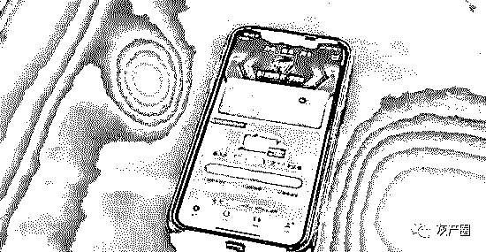
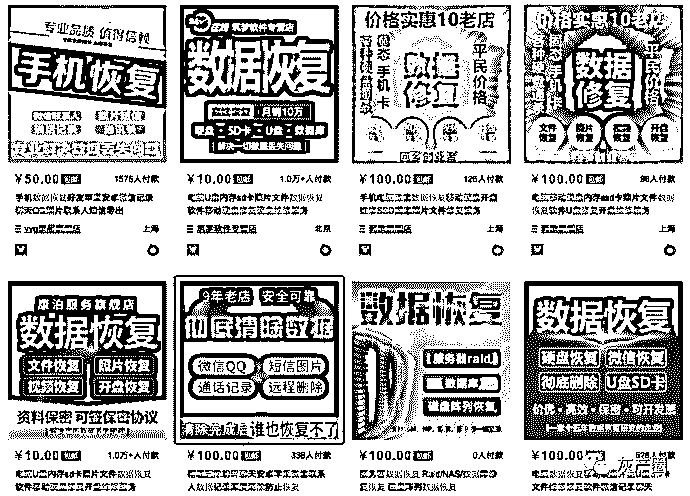
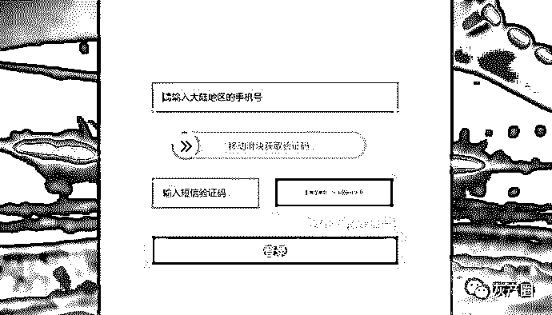

# 新型“盗刷”现世，丢钱别丢手机！

> 原文：[`mp.weixin.qq.com/s?__biz=MzIyMDYwMTk0Mw==&mid=2247496240&idx=1&sn=9794d3f3c4d060e1417c4e5eafb812da&chksm=97cb3908a0bcb01e8c735215324ee27ca300d3b7103cb0106c2ed0ade228c217d8a2d87d5dbf&scene=27#wechat_redirect`](http://mp.weixin.qq.com/s?__biz=MzIyMDYwMTk0Mw==&mid=2247496240&idx=1&sn=9794d3f3c4d060e1417c4e5eafb812da&chksm=97cb3908a0bcb01e8c735215324ee27ca300d3b7103cb0106c2ed0ade228c217d8a2d87d5dbf&scene=27#wechat_redirect)

**点击上方蓝色字体免费订阅“灰产圈”**

一机走天下，方便了自己，也方便了「小偷」。

如今，智能手机在我们日常生活中扮演着越来越重要的角色，也逐渐顺其自然地承载着越来越多的关于你、关于你的家人、关于你的生活点滴的信息，这些甚至已经超出了手机本身，甚至是作为机主的你控制范围。

不敢说我喜欢你，

只有在某个夜晚多愁善感又萦绕在心头，

或是朋友聚会上的大醉，

才敢借着情绪说，

我喜欢你，喜欢了好久好久。

2019 年 9 月 17 日，上海黄浦警方披露了一起新型信用卡盗刷案件。当受害者手机遗失或者被盗，「小偷」通过手机号登陆携程、飞猪、去哪儿等出行软件，获取完整的机主信息，从而能够冒充机主实现盗刷。

从实际操作来看，犯罪嫌疑人并没有采用多高科技的手段：

> 1.破解手机锁屏保护，利用已有的手机 SIM 卡逐一登陆携程、飞猪等出行软件，搜集机主真实信息；
> 
> 2.利用数据恢复功能或者 51 信用卡管家等软件，获取受害者银行卡信息；
> 
> 3.利用已有信息重置受害者部分账户密码，尝试盗刷。

此类事故的发生，一定程度上暴露出众多平台账户的安全验证措施不够完善，或者说仅靠手机号短信或者电话验证用户身份本身就存在较大的安全漏洞。

如果你问我，一万块钱丢了和一部 5000 块用了一两年的智能手机被偷，比较能接受哪一个？

**我肯定愿意丢钱。**

看了大量的犯罪手法，你会发现，一些你不经意留下的信息都有可能是「小偷」眼中的重要突破口。

一般来说，一部手机用一两年之后，里面存储的重要信息可能连你自己都想象不到，最常见的就是自拍照。同时，应该也有很多人接触到那种需要上传身份证正反面照片、银行卡照片或者扫描件甚至是手持身份证的照片来进行实名认证的场景，这些对于犯罪分子来说是最有价值的内容。

> 什么？你用完就删？可能没你想的那么简单。

去年的时候，笔者刚好写过一篇关于旧手机隐私的文章，主要也提到过一个案例——某地官员在接受检查的时候，其手机就被取证技术手段恢复了已删除的聊天记录，因而成为违规违纪的证据。

而通过专业的数据恢复手段，能够恢复手机上已经删除的文件、照片，甚至还包括通话记录、短信、通讯录以及各种社交软件的聊天记录。

这种数据恢复服务在线下的一些手机维修店就可以找到，而万能的某宝也自然是有的。相比去年笔者写那篇文章截图的时候，这次同样的关键词搜索发现大量提供数据永久清除（防恢复）的服务。

当数据清除不再是点点删除键那么简单的时候，很多人已经靠它赚钱，我们是不是也该好好想一想如何保护手机里的秘密……

此外，在前文提到的案例中，SIM 卡在犯案过程中也发挥着至关重要的作用。

目前在国内全面使用手机号实名制，在某些应用场景下 SIM 卡充当着机主身份证的作用。而部分大量的 APP 也简单粗暴的把接收验证码登陆作为默认或者可选的账户登录方式。

这也意味着，一旦有人捡到你的手机，即便没能第一时间破解锁屏，直接抽出 SIM 插在另一部手机上，也能够通过短信验证码的方式登陆你的部分账户。至少外卖、打车、旅行服务的 APP 多数都可以通过这种方式登陆。而账户中所保存的用户信息就能够一览无余。

甚至直接用你的手机号拨打运营商或者部分金融服务平台的客服电话，还能够重置服务密码。更严重的话，利用你的手机号以及掌握的其他信息去对你的家人朋友进行钓鱼诈骗。

这种情况不止是存在手机遗失或者被盗的情况下，不少人都有更换手机号的体验，即便是你注销掉的手机号在一段时间后还是会被运营商重新投放到市场等待它的下一任机主。而你曾使用该手机注册过账号却不会随着注销而注销，也意味着下一任机主能够通过短信验证的方式登陆你的部分账户。

笔者现在所使用的手机号就是二手的，在刚买到的时候曾经成功通过短信验证的方式登陆过支付宝（虽然没有支付密码无法完成支付）、部分外卖平台等。

至此，回想一下会发现，智能手机的出现确实给我们的生活带来的极大的便利。但同时也承载、记录了过多的私密信息，甚至被过度赋予一些特权。懂得保护自己的私密信息很重要，短信验证码的单一验证方式不够安全是不争的事实，各大平台账户的安全验证机制明显存在漏洞，而运营商对于手机号码安全管理以及注销手机号的处理方式明显还不够完善，这些都是需要迫切完善的地方。

作者：Allen 别 bb

← 向右滑动与灰产圈互动交流 →

**阅读原文加入灰产圈高端社群**