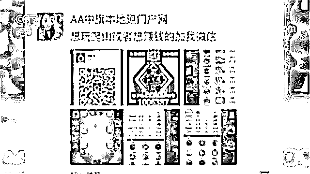
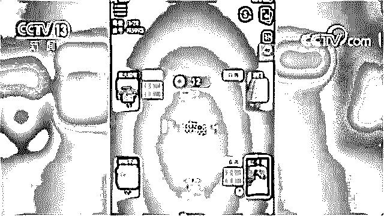
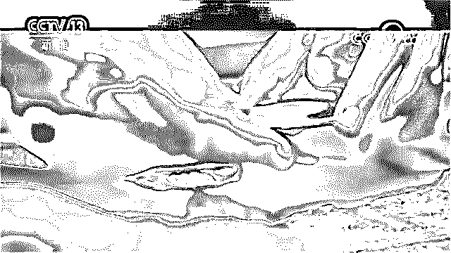
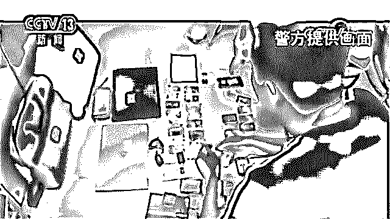
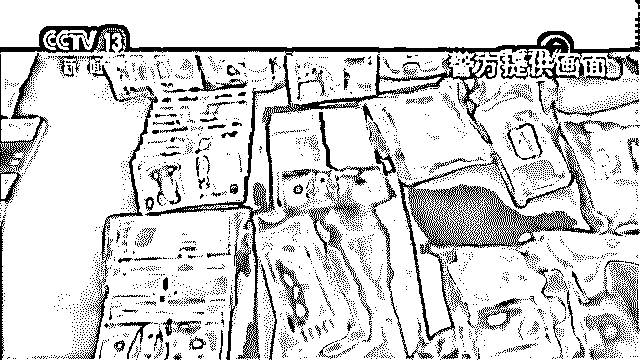

# 要想死得快，网赌加网贷！

> 原文：[`mp.weixin.qq.com/s?__biz=MzIyMDYwMTk0Mw==&mid=2247496223&idx=1&sn=ad00aa1d994b7c66435d77115af8a028&chksm=97cb3927a0bcb0316efc07cecdc0d6ca5727385fafbb6bab568b7896d34e62e6ecf0404f0898&scene=27#wechat_redirect`](http://mp.weixin.qq.com/s?__biz=MzIyMDYwMTk0Mw==&mid=2247496223&idx=1&sn=ad00aa1d994b7c66435d77115af8a028&chksm=97cb3927a0bcb0316efc07cecdc0d6ca5727385fafbb6bab568b7896d34e62e6ecf0404f0898&scene=27#wechat_redirect)

**点击上方蓝色字体免费订阅“灰产圈”**

导语

央视网消息：

最近，一起特大网络赌博案件的告破。

内蒙古察哈尔右翼中旗的杨先生是当地一位有名的工程承包商，从小家境贫寒的他靠自己的努力打拼，从白手起家到小有积蓄，可谓十分励志。

但是在**去年年底短短一个月的时间内，他就变得身无分文，甚至负债累累了**。

那么，杨先生到底经历了什么呢？

杨先生今年 32 岁,他告诉记者，小时候家里很穷，在他读完初中的时候便选择了外出打工。

外出打拼的杨先生在那几年不知疲倦，只希望可以让家里人过得好一点。

就这样，杨先生靠自己的双手让家里的条件获得了不少改善，买了房买了车，他自己也结了婚，并于 2013 年 9 月份有了一个女儿。

眼看着日子正要蒸蒸日上，**2018 年 12 月的一天，杨先生无意中看到了微信朋友圈中一个人转发的一款名为“扑克*”的游戏，上面写道：****“想玩爬山或者想赚钱的加我微信”**。

“爬山”又名“诈金花”、“拼三张”，是一种带有赌博性质的扑克牌游戏。

杨先生看到，这款“扑克*”游戏里使用的是游戏积分，与人民币是一比一兑换的，想要充值或者提现都需要与客服联系进行操作。

杨先生一时间便对这款游戏充满了兴趣，随后便按照游戏中的提示进行了充值。 

参赌人员杨先生：“**上了一百块钱，我感觉到真还行，不是骗人，我就开始渐渐去玩了。****每天晚上下班回去我就打开想进去看一看，看一看耍几把就睡觉了。**”

就这样，杨先生渐渐痴迷了起来，只要一有时间便进入游戏玩上几把。**投注的金额也从最初的 100 元骤增到几千乃至几万元**。

参赌人员杨先生：“**就是每天赢上个三五千，输上个好几万，就是这样，就是输两万，赢上往回打上一万五，你还耍，最后又输了，就是这样断断续续、反反复复，每天反正就是这样输。我总共输进去 80 多万。**” 

夫妻二人几年的积蓄，让杨先生在短短一个月的时间内挥霍一空，不仅如此，他还卖掉了车、首饰等家里所有值钱的东西，欠下的债务也越来越多。

如此的大起大落让杨先生万念俱灰，甚至一度想到了跳楼自杀。

参赌人员杨先生：“有一天耍得就是输了七八万，就是三天三夜没有睡过觉，也没有吃过东西。当时想的就是，也想过，我真想过，那会儿是想过跳楼，欠了一屁股债就是还不上。”

欠债 400 多万 警方调查赌博幕后大鱼

如今，杨先生所欠下的债务已达 400 多万元。

**拼搏，让他拥有了一切，赌博，却又让他亲手毁灭了这一切**。

那么，杨先生所玩的这一款“扑克*”游戏，到底是谁在经营？由于朋友圈内转发那条消息的人不在少数。

警方怀疑，这极有可能是有人在幕后 靠开设网络赌场，从中获利。

内蒙古自治区乌兰察布市察哈尔右翼中旗公安局网安大队副大队长霍晓东：“他们这个赌博模式是这样的，这个赌博 APP 采用的是诈金花。你下载 APP 注册之后，他有一个微信客服，微信联系人，你跟这个微信客服联系之后，他再让你加一个支付宝好友，给你发一个支付宝二维码，你扫支付宝二维码之后加一个支付宝的好友，然后你就往这个支付宝好友给他发一个红包，然后备注上你的游戏 ID，之后你的这个赌博 APP 上，相应会给你上相应的分数，然后你在这个上面参与赌博。参与赌博如果假如你是赢钱了之后，它有对应的分数，你点这个下分，然后再把你支付宝的二维码传上去，它就会把你赢的这个钱给你打到你的这个支付宝里。所赢的钱，会抽头 3%，1.5%他们是留给这个，就是赌博 APP 拿了，会给这个会长返剩下的 1.5%，返到这个会长的银行卡里。”

警方侦查发现，会长，是这款“扑克*”游戏的代理，是一种所谓的推广方式，参赌人员可以邀请其他人进入游戏，只要拉 30 个人进入到游戏中，便可以成为他们的会长。这些人赢了钱，会长就可以获得相应的提成。

不少参赌人员为了成为代理，以得到额外的收益，便大肆地在各大论坛及朋友圈内疯狂转发广告。

杨先生也正是通过这种方式接触到的这款游戏，进而一步步坠入了深渊。

内蒙古自治区乌兰察布市察哈尔右翼中旗公安局网安大队大队长鲁俊义：“经过我们的逐步侦查，发现这个赌博的金额越来越大，赌博的流水、**单日流水达到三千万元以上**。”

民警分批次调取了上千张银行卡的交易流水，却发现整个平台的交易方式如同枝蔓一般盘根错杂。

内蒙古自治区乌兰察布市察哈尔右翼中旗公安局网安大队副大队长霍晓东：“这些赌资打到这张银行卡里，然后银行卡再向上一级银行卡里再转，上一级银行卡里再转，然后他上级银行卡还在流转，发现这些赌资就是一直在这些银行卡里流转，就没有这个提现的痕迹，所有的钱不停在流转，打来打去。当时我们也特别纳闷，你说这个非法盈利他总得有个受益人，这个受益人是谁？他是怎么把这些盈利揣到自己腰包的？”

通过对上千万条数据进行分析，民警判断：该赌博集团是通过“对敲型地下钱庄”，对抽头收益进行洗钱，最终完成交易。 

利用“对敲型地下钱庄”完成交易

正是利用“对敲型地下钱庄”，赌博幕后大鱼被隐藏的严严实实。

那么什么是“对敲型地下钱庄”呢？

就是如果把人民币打给地下钱庄，地下钱庄就会在境外给换成美元。

如果在境外需要人民币，那你在境外给地下钱庄美元，你境内的账户给我的账户里打入人民币。

这样无法进行查证，因为两个资金没有关联。

但尽管如此，民警通过比对调查，还是从这成千上万张银行卡中，有了新发现。

内蒙古自治区乌兰察布市察哈尔右翼中旗公安局网安大队大队长鲁俊义：“**涉案银行卡大部分开户地址在唐山，但是使用地址在境外柬埔寨，我们就怀疑这是一个唐山人在柬埔寨开设的赌场**。”

警方发现，这些银行卡的使用者都不是开户者，同时，由于银行卡数目实在过于巨大，赌博团伙在网上交易所使用的也均为虚拟身份，想要从茫茫多的虚拟身份中进一步锁定犯罪嫌疑人，仍然难度不小。 

内蒙古自治区乌兰察布市察哈尔右翼中旗公安局网安大队副大队长霍晓东：“后来我们通过调取这个微信这个登录日志，因为这个微信特别有嫌疑，而且是他是当天的 IP 从柬埔寨变化到了天津，从天津这个 IP 又变成到了唐山，那么我们在想，他是不是从柬埔寨回来的一个人，又回到了天津，回到了唐山。”

警方猜想，团伙内的其中一名犯罪嫌疑人极有可能是在这一天，从柬埔寨乘飞机经过天津后转机，最终回到了唐山。

民警随即调取了当日这趟航班的所有乘机人信息。一名名叫王某的唐山籍女性，逐渐进入了警方的视野。

内蒙古自治区乌兰察布市察哈尔右翼中旗公安局情报大队教导员杨少辉：“通过对她的调查，她是无业，她在无业的情况下频繁地往来这个柬埔寨到天津，还有唐山之间，这说明什么，没有那么大的经济实力，怎么会总是坐飞机，怎么会总是往来于柬埔寨。”

这一信息引起了办案民警的高度注意，通过对其社会关系的调查，民警发现，不只王某，包括她身边的主要关系人，似乎也都疑点重重。

内蒙古自治区乌兰察布市察哈尔右翼中旗公安局情报大队教导员杨少辉：“通过王某关联出韩某，发现韩某也是无业，但是他的经济实力非常雄厚，包括在北京有房，还有豪车，并且频繁地往来于柬埔寨、天津、唐山。”

在对韩某的社会关系展开调查后，警方获得了重大发现。

内蒙古自治区乌兰察布市察哈尔右翼中旗公安局网安大队副大队长霍晓东：“发现他的一个关系人魏某也经常往返于柬埔寨和唐山，同时魏某还是开设赌场的前科人员，他们周围的一些朋友、亲戚、关系人也都经常往返于柬埔寨，而且还有大量的银行卡办卡信息。更加印证了我们对他的怀疑，他极有可能是这个境外赌场的一个工作人员。”

就这样，经过层层排查，一个以韩某、魏某、王某等人为首的犯罪团伙，逐渐浮出了水面。

同时，警方还发现，这些人曾经都有在北京一家游戏公司任职的经历。

这是一家专门做扑克棋牌游戏的公司，其名下做了一款游戏，名叫“我*扑克”，里面就包含有诈金花游戏。

虽然北京这家棋牌游戏公司已经关闭，但如此多的巧合，都让这家游戏公司变得更加可疑。

内蒙古自治区乌兰察布市察哈尔右翼中旗公安局网安大队副大队长霍晓东：“他这个公司当时有很多股东，而且都是唐山人。所以我们就怀疑，他们是不是把这个棋牌类的搬到了境外，然后用于赌博。”

确定赌场幕后头目 展开收网行动

至此，警方基本可以确定，曾经的这家棋牌游戏公司中的骨干，就是此案的主要嫌疑人。

民警随即对其中所有的可疑人员展开侦查，待时机成熟，再将他们一网打尽。

警方进行了长达一个多月的排查工作。

在查询到其中另外两名主要犯罪嫌疑人即将飞回境内进行续签后，2019 年 8 月 2 日，警方决定展开统一收网行动。

内蒙古自治区乌兰察布市察哈尔右翼中旗公安局副局长何永清：“**全局出动了 100 多名警力，分别在北京、唐山、重庆、哈尔滨、石家庄等十几个城市同时收网，抓获主要犯罪嫌疑人 21 人，冻结银行卡 4053 张，涉案金额大约是 8000 多万**。”

同时，警方还在魏某家中搜寻到了大量名表、金砖、奢侈品等赃物，价值超过一千万元人民币。

警方连夜将犯罪嫌疑人带回公安局进行审讯，至此，“1·23 特大网络开设赌场案”成功告破。

内蒙古自治区乌兰察布市察哈尔右翼中旗公安局网安大队大队长鲁俊义：“当时在审讯这个一号人物韩某的时候，他当时是因为在北京做这个棋盘游戏公司，正好赶着国家的政策，不允许他做这个德州扑克类的，还有诈金花类的游戏。**听说柬埔寨那边做这个赌博比较挣钱。****正好他也有这个赌博的 APP，然后就开始大规模地把他的老员工带到柬埔寨去做这个赌博 APP。**”

为了获取到更高额的利益，他们开始大肆发展下线，拉拢更多的玩家参与赌博。

不少参赌人员在沉迷后，由于负债累累，为了获得收益偿还债务，开始不断地转发赌博广告。

犯罪嫌疑人樊某：“就是说能赚钱啥的。代理的提成赢一百块钱给一块多吧，一块左右。就是帮他们发这个链接，然后有人进去玩，有人进去玩反正是通过这个赚了十万左右。”

仅仅一个代理，就可以在短短几个月的时间内从中获益 10 万余元。

据了解，像杨先生这样，通过赌博最终家破人亡的人并不在少数。

内蒙古自治区乌兰察布市察哈尔右翼中旗公安局网安大队副大队长霍晓东：“**很多人都是因为参与赌博弄得家败人亡，妻离子散，卖房卖地卖汽车，真的是害人不浅，很多人深陷其中难以自拔，正所谓要想死得快，网赌加网贷，真的是危害了很多很多人。**”

← 向右滑动与灰产圈互动交流 →

**阅读原文加入灰产圈高端社群**