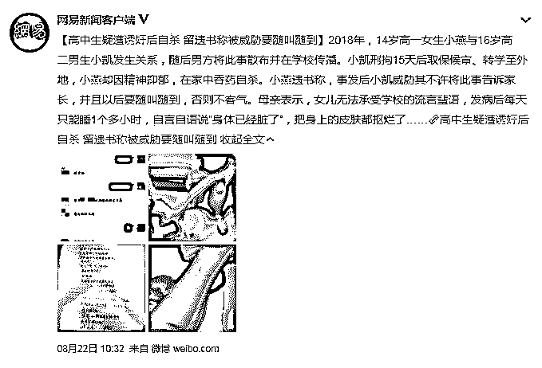
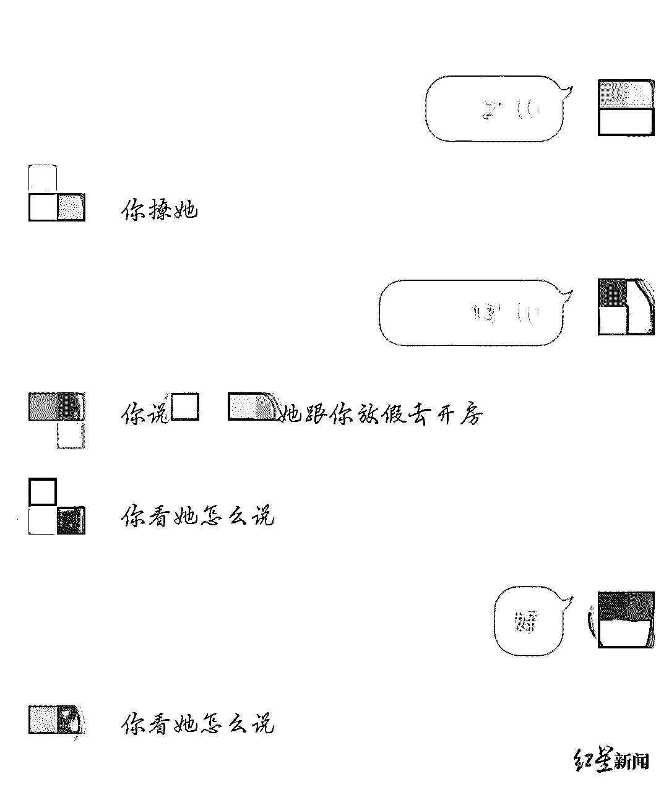
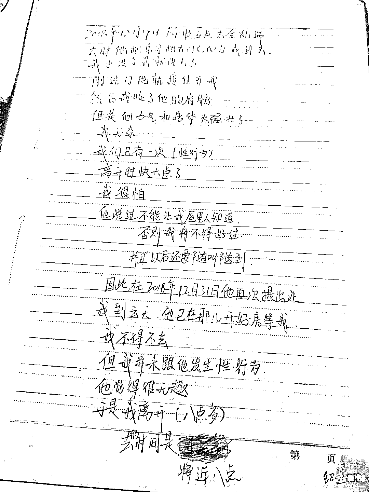
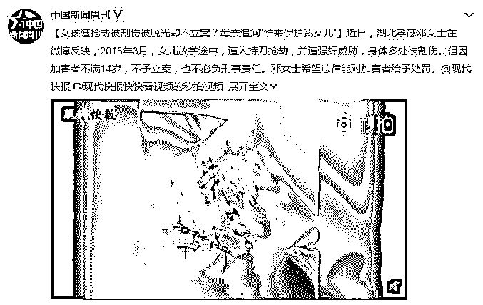
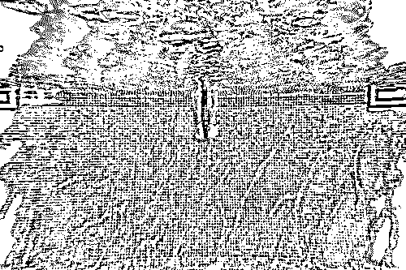
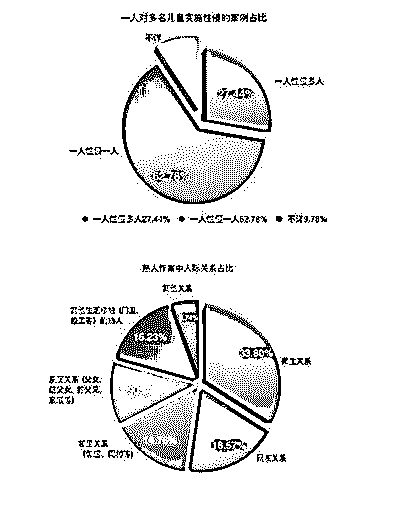

# 14 岁少女被诱奸后自杀：“我和他开房的事，全校都知道了”

> 原文：[`mp.weixin.qq.com/s?__biz=MzIyMDYwMTk0Mw==&mid=2247496203&idx=1&sn=6f8d33b6257bed5fe313dc44b7feffb2&chksm=97cb3933a0bcb025292d4a39c1841ab39c72d13d0dede78b3543d33d1385620554b192e158f2&scene=27#wechat_redirect`](http://mp.weixin.qq.com/s?__biz=MzIyMDYwMTk0Mw==&mid=2247496203&idx=1&sn=6f8d33b6257bed5fe313dc44b7feffb2&chksm=97cb3933a0bcb025292d4a39c1841ab39c72d13d0dede78b3543d33d1385620554b192e158f2&scene=27#wechat_redirect)

**点击上方蓝色字体免费订阅“灰产圈”**

01

就在前不久，网上爆出一条新闻，看完让人不寒而栗：

湖北一所学校的高二男生小凯诱奸了高一学妹小燕，结束之后，威胁她必须随叫随到。

小燕在被诱奸之后，神情恍惚精神憔悴，曾经试图割腕自杀，被妈妈救了下来。

（小燕曾试图割腕自杀）

后来她又开始自残，整夜整夜地睡不着觉，把脸上、身上的皮肤都扣烂了，满脸是血，不愿出门，出门也要把自己严严实实地包裹起来。

为了证明自己不是随便的人，小燕还给小凯留下了一张贺卡，里面写着：**“我把第一次给了你，希望你也珍惜我”。**

这张贺卡，被小凯拿作是她自愿发生关系的把柄，炫耀得全校人都知道了，还唆使别的男生也来试探小燕，问她能不能“开房”。

小凯让另一个男生约小燕去开房（家属供图）  

**14 岁，本该是最美好的年龄，刚刚成年，便遭受了如此折磨，嫌疑人被取保候审，别人异样的眼神，她的内心崩塌了。**

**最后，小燕不堪压力，自杀了。**

临走前，留下了一封遗书，说了当时的情况：

> 2018 年 12 月 29 日下午快五点去金凯瑞，去时他把身体挡在门后面让我进去，我也没多想就进去了，刚进门他就搂住亲我，然后我咬了他的肩膀，但是他力气和身体太强壮了，我无奈……我们只有一次（性行为），
> 
> 离开时快六点了，我很怕，他说过不能让我屋里人知道，否则我将不得好过，并且以后也要随叫随到，因此在 2018 年 12 月 31 日，他再次提出让我到云天，他已在那儿开好房等我，我不得不去，但我并未跟他发生性行为，他觉得很无趣，于是我离开（八点多），去的时间是将近八点。

（小燕的遗书）

**如此恶行，真是令人发指。**

02

早些时候，在微博上看到过一篇有些恐怖的新闻。

湖北孝感的一名 13 岁女孩，在放学途中遭同学持刀暴力劫持，遭强奸威胁，被脱光衣服，身体多处被割伤。

学生家长报案后，警方很快抓获了犯罪嫌疑人黄某，可是晓彤经过治疗出院后没多久，当地派出所通知，加害者不满 14 岁属于未成年人，不负刑事责任，对此案不予立案。

随后，女孩家长诉讼到法院，同样因为对方未成年，只能当民事纠纷处理。

而最让人无语的是，黄某家人的态度，至今拒绝赔偿。

**“持刀抢劫”，“扒光衣服”，“强奸未遂”，“十几处刺伤”……这是一个孩子做出来的事情吗？**

**这根本就不是熊孩子，明明就是恶魔！**

真是不敢想象长达两个小时的过程中，晓彤身心受到了怎样地煎熬，她一定很害怕，很疑惑，一个普通的放学午后，自己到底经历了什么？

**如果仅仅因为年纪小可以被原谅，可是如果杀了人，谁给那个生命再来一次的机会？如果强奸成功了，谁给那个女孩一次机会？**

03

**恶魔，一直都在。**

据《“女童保护”2018 年性侵儿童案例统计及儿童防性侵教育调查报告》发布调查的结果

**2018 年曝光性侵儿童案例 317 起，受害儿童逾 750 人。**

在 750 名受害人中，“女童保护”发现，需要注意的是 2018 年案例总数虽然比往年低，但是平均每起案例受害儿童 2.37 人，极大高于往年 17 年 1.6 人和 16 年的 1.8 人。且熟人作案比例最高。

据中国人民公安大学犯罪系教授介绍，公安大学曾对全国 5800 名中小学生做过一个问卷调查。

**结果显示，性侵害案件的隐案率是 1:7。**

**也就是说，如果有 1 起性侵害案件被揭露出来，那么背后还会有 7 起不为人所知。**

**让人细思极恐，任何人都有可能成为女儿一生的恶魔。并且还有更多未曝光的儿童正在遭受性侵的折磨。**

04

作家柴静在《沉默在尖叫》里，回忆过自己中学时候的故事：

> 中学时有天中午上学路上，那个小混混喝了酒，从身后把我扑倒了，磕在街边的路沿上，我爬不起来，被一个烂醉的人压着，是死一样的分量。
> 
> 旁边的人嬉笑着把他拉扯起来，我起来边哭边走，都没有去拍牛仔服上的土。
> 
> 我没有跟任何人说这件事，最难受的不是头上和胳膊上的擦伤，也不是愤怒和委屈，是自憎的感觉——厄运中的人多有一种对自己的怨憎，认为是自我的某种残破才招致了某种命运

受了欺负，第一反应是：**我是不是做错了什么**。大约是每个女孩子的共性。

然后试图以“我们相爱，才会这样做”这种理由，在龌龊的行为里掺入真挚的情感，让发生的一切显得理所应当，是很多女孩子会选择的逃避方式。

而我想对所有被猥亵的女孩子说：**从头到尾你什么都没做错，也不要为他伤害你找借口，给他继续伤害你的机会。**

**他的错就是他的错，你是受害者，你是无辜的。**

性情柔软的人，可以跑，可以躲，可以换个地方重新生活刷新一切，性情刚烈的人，可以起诉，可以刚，可以寻求各种方法来维护自己。

**唯一不要做的，就是用死亡来逃避。**

**不要把这个世界，让给你讨厌的人。**

很多时候我们不敢说出口，是因为我们依然对坏人心存侥幸，太担心会遭到报复，遭到这个世界不善意的评价与目光。

可法律的出现本就是为了保护无辜而制定的吗？

制定更严厉的法律，提高性教育，穿得更保守一点？

**一切的防范都制止不了人性的阴狠，而这个世界上的坏人是杀不完的。**

**我们唯一能做的，就是在受到侵犯时不再沉默，勇敢面对。**

**勇敢面对以后的生活，勇敢将罪犯送上审判台。**

← 向右滑动与灰产圈互动交流 →

**阅读原文加入灰产圈高端社群**