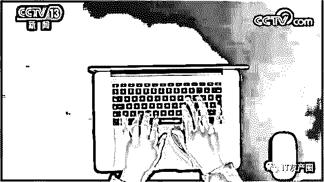
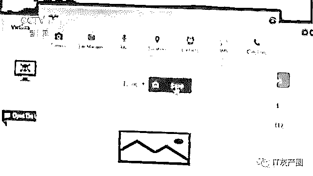
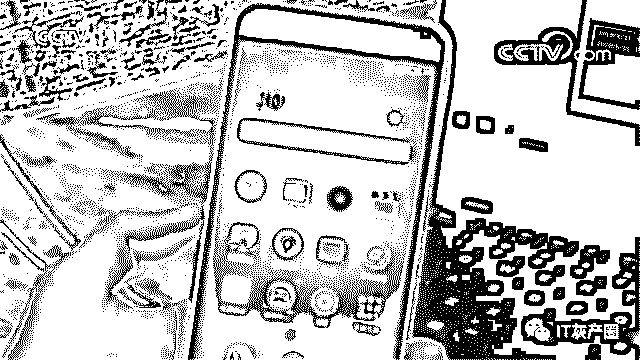
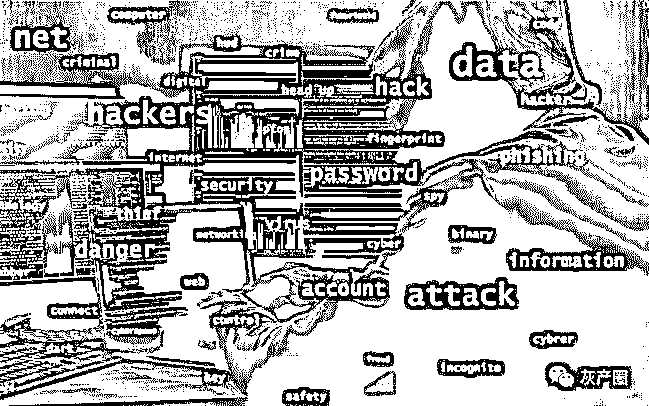
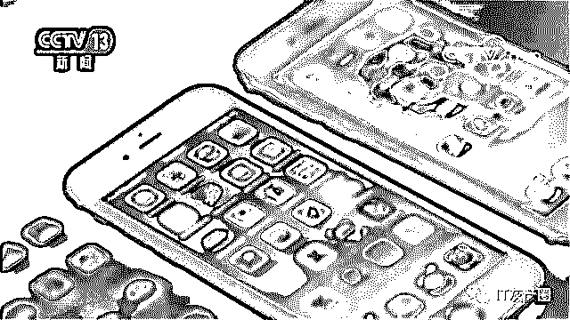
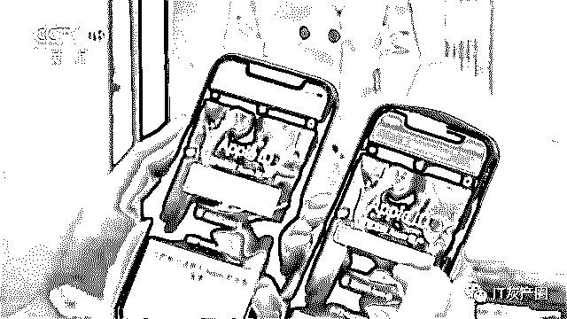
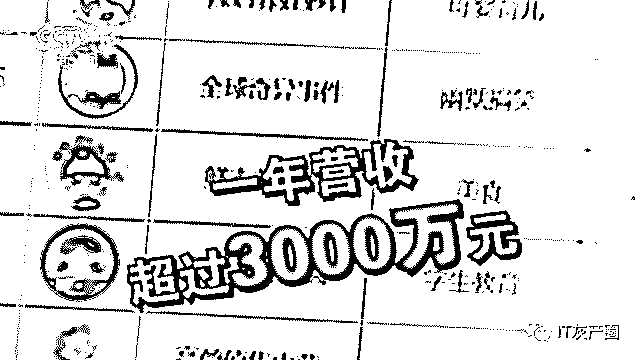

# 揭秘：黑客获取个人信息的多重“黑幕”

> 原文：[`mp.weixin.qq.com/s?__biz=MzIyMDYwMTk0Mw==&mid=2247496194&idx=1&sn=103602b7de62e5081004e8d61e7578c1&chksm=97cb393aa0bcb02c459879bbd57c1cb5f5b1e961bf133ccdd3212f3275c9392c29bbdd4f152c&scene=27#wechat_redirect`](http://mp.weixin.qq.com/s?__biz=MzIyMDYwMTk0Mw==&mid=2247496194&idx=1&sn=103602b7de62e5081004e8d61e7578c1&chksm=97cb393aa0bcb02c459879bbd57c1cb5f5b1e961bf133ccdd3212f3275c9392c29bbdd4f152c&scene=27#wechat_redirect)

**点击上方蓝色字体免费订阅“灰产圈”**

导语

截至 2019 年 6 月，我国网民规模已达 8.54 亿。互联网，方便了人们的工作和生活的同时，也带来了信息泄露的危险。

我们的各种账户、各种记录在内的种种信息，成为不法分子下手的目标，甚至直接导致精准诈骗。

近日，在北京网络安全大会上，安全工程师通过模拟场景揭开了黑客获取信息的“黑幕”。

生活中，很多人会报着“蹭网”、“占小便宜”的心态去连入不明来源、甚至不需要密码的 WIFI。

事实上，这免费“午餐”背后却蕴藏着极大的风险。

网络安全工程师陈波：“连接成功之后打开我常用的 APP，发现我的这个常用 APP 有个新版本需要升级。”

安全工程师指出，现实生活中，免费 WIFI 往往是黑客攻击的主要对象，有的甚至是黑客故意搭建的。

通过这些恶意 WIFI，黑客进入手机。连上网后，很多人都会用 app 等应用，此时，黑客也就会更进一步，设置有漏洞的 app，提示用户下载更新，在这个过程中，木马病毒搭载其中潜入手机。

“中招”后的手机，虽然还在主人手里，实际上已经被黑客远程“操控”。

偷偷拍照、录音、尽管黑客用手机频频“动作“，但手机表面却没有任何变化，真正的主人大多对此也是毫不知情。

安全工程师陈波：“没有闪光，它也没有任何变化，它是待机状态，它是黑屏的，但实际上这个画面已经被远程窃取到了。”

此时，“中招”的手机里所有的个人信息，在黑客面前也是完全透明。

安全工程师陈波：

“联系方式，以及手机中存储的一些短信信息，还有我们手机整个存储相关的文件信息，他就获得了用户的所有控制权。”

黑客钓鱼“诱饵”：找回手机功能

现实生活中，不仅仅是不明来源的免费 WIFI 存在巨大的安全风险，不明短信背后往往也暗藏“玄机”。收到不明短信，千万不要随意点开其中的链接。否则，极容易落入诈骗分子窃取信息的网络陷阱之中。

苹果等品牌的手机，自带“找回功能”，一旦丢失可以设置远程锁定，并且可以自动定位。

但是，这个本来可以带来便捷的功能却被不法分子盯上，成了黑客钓鱼的“诱饵”。安全工程师对这个过程进行了揭秘。

安全工程师朱鹏：“去补卡，然后重新买一个新的手机，然后新的手机我在使用的过程中，很有可能就会收到一条短信。”

在这样一个以所谓的“苹果安全中心”为名义发出的短信中，告知用户，通过点击相应链接就可以找回丢失的手机。

为了增加迷惑性，钓鱼网站的链接网址和页面，也是精心伪装。用户一点击，就会中招。

安全工程师朱鹏：“我的左手边是假的这个苹果的网站，右手边是真的苹果的网站，他们两个是长得非常像的，可以看到我们这边输入帐号的时候，他（黑客）在这边马上就立刻能够收到咱们刚刚输入的帐号信息。”

通过钓鱼网站，用户的苹果账户和密码等信息被黑客偷走，为了逃避打击和监管，黑客还会不断变换短信中的钓鱼网站的链接网址。

安全工程师朱鹏：“它都会携带一些跟苹果有关的一些关键字词在里面，都是来自于所谓的苹果安全中心或者苹果售后等等这样的一些地方。”

不仅仅是找回苹果手机的骗局，近日，国家互联网应急中心发现了主要通过短信实现植入的 120 个窃取用户个人信息的恶意程序变种，名称包括成绩单、积分兑换、体检报告单、违章查询、校讯通、手机报退订、聚会相册、盗号生成器、电子请柬等。数据显示，这些恶意程序的感染用户近 3 万个。

**这些恶意程序的主要危害是：**

私自将用户手机里已存在的所有短信和通讯录上传至指定的邮箱；私自将用户接收到的新的短信转发至指定的手机号，同时在用户的收件箱中删除该短信；同时，运行后用户无法正常卸载。对用户信息安全造成严重威胁。

“黑客+卧底”模式 窃取平台海量信息

业内人士指出，通过不明 WIFI，不明短信等针对个人的手段，黑客通常只能逐个攻破个人用户，盗取信息，获取成本较高。

随着网络迅速发展，打车、购物等等很多人日常的衣食住行都是通过网络平台进行，越来越多的个人信息也集中在各种网络平台系统之中。从平台下手，已经成为众多黑客的首选。

近期，深圳龙岗警方就侦破了一个“黑客+卧底“的平台信息窃取诈骗案。

2018 年 7 月，龙岗警方先后接到两家网店报警，怀疑客户信息泄漏。侦查后，警方锁定目标——犯罪嫌疑人吴某，他在两家店铺先后担任过客服，又都在一个月内离职。

经审讯，一个卧底与黑客里应外合的团伙信息窃取套路，浮出水面。

**第一步：**犯罪嫌疑人应聘网店的客服，取得客服的账户和密码，这样就拥有了进入买方客户信息库的权限，成为“卧底”。

**第二步：**在下班或者深夜，周围没有其他工作人员时，黑客同伙发来木马，“卧底”点击安装，卧底用客服账户密码登录，木马爬取用户信息，并自动批量发送给远程的黑客。

**受害网店店主李女士**：“大概有半个小时的时间，登陆以后下载了大概有 18 万条这样的一个买家信息。

所有的收件人信息、买的东西、产品的信息，还有地址（电话等）这些。”

在这种黑客+卧底内鬼的攻击下，多家电商平台及快递公司的客户信息被盗取，随后，被卖给诈骗团伙。

随后，诈骗团伙常常以网店或者快递公司客服的名义，以质量有问题、快递丢失、赔付、退款等关键词为由，发来所谓的“退款”二维码和链接。

事实上，二维码和链接背后，是黑客设置的钓鱼网站，在扫二维码和点击链接时，客户就落入了“陷阱”。

2019 年至今，仅在深圳，购物退款和快递退款类诈骗案就已超过了一千宗，涉案金额超过两千万元。

利益驱动 不法分子瞄上大平台数据

你的信息，他的生意；你的数据，他的资源。不仅仅是一个个网店和快递公司，在利益的驱动下，不法分子瞄上了越来越大的平台。

8 月 27 号，一个涉及 30 多亿条公民个人信息泄漏的案件，在浙江绍兴开庭审理。被告单位北京瑞智华胜科技股份有限公司，涉嫌非法获取计算机信息系统数据罪。

这家曾是新三板的上市企业，自 2014 年开始，通过关联公司，先后与全国十多个省市的电信、移动、联通、铁通、广电等大型运营商，签订了通过数据分析进行精准广告营销的协议，获取了运营商服务器的登录许可。

随后，开始通过恶意程序，盗取服务器中的用户数据。

绍兴市公安局越城分局网警大队大队长张野平：“非法获取计算机数据达 30 亿条，数据涵盖京东、今日头条等 96 家知名的互联网企业， 这些原始的 cookie 数据包含账户密码等信息。”

通过黑客手段从运营商处把用户登陆网站、app 等的账号、密码等信息偷出来之后，犯罪团伙再次利用研发的爬虫程序、加粉程序等黑客软件，非法登录网络用户的淘宝、微博等账号，进行强制加粉、订单爬取等行为。

窃取用户账户、密码，强制加粉、订单爬取、违规推广，在案发之前，这个团伙旗下一家公司，靠着这种手段牟利一年营收就超过 3000 万元。

不仅仅是经济获利，检方指出：海量信息，从运营商层面流出，潜在危害巨大。

本案公诉人施晟：“这个案子因为是在运营商这个节点对数据进行一个侵害，所以其危害性更大。

网络用户所有的上网行为都可以通过运营商服务器直接反映出来，所以这种情况下，更加难以保护或者是对这种非法行为加以监管。”

针对这种“内鬼”、“供应商”与黑客行为勾结起来，信息平台该怎么办呢？《网络安全法》明确规定：网络运营者应当采取技术措施和其他必要措施，确保其收集的个人信息安全，防止信息泄露、毁损和丢失。

也就是说，保护个人信息，是平台的法律责任。

同时，业内人士指出，从技术层面，网络安全本来就是一场攻防战，面对黑客的新战术，平台必须不断技术创新、动态完善防控的体系，才能最大程度减少信息泄漏的风险。

日益突出的信息泄露等网络安全问题，挑战着网络空间秩序，损害公众利益，甚至威胁到国家安全。

据了解，我国还将在数据安全管理和个人信息保护、关键信息基础设施保护等方面，出台一系列法律和政策，从国家层面筑牢网络安全防线。

而对于网络平台和个人来说，也要加强防范的能力和意识，让我们的网络越来越安全。

[`v.qq.com/iframe/preview.html?vid=s0924wmls6l&auto=0`](https://v.qq.com/iframe/preview.html?vid=s0924wmls6l&auto=0)

《“黑客+卧底”模式窃平台海量信息》

← 向右滑动与灰产圈互动交流 →

**阅读原文加入灰产圈高端社群**