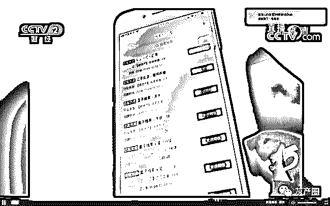

# 你接到的骚扰电话不是“人”打过来的？

> 原文：[`mp.weixin.qq.com/s?__biz=MzIyMDYwMTk0Mw==&mid=2247496160&idx=1&sn=7889d430ce4854d36eeb2119cbff0bd3&chksm=97cb3ad8a0bcb3ce0e3a96d7c54f99220a67c71a5fb0705391fa6f8cc3c36fe9ca4248f2b0bf&scene=27#wechat_redirect`](http://mp.weixin.qq.com/s?__biz=MzIyMDYwMTk0Mw==&mid=2247496160&idx=1&sn=7889d430ce4854d36eeb2119cbff0bd3&chksm=97cb3ad8a0bcb3ce0e3a96d7c54f99220a67c71a5fb0705391fa6f8cc3c36fe9ca4248f2b0bf&scene=27#wechat_redirect)

**点击上方蓝色字体免费订阅“灰产圈”**

导语

“先生，最近还考虑买房吗？”

“女士，这边有一款保险要了解一下吗？”

“您好，我们是 XX 教育培训机构”……

每一天，我们几乎都会接到类似的骚扰电话。日前，工业和信息化部信息通信管理局组织召开了综合整治骚扰电话专项行动工作会，要求进一步加大骚扰电话源头治理力度，骚扰电话综合整治有望升级。

我们发现，如今市场上仍存在售卖自动拨号系统、买卖用户电话信息等活动。专家认为，治理骚扰电话应改变属地管理的模式，保护好用户信息，进一步提升违法成本和处罚力度。

骚扰不断房产贷款教育类居多

下午 3 点，正在单位办公室开会的岳某，手机突然震动。悄悄掏出手机一看，又是那个以“95”开头的电话号码，他没犹豫瞬间挂断了。几分钟后，岳某正在做工作汇报时，电话再次震动，他不得不暂时停下，尴尬地掐掉了电话。

“骚扰电话、短信太多了，烦不胜烦。我专门在网上查过，这种以‘95’开头的电话大多是营销电话，真希望可以管一管。”回想起当时会场的尴尬气氛，岳某心里气不打一处来。当他把电话回拨过去、准备质问时，又发现该号码无人接听。

岳某很困惑，营销电话那头究竟是怎样获取到自己号码的。

而更让他困惑的是，面对营销电话骚扰，很难做到眼不见为净——即使他将某个号码加入通话黑名单，也还会有其他营销电话“轰炸”过来，“变着法儿打进来，每天少说都有五六个，这不就是明晃晃地骚扰吗？”

与岳某有相同遭遇的人并不少。

前不久，宋某刚刚购买了自己的住房。他本以为，购房后骚扰电话就会少一些了，然而现实还是给他上了一课：“几乎每天都会接到电话，一会儿说哪里有房还需要吗，一会儿问还考虑哪个区域的房子吗，太多了！”

宋某再怎么努力回忆，也说不清骚扰电话究竟是从什么时候开始多起来的。“大概就是第一次在某 App 上留下了自己联系方式开始，从那以后就没有消停过了。

不仅这一家中介，其他中介也知道了我的电话号码。”最后，宋某在朋友介绍下，下载了手机电话拦截软件，骚扰类电话才相对消停了一些。

记者采访多位市民后发现，如今对市民推销较多甚至构成骚扰的营销电话，来源主要集中于一些商业类企业和金融平台。

其中，尤其以房产、保险、贷款、汽车、教育类居多。而面对这些营销电话隔三差五地骚扰，很少有市民愿意去固定证据或者举报投诉，甚至并不知道应当向哪个部门反映类似情形，更多时候只是抱怨责问一通，或者直接将号码拉入黑名单。

利益驱动聊天群兜售个人信息

营销类骚扰电话究竟是怎样拨出的，营销电话“骚扰不断”的背后，又有哪些秘密？

我们发现，网络上有技术先进的拨号软件和系统售卖，甚至有人在聊天群内公开求购和售卖用户个人信息。

**某电商平台上介绍的自动拨号系统功能**

在某电商平台上，记者尝试输入自动拨号软件，网页跳转后，各种功能和价格的自动拨号软件映入了眼帘。

这些自动拨号软件，价格从几十元一套至数千元一套不等，几乎均冠以“营销利器”、“电销机器人”、“智能电话机器人”等标签。而在功能介绍上，则更令人感到“神通广大”。

某自动拨号软件的产品功能

例如，一款标价 3800 元的智能电销机器人产品的介绍中，声称包含 50 个“机器人”，每天能自动拨打 2000 通电话，“减少 80%的重复劳动，创造更高的商业价值”。

更让人“心动”的是，该产品在智能拨打之外，还具有“无限开号”、“真人语言”、“源码出售”、“智能对管”等功能。而另一套人工智能电话机器人则显得更为“先进”，自称还可以做到批量外呼、自动分类和筛选客户、保留录音及文字记录方便跟进客户等。

**某平台上智能拨号机器人介绍**

某智能拨号系统的跟帖中，有买家评论了该系统：“只要一按电话机的启动按键就会自动拨打客户的电话了，并且后台能清晰地区分哪些是我想要的客户，哪些是没用的客户……精准客户二次回访的成功率提高了很多。”而另一位买家则称“一天几百个电话呼出都不成问题……”

**自动呼叫**

除了自动拨号软件和系统的“助力”之外，记者同时发现，在一些 QQ 聊天群里，也有人买卖用户个人信息。

这些聊天群会以“数据采集”、“数据标注”、“数据资源共享”等为群签名或介绍。在一个有 955 人的“河南数据标注共享”群里，有人公开叫嚣“有需要身份证采集的老板吗？”在另一个有 180 人的“数据采集标注共享群”里，几乎每天都有群员在里面求购用户信息——“谁有老年保健品数据，年龄 60 岁以上。” “电商数据采集，能做的私我，小平台！” “有能做数据采集的吗？”

**聊天群内公开求购和售卖用户信息**

最让人吃惊的是，有人直接喊话“一手贷款数据，历史料，前一天数据都有，支持每天供货。”

记者点击放大该人提供的一份截图后发现，其中用户的真实姓名、手机号码、信贷产品、额度信息、商户用户名等一应俱全。记者尝试询问该人贷款数据的价格，但最终并未得到答复。

联合治理个人信息保护是焦点

“这几年，国家层面保护个人隐私的法律法规逐渐完善，然而电话和短信骚扰用户的情况没有得到根本性的彻底的扭转。”有法律人士指出，这背后既有相关灰色产业链的存在活动，也有一些诸如所谓“人工智能”、“自动拨号”等技术的驱动。

专家指出，不能任由“互联网+骚扰”继续发展，而应及时有效深入治理。因为其后果往往是严重的——轻则对民众生活和工作造成骚扰，重则可能让民众陷入电信诈骗、金融陷阱等，使民众遭受财产安全损失。

“电话短信精准骚扰的背后，有一部分是来自于消费者自己的信息泄露，但绝大部分情形不是基于消费者的意愿，而是基于信息的买卖，应该好好治理了。”中国政法大学传播法研究中心副主任、中国互联网协会法律专业委员会委员朱巍说，然而在办理具体的骚扰电话和用户信息泄露、甚至是精准诈骗时，一些基于属地管理的执法部门也会感到为难，“因为这背后很复杂，需要协调的东西比较多。”

最大的难点在哪里？朱巍认为有两个问题。“一是，现在主要实行的是属地管理，应当建立专门的特殊的部门去横跨统一管理；第二点，办案经费、部门权力划分和协调难度也很大。”朱巍举例，与治理骚扰电话和用户信息泄露相关的部门有很多，比如公安、工信、网信办等等。然而，如何划分他们的权利和协调职责？需要有联席制度、或者统一的协调部门。

采访中，不少专家都谈到，骚扰电话只是表层现象，更深层的原因是用户信息和隐私泄露。因此，朱巍认为治理的根本核心，是基于个人信息的保护——不能仅仅停留在立法层面，还要看技术层面如何进行保护，同时要建立可溯源机制，“拨出萝卜带出泥”。

“不能只是处罚骚扰电话的事情，还应深挖用户信息是怎么来的，要斩断整个产业链的根源。”朱巍说，此外还要加大违法成本和处罚力度。“只要未经过用户允许拨打了骚扰营销电话，用户就可以报警，而后执法部门可对其列入黑名单或者进行最低下限的处罚。”

专家建议，在处罚力度和链条上，可以设立信用记分、“黑名单”制度、以及针对单个单次骚扰电话的处罚等等。只要以上方面做好了，常抓不懈，骚扰电话和用户信息泄露的局面就会逐渐好转

[`v.qq.com/iframe/preview.html?vid=l0916awb2z9&auto=0`](https://v.qq.com/iframe/preview.html?vid=l0916awb2z9&auto=0)

**骚扰电话黑色产业链调查：万条个人信息售价千元**

← 向右滑动与灰产圈互动交流 →

**阅读原文加入灰产圈高端社群**