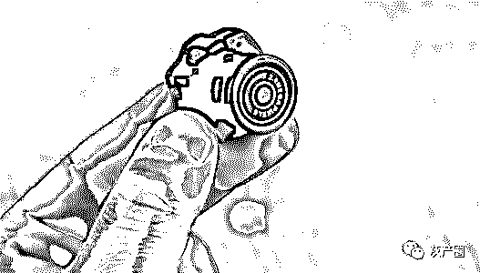
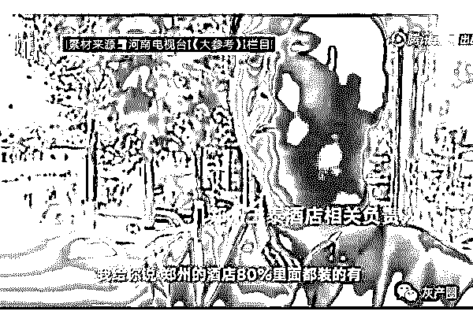
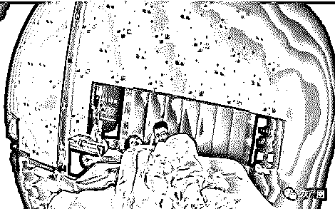
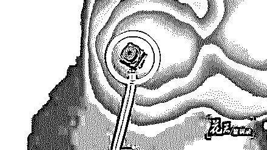
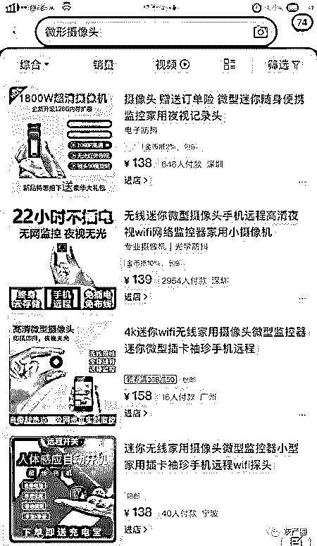

# 闷声发大财：“花总”再曝光国内酒店偷拍黑色产业链内幕！

> 原文：[`mp.weixin.qq.com/s?__biz=MzIyMDYwMTk0Mw==&mid=2247496155&idx=1&sn=a66e184b9fde0d5abfac3f875f3e3bfe&chksm=97cb3ae3a0bcb3f576c337f616a7a8cfce43037fe23173fb3af485ebbe4223192dadb8b31d59&scene=27#wechat_redirect`](http://mp.weixin.qq.com/s?__biz=MzIyMDYwMTk0Mw==&mid=2247496155&idx=1&sn=a66e184b9fde0d5abfac3f875f3e3bfe&chksm=97cb3ae3a0bcb3f576c337f616a7a8cfce43037fe23173fb3af485ebbe4223192dadb8b31d59&scene=27#wechat_redirect)

**点击上方蓝色字体免费订阅“灰产圈”**

大家还记得“花总”吗？去年 11 月份“花总”在网络上传了一段标题为《杯子的秘密》的视频，视频中揭露了国内多家知名五星级酒店用脏毛巾擦杯子或者马桶的现象，从而将酒店卫生乱象公之于众，引起了巨大的争议。

“花总”原名吴东，网名“花总丢了金箍棒”，福建人，网络人称“花总”，曾经根据新闻照片鉴定过多位官员的手表，被网友认为是网络反腐的代表人物。近日，“花总”再次上传一段标题为《偷拍的秘密》的视频，揭露酒店行业泛滥的潜规则—“偷拍”乱象。

其实“酒店偷拍”早就不是什么新鲜新闻了，在网络上频频被各种新闻曝光，但均没有引起足够的重视以及深入的调查。

据悉，最近一段时间内，石家庄、洛阳、郑州等地的酒店都被发现有针孔摄像头偷拍的现象，而从整个产业链来讲，偷拍视频已经成为了某些利益集团的赚钱工具，有消息称：国内超过 8 成的酒店房间内均装有摄像头，而一套设备一年至少可获利数百万元。

“花总”上次揭露酒店卫生乱象，是冒着极大的生命风险偷拍所得，而这次“偷拍的秘密”则并非偷拍，而是“花总”与人合作制作了一个现场实现：在一间房屋中安装 12 个隐藏摄像头，然后让“花总”去找出这些摄像头。“花总”作为有着丰富卧底经验以及熟知摄像头秘密的老手，竟然最终只找到了 6 个。

当然，视频的内容并非这些，视频中还揭露了隐藏摄像头是如何进行伪装后，安装在试衣间、卫生间、出租车、酒店等处，来偷窥普通人生活隐私的。很多网友看完之后都有一种不寒而栗，防不胜防的感觉。

《澎湃新闻》今年报导：今年 6 月 15 日，住河南郑州玉泰酒店的旅客黄先生，在入住后两小时，在所住房间内的电视机下方的五孔插座中意外发现一个针孔摄像头。黄先生随即报警，并找来了酒店管理方，但酒店方面对此并不以为然，表示在郑州有 80%的酒店都有这种情况。随后酒店负责人对此表示：我不对我说的话负责。

根据行业内人士透露：一套偷拍设备可以共享给 100 人观看，而且具有现场直播、回放、下载观看等功能。偷拍者将每个观看帐号以每月 100-300 元不等的价格出售给代理商，代理商再以每个帐号 200-400 元不等的价格出售给下级代理或者直接用户。

2018 年赵某由于涉嫌偷拍被抓获，共查获微型网络摄像头 300 多个，偷拍的酒店客房视频高达 10 万多部，如果以一个摄像头 300 元计算，300 多个摄像头每月能给偷拍者带来大约 10 万元的收入，而这仅仅只是第一层的代理商，经过层层代理之后，这个产业链已经极为庞大了。

假如一部视频按照 5 元的价格，那么单次出售全部视频就可一次获利 50 多万元，如果二次售卖、多次售卖之后呢。

行业人士透露：现在偷拍已经不仅仅只是一个摄像头这么简单了，从摄像头的制造、出售，到视频的拍摄、收集，再到视频的销售、传播，已然成为了一条完整的偷拍黑色产业利益链。

而当今科技爆发式的发展，则是这条黑产链形成的技术基础。视频中“花总”为大家展示了一种超微型的摄像头模组，大小仅为常人小拇指指甲盖的三分之一，如果把它们装入到生活中常见的装饰物中，能够让偷拍很好的“掩人耳目”。

而随着摄像头硬件技术的逐渐成熟，成本也在不断的降低，这让偷拍逐渐成为了一种“小投入，高回报”的行为。

在某宝上，搜索“微型摄像头”就会出现大量的商品，均打着“更小更实用”、“无光夜视、不发光不发声”、“想装哪里就装哪里”、“自带 AP 热点，没网也可实时监控”等宣传语，而价格则从 100 元到 1000 元不等。

越来越多的人将针孔摄像头安装在各个隐蔽的角落中，把所得视频再出售给网站，或者自己私下转卖获取利益，“花总”这部揭秘的短片，仅仅是挑开了偷拍这条黑色产业链中的一角。

[`v.qq.com/iframe/preview.html?width=500&height=375&auto=0&vid=j0919dff8us`](https://v.qq.com/iframe/preview.html?width=500&height=375&auto=0&vid=j0919dff8us)

《花总鉴识录》第一期：偷拍的秘密

← 向右滑动与灰产圈互动交流 →

**阅读原文加入灰产圈高端社群**