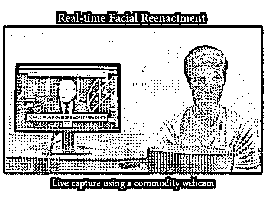
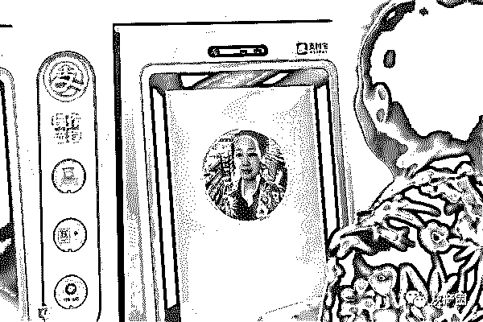
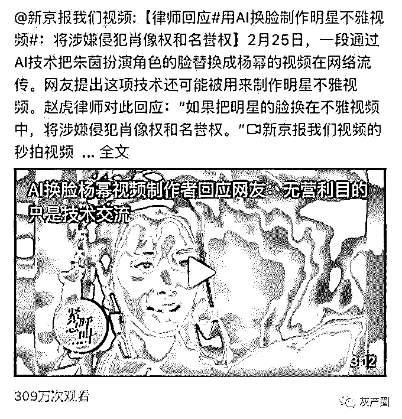

# AI 换脸！“ZAO”起来吧！

> 原文：[`mp.weixin.qq.com/s?__biz=MzIyMDYwMTk0Mw==&mid=2247496131&idx=1&sn=3cf333c4f25ca1a0ad9c502a00b39f29&chksm=97cb3afba0bcb3ed03b013eca08e629258484f0024556312ffd3056a38c731c90a33a2d3874c&scene=27#wechat_redirect`](http://mp.weixin.qq.com/s?__biz=MzIyMDYwMTk0Mw==&mid=2247496131&idx=1&sn=3cf333c4f25ca1a0ad9c502a00b39f29&chksm=97cb3afba0bcb3ed03b013eca08e629258484f0024556312ffd3056a38c731c90a33a2d3874c&scene=27#wechat_redirect)

**点击上方蓝色字体免费订阅“灰产圈”**

只需要上传一张照片，你可以变成任何你想成为的人！冠希哥、小李子、张柏芝、玛丽莲梦露、尔康、中餐厅黄晓明……

8 月 30 日，一款运用 AI 技术换脸的 APP“ZAO” 在社交媒体上刷屏，用户只需要一张正脸照，就可以替换为影视作品或者小视频中的人物，生成以自己为主角的视频片段。不过，在一夜刷屏之后，ZAO 的用户协议条款却引发网友争议。

[`v.qq.com/iframe/preview.html?width=500&height=375&auto=0&vid=h0920sr1zgu`](https://v.qq.com/iframe/preview.html?width=500&height=375&auto=0&vid=h0920sr1zgu)

“ZAO”涉嫌过度攫取用户授权

网友担忧个人信息泄露

根据“ZAO”用户协议内容中的必要授权协议：用户上传发布内容后，意味着同意授予“ZAO”及其关联公司以及 ZAO 用户在**“全球范围内完全免费、不可撤销、永久、可转授权和可再许可的权利”****，**“包括但不限于可以对用户内容进行全部或部分的修改与编辑（如将短视频中的人脸或者声音换成另一个人的人脸或者声音等）以及对修改前后的用户内容进行信息网络传播以及《著作权法》规定的由著作权人享有的全部著作财产权利及邻接权利”。对此，知名法律博主、北京炜衡（成都）律师事务所专职律师@法山叔表示，**“ZAO”如此规定涉嫌过度攫取用户授权，让用户在无形中将自己的肖像权永久拱手让人，以后用户的人脸将完全有可能被别人随意使用或变换。**“有手机号，有面部图像，通过技术合成，犯罪分子可以替你和你的家人通话……”“如果被人盗用于支付宝刷脸付款，那你的钱很快就没了，有很大的风险，也说不定哪天就成了色情片主角”。网友普遍担忧人脸信息被永久攫取后，会遇到这些情况。

针对网友因 AI 换脸担忧金融安全问题，支付宝随即发表声明：**“网上换脸软件有很多，但不管换的有多逼真，都是无法突破刷脸支付的。****”**

 “AI 换脸”非新技术 

“ZAO” 背后是陌陌系公司

所谓 AI 换脸，技术上并不新鲜。早在 2017 年 12 月，国外某 ID 名为“deepfakes”的 Reddit 论坛用户，就首次发布了自己制作的 AI 换脸视频。它能够把照片和视频中的人脸替换成任何想要替换的人脸，且效果十分逼真。

今年 3 月，国内知名视频网站 blibli 流传出一段视频：电影《射雕英雄传》（1994 年版）朱茵主演的黄蓉，被视频制作者通过“AI 换脸术”处理成了杨幂的脸，神态表情如同朱茵饰演的黄蓉一样生动俏皮，毫无违和感。

[`v.qq.com/iframe/preview.html?width=500&height=375&auto=0&vid=h0857tcu6oo`](https://v.qq.com/iframe/preview.html?width=500&height=375&auto=0&vid=h0857tcu6oo)

而“ZAO”这次之所以能刷频，是因为以往的换脸视频，对制作者的技术甚至制作的设备，有着比较高的门槛要求，而“ZAO”一下子把门槛降到了最低，普通手机用户都可以玩了。这款 App 属于长沙深度融合网络科技有限公司，其背后股东则来自主打陌生人社交起家的社交平台陌陌。

天眼查资料显示，长沙深度融合是海南喵咖网络科技有限公司（海南喵咖）的全资子公司。而王力和雷小亮各持海南猫咖 50%的股份。王力为陌陌公司董事、总裁及 COO，雷小亮则为陌陌公司联合创始人兼游戏业务部总裁。

“AI 换脸”

会不会被“刷脸支付”？

看到有人担心，玩这个软件会不会导致自己的支付宝刷脸被冒充？

先说结论：这点完全别担心，不会的。

这不是互联网上的第一款换脸 App，也一定不是最后一款，

但不管怎么换，也不管换的有多「逼真」，你都不用担心支付宝刷脸支付的安全性。

**1、「刷脸支付」采用的是 3D 人脸识别技术**

在进行人脸识别前，会通过软硬件结合的方式进行检测，来判断采集到的人脸是否是照片、视频或者软件模拟生成的，能有效地避免各种人脸伪造带来的身份冒用情况。

**2、在支付宝 App 上开通刷脸支付需要曾输入过密码**

支付宝还会通过各种安全风控策略确保账户安全。比如刷脸支付功能需要用户进行开通操作，开通之后才能进行支付，用户也可以随时关闭。而且只有在输入过密码的支付宝 App 上才能开通刷脸支付。

**3、多因子校验，确保万无一失**

在支付宝 App 上，人脸识别并不是唯一的校验方式，我们的智能风控引擎会通过设备、环境等多个因素辅助校验。部分用户还需要输入与账号绑定的手机号以及验证码进行校验，进一步提高了安全性。

**4、100%的保障**

即便出现账户被冒用的极小概率事件，支付宝也会通过保险公司进行全额赔付。

结尾

实际上，AI 换脸技术并不是一个刚刚出现的技术，在《速度与激情 7》中，为了让保罗·沃克重现荧屏，影片的技术团队就曾大量使用了 AI 换脸技术。

这项技术的核心是一个“自动编码器”，这个“自动编码器”实际上是一个深度神经网络，它能够接收数据输入，并将其压缩成一个小的编码，然后从这个编码中重新生成原始的输入数据。

简单点说，就是如果你想把视频 A 中的人物 b 换成人物 c，那么首先需要对视频 A 进行逐帧切片，并把没有人物 b 的帧删掉，然后还需要提供人物 c 的大量图片或视频，方法同上。之后深度学习算法会提取人物 b 每帧的特征，我们将之命名为 feature b，找到人物 b 变换成 feature b 所需的光照、扭曲等条件。之后对人物 c 进行基于 feature b 的转换，形成 feature c，然后用 feature c 替换 feature b 即可。

**技术本身没有错，错的都是使用技术的人**

AI 换脸技术自从出现开始，与其相关的争议就没有停止过。2017 年，一名叫 deepfakes 的人，使用 AI 换脸技术，把一部 18 禁电影的女演员的照片换成了神奇女侠—盖尔·加朵，并把视频上传到了 Reddit 论坛上，这应该是大众第一次真正见识到 AI 换脸这项技术。

之后，deepfakes 还使用 AI 技术侵犯过更多的明星跟名人，被他侵权的人不仅有好莱坞明星，还有特朗普这样的公众人物。迫于各方压力，Reddit 论坛封禁了 deepfakes 的账号。出于报复，deepfakes 直接开源了 AI 换脸项目的代码。因此，这项技术，也被命名为“deepfakes”。

而这项技术在国内被大众所知，是因为 B 站 UP 主“换脸哥”发布的一段 94 版射雕英雄传视频。视频中，原本饰演黄蓉的演员朱茵的脸被替换成了杨幂的脸，从流出的视频和动图看，虽然是用 AI 合成的，但是整体效果十分逼真。

该视频在网上引发了轩然大波，在对技术的感叹过后，人们开始讨论 AI 技术的侵权问题。

无论是国内的例子还是国外的例子，都表明了同样的一个问题，AI 换脸因其技术门槛较低的缘故，很容易产生侵犯他们名誉权和肖像权的行为。

**事实上，AI 换脸的黑产早就不是什么新鲜事。**

门槛降低带来的也就是鱼龙混杂，有一些人专注于研究、分享自己的换脸作品，出于爱好或是出于玩乐。也有一些人看到了这里面的“商机”，于是对 18 禁影片进行换脸并打包售卖，最受欢迎的当然就是女明星，据有的卖家透露，其换脸作品几乎囊括国内所有一二线女明星。

在国内，AI 换脸俨然已经形成了一个黑产产业链，上游提供软件及技术、中游提供视频、照片定制、下游售卖成品视频，也有的商家做全产业链的生意。部分卖家供不应求，求之者众，黑产规模可见一斑。

不过，值得庆幸的是，目前监管部门已经注意到了 AI 换脸的危害性。今年 4 月提交十三届全国人大常委会第十次会议审议的民法典人格权分编拟规定，任何组织或个人不得以利用信息技术手段伪造的方式侵害他人的肖像权。

5 月底，国家网信办会同有关部门发布《数据安全管理办法（征求意见稿）》，其中要求，网络运营者利用大数据、人工智能等技术自动合成新闻、博文、帖子、评论等信息，应以明显方式标明“合成”字样；不得以谋取利益或损害他人利益为目的自动合成信息。

政府部门的这两个动作也表明，关于 AI 换脸等的法律文件或将出台，未来如果再利用 AI 换脸进行相关操作损害了他人利益的或涉及侵权违法。

**未来，AI 换脸技术想要更好的发展，关键就是与其相关的配套政策能否完善。作为普罗大众的我们，要做的是用一个合理的态度去看待这个技术。**

← 向右滑动与灰产圈互动交流 →

**阅读原文加入灰产圈高端社群**