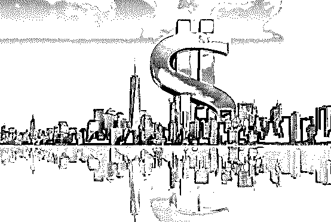
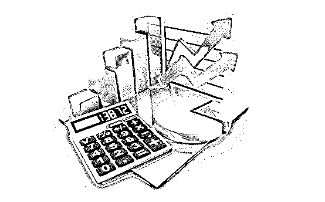
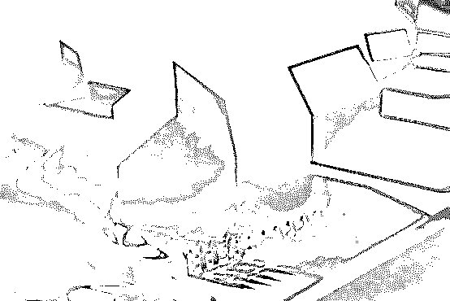
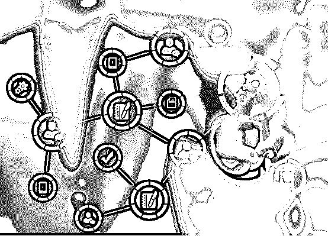
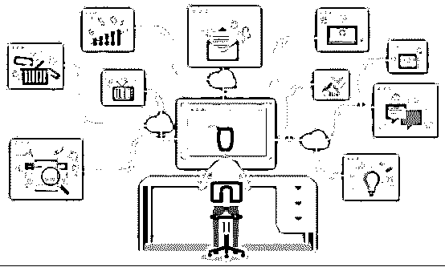

# 你所投的“投资平台”只要具备这十大特征，最终结果不是崩盘就是跑路！

> 原文：[`mp.weixin.qq.com/s?__biz=MzIyMDYwMTk0Mw==&mid=2247496105&idx=1&sn=9e94b1802cead0d5768ba7f60322e82e&chksm=97cb3a91a0bcb3872c14971d7020e2cfbb2bbf1cdbb46c9a6cd6392fc637aceb425d7d50711c&scene=27#wechat_redirect`](http://mp.weixin.qq.com/s?__biz=MzIyMDYwMTk0Mw==&mid=2247496105&idx=1&sn=9e94b1802cead0d5768ba7f60322e82e&chksm=97cb3a91a0bcb3872c14971d7020e2cfbb2bbf1cdbb46c9a6cd6392fc637aceb425d7d50711c&scene=27#wechat_redirect)

**点击上方蓝色字体免费订阅“灰产圈”**

大家都喜欢高收益的投资平台，然而，每天都有不少平台新生，每天都有不少平台崩盘和跑路，涉及金额动辄几十亿上百亿，令人不寒而粟，却依然有人乐此不彼。

这些崩盘和跑路的投资平台，多数没有造血功能，只能拆东墙补西墙，以新增会员的钱支付前面会员收益，他们通常会巧立名目，以高收益激发不明所以然的投资者的贪欲，进行非法集资，极具隐蔽性、欺骗性和社会危害性。

即使再精心策划的骗局，也终有一天会露出尾巴，众多投资莫宁奇妙的做了接盘侠。

我在见证和研究了众多跑路和崩盘的“投资平台”后，结果发现：拥有以下这十大特征的“投资平台”， 很少能活过三年，最终不是崩盘就是跑路。这些“投资平台”就是资金盘。

何为资金盘？

**资金盘是指用直销倍增原理，以滚动或静态资金流通形式的金字塔传销骗局。**

这可能难以理解。说白了就是资金盘本身没有造血功能，只能拆东墙补西墙，以新增会员的钱支付前面会员收益的平台。

这种平台会巧立名目，以高收益激发不明所以然的投资者的贪欲，进行非法集资，极具隐蔽性、欺骗性和社会危害性。

资金盘很少能活过三年，最终不是崩盘就是跑路。

资金盘玩的就是接盘侠和跑得快的游戏。除了少数自以为聪明的人，明知道是资金盘，还是抱着自己不是接盘侠的投机心理，参与进去，大多数人是辨识不了资金盘，莫名其妙就变成了接盘侠！

**资金盘的十大特征**

目前，市面上的资金盘层出不穷，这不是资金盘有多高明，而是韭菜太多，骗子不够用！

不管资金盘以什么面目呈现出来，总归逃不掉以下这些特征。

**首先，高收益。**

所有资金盘都强调高收益，以此激发投资者的贪欲。

而且，资金盘的收益有按天计算，日收益 3%-10%之间；也有按月计算的，月收益在 50%到 300%之间。如凤姐站台的已经倒闭的 BHB 资金盘，号称日收益达到 11%。

以此换算，年收益达到 3132%。

这么说来，是不是只需要投入 10000 元，没过几年，就可以财富自由啦！

别做梦啦，资金盘都短命，一般活不过三年，最短几个月，在 100 到 1000 多天期间，每一刻都面临着损失全部本金的可能！

高额分红，简单粗暴，一些不专业的投资者直接就是奔着高收益去的，没想到你只想利息而已，资金盘要的是本金。

**其次，涉及传销。**

大家都知道，判断传销的三大特征：

**1、是否需要缴纳人头费；**

**2、是否需要发展下线并超过三级；**

**3、是否以按人头或团队业绩计酬。**

只要符合这三个特点，就被法律认定为传销。

很多资金盘都是互联网传销盘，下线远远不止 3 级，可达到 10 级，甚至不限级。

如众筹还款的“有钱还”APP：

人头费：400 元，获取众筹资格。

第一阶段：3 人，交 1200，还 600 元，剩下 600 元；

第二阶段：9 人，交 3600，还 1800+600*2=3000，剩下 600 元；

第三阶段：27 人，交 10800，还 5400+1800*2+600*2=10200，剩下 600 元；

第四阶段：81 人，交 32400，还 16200+5400*2+1800*2+600*2=31800，剩下 600 元；

……

第九阶段：……剩下 600 元。

这是不是标准的传销骗局，不用我再解释一遍了吧。

**第三，非法集资。**

资金盘的设计就是为了圈钱，只不过圈钱的手法比较隐秘。

所谓的圈钱就是非法集资，通常采用合法的形式掩盖非法的目的，具有诱惑性和欺骗性。

如之前跑路的第一资金盘 Plus Token。

想玩？500 美金起步，然后平台开始智能搬砖，每月发利息。

所谓的智能狗搬砖，就是你投资的钱，拿来投资主流数字货币，利用不同交易所之间的币值差异，配合高科技手段，把赚到的钱发给你，简单说就是套利交易。

听起来是不是好像合情合理？

然而，Plus Token 基本上没有什么套利交易，你投资的钱够买的虚拟货币，直接转入个人钱包，根本没有什么机构。

这彻头彻尾就是骗局，也就是巧立名目进行非法集资。

其实，资金盘中非法集资的名目各种各样，背后都有一套可以帮你赚钱的机制包装，懂的人能看懂，不懂的人，就只能被骗了。

远离非法集资最好的建议就是：不懂，不要急着送钱！

**第四，庞氏骗局。**

99%的资金盘都是庞氏骗局，何为庞氏骗局我就不科普了。

资金盘本身没有造血功能，不就是依靠不断加入的新增会员嘛。要不是你们给他们送钱，他们拿什么给前面的投资者分红，怎么营造出平台非常赚钱的氛围？

不错，资金盘本质就是借新还旧。

所以，新增会员大于老会员，资金盘才能持续的运转下去，如果那天送钱的人少，分钱的人多，资金盘就运转不下去了，这时候只能崩盘或者选择跑路。

庞氏骗局最终不都逃不过这命运的安排吗？

资金盘随时跑路，那些后面进来的会员一不小心就成了接盘侠！

**第五，虚假宣传。**

为了让你们相信平台非常赚钱，资金盘不得不使出杀手锏：虚假宣传。

虚假宣传使用的工具包括：群+托的推广模式、新媒体矩阵以及大量投放广告。

资金盘没有造血功能，但是虚假宣传的资金盘，不但有造血功能，还非常的赚钱，要不你们怎么会上当受骗呢。

围观一下已经崩盘的 Plus Token 宣传的造血 10 大生态圈：

**1\. 存币，去中心化钱包可存币，存币产生手续费；**

**2\. 智能狗搬砖套利系统自动捕捉各大交易所价差套利；**

**3\. STO 交易所，所有交易都会产生手续费；**

**4\. 支付功能，德国、韩国、日本、马来西亚实体商业对接，支付产生资金沉淀；**

**5\. 币融，Plus Token 的贷币功能；**

**6\. 卖矿机，35 万一台；**

**7\. Plus Token 将上线游戏；**

**8\. 将上线公链，租用公链开发代币；**

**9\. 将上线保险，保护币圈资产；**

**10\. IPO，出售股权。**

然而，这么赚钱而且万能的 Plus Token 还是跑路了！

所有的资金盘都进行虚假宣传，虚假宣传也不外乎非常赚钱和画大饼的套路，其实很容易识别，只不过大家没有仔细考证，只因为听说和偏信！

**第六，发行空气币。**

现在最流行的资金盘就是打着区块链的旗号发行空气币。

空气币和数字货币不同，数字货币背后是链接着庞大的应用市场，空气币却毫无价值，话说游戏里的“欢乐豆”都比空气币值钱。

目前的空气币基本上都引用比特币、以太坊那一套开源代码，稍作修改而已。

现在有专门提供发行空气币的技术解决方案，从白皮书到代码调试，只需要 3 到 5 个月的时间，费用嘛，50 万到 300 万不等，同一套技术解决方案可供多家发币公司，最多也就根据客户需求修改一下代码而已。

空气币对外宣称区块链 3.0、区块链 4.0、区块链 5.0

哦噢，你这么宣传，让研究了数字货币 5 年的央行情何以堪？

**第七，饥饿营销。**

要说饥饿营销玩得最溜的，资金盘敢称第二，没有敢称第一的。

曾经有一个新加坡开的资金盘，也是发行空气币，45 天卷跑几十亿，多少人急着给他们送钱啊。

这个资金盘的特点就是将饥饿营销发挥到极致。

前三周都是新媒体矩阵打广告，暴力拉升空气币币值，短短三周将空气币币值拉升了好几倍。

造势造的差不多了，从第四周开始，提前三天发布抢“空气币”的信息，然后暴力拉升币值，如此一来，没抢到空气币的玩家很不甘心啊。

每周都是提前发布抢“空气币”的信息，暴力拉升币值。

就这样的一个靠“饥饿营销”的资金盘，45 天卷跑了几十亿，实属是币圈急着送钱的人太多了。

**第八，割韭菜。**

资金盘不割韭菜不可能的，永远都不可能，尤其是空气币资金盘。

大家都知道空气币大多数都是老板、合伙人和投资人持有，剩下未发行的也都是他们持有。

为了将空气币套现成真金白银，暴力拉升币值是必须要走的一步，只有暴力拉升币值，才能吸引币圈玩家进场。

大家都懂，只要币圈行情不太差，资金足够，持有空气币分量足够，空气币的股东就可以操纵币价，可以实现 24 小时没有涨停板。

暴力拉升币值，配合对外宣传，营造出暴涨氛围，这时候，就会有越来越多的币圈玩家进场。

等到差不多了，币值也拉升的差不多了，空气币的股东们就开始抛售空气币进行套现啦。

通常情况下，拉升币值和抛售交替进行，一边拉升一边出货，韭菜割了一遭又一遭，赚到钵满盆满，不亦乐乎！

**第九，鼓吹去中心化。**

互联网的本质就是去中心化的，区块链也不例外，去中心化并不神秘。

可是币圈鼓吹的所谓“去中心化”，只针对“监管”。

在我看来，监管，不妨碍去中心化，并不妨碍区块链应用，更不妨碍空气币交易，参考支付宝和微信支付。

币圈竭斯地鼓吹去中心化，可能是因为监管的存在，妨碍了空气币庄家洗钱、割韭菜和跑路吧。

**第十，套中套。**

只要傻子足够多，钱根本赚不完！

这是资金盘的名言，很多资金盘都设置套中套。

有些资金盘为了给自己增信，设计出貌似“跑路”的套路。

现在资金盘玩家都知道，一个资金盘发 “系统维护和升级”公告，基本上就跟跑路差不多了。一些资金盘的操盘手就利用这个共识，上演“跑路”大戏。几番下来，玩家就会相信这个资金盘没事，值得玩，然后就会有更多玩家进盘。

在操盘手看来，毕竟搭建一个资金盘也不容易，不套多一点舍不得跑啊，那些设置“套中套”，反复上演“跑路”然后“复活”的资金盘，一定是因为傻子太多，钱没赚够的缘故。

毕竟重新开盘比重新运作一个盘，简单多了，成本也低很多。在我看来，每一次为了多收割一批韭菜罢了，反正资金盘最终都逃不过崩盘或者跑路的命运安

那么我们如何预判资金盘跑路呢？由于篇幅有限，本文未放**十条预判资金盘跑路的鉴定方法**，如果你想继续了解剩余的鉴定手段，可以直接扫描下方二维码，关注**“菲凡烽火台”**公众号，在后台回复**“资金盘”**查看全文：

**菲凡烽火台**是一个专业的金融反欺诈普惠平台，作为一个公益性公众号，他们专注于骗局揭秘，科普防骗知识，提供企业风险信息查询；针对企业项目及平台进行反欺诈深度调查分析，帮助你提前避开投资陷阱、金融诈骗等，降低投资风险，保障个人财产安全。