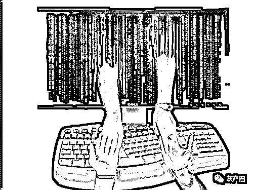
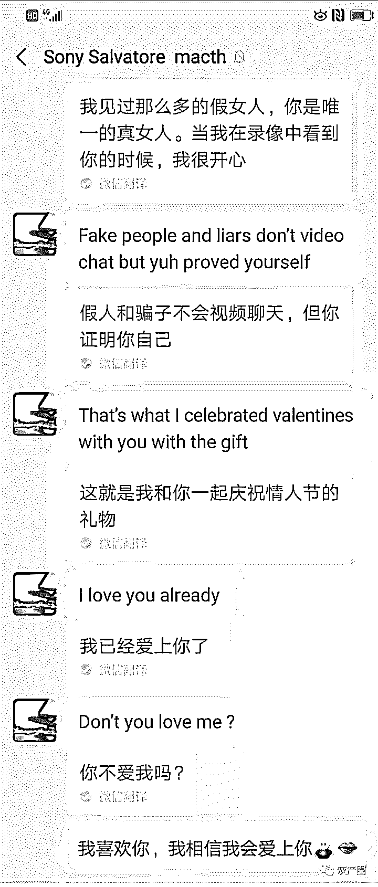
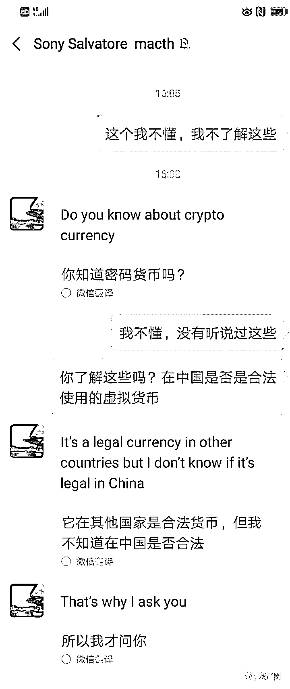
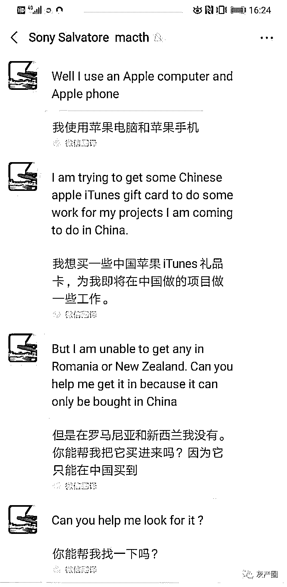

# 网恋么？“谈钱”伤感情的那种！

> 原文：[`mp.weixin.qq.com/s?__biz=MzIyMDYwMTk0Mw==&mid=2247496095&idx=1&sn=0aeeb7b1b5e529dfba1079bff3fd2b04&chksm=97cb3aa7a0bcb3b1372328a5febe71fd660567f53d1023ce951a414bfa6ce3b148c21ab0dae8&scene=27#wechat_redirect`](http://mp.weixin.qq.com/s?__biz=MzIyMDYwMTk0Mw==&mid=2247496095&idx=1&sn=0aeeb7b1b5e529dfba1079bff3fd2b04&chksm=97cb3aa7a0bcb3b1372328a5febe71fd660567f53d1023ce951a414bfa6ce3b148c21ab0dae8&scene=27#wechat_redirect)

**点击上方蓝色字体免费订阅“灰产圈”**

导语

网恋么？我超甜！ 

曾几何时，网恋成了广大单身青年企图摆脱单身的美好畅想。

殊不知，现在的网络社交平台充斥着大量的骗子，男骗女，女骗男，男扮女骗男，抠脚大叔也时常变身网络女神，这一切乱象的背后的真相究竟是什么？

是人性的扭曲还是道德的沦丧？请看调查 

海内存知己，海外需谨慎

首先表明一个事实：网络社交平台上充斥着大量的骗子，其中 90%的目的是骗取金钱。

来看一个来自海外线上交友平台的网骗：

这是一位女粉丝向我分享的一段经历。

她在国外的线上交友平台（Match）上遇到了一位形象好、事业佳、有阅历的“完美对象”。两人在微信上聊了没几天，对方就频繁对女士示爱，并且提出让女士删除自己在平台上的账号，与他进入 1 对 1 的关系。

骗子这么做的目的，是减少女士与他人的沟通接触，投入地与他沟通，以便之后能更快让女士跌入他设置的陷阱里。

七夕的时候，骗子给女士送了花和蛋糕，不断强化自己的真实性和真心。

注意：现在的骗子，是会提前投一点点小钱来引人上钩的，比如：网站充值 VIP，或送一些小礼物。

平时聊天的过程中，骗子还会经常提起一些投资的项目，试探女士对于这方面的认知。

这是专业网骗的常规操作，会在聊天过程中多次提及金钱相关的投资项目。

通过这种方式，骗子能了解到对方在金钱上的认知盲区，从而方便他在相应领域布下陷阱骗钱。 

等时机成熟了，骗子就露出了自己的真面目，他提出希望女士帮他买大量的 itunes 礼品卡。

这位女粉丝在向我描述这位对象时，我就察觉到他具有非常多的网骗特征，并提醒了女士要警惕。

然而一开始，这位女士并不相信我的判断，因为她曾与对方有过两次视频，虽然时间都很短，但却让她明显地放松警惕了。一直到后来骗子开始提出金钱上的需求，这个女士才醒悟过来。

你别觉得这个女士“傻”，在我接触的案例里，被骗子骗了还帮着骗子说话，发自内心地认为骗子一定有苦衷的情况不在少数。

初阶骗术驭人，高阶骗术驭心

以上的例子还只是比较初阶的骗术，现在网络上的高阶骗子都已经是集团作业，精通心理学，如果不是具备一定的反侦察能力，大部分真诚的朋友都难免会受骗。

特别是海外的骗子们，因为信息的不对称，他们得手的可能性也就越大。

不过，大家也不用太担心，因噎废食对网络产生抗拒和恐惧。不管是低阶还是高阶的骗子，只要是骗术，就一定有破绽。

国外网骗，特点总结

接下来，送大家一份线上交友平台上，那些国外的网骗们的特点总结。

希望能帮助大家更快识别他们的套路！

如果对方真的是骗子，他们往往具有这些特点：

> 1、在线上平台的照片非常专业，资料看起来也很完美
> 
> 2、非常快速就撤销平台资料并且告诉你是为了你
> 
> 3、无工作细节和照片，消息内容空洞
> 
> 或者，消息内容特别齐全，一封信交代了所有故事，细致到出生年月日和身高
> 
> 4、正在服役的军人，在战乱地区；或石油行业
> 
> 5、任何听起来非常坎坷不同寻常的人生经历

准备前往或者正在东南亚工作，有产业/工程/好的投资项目

> 6、Contractor/无国界医生/职业特别好，现在想要寻找新的投资方向
> 
> 7、丧偶、独自抚养儿女
> 
> 8、父母双亡，留下遗产或公司
> 
> 9、特别强调自己是 God-learning
> 
> 10、异常热情，快节奏，以来就称呼亲爱的，恨不能立刻爱上你
> 
> 11、任何在沟通的前期提及财务信息的

结尾

网络骗子千千万，网恋平台占一半！

单身不可怕，最怕骗子有文化！

希望广大网友，提高警惕，网恋可以，不要被幻象蒙蔽了双眼！

← 向右滑动与灰产圈互动交流 →

**阅读原文加入灰产圈高端社群**