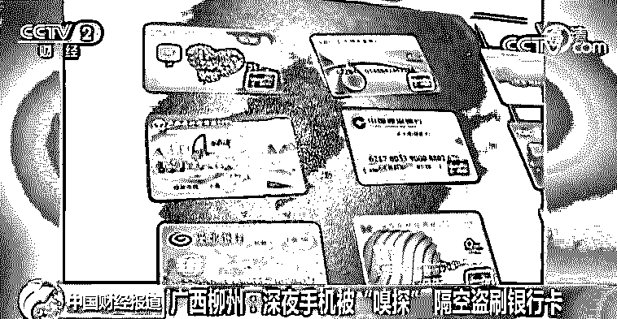
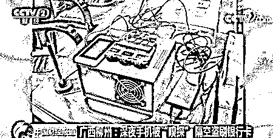
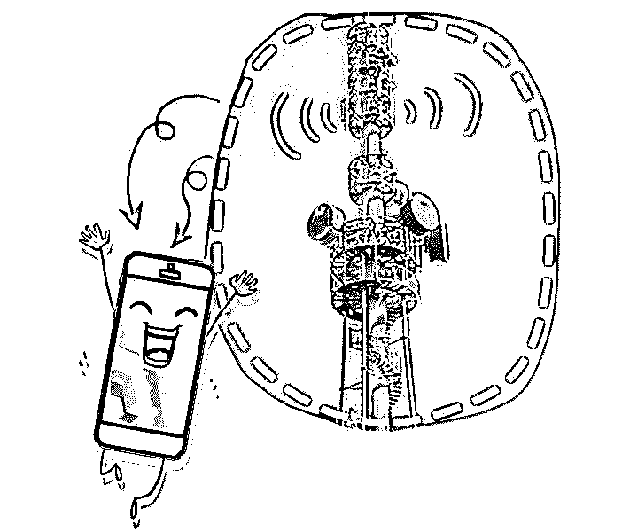
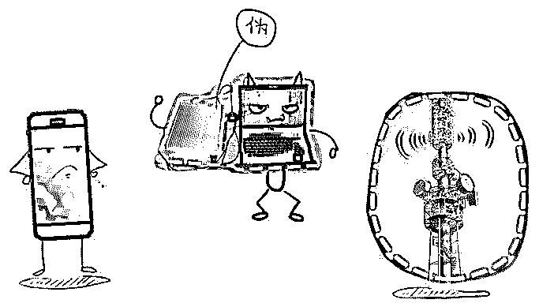
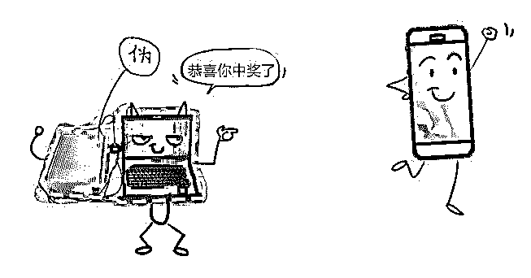
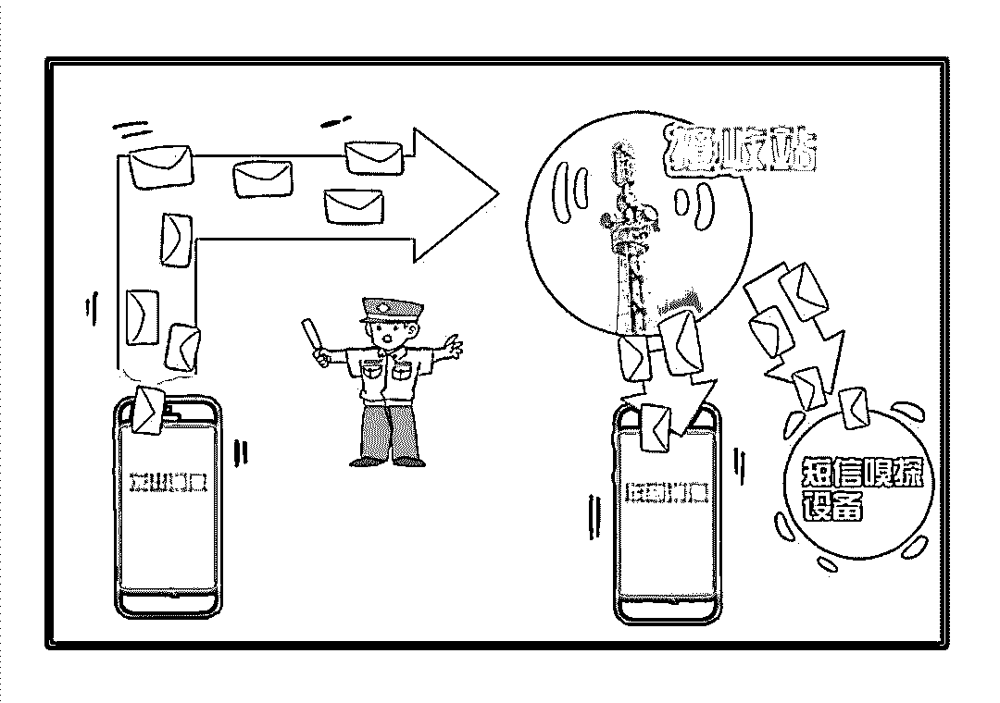
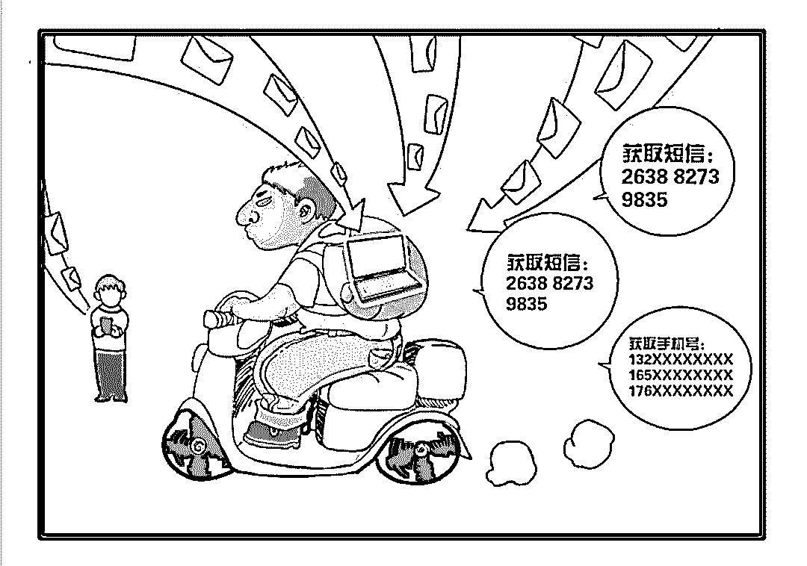
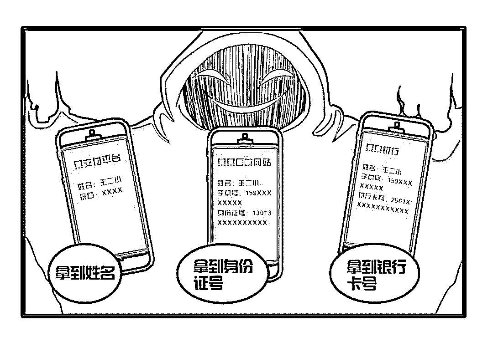
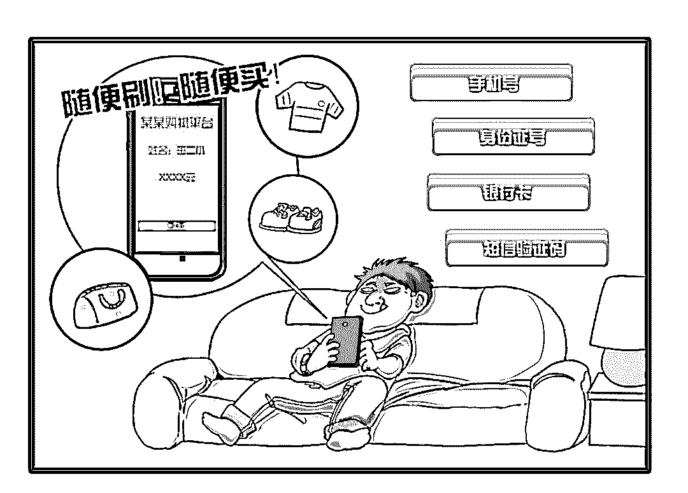

# 一夜之间被刷爆！银行卡里的钱是怎么不翼而飞的？

> 原文：[`mp.weixin.qq.com/s?__biz=MzIyMDYwMTk0Mw==&mid=2247496059&idx=1&sn=fe1e3b3268bfd7637b71ed540863f8e2&chksm=97cb3a43a0bcb3552cd60302b92cf5ee008e046bab03da08df41aa179f89111f4c7c199d69f1&scene=27#wechat_redirect`](http://mp.weixin.qq.com/s?__biz=MzIyMDYwMTk0Mw==&mid=2247496059&idx=1&sn=fe1e3b3268bfd7637b71ed540863f8e2&chksm=97cb3a43a0bcb3552cd60302b92cf5ee008e046bab03da08df41aa179f89111f4c7c199d69f1&scene=27#wechat_redirect)

**点击上方蓝色字体免费订阅“灰产圈”**

**“人在家中坐，祸从天上来。****”**账号没被盗走密码没有泄漏银行卡还在口袋里只是睡了一觉**钱，就没了？****！**看到这，有些朋友该笑了：“这怎么可能呢？”可别不相信手机里的钱不翼而飞的事最近可频频发生！而这些不法分子正是利用了**“GSM 劫持+短信嗅探”**技术（敲重点） <sectionxiumi.us>**1**

**深夜隔空盗刷案件频发**</sectionxiumi.us> 8 月 21 日，**央视财经《中国财经报道》栏目**报道了一起广西柳州警方破获的**“盗刷银行卡”**电信网络诈骗案。到柳州出差的李先生入住了柳石路的一家酒店，没想到，第二天醒来后却发现银行卡里的 7 万多元全被刷光！无独有偶，两天后，家住荣军路的何女士也是在一夜之间被盗刷了 3 万多元。奇怪的人，两人期间都没有外借过银行卡，也没向其他人透露过银行卡账号及密码或其他身份信息，这到底是怎么回事？柳州警方立即成立专案组，后来发现，原来这是一起利用“嗅探设备”盗刷银行卡的电信网络诈骗案，经过警方努力，终于将三名嫌疑人抓捕归案。

[`mp.weixin.qq.com/mp/readtemplate?t=pages/video_player_tmpl&action=mpvideo&auto=0&vid=wxv_953846461534453760`](https://mp.weixin.qq.com/mp/readtemplate?t=pages/video_player_tmpl&action=mpvideo&auto=0&vid=wxv_953846461534453760)

△央视财经《中国财经报道》栏目视频据嫌疑人交代，这个团伙中，嫌疑人雷某和雷某斌负责利用“嗅探设备”窃取被害人手机信息，接收验证码短信，分析机主身份证绑定的支付宝账号和银行卡号，徐某则负责“加工”窃取来的信息，并且在第三方支付平台盗刷。
简单来说，在一般的 App 中，账户登录及资金操作都可以通过手机号码加短信验证码的方式实现，嫌疑人就是利用这个“嗅探设备”来获取用户的验证码，从而操控用户账户，你的手机号、身份证号、银行卡号、短信验证码他全都可以掌握。 <sectionxiumi.us>**2**

**“GSM 劫持+短信嗅探”究竟是什么？**</sectionxiumi.us> 隔空盗刷，这么“神通广大”的 GSM 劫持、短信嗅探究竟是什么呢？我们就来给大家好好科普一下。想要搞清楚它们的真面目，首先就得提到手机和基站，手机就是我们使用的通信工具，那基站是什么呢？简单来说，**基站是移动通信交换中心和手机之间的信号纽带。****如果没有基站，手机就没有信号。**

而如果说，手机和基站算是一对 CP 的话，那么，在以前，“伪基站”就是插足它们之间的第三者。

伪基站又名假基站，它一般由主机和笔记本电脑或手机组成，通过短信群发器、短信发信机等相关设备能够搜取以其为中心、一定半径范围内的手机卡信息，利用 2G 移动通信的缺陷，通过伪装成运营商的基站，冒用他人手机号码强行向用户手机发送诈骗短信，诱导点击木马链接，甚至伪造号码，如 10086 或者 95555 这种广告推销等短信息。

不过，随着人们对短信诈骗防范意识增强和全社会对伪基站诈骗的重点打击，传统伪基站诈骗这种犯罪已经逐渐 OUT 了。在这之中，可也有我们不少的功劳哦！**守护者智能反诈中枢**中就有一套专门应对伪基站的系统——**麒麟伪基站定位系统**。

这套系统能够利用大数据和 LBS 对伪基站进行定位，并从空间、时间纬度利用地图直观呈现伪基站的聚类传播区域和实时运动轨迹，帮助警方提高打击伪基站团伙的效率。此套系统不仅协助**重庆破获 1.1 特大伪基站诈骗案**，**协助河北警方重拳打击伪基站**，而且在深圳警方使用麒麟系统的 3 个月内，打掉了团伙 13 个，抓获 110 人，缴获设备 59 套 ，车辆 43 台，降低伪基站发案率 74%，**目前深圳市的伪基站已基本为零。** <sectionxiumi.us>**3**

**伪基站 2.0 版，“短信嗅探”横空出世**</sectionxiumi.us> 随着伪基站 1.0 没落，伪基站 2.0 就此诞生，它就是“**短信嗅探”。****短信嗅探通常由号码收集设备（伪基站）和短信嗅探设备组成。**其犯罪具体可分为以下四步：**第一步，**犯罪团伙基于 2G 移动网络下的 GSM 通信协议，在开源项目 OsmocomBB 的基础上进行修改优化，搭配专用手机，组装成便于携带易使用的短信嗅探设备。

**第二步，**通过号码收集设备（伪基站）获取一定范围下的潜在的手机号码，然后在一些支付网站或移动应用的登录界面，通过“短信验证码登录”途径登录，再利用短信嗅探设备来嗅探短信。

**第三步**，通过第三方支付查询目标手机号码，匹配相应的用户名和实名信息，以此信息到相关政务及医疗网站社工获取目标的身份证号码，到相关网上银行社工，或通过黑产社工库等违法手段获取目标的银行卡号。由此掌握目标的四大件：手机号码、身份证号码、银行卡号、短信验证码。

**第四步，**通过获取的四大件，实施各类与支付或借贷等资金流转相关的注册/绑定/解绑、消费、小额贷款、信用抵扣等恶意操作，实现对目标的盗刷或信用卡诈骗犯罪。因为，一般短信嗅探技术只是同时获取短信，并不能拦截短信，所以不法分子通常会选择在深夜作案，因为这时，受害者熟睡，不会注意到异常短信。

依靠这“罪恶四步骤”，悄无声息就盗刷、转移走受害者的钱财。

 <sectionxiumi.us>**4**

**注重防范，守护财产安全**</sectionxiumi.us> 面对诡计多端的不法分子和日益先进的作案手法，我们应该如何做好防范避免受害呢？下面我们说的可就是重点了！ 

1、**注重个人隐私安全**，对于手机号、身份证号、银行卡号、支付平台账号等信息一定要保管好。

2、**科学设置密码**，尽量使用安全性更高的组成密码，定期更换重要密码，用卡时注意安全环境。

3、**支付验证更严谨**，设置支付、转账等功能时，少用短信验证码，还要结合强口令、U 盾、指纹、刷脸等方式，多重验证，保障财产安全。

4、**睡前关机或开飞行模式**，这样手机不会连到伪基站，不法分子就无法获取手机号码和验证码短信。

5、**如有异样及时报**警，如看到奇怪的验证码短信，赶紧查看自己的银行卡和支付应用。这时如果发现钱被盗刷了，火速冻结银行卡，报警。

 <sectionxiumi.us>盗刷银行卡犯罪虽然吓人

但我们相信随着 4G、5G 网络的发展

随着反诈技术的不断升级

“GSM 劫持+短信嗅探”终将会渐渐成为历史

但是，今后肯定还有新的诈骗种类出现

因此，大家要记住保护好个人隐私

提高防范意识，多学习反诈知识

同时，如遇盗刷 

一定要记得第一时间**报！****警！**

**作者：****守护者计划**

← 向右滑动与灰产圈互动交流 →

**阅读原文加入灰产圈高端社群**</sectionxiumi.us>