# 你的收款码正在沦为黑产洗钱的工具！“赚呗”跑分平台 103 人被抓！

> 原文：[`mp.weixin.qq.com/s?__biz=MzIyMDYwMTk0Mw==&mid=2247495989&idx=1&sn=fc6ea5d4b5d2fa8ac76a281a8dde166e&chksm=97cb3a0da0bcb31bd7fc7db722b9f6f3ead98251ffbc017d3725195581326adf68b986c94950&scene=27#wechat_redirect`](http://mp.weixin.qq.com/s?__biz=MzIyMDYwMTk0Mw==&mid=2247495989&idx=1&sn=fc6ea5d4b5d2fa8ac76a281a8dde166e&chksm=97cb3a0da0bcb31bd7fc7db722b9f6f3ead98251ffbc017d3725195581326adf68b986c94950&scene=27#wechat_redirect)

**点击上方蓝色字体免费订阅“灰产圈”**

导语

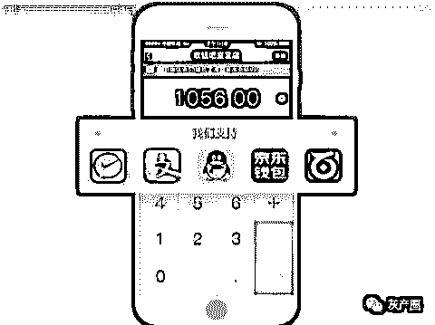

利用自己的微信或支付宝的收款码，替别人代收款，就能赚取佣金？这种“跑分”行为可能是在帮境外网络赌博网站接收、流转、洗白资金，逃避警方打击

净网行动 2019

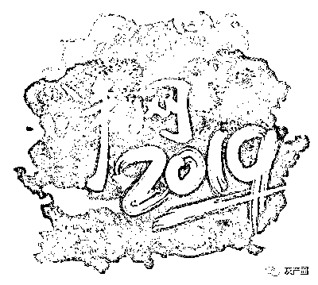

近日，在公安部的协调指挥下，省公安厅组织佛山市公安机关，在中山、深圳、河源、福建等多个省市同步开展“净网 6 号”专案收网行动，打掉一个利用“跑分”APP 平台洗白赌资、逃避监管的新型犯罪团伙，抓获犯罪嫌疑人 103 人，捣毁窝点 10 个，冻结涉案金额 1645 万元，缴获手机、银行卡、电脑、帐单等涉案物品一大批，该案是全国首例打击“跑分”平台帮助信息网络犯罪活动案

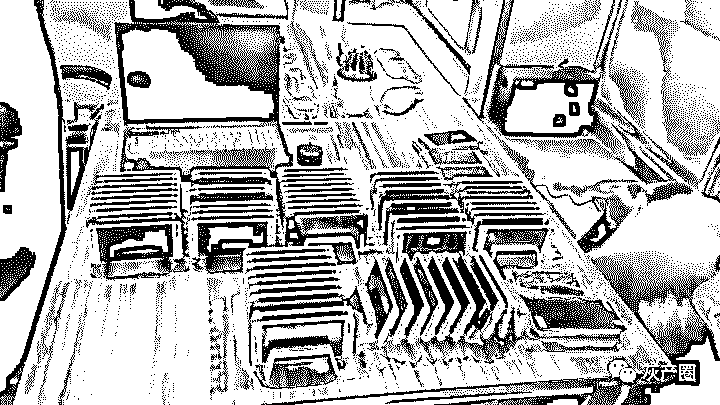

涉案手机

经专案组深入侦查，成功挖掘出一个利用跑分平台帮助信息网络犯罪活动团伙。该团伙通过外聘软件公司开发一款名为“赚呗”跑分 APP，吸纳会员，并组织会员为境外赌博网站商户提供资金支付通道，以赚取佣金获利

经查，该团伙形成“赌客——平台会员——跑分平台——境外赌博网站”资金流转闭环路径，每月涉案资金高达 2 亿元人民币，当赌客登陆境外赌博网站并需充值赌资时，境外赌博网站会将充值信息推送至跑分平台，跑分平台会采取类似网约车抢单机制，在平台上发布资金流转订单，跑分平台的注册会员可以抢单

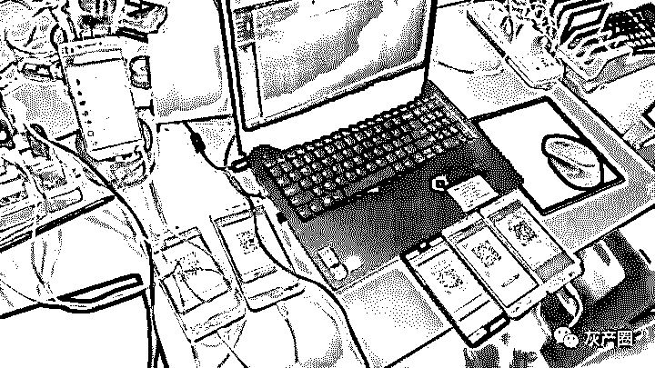

涉案工具

当会员成功抢单后，赌客将赌资转账至会员，会员将赌资转账至境外赌博网站，境外赌博网站以每笔资金的 2.5-2.8%为佣金，返还给跑分平台，跑分平台再以 1-2%的佣金返还给平台注册会员，最终跑分平台通过赚取佣金差价进行牟利

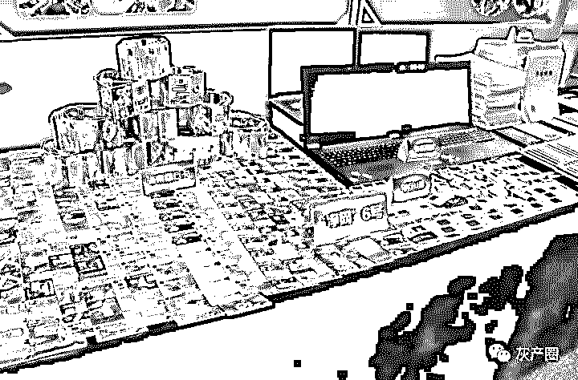

跑分平台发展会员采用类似网络传销的形式开展，介绍人就是会员的上级，发展会员可以赚取相应比例的佣金。会员加入跑分平台时需要上传本人的支付宝、微信收款二维码，还需要向跑分平台充值相应的押金，押金一般不超过 5 万元，押金价值等同于抢单金额的上限

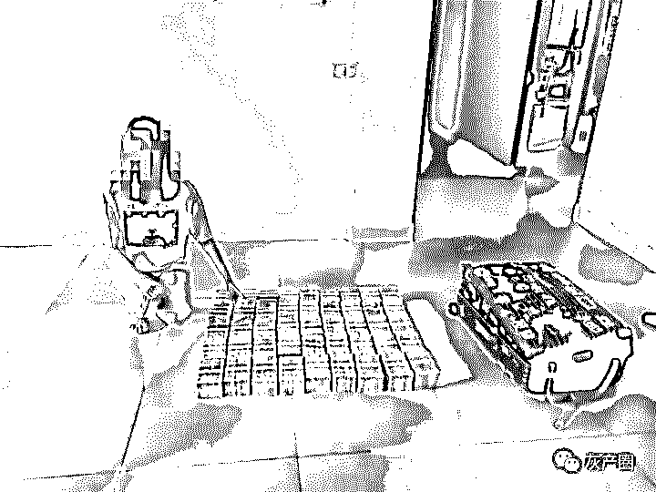

抓捕现场

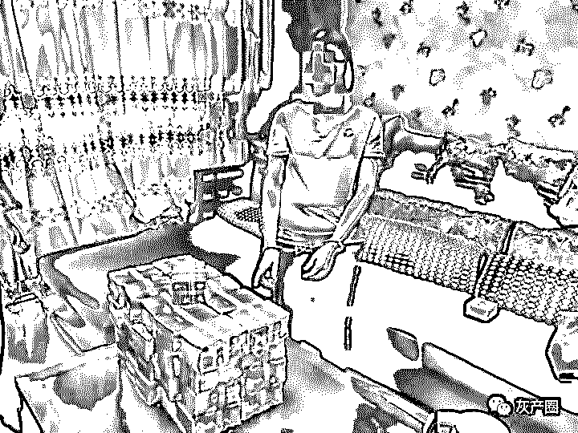

抓捕现场

在查清团伙组织架构和固定相关犯罪证据后，6 月下旬，在公安部的协调指挥下，省公安厅组织佛山市公安机关，在中山、深圳、河源、福建等多个省市同步开展“净网 6 号”专案收网行动，打掉一个利用跑分 APP 平台洗白赌资、逃避监管的新型犯罪团伙，抓获犯罪嫌疑人 103 人，捣毁窝点 10 个，冻结涉案金额 1645 万元，缴获手机、银行卡、电脑、帐单等涉案物品一大批。该案是全国首例打击跑分平台帮助信息网络犯罪活动案

犯罪分子宣称“跑分”兼职来钱快回报高，吸引了不少年轻人投身其中。据现场查证后台统计，“赚呗”跑分 APP 兼职会员 2150 余人中，有 1440 余人为 90 后和 00 后

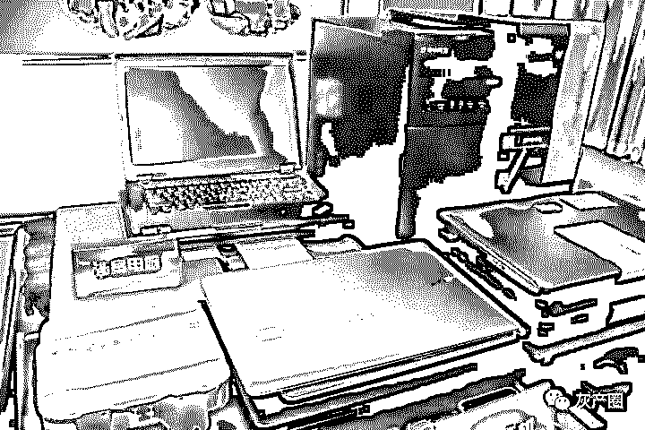

涉案物品

警方提醒

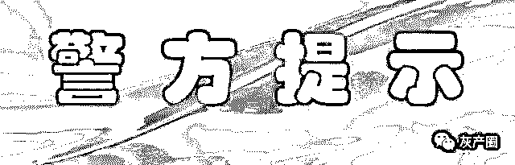

部分利用微信、支付宝收款二维码等进行“跑分”兼职项目，背后实质为帮助赌博等黑灰产团伙进行洗钱活动，涉嫌帮助信息网络犯罪活动罪，参与者需要承担经济损失风险和相应法律责任，群众如遇类似的“跑分”平台时，请及时向公安机关提供详细情况进行举报

## 腾讯：严厉打击“微信跑分”违法违规活动

近日，网上出现“微信跑分”的网络活动，诱导用户在跑分平台上注册并缴纳押金，上传个人收款二维码供他人使用，从而获得一定的佣金奖励

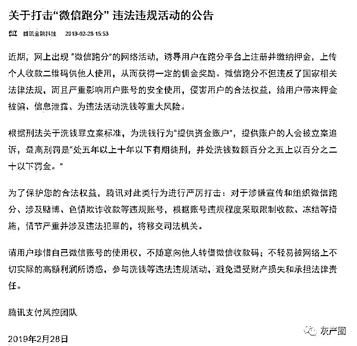

对此，2 月 28 日，腾讯支付风控团队发布公告称，微信跑分不但违反了国家相关法律法规，而且严重影响用户账号的安全使用，侵害用户的合法权益，给用户带来押金被骗、信息泄露、违法活动洗钱等重大风险

腾讯支付风控团队表示，为了保护用户的合法权益，腾讯对“微信跑分”违法违规活动进行严厉打击：对于涉嫌宣传和组织微信跑分、涉及赌博、色情欺诈收款等违规账号，根据账号违规程度采取限制收款、冻结等措施，情节严重并涉及违法犯罪的，将移交司法机关。

同时，腾讯支付风控团队提醒，请用户珍惜自己微信账号的使用权，不随意向他人转借微信收款码；不轻易被网络上不切实际的高额利润所诱惑，参与洗钱等违法违规活动，避免遭受财产损失和承担法律责任

结尾

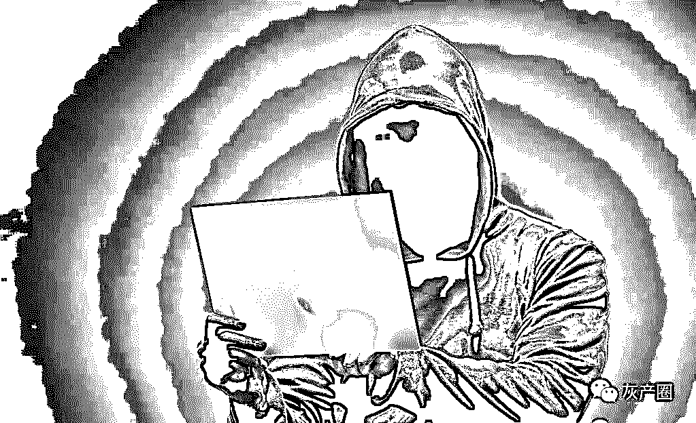

微信跑分就是一些平台利用你的微信收款码来收款，并给你一定的佣金奖励的网络兼职项目

用户提供微信收款二维码给跑分平台，同时给跑分平台缴纳一定的保证金。跑分平台利用这些收款二维码进行收款，每当用户收到一笔款项时，对应缴纳的保证金就会相应减少，由此来完成一进一出的跑分行为，同时用户会得到一定比例的佣金的模式。

最后再次提醒，微信跑分违法！请勿以身试法！

← 向右滑动与灰产圈互动交流 →

**阅读原文加入灰产圈高端社群**

# 

> 原文：[`mp.weixin.qq.com/s?__biz=MzIyMDYwMTk0Mw==&mid=2247495980&idx=1&sn=e3974081a243a4667e6463825345197d&chksm=97cb3a14a0bcb302f2728063ad4baa4e2c6c171e1863768449cfb26c53adda8969258601b8d2&scene=27#wechat_redirect`](http://mp.weixin.qq.com/s?__biz=MzIyMDYwMTk0Mw==&mid=2247495980&idx=1&sn=e3974081a243a4667e6463825345197d&chksm=97cb3a14a0bcb302f2728063ad4baa4e2c6c171e1863768449cfb26c53adda8969258601b8d2&scene=27#wechat_redirect)