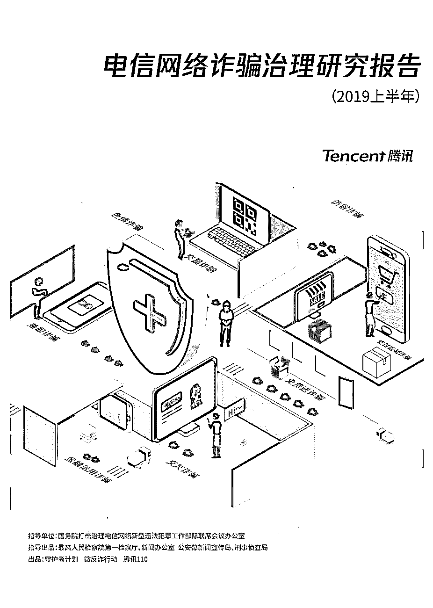
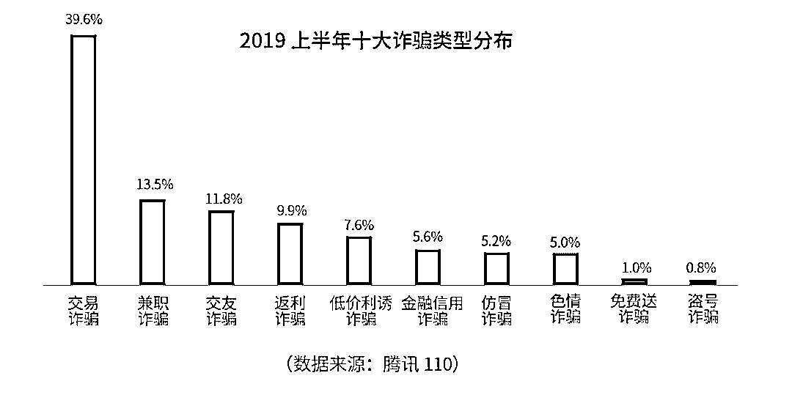
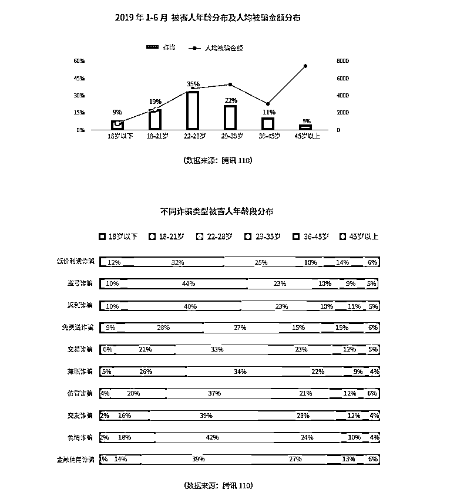
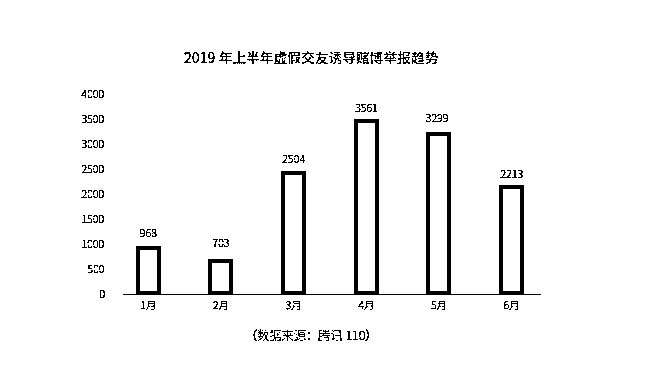
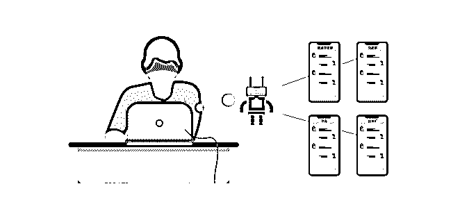
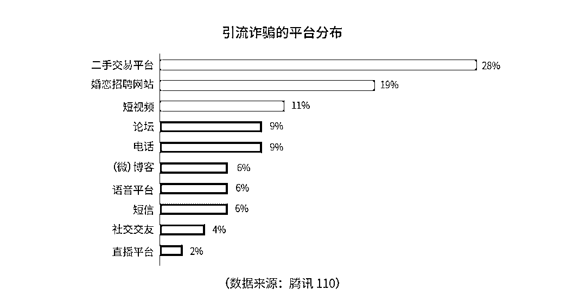

# 腾讯发布《电信网络诈骗治理研究报告（2019 上半年）》，揭秘网络诈骗七大新特征

> 原文：[`mp.weixin.qq.com/s?__biz=MzIyMDYwMTk0Mw==&mid=2247495973&idx=1&sn=6943aa40f8c53fd5788fe9fcba2ee7ee&chksm=97cb3a1da0bcb30b36430291385d29563d1c297283665173974010098121a434ca9f334efc38&scene=27#wechat_redirect`](http://mp.weixin.qq.com/s?__biz=MzIyMDYwMTk0Mw==&mid=2247495973&idx=1&sn=6943aa40f8c53fd5788fe9fcba2ee7ee&chksm=97cb3a1da0bcb30b36430291385d29563d1c297283665173974010098121a434ca9f334efc38&scene=27#wechat_redirect)

**点击上方蓝色字体免费订阅“灰产圈”**

《电信网络诈骗治理研究报告（2019 上半年）》

8 月 6 日，在国务院打击治理电信网络新型违法犯罪工作部际联席会议办公室的指导下，腾讯守护者计划防范新型电信网络诈骗公益活动**“微反诈行动”**发布会在北京举行。会上，**腾讯发布了《电信网络诈骗治理研究报告（2019 上半年）》**，该报告由最高人民检察院第一检察厅、新闻办公室，公安部新闻宣传局，刑事侦查局指导出品，守护者计划、微反诈行动、腾讯 110 出品。

报告通过真实数据和案例，直观展示了**2019 年上半年电信网络诈骗现状和 7 大特征**，并结合检察和公安机关打击治理电信网络诈骗的工作成效，着眼于互联网平台综合防治体系运行成果，积极思考更加科学有效的解决方案。

**迭代更新 电信网络诈骗显现七大新特征**

该报告显示，与以往“简单结伙”“单兵作战”不同，近年来电信网络诈骗运作模式正在呈现专业化、公司化的趋势，犯罪手段也变得更加智能，并且已经逐渐形成了**“恶意注册-引流-诈骗-洗钱”**等各环节精细分工的完整链条，形成了网络诈骗的“新范式”。

进入 2019 年，电信网络诈骗无论是在高发类型、目标人群还是在诈骗套路方面都在不断发生新变化，呈现新趋势，并衍生出多种新类型新手法。**这些新型网络诈骗，手段更加隐蔽，利益关联更加复杂**，给电信网络诈骗的防范和治理带来了新的挑战，具体总结为以下七大特征：1

**交易型诈骗最为高发，纯获利类诈骗日渐淡出**

通过对用户举报情况的盘点分析，报告整理出了 2019 上半年十大诈骗类型，诈骗场景呈现多样化；由于网络购物和网络支付的普及，交易诈骗占比遥遥领先，是最为高发的诈骗类型。

2

**90 后被骗概率高，中老年人被骗金额高**

根据数据显示，18-28 岁之间的被害人所占比例高达 54%。90 后是网络用户的主力军，同时也因社会经历有限，对电信网络诈骗方案意识不足，而成为被骗概率最高的群体。而 45 岁以上被害人的人均受骗金额约为 7000 元，远远超过其他年龄段人群。 

3

**广撒网骗财骗信息，全面榨取被害人价值**

现阶段，“随机诈骗”与“精准诈骗”相互交织，成为电信网络诈骗手段的新趋势。公民个人信息的获取是“精准诈骗”得以实施的前提，所以以用户注册、商品邮寄及提供服务需要等为借口骗取被害人金钱与个人隐私信息的广撒网式诈骗手段愈加泛滥。

4

**交友骗入“杀猪盘”，多种黑产相互勾结**

“杀猪盘”是一种新近兴起的东南亚博彩骗局，以交友名义诱骗被害人进入赌博平台或虚假投资平台投入资金。2019 年 1 至 4 月，虚假交友诱导赌博的月均举报数量总体急剧上升，后经平台专项治理和宣传曝光，该类诈骗增长势头有所遏制，数据开始回落。

5

**群聊群控做迷局，新型技术成诈骗工具**

同时新型技术的发展也逐渐被不法分子利用，比如在电信网络诈骗实施过程中，人工智能开始被用于群聊群控场景，诈骗行为人制作聊天机器人程序，配合人工操作，将被害人引入迷局。

6

**跨平台诈骗日益增多，多平台成引流入口**

报告通过对社交场景下诈骗行为的分析，发现相当一部分诈骗行为源自多平台、跨平台的引流。其中二手交易平台、婚恋招聘网站、短视频平台出现诈骗引流较为突出。

7

**转发分享需谨慎，裂变式传播害人害己**

随着互联网的广泛覆盖，网络裂变传播逐渐成为一种重要的营销策略。但是这种营销方式也被诈骗行为人利用，通过“免费送”等手段，诱骗受害人转发分享有诈骗链接或二维码的内容，影响十分恶劣。

**效果显著 检察、公安机关、科技企业联动治理**

针对手段不断翻新、危害日益突出的电信网络诈骗问题，报告展示了检察、公安机关、腾讯公司等多方联动治理之下，反诈骗工作所取得的成效。

2019 年 1 至 6 月，全国各级公安机关共破获电信网络诈骗案件 5.8 万起，同比上升 3.0%；共抓获电信网络犯罪嫌疑人 5.14 万人，同比上升 32.28%。

另外，**依靠守护者智能反诈中枢的能力，2019 年上半年，腾讯协助各地公安机关开展各类网络黑灰产犯罪打击共计 63 件；****累计协助破获电信网络诈骗类案件 26 起，涉案金额近 4 亿元。**

**建言献策 提升电信网络诈骗综合防治实效**

面对快速更新和不断迭代互联网诈骗现状，该报告不仅以真实有效的数据和案例进行剖析，同时，针对性的提出了提升电信网络诈骗综合防治的五大建议。

首先，互联网服务提供者要**不断加大安全建设投入、完善技术策略**，加固安全防护屏障，有效阻断电信网络诈骗的链路；另外要**创新普法宣传形式**，加强网络安全教育，以强化预警效果和引导社会公众提升个人信息保护意识；同时也建议**公安司法机关不断完善法律规制方案，加大黑产源头治理**；报告还强调，**网络安全问题不能只靠政府部门，更需要社会各界、各行业，以及广大用户的共同努力和参与**，呼吁广大用户积极参与，加入“反诈行动派”，共同壮大全社会反诈骗的行动力量。

**点击“阅读原文”，查看报告完整内容**