# “强制霸屏、阅后即焚”：垃圾短信出何时休？！

> 原文：[`mp.weixin.qq.com/s?__biz=MzIyMDYwMTk0Mw==&mid=2247495954&idx=1&sn=07a4c57e3eb031f4442947754c84f2b9&chksm=97cb3a2aa0bcb33c6b152a72f16c5a5d761a2032418cf17cf215817f22d1a9d080646ef51f9a&scene=27#wechat_redirect`](http://mp.weixin.qq.com/s?__biz=MzIyMDYwMTk0Mw==&mid=2247495954&idx=1&sn=07a4c57e3eb031f4442947754c84f2b9&chksm=97cb3a2aa0bcb33c6b152a72f16c5a5d761a2032418cf17cf215817f22d1a9d080646ef51f9a&scene=27#wechat_redirect)

**点击上方蓝色字体免费订阅“灰产圈”**

近日，媒体称有读者投诉收到自动全屏显示的垃圾短信，关闭后该短信后会彻底消失，且收件箱没有任何记录。我们调查发现，这种短信被称为闪信，在网络上被骚扰过的人不在少数。

垃圾短信大家并不陌生，可称深恶痛绝。近年来，工信部、网信办等部门都曾做过整治，但垃圾短信“出新出奇”的速度似乎正在加快。

01

**无法拦截、无法屏蔽、强制弹窗**

几日前，有媒体报道读者爆料，“刚才我的手机，突然全屏显示了一条营销消息，英语培训的”，而且“关掉后，去收件箱找，却找不到任何记录。就跟不存在一样。”该读者表示十分不解，怀疑其“手机被黑”。

据了解，这种短信被业界称为闪信、屏信或 0 级短信，是一种直接显示在屏幕上、强制接收方阅读的特殊文本信息，关闭后不会被存储在设备上，而且是符合 GSM（全球移动通信系统）标准的合法短信。

我们

以“闪信”为关键词在微博上进行搜索，发现收到过此类短信的网友不在少数。微博名为“flypig”的大 V 网友抱怨称，“汉普森英语是什么东西？为什么能发这种强制全屏的消息，然后再打推销电话过来？”

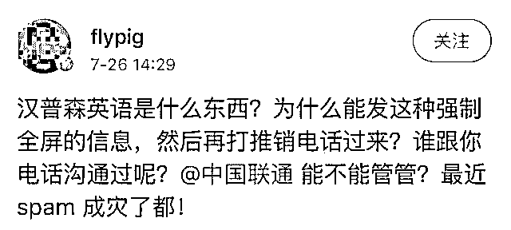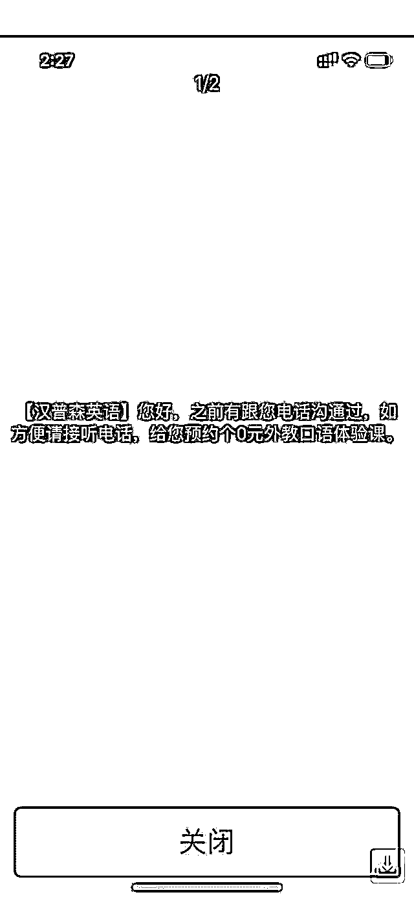

微博名为“flypig”的网友收到的霸屏显示的营销短信。

名为“火华社-凝眸”的微博网友吐槽道，“现在垃圾短信都这么隐秘？不管正在干什么，直接弹出来整个屏幕显示短信？垃圾短信越治理越猖獗？”

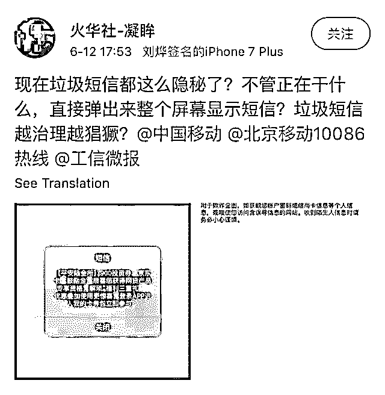

以“闪信”为关键词在微博上进行搜索，发现收到过此类短信的网友不在少数。

据我们梳理，网友收到的闪信具有以下特点：

无法拦截：不受软件、手机终端设置等方式的信息拦截；

不依赖数据网络：不依赖任何数据网络传输，只要能打电话的地方就可以接收信息；

弹屏显示：无论是在待机还是在开机状态，无论是在发微信、打电话还是玩游戏，信息会实时弹屏显示，在屏幕上直接阅读，不需要点击任何东西。

运营商内部人士透露，闪信这种基于 USSD 协议（一种基于 GSM 网络的交互式数据业务）的功能并不新鲜，早在功能机时代，就有公司推出闪信软件用作类似短信一样的聊天功能，只是现在又出现了“新玩法”。

实际上，此前这种形式的短信主要是政府和运营商用来发送非常重要并且紧急的信息的，比如极端天气、自然灾害的提醒，防诈骗的提醒以及民商事纠纷案件信息送达等。例如，湖南长沙芙蓉区法院官微曾发文称，“当天送达次日调解，芙蓉区法院‘闪信+’电子送达助力审判质效提升。”

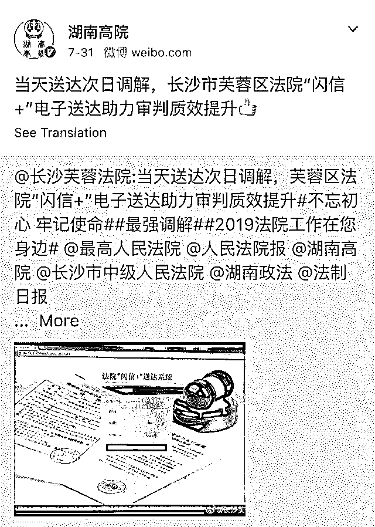

湖南长沙芙蓉区法院用闪信助力审判质效提升。

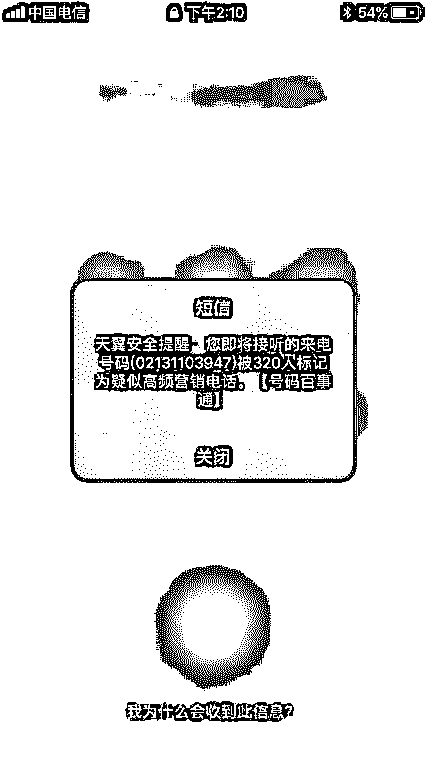

闪信用于防诈骗提醒。

02

**营销类闪信被官方禁止 第三方公司却称有“运营商合作渠道”**

为什么本来凭借技术优势可以分发重要提醒信息的闪信，现在却被用来营销？闪信的使用范围有明确规定吗？运营闪信业务的公司需要具备哪些资质？

我们

发现，中国移动通信开放平台上有关于提供闪信业务的内容。对于使用闪信的企业资质，移动通信开放平台的客服人员表示“只要是正常的用户，有营业执照就可以”。

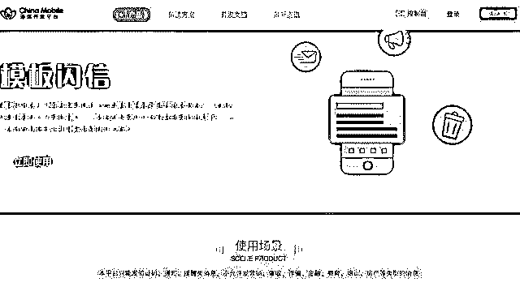

中国移动通信开放平台官网明确提醒不支持闪信用于营销。

“闪信的话，我们这边只能发送提醒和通知类内容”，客服人员告诉我们，而且“内容的话是需要审核的……如果是营销或者偏营销的内容都是无法审核通过的。”

就客服的回答来看，三大运营商的正规途径是并不支持闪信用于营销，但为何会出现闪信垃圾广告？

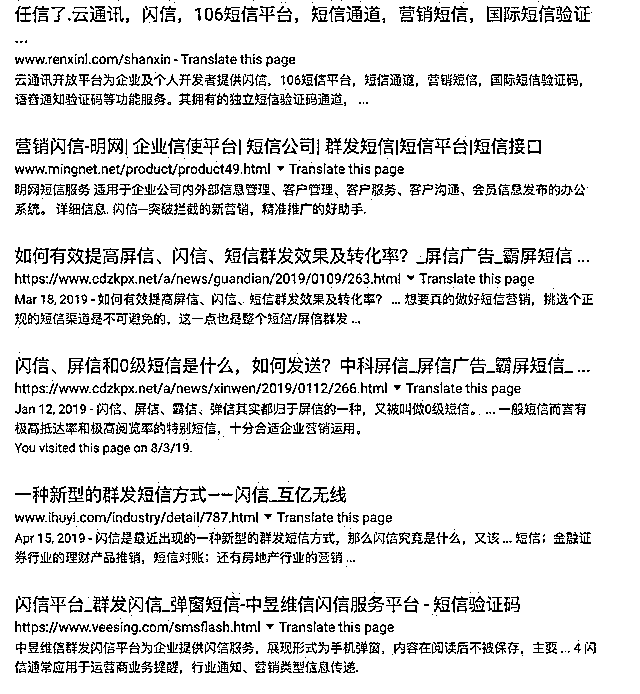

其他专门经营此类业务的第三方公司不在少数。

我们

调查发现，除运营商外，其他专门经营此类业务的第三方公司不在少数，有第三方公司在其官网自称“由三大运营商和工信部授权运营、国家版权中心认证，具有正规资质”。

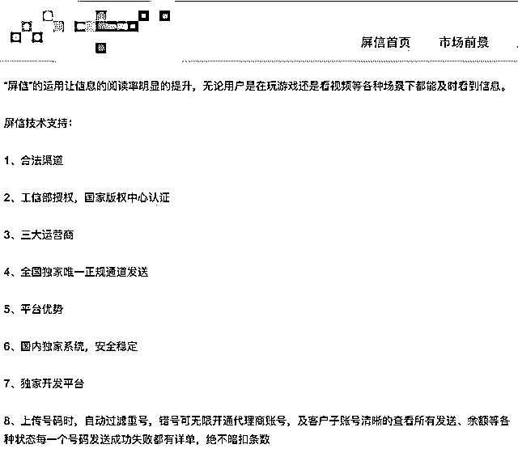

以有英语培训班推广需求为由，我们询问了其中几家公司闪信的操作情况。其中一家公司发来了产品的介绍资料，从资料可以看出，该公司的主要业务是营销类闪信，并且将其包装成为一种全新的广告传播方式。

该资料介绍，闪信的业务场景主要涵盖零售电商、金融、保险、餐饮、汽车、医疗等行业，可谓无所不包。以保险行业为例，通过闪信其客户可以发送客户管理、续保通知、新险种通知以及节目祝福等消息。

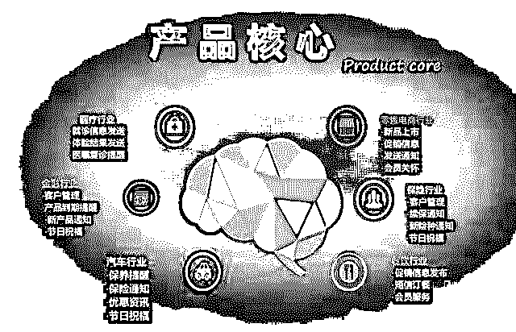

该公司介绍闪信的业务场景。

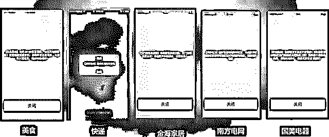

涉及行业广泛。

该公司工作人员告诉我们，一条闪信是 0.08 元，5000 元起充。而且，全国范围内的任何类型闪信都可以发，发送对象以客户提供的手机号数据库为主。

但当我们提出第一批信息需要发送到北京地区老客户的手机上，并且希望可以扩大推广量时，该工作人员回复称“我们也可以提供一部分资源给你”。同时，该工作人员还表示，内容需要提前报备，“基本上都能通过”，但是因为北京地区的审查有些严格，通过率不能保证。

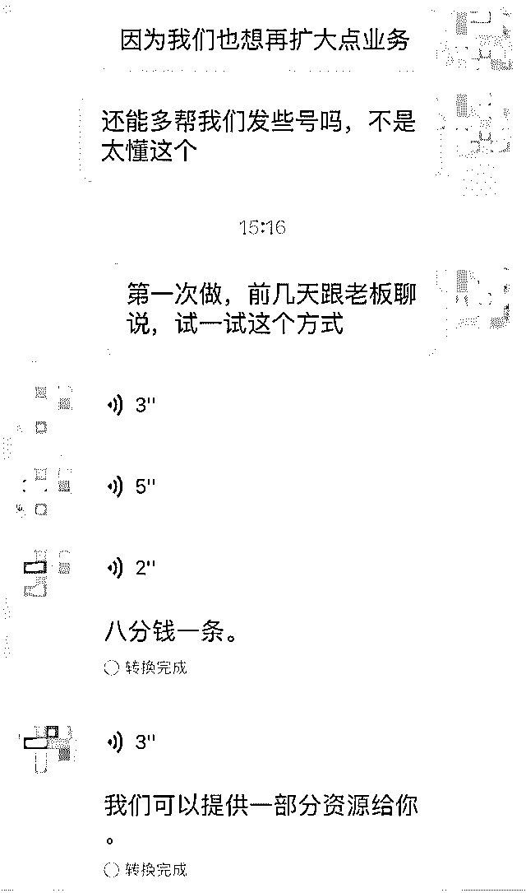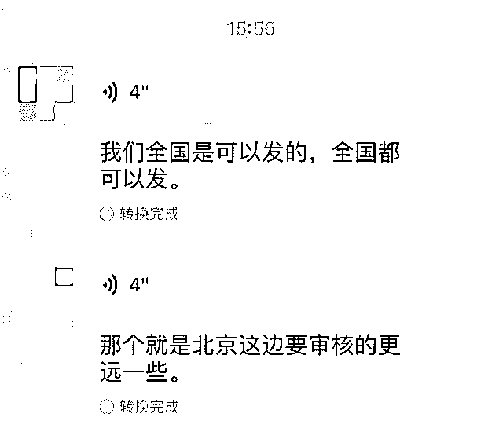

为了证明其业务效果，该工作人员提出可以当下就发一条其他英语培训机构的推广闪信进行验证。仅过了几分钟，我们就收到了以下信息。

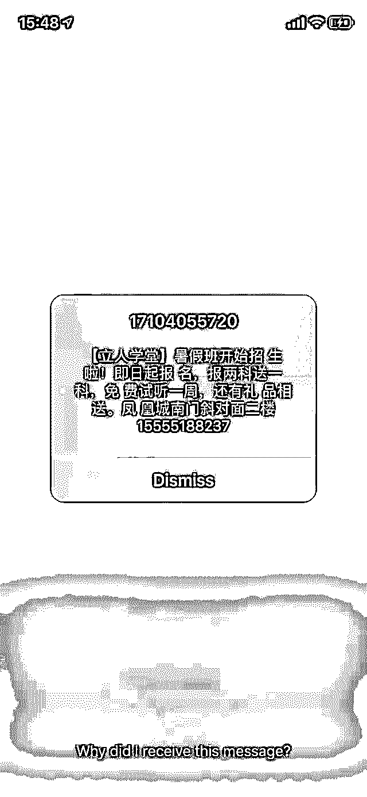

我们收到的闪信。

当我们表现出对其运营资质的质疑时，该工作人员坦言“我们是做短信起家的，肯定是和运营商有合作渠道的”，而且发来了《增值电信业务经营许可证》的编号和查询地址。在电信业务市场综合管理信息系统中，我们查询到了该公司可以在全国范围内经营信息服务业务的信息。

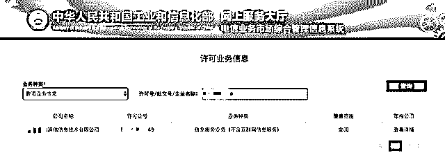

03

**相关部门回应：会对此事进行调查**

据我们梳理发现，2015 年工信部发布并实施的《通信短信息服务管理规定》中已明确要求，“短信息服务提供者、短信息内容提供者未经用户同意或者请求，不得向其发送商业性短消息。”

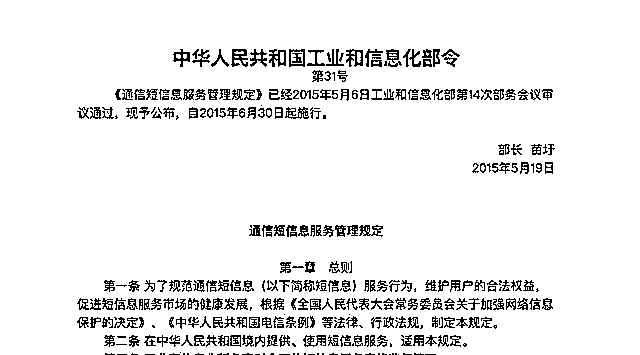

2015 年工信部发布并实施《通信短信息服务管理规定》。

在上述规定中，对短信息服务的适用范围也做了明确界定，“利用互联网向固定电话、移动电话等通信终端用户提供文字、数据、声音、图像等具有短信息特征的信息递送类服务，参照本规定执行”。从定义中可推断，闪信也属于该范围。

此外，该规定还要求，发送商业性短信息，应当提供便捷和有效的拒收方式。但营销类闪信无法拦截、霸屏显示、阅后即焚的特点，显然不符合该规定。

独立电信分析师付亮告诉我们，“如果闪信是走短信通道的话，运营商就负有很大的（监管）责任，他们肯定存在一些问题。”

运营商内部人士也向我们透露，闪信对于普通用户来说很难举报。普通的垃圾短信可以向 12321 网络不良与垃圾信息举报受理中心举报，而且按照《通信短信息服务管理规定》，违者通信管理机构会责令限期改正、予以警告，并可处 1 万元以上 3 万元以下罚款。但是基于闪信的特点，信息根本无法保存在手机短信里，看完也无处查询，发送的号码也无处可找。

随后，南都就上述所有问题询问了相关部门，对方称会对此事进行调查，如果有结果会第一时间告知。

← 向右滑动与灰产圈互动交流 →

**阅读原文加入灰产圈高端社群**