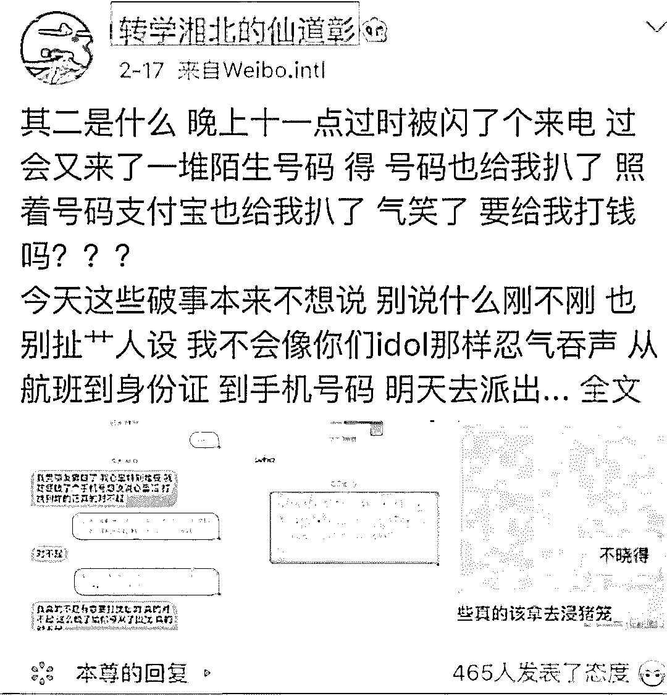

# 194 个未接电话！当明星被私生饭穷追猛打时，你以为你能逃过吗？

> 原文：[`mp.weixin.qq.com/s?__biz=MzIyMDYwMTk0Mw==&mid=2247495940&idx=1&sn=9559e9b1b1f3bc3116e6970a4fb1c29c&chksm=97cb3a3ca0bcb32a1ecd7d58cd82f1abb70a1082fb829620568499e611dcb0d1f226def7eb31&scene=27#wechat_redirect`](http://mp.weixin.qq.com/s?__biz=MzIyMDYwMTk0Mw==&mid=2247495940&idx=1&sn=9559e9b1b1f3bc3116e6970a4fb1c29c&chksm=97cb3a3ca0bcb32a1ecd7d58cd82f1abb70a1082fb829620568499e611dcb0d1f226def7eb31&scene=27#wechat_redirect)

**点击上方蓝色字体免费订阅“灰产圈”**

前几天，因为《陈情令》火到不行的王一博、肖战爆出手机号泄漏，短短几小时被 194 个电话打爆。

而这在娱乐圈并不是稀奇事，还有明星在家收到私生饭短信“欧巴，你的小熊内裤好可爱”；

韩国一明星半夜鬼压床惊醒，结果是私生饭趴在他身上偷吻......

[`mp.weixin.qq.com/mp/readtemplate?t=pages/video_player_tmpl&action=mpvideo&auto=0&vid=wxv_930595084394037249`](https://mp.weixin.qq.com/mp/readtemplate?t=pages/video_player_tmpl&action=mpvideo&auto=0&vid=wxv_930595084394037249)

木村拓哉的“强势私生饭”

而这一切，都离不开私人信息的泄漏。疯狂的追星背后，有一群人躲在“爱”的名义下，伺机敛财。

**疯狂的私生饭**

当下的娱乐文化盛行，追星早就成为众多人生活中必不可少的一部分。从韩团的强大后援团刷榜应援，到周杰伦老粉都要出来微博刷超话数据，这场追星的盛宴早就充满了各路神仙妖怪，各个大显身手。

但是其中还有一群人，充满了狂热与激进，他们就是私生饭。所谓私生饭，源自韩国的流行娱乐次文化用语，是指喜欢刺探艺人私生活的歌迷。

**发短信打电话**

面对偶像，大部分私生饭都会选择一跟到底，从明星的公开行程跟到他回家休息，就连爱豆和家人一起的私人行程，也是被堵的水泄不通。

韩国男星金希澈的手机号被泄漏了，电话被打爆，结果换完新号还没走出营业厅就收到私生饭短信：**“哥哥，不要以为你换了新号我就不知道哦。”**

简直让人毛骨悚然啊！！

**强抱强吻**

前几天任达华在活动现场被砍数刀，面对一些黑粉或者狂热粉丝，明星也成为了高危职业。

比如刘亦菲早前也是在宣传电影是遭到了粉丝强抱。

薛之谦走红毯竟然还有粉丝直接强吻......

**偷拍跟踪**

以前偷拍是狗仔的“专利”，一次次的“深扒爆料”勾起全民八卦浪潮。但是现在面对明星，大家的第一反应就是拿起手机一顿狂拍。**而私生饭的偷拍，就更加吓人了。**

早前赵丽颖的小时候照片在网上被爆出，结果发现是私生饭潜入其家中偷拍出来的......

跟踪的私生饭太多了，萧敬腾的私生饭就曾曝出长时间跟踪、还购买了他家楼下的房子，最后由爱生恨引发“泼粪门”。就连我们优秀的中年唱将杨坤老师，也曾在微博怒斥多日驻守在他家门口的私生饭......

**制造车祸、登堂入室**

**私生饭的最恐怖的，还是他们愿意牺牲金钱、时间、安全甚至生命来靠近明星。**

[`mp.weixin.qq.com/mp/readtemplate?t=pages/video_player_tmpl&action=mpvideo&auto=0&vid=wxv_930629592258445314`](https://mp.weixin.qq.com/mp/readtemplate?t=pages/video_player_tmpl&action=mpvideo&auto=0&vid=wxv_930629592258445314)

可怕的私生饭

有韩星早前在节目中讲述有私生粉多次偷偷潜入自己家中，并在夜晚熟睡时趴在自己身上。最先开始还以为是鬼压床，结果一睁开眼是女粉丝趴在身上盯着自己......

从小火到大的 TFboys 也曾经发表过对于私生饭的看法，希望大家注意安全。因为还在读书的他们就多次在学校内、考场上受到侵扰。更有甚者，直接人为制造车祸近距离接触他们。

**私生饭养活一条黑产链**

明星的基本信息泄漏，主要集中在个人身份信息、航班等交通信息、酒店信息以及家庭住址等信息。因为巨大的市场需求，的确存在部分内部泄漏情况，而更多的还是在职业追踪明星信息的人通过各种合法、非法手段获取。

**航班信息 50 元**

许多私生饭会结合比明星公布的近期行程查询推断，结合部分内部泄漏的身份证及护照信息进行查询。

去年我们就聊过一次[明星航班信息贩卖](http://mp.weixin.qq.com/s?__biz=MzI2MDE5MTQxNg==&mid=2649688412&idx=1&sn=e4e5d20c36a037b0a46cbc89bc2beea2&chksm=f276cc8bc501459d4fc511a48024b26e0f0cb76baf3cb2a0434466cdfc1829a71ce98064f2d8&scene=21#wechat_redirect)，鹿晗吴亦凡的航班信息竟然只要 30 到 50 不等，90 元还能直接打包护照、身份证等私密信息，这个黑产市场实在是有点恐怖。

当然，有时候也会出现滑铁卢，比如之前就有业内大 V 爆料称“张继科在参加某节目飞北京的时候，飞机上所有的头等舱和商务舱的票全部被私生饭买光了，没办法，他们最后和工作人员换成了经济舱......”

**手机号码 30 元一条**

手机号码的贩卖是黑产最为轻车熟路的，30 元一条、100 元包明星团。私生饭购买到这些电话号码直接打爆明星电话，之前韩国男团 sj 就屡屡爆出手机号码泄漏，还有吴世勋接到私生粉电话，感叹一句作为明星真不容易......

手机号码泄漏之后，还有一点更为可怕，私生粉会通过这些手机号码去尝试注册、登录甚至修改明星在部分平台上的私人账号。当下手机号码关联的信息越来越多，一隅泄漏，全盘崩塌。

根据手机号扒到支付宝：请问是否要转钱？

**分级代理只需 100 元**

当各类明星信息有针对性的被扒出来之后，黄牛迅速登场。首先从微博、贴吧等公开网站上进行引流。

公开平台引流之后，黄牛发展各种下级，在微信、闲鱼等较为私密的平台进行兜售。价格从几十元到几百元不等。

甚至还有一些黑产人员，会通过接收代理贩卖信息，仅需 100 元就能成为倒卖中的一份子。从信息倒卖赚钱到收取代理费加盟，这条以侵犯公众人物隐私的黑产链条可谓是肮脏十足。

图片来自新京报

**信息裸奔，你我同命运**

从以上几个级别来看，私生饭的诉求重点在于：了解更多、触碰更多。这种越界的迷恋不仅对明星的个人生活造成严重困扰，还为私生饭自己带来了许多不必要的伤害。

在心理学中有一个“投射效应”，是指崇拜者将自我的某种梦想、欲望和缺憾投射到偶像身上的倾向。追星就是如此，我们享受着追星带来的快乐与动力。但是狂热的私生饭，却在虚幻中沉沦，错将虚拟变成了现实，妄想越界的过度了解、过度触碰，最终只会落得伤人伤己。

如今我们看到各种明星、名人、国内外的信息泄漏，大家看得多了似乎逐渐麻木了。但是我们不能忘记，**雪崩的时候，没有一片雪花是无辜的。**就像他们所控诉的那样“一次的信息泄漏，需要更换手机号、更换各种的绑定信息，非常麻烦”。

如今的你我仿佛觉得信息泄漏很遥远，但是当暗网几十万酒店信息贩卖时，当国外 Facebook 因为隐私问题获高额罚款时，当你不断收到邮箱里面的异地登陆、更换密码通知时，**你就该知道，这场雪，离你并不遥远。**

黑产的营生目前好像只在做明星，那是因为这个市场巨大，利益可见；如今在这数据时代，我们普通人的信息也拥有巨大的数据价值，一次次的信息泄漏、一次次的骚扰短信，黑产早就将枪口对向我们了。

因此，拒绝隐私裸奔，从现在开始，拒绝成为这场黑暗游戏的参与者。

← 向右滑动与灰产圈互动交流 →

**阅读原文加入灰产圈高端社群**