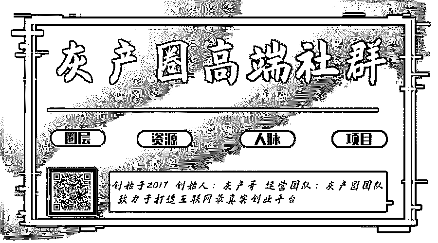
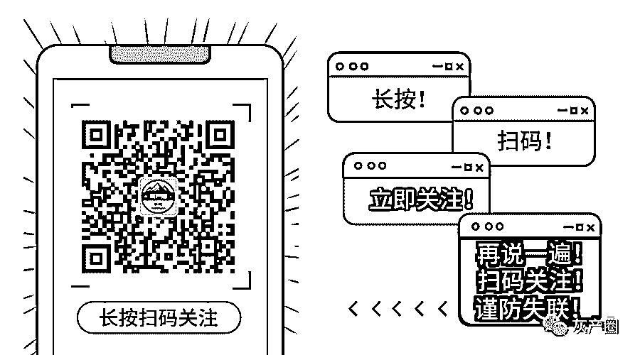

# 交 400 清偿 400 万？“众筹还款”传销骗局卷土重来，受害者越多，平台越赚钱！

> 原文：[`mp.weixin.qq.com/s?__biz=MzIyMDYwMTk0Mw==&mid=2247495920&idx=1&sn=900926ec4fd82aacf5919cdba71cbe4e&chksm=97cb3bc8a0bcb2de96672312dd1cf3d66260100aa054157033630b7d323e17005585f7d8494d&scene=27#wechat_redirect`](http://mp.weixin.qq.com/s?__biz=MzIyMDYwMTk0Mw==&mid=2247495920&idx=1&sn=900926ec4fd82aacf5919cdba71cbe4e&chksm=97cb3bc8a0bcb2de96672312dd1cf3d66260100aa054157033630b7d323e17005585f7d8494d&scene=27#wechat_redirect)

**点击上方蓝色字体免费订阅“灰产圈”**

文 | 尹明

不知不觉， “众筹还款” 最近流行起来，这只能说明一种情况：负债的市场需求真的真的太大太大了!!!

话说，谁身上没点债呢，江湖救急不救穷，凭实力欠下的债凭实力去还，“众筹还款”是什么鬼？

（“有钱还”APP 界面）

**万恶的“群”+“托”推广模式**

老杨不知道什么时候被朋友拉入了一个“众筹还款”的群里，在群里待了几天，每天接到的信息都是：

“感谢‘有钱还’APP 平台，我三个月还清了 30 万债务！”

“三个月时间，我升级到了八阶，再过几天，我就可以还清所有债务了，各位加油，及早上岸！”

“恭喜王总，三个月还清了 500 多万债务，众筹还款，无债一身轻！”

欠债 30 多万，被压得喘不过气的老杨，起初不相信，众筹还款，这钱也来的太容易了吧！

**其实，稍微有点骗局常识的人都知道，这是一种“群+托”推广模式，不过，只要有这种需求，任凭你有多好的定力，迟早会等到你上钩！**

**杀熟和感情牌**

如果“群+托”推广模式你不上钩，那推广还有另一种途径：杀熟和打感情牌。

如上所述，老杨定力不错，不相信众筹还款，原本打算继续做一个旁观者，这时候老秦跳出来了。

老秦是老杨的大学同学，虽然两人平常不怎么联系，可是终归是认识。

老秦现身说法：自己也曾因为投资失败，欠下了几十万的网贷，每天都被逼债，最后通过熟人介绍，进入了众筹还款的群。短短三个月的时间，就还清了几十万的债务，成功上岸，现在是过着无债一身轻的生活。

因为涉及到钱的问题，老杨还是很谨慎。可是群里一遍遍刷着“成功上岸”的案例，再加上经不起老秦的百般劝说，于是按照群里负责人的要求，给推荐人老秦打了 200 元，给负责人打了 200 元，获得了“众筹还款”的资格。

审核后，老杨以为就等着 30 多万债务还钱就可以了，没想到，交了这 400 元，也仅仅是获得了“众筹还款”的资格而已！

**“众筹还款”是传销局**

“众筹还款”的群负责人告诉老杨，众筹分为 9 个阶段。在获得众筹资格后，需要推荐 3 位负债者，并成功让他们各自为老杨打 200 元，并各自为其他众筹者打款 200 元，才完成了第一阶段的众筹，然后升级到第二阶段，如果不能完成，众筹失败。

众筹失败，意味着这 400 元打了水漂。这跟老秦说的“只需要 400 元就可以清偿所有债务”有很大出入。

原来，400 元只是缴纳会员费而已，需要不断发展下线，这不是传销吗？

面对老杨的质疑，没人回答，群里每天依然刷着“恭喜某某人，众筹还款，成功上岸”的案例。

事到如今，老杨知道自己被老秦和群托给骗了，觉得没趣，只好自己退群了。

不用怀疑，这就是标准的传销局。

简单判断是否一个传销局，就三条：

**1\. 是否缴纳“人头费”？**

**2\. 是否需要发展下线？**

**3\. 是否层层返利？**

“众筹还款”需要缴纳人头费（400 元获得资格）；需要发展下线（三三晋级制）；分为九个阶段，层层返利。以此判断，该模式是标准的传销局。

组织策划传销，没收非法所得，处 50 万元以上 200 万元以下的罚款；参与传销，罚款 2000 元，层级大于 3 级人数超过 30 人，可追究刑事责任。

按照“众筹还款”的规则，晋级第三阶段，3+9+27=39 人，已经达到 3 级人数超过 30 人的标准，意味着“众筹还款”完成清偿 7800 元债务，就已经触及法律底线了，可追究刑事责任。

（“众筹还款”的界面）

**为“众筹还款”算笔账**

组织策划传销，无非是为了钱！

传统传销有严密的分成制度，大多数是按照“五级三晋制”和“团队计酬”分钱，根据传销参与者的级别高低分成。

传统传销，就是你所有的亲朋好友，都拿钱去成就你和传销组织者，那是昧着良心赚钱，甚至传销中毒深者，六亲不认，所以家破人亡、妻离子散的多。

“众筹还款”是互联网传销骗局，不同于传统传销骗局。“众筹还款”号称“交 400 元清偿 400 万”，那么至少需要升级到第九阶段，即 3¹+3²+3³+3⁴+3⁵+3⁶+3⁷+3⁸+3⁹=29523 人。

这意味着什么？意味着 29523 人才能成就一个人的梦想！

我不以人均 400 万债务计算，这 29523 人当中，按照人均欠债 20000 元计算，则每个人需要升级到四阶段，才能清偿债务，即每人需要

3¹+3²+3³+3⁴=120 人。清偿 29523 人这一组人的债务，至少需要 3542760 人。

**账，我就不继续往下算了，全国 14 亿人全部参与，也只能为 14 亿/29523=47420 人清偿债务，可是，全国欠债 400 万以上的何止 29523 人？大家都是欠债的主，“众筹还款”如何帮你清偿得了。**

（“众筹还款”的九个阶段，图片来自：反传销举报中心）

**“众筹还款”的赚钱套路**

当然，组织策划“众筹还款”的人，本意就不是为了帮你们清偿债务，而是为了钱！那么这个“众筹还款”传销骗局赚钱套路是如何的呢？

假设你是第一个发起者，正常的情况是这样赚钱：

人头税：400 元；

第一阶段：3 人，交 1200，还 600 元，剩下 600 元；

第二阶段：9 人，交 3600，还 1800+600*2=3000，剩下 600 元；

第三阶段：27 人，交 10800，还 5400+1800*2+600*2=10200，剩下 600 元；

第四阶段：81 人，交 32400，还 16200+5400*2+1800*2+600*2=31800，剩下 600 元；

……

第九阶段：……剩下 600 元。

正常情况下，清偿 1 个欠债 400 万的人，平台赚取：400+600*9=5800 元。

29523 人参与，清偿了其中一个 400 万的债务，平台才赚 5800 元，是不是觉得这平台很良心？

但是，账不是我算的这么简单，清偿一个 400 万债务，也伴随着清偿很多其他不到 400 万的债务，那赚到的都是可观的数目，有兴趣的，可以自己算一下！

**骗子精心策划的传销骗局，又岂能是正常情况赚钱呢？**

那么，“众筹还款”的非正常情况赚钱套路是怎么样的呢？

**其一，人头税，自行退出。**就好比上面案例中提到的老杨，交了 400 元的“人头税”，突然发现这是一个传销骗局，默默的退出了。嗯，这 400 元就打了水漂了。

**其二，完成不了任务，众筹失败。**升级到第一阶段，需要达成的条件，拉 3 个人入网，每个人交 400 元“人头税”，结果费了九牛之力，只拉了 2 个人，那么，众筹失败，加上你一共仨人，1200 元，全部打了水漂。

就算你运气好一些，身边欠债的朋友比较多，完成了第一阶段，平台只赚 1000 元，但升级到第二阶段的时候，你也完成不了 9 个人，只能众筹失败，让更多的人成为受害者。

**不管到了那个阶段，众筹失败，赚到的钱就更多了。所以说“众筹还款”平台是“何不食肉糜”，受害者越多，平台越赚钱。**

说到这，大家都明白了，“众筹还款”正常的情况不多，非正常的情况很多，平台就利用这些规则的最大解释权，不知不觉的把钱赚了，让你们都成了受害者，还指着你们说：“这些韭菜真笨！”

**其三，有足够多的托，所有的钱我都要。****对于骗局，不妨以最恶意的揣测，如果“众筹还款”平台有足够多的“托”，那么，这些受害者所投的钱，都是平台赚的钱！**

我真希望是自己在恶意揣测，可是，如果没有那么多“托”，哪来的群和社区一遍又一遍的机械的刷着“恭喜成功上岸”的信息？如果没有那么多“托”，你倒是让那个利用“众筹还款”平台清偿 400 万债务的家伙出来对证一下啊！

这年头哦，谈鬼的人多，见鬼的人有几个？

**上岸路漫漫，没有捷径！**

“众筹还款”传销骗局并不高明，可是还有很多人上当，说明了什么问题？

骗子都是精通大众心理学的啊。

负债累累的那些人，每天被债务压得喘不过气来，已经失去理性了，因此容易上当受骗！

对于他们来说，在债务的苦海中沉沦，非常痛苦，非常绝望，只要有一点希望可以上岸，就像在绝望中抓到了一根救命的稻草，又岂能不去尝试一下？

每一个负债的人都想着“无债一身轻”，骗子抓住的就是这样的大众心理，所以再简单不过的骗局，也终归有人上当！

我再次奉劝大家：上岸之路漫漫，没有捷径可走！

天上不会掉馅饼，有可能掉铁饼。看完这篇文章，不要再问我“400 元如何通过众筹变成 40 万甚至 400 万”这么欠智商的问题，也别听传销骗子给你洗脑，说什么“400 元通过众筹可以清偿 400 万债务”。

**在我看来，别说 400 元，就算 4 毛钱，也不能白白给了骗子！**

**作者：菲凡烽火台**

****

← 向右滑动与灰产圈互动交流 →

**阅读原文加入灰产圈高端社群**