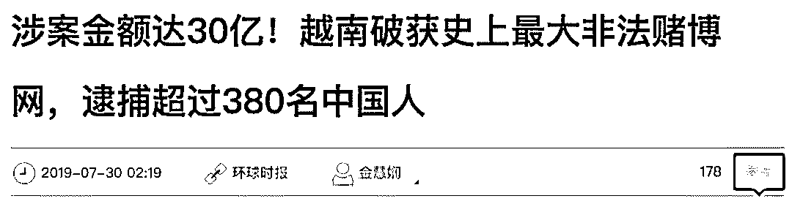
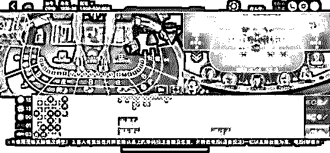

# 380 人团伙在越南被端，跨界网络赌博是怎么坑人的？

> 原文：[`mp.weixin.qq.com/s?__biz=MzIyMDYwMTk0Mw==&mid=2247495911&idx=1&sn=9397dddb0c4b365c1ced7627a59f4363&chksm=97cb3bdfa0bcb2c99ec9c0f89dcab0fe72c95e7ab16d550587a1d593943b9bf95360ccbf4dae&scene=27#wechat_redirect`](http://mp.weixin.qq.com/s?__biz=MzIyMDYwMTk0Mw==&mid=2247495911&idx=1&sn=9397dddb0c4b365c1ced7627a59f4363&chksm=97cb3bdfa0bcb2c99ec9c0f89dcab0fe72c95e7ab16d550587a1d593943b9bf95360ccbf4dae&scene=27#wechat_redirect)

**点击上方蓝色字体免费订阅“灰产圈”**

大家好，今天要分享的内容与跨境犯罪有关。

7 月 29 日，越南警方向中国警方移交了超过 **380 名嫌疑犯**，涉案金额高达 **30 亿**。

这个涉案团伙人数之多，可以坐满 8 辆 50 座旅游大巴了。

同样是 7 月下旬，中国和越南警方在另一个联合破获的案件中，抓了 106 个犯罪嫌疑人，其中从越南缉捕解回 77 人，同时捣毁了 15 个犯罪窝点。

这么大阵仗的抓捕归案，跟什么有关呢？

答案是**网络赌博**。

据越南警方公布，抓捕超过 380 名嫌疑犯的案件，就涉案外国人人数和在越南境内进行的交易金额而言，这是越南历史上规模最大的非法赌博网络。

**非法赌博网络****最常见的作弊操作是什么？**

**网络赌博，十赌九输。**

这句话真的不是传说。

在抓了 106 个犯罪嫌疑人的案件中，警察叔叔们公布了这个团伙的运作模式，以及坑骗赌客的手法。

一个赌客要想在这些犯罪团伙的平台上赌博，首先需要加入一个俱乐部，与这个俱乐部的其他成员对赌。

**俱乐部收费是以每个牌局盈利的玩家盈利部分的 3%-5% 为主。**

而多个俱乐部互相捆绑后，会组成一个联盟。**联盟向俱乐部收取服务费**，每桌 3 块钱，比如今天开了 50 桌，每个俱乐部就要给联盟 150 元。

如果你觉得俱乐部、联盟这些犯罪平台，只是通过抽抽水，收点平台服务费来赚钱，那就太天真了。

**我们想说，这类网络赌博平台就是一个彻彻底底的陷阱，完全没有公平可言，在这种赌博平台中赢到钱的人非常少。**

而他们之所以让赌客赢点小钱，都是为了放长线钓大鱼，**让那些放松警惕、沾沾自喜的赌客在上瘾后，加大投入**。

把小鱼养肥了再宰杀，这操作是不是很熟悉？

有一句话很经典：庄家并不担心赌客赢钱，他们只担心赌客流失。

网络赌博团伙骗取赌客钱财的手段很多，其中最常见的作弊手段就是**伙牌**。

在一局有 8 个人的德州扑克赌局中，只要有 3-4 个人私下通报手上的牌，那么整个赌局基本就是半透明的了，因此桌上其他赌客根本没有赢的机会。

更有犯罪团伙在后台**通过人为操作或者算法，直接更改下注结果等，进行诈骗**。

而这些被抓获的赌博俱乐部，更是直接组织人去作弊打伙牌，联合骗取赌客的钱，收益平均每个月在数十万以上。

虽然这些网络赌博的平台架设在境外，但参与赌博的人员几乎全部来自境内。也就是说，这些犯罪团伙盯上的目标，都是国内的人员。

**国内“最大网络罂粟花”****内地数十万会员，年投注超万亿**

网络赌博有多严重？

还有比文章开头那个坐满 8 辆 50 座旅游大巴的犯罪团伙，更夸张的。

据《经济参考报》报道，由“亚洲新赌王”周焯华（绰号洗米华）控制的菲律宾和柬埔寨太阳城网络赌博平台，通过将赌场和网络服务器设在境外，借助远程视频，让国内赌客足不出户地参与赌博。

**太阳城网络赌博，在大陆拥有数十万会员，每年的赌注额在万亿元以上，相当于中国彩票年收入的近两倍。**

每年盈利的资金通过地下钱庄流向境外，金额高达**数百亿元**。

这类网络赌博平台，为了拉取更多赌客，甚至鼓励现有的赌客发展下家，并根据下家投注金额的 1.6% 抽取“码粮”（返利）。

这意味着**注册赌客可以像传销一样，从太阳城拿到其下线的利益**。

这个非法网络赌博平台不仅提供一对一 24 小时全天候服务，支持中文。语音功能支持普通话、粤语、东北话等个性化语言，很明显是专门针对中国赌客设计的。

专家将这个平台称为绽放在**中国的网络赌博“最大罂粟花”**，认为其对中国社会经济秩序和金融安全产生了巨大危害，应当引起监管部门的高度重视。

图为太阳城网络赌博平台手机版截屏

**千金散尽****网络赌博比实体赌博快太多**

在网络上买买买，钱包大出血也没有太多的痛感。

赌客在网络赌博平台上用的一般是虚拟的筹码数字，而不是握在手里的现金钞票、实体筹码，因此对网络赌博的输赢也不会有太大的感觉。

在手指触控屏幕、鼠标键盘点击确定的一瞬间，赌客的房子、车子、工厂这些资产可能就顿时消失了。

根据业内人士的暗访调查，参赌人员一旦陷入网络赌博，往往是**从小赌到大，越输越想回本反而越陷越深，从把现金、车子、房产这些资产赔进去后，接着举债赌博以至债台高筑、倾家荡产，最终甚至家破人亡**。

这样的例子数不胜数，也唏嘘不已。

**法律分析**

与赌博有关的犯罪，我们建议网络赌博平台的犯罪分子们，来学习一下**《中华人民共和国刑法》第三百零三条赌博罪**。

**营利为目的，聚众赌博或者以赌博为业的，处三年以下有期徒刑、拘役或者管制，并处罚金。开设赌场的，处三年以下有期徒刑、拘役或者管制，并处罚金；情节严重的，处三年以上十年以下有期徒刑，并处罚金。**

与赌博罪相关的司法解释也麻烦了解下：

> **以营利为目的，在计算机网络上建立赌博网站，或者为赌博网站担任代理，接受投注的，属于刑法第三百零三条规定的“开设赌场”。**
> 
> **中华人民共和国公民在我国领域外周边地区聚众赌博、开设赌场，以吸引中华人民共和国公民为主要客源，构成赌博罪的，可以依照刑法规定追究刑事责任。**
> 
> 最高人民法院、最高人民检察院

而以赌博为名，行诈骗之实，通过诱骗另一方参与赌博，诈骗对方财物的行为，根据具体情节可能构成诈骗罪。

**诈骗罪：数额巨大或者有其他严重情节的，处三年以上十年以下有期徒刑，并处罚金；数额特别巨大或者有其他特别严重情节的，处十年以上有期徒刑或者无期徒刑，并处罚金或者没收财产。**

**个人信息“四件套”****正在流向网络赌博窝点**

与此同时，网络赌博、电信诈骗等境外网络犯罪在上游已经形成了专门提供假身份信息的“整套证件”服务产业。

7 月 26 日，公安部首次披露了个人信用卡“套装”是如何转运出境的。

这些套件有两种，一种是银行卡“四件套”，包括身份证件、银行卡、手机卡、U 盾。

另一种是企业对公账户“八件套”，包括对公银行卡、U 盾、法人身份证、公司营业执照、对公账户银行申请表、公司公章、法人印章、公司章程等，

这些账户都来自哪里呢？**中国在校学生、城市务工人员等社会群体**。

他们有的前往银行开办账户后卖出，也有人专门组织这些人员办卡、收购，再进行转卖。

银行卡“四件套”在**收购时一般每套 500-1000 元**，在经过层层转手加价，最后到真正的买家手里最高可以卖到**每套 3000 元**。

企业对公账户一套最终可以卖到 **8000 元-15000 元**。

根据《刑法》第二百五十三条：

**国家有关规定，向他人出售或者提供公民个人信息，情节严重的，处三年以下有期徒刑或者拘役，并处或者单处罚金；情节特别严重的，处三年以上七年以下有期徒刑，并处罚金。**

总而言之，网络犯罪日趋严重，网络赌博集团跨境实施犯罪成为新趋势。

**经熟人介绍参与网络赌博，是网络赌博发展人员的主要途径。**

十赌九输，赌博不能碰。

更要保护好自己的个人信息，谨防身份证等重要证件落入不法分子的手里，成为背黑锅的那个人。

参考内容来自：

1\. 环球网，《涉案金额达 30 亿！越南破获史上最大非法赌博网，逮捕超过 380 名中国人》，2019-07-30

2\. 央视网，《5 万赌客豪赌 涉案金额上亿！跨境网络赌博案暴露惊人内幕

》，2019-07-29

3\. 北京青年报，《公安部首次披露个人银行卡"套装"如何转运出境》，2019-07-26

4\. 经济参考报，《网络赌博“花式”设局：藏匿境外 专坑国人》，2019-01-15

← 向右滑动与灰产圈互动交流 →

**阅读原文加入灰产圈高端社群**