# PTFX 骗局：搏命赌徒的末日狂响

> 原文：[`mp.weixin.qq.com/s?__biz=MzIyMDYwMTk0Mw==&mid=2247495862&idx=1&sn=8472e744c788dd6bf24ca038193c8c29&chksm=97cb3b8ea0bcb298597a1e0067ba8415d3ec8a77ec36fe52bca86a8b31c38793ca2cf4a87e5e&scene=27#wechat_redirect`](http://mp.weixin.qq.com/s?__biz=MzIyMDYwMTk0Mw==&mid=2247495862&idx=1&sn=8472e744c788dd6bf24ca038193c8c29&chksm=97cb3b8ea0bcb298597a1e0067ba8415d3ec8a77ec36fe52bca86a8b31c38793ca2cf4a87e5e&scene=27#wechat_redirect)

**点击上方蓝色字体免费订阅“灰产圈”**

**01**

最近后台以及文章留言里向我咨询 PTFX 外汇的人特别多，JUMP 里面也是一大堆问的。 

其实我之前写外汇骗局的时候，专门提到过 PTFX 是资金盘骗局，无奈那篇文章常规性消失了，导致非常多新关注我的朋友都没看到过那篇文章，还在不停地问。

以至于和家里被骗的朋友同事老人论战时没有了关键论据，我觉得这样也不合适。

刚好最近正在帮某大型国有机构和某公安做反诈骗合作，期间多次提到了 PTFX 这个项目，他们国内的主要团伙其实和福建一帮资金盘是一伙人，上个月刚被端了一次元气大伤，现在正在疯狂拉下线，所以最近他们的声音又大起来了。

而且 8 月也是反诈骗宣传月，刚好趁这个机会重新好好理一下以 PTFX 为代表的外汇资金盘的骗局，希望能够帮到更多人。

希望这篇文章能被更多人看到，说不定看到一个就救一个。

**02**

PTFX 是什么？

PTFX 是打着印尼某公司旗号的外汇资金盘，号称是受到印尼监管背书，印尼十大外汇公司之一，操盘手牛逼上天，只要你投钱进入 PTFX，你什么都不用做，自然有外汇投资大神带你飞，每个月 10%到 30%的收益包您爽。

而且如果你拉到了更多的人参与 PTFX，他们就会成为你的下线，收益分你一部分，你下线的再拉下线，那么你还能获得收益。

上一张图给你们感受一下，这是他们自己公开的收益，厉害不厉害？ 

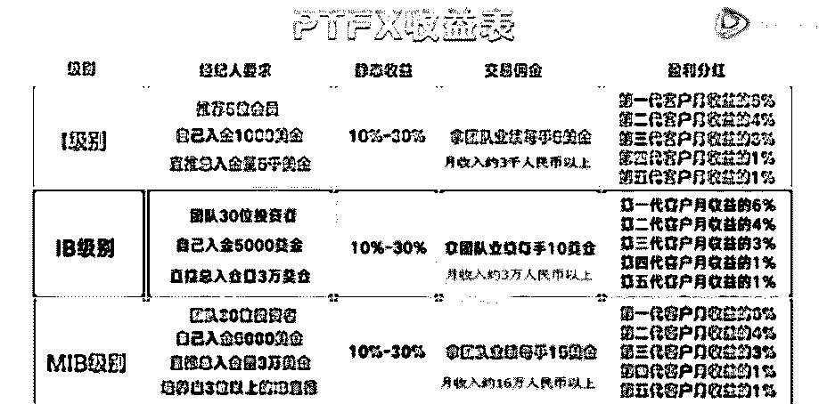

另外还要注意一点，这里面标注的单位是月，就是一个月 10%到 30%的收益，你拿到的客户的收益，时间单位也是月。

如果算年华收益的话，不算复利是要 X12，算复利（每月滚动本息）的话，要 X20 以上，差不多一年 700%不到的样子。

听起来是不是特别棒？

一般稍微有点金融常识的人看到这里就把他们拉黑了。

一年 700%的收益是什么概念？

那些牛逼的，暴雷 P2P，超级非法集资，也就是一年 36%左右的收益率。

那些扫黑除恶专项打击对象的高利贷，放砍头息出去一年的收益率也就是 180%到 600%左右。

而你在 PTFX 里，即使是个普通人，运气好也能有一年 700%的收益，如果你投入几十万，按照 PTFX 这个利率，十年后，你可能就是世界首富了。

建议孙结石老师也别搞币圈了，抓紧投入 PTFX 吧。

**03**

说完收益率，我们再说别的。

还是这张图，大家看盈利分红这一列。

这里有一个第 1 到第 5 代客户的概念，其实就是发展下线。

A 拉了 B 入伙，B 就是 A 的第一代。

B 拉了 C 入伙，C 就是 A 的第二代。

C 拉了 D 入伙，D 就是 A 的第三代。

总之，PTFX 是支持 5 代分红的，就是最少有 6 级关系链，当然实际的关系链可能更多。

**在我国，超过 3 级的分销体系，就会被定义为传销。**

**传销是违法的，这个我想不用再跟大家废话了吧。**

**顺道再说一句，国内是禁止公民参与外汇保证金交易的，这是重点打击对象，在这里，又要拿出我们的老朋友百度了。**

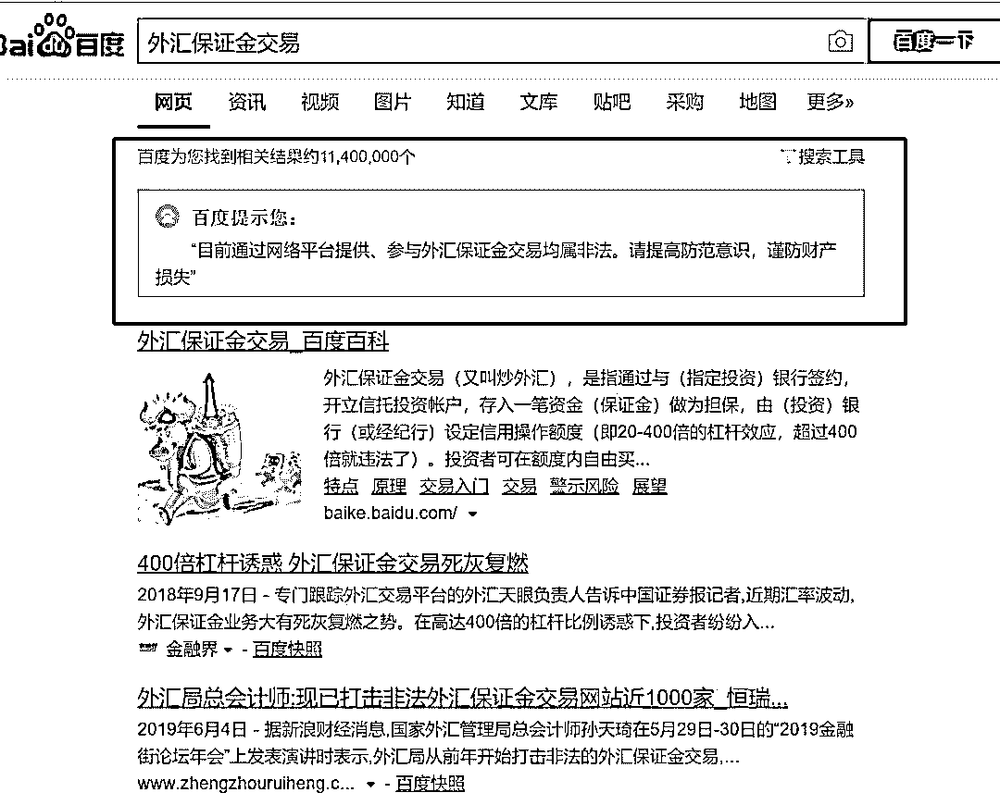

**我们再换个词。**

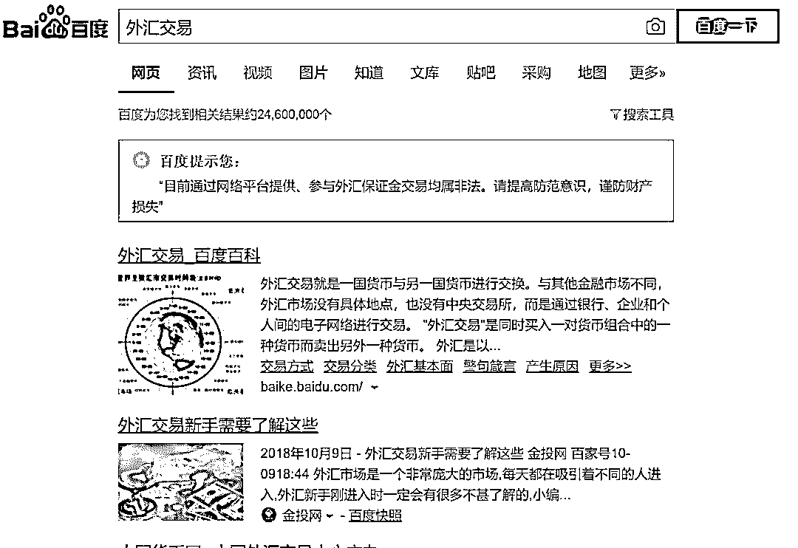

连百度都提示你违法并且没有打广告的事情，显然是非常危险并且犯法的。

利益链超过 3 级的传销，外加国家严厉打击的网络外汇资金盘交易，亲上加亲。

你们在玩儿百度都不玩儿的东西呀朋友们，你们脑子瓦特了吗？

**04**

我们来看看国家对于 PTFX 的态度是怎样的。

先来一张湖北省外汇管理局网站的回复。

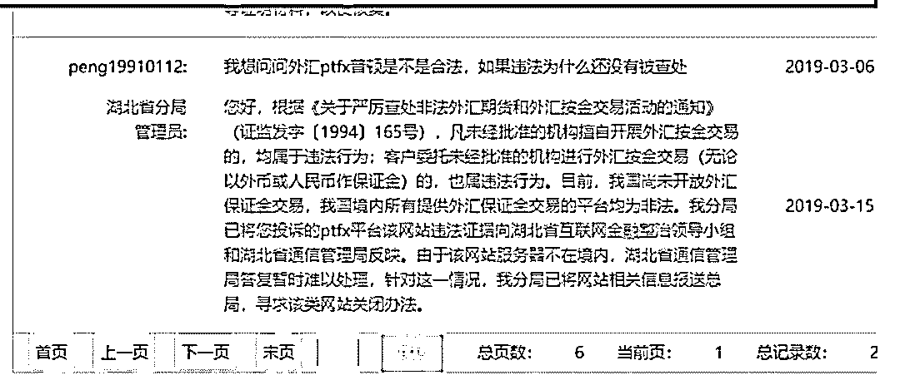

再来一张深圳外汇管理局的的回复。

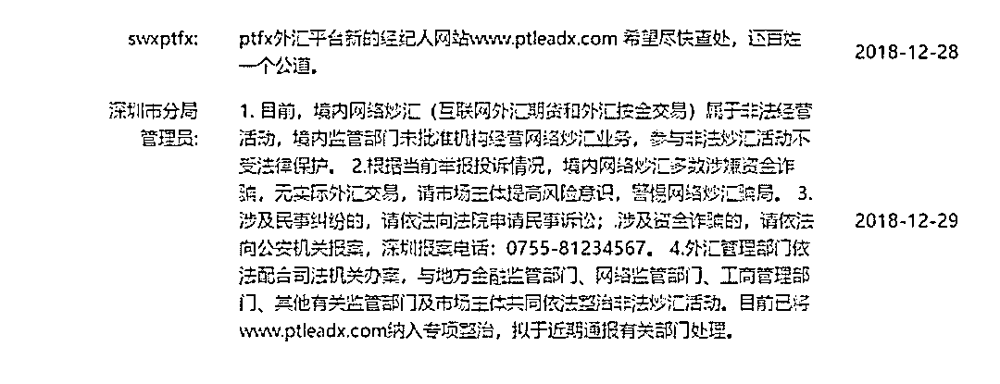

这些东西可以直接在外汇管理局官网找到，甚至如果你愿意，直接在自己当地的外汇管理局网站留言这边留下问题直接问 PTFX 外汇交易是否合法，都是很明确的回复。

政府机构都这么明确的答复了，我觉得智商正常的人应该都明白了。

参与非法炒汇活动不受法律保护，政府不让你做，百度不给你推广，这还不够明确么？

你参与玩儿了，到时候人家一跑，你去找谁去？

你能怪谁？

**05**

当然，如果只是这点信息，是撑不起我的一篇文章的。

我得丢一些大招来好好砸他们脸。

每个外汇资金盘听起来都是这么棒的，而 PTFX 之所以成为第三代外汇骗局的领头羊，主要是因为他们拉来了印尼监管的背书，听起来就是正规军的感觉。

很多 PTFX 的经纪人，整天鼓吹着 PTFX 多么牛逼，可惜在专业人士眼中统统不堪一击。

既然本文要拿来给大家当做论战素材的，那么我就多放点资料。

**PTFX 号称自己是可以在商务部网站查到的，说自己是受到中国驻印尼商务参赞的认可的正规机构，所以安全放心。**

我们来看一份声明。

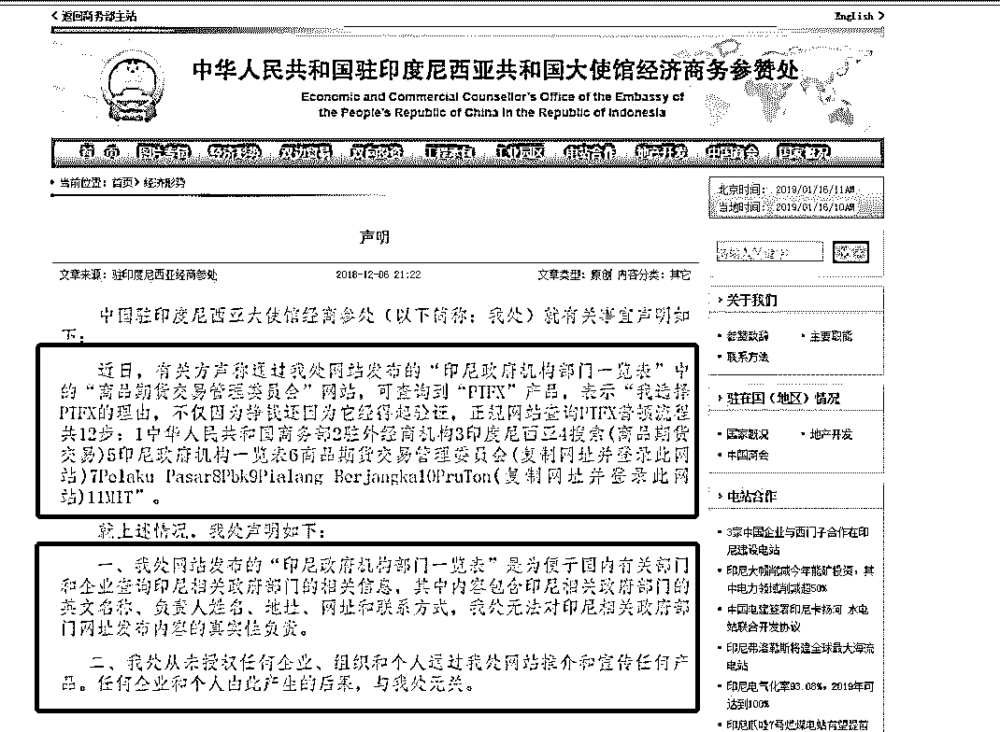

商务部网站对应这个页面的地址是

http://id.mofcom.gov.cn/article/jjxs/201812/20181202814115.shtml

这个是 gov 域名的政府网站，人家把事情写的很明白了，政府公开信息和 PTFX 自吹自擂的信息哪个更可信，脑子正常的也都知道的。

**PTFX 号称自己被多国监管机构所监管，所以自己非常靠谱。**

但是很不幸，早在 2017 年，马来西亚央行就把 PTFX 列入了警示黑名单：

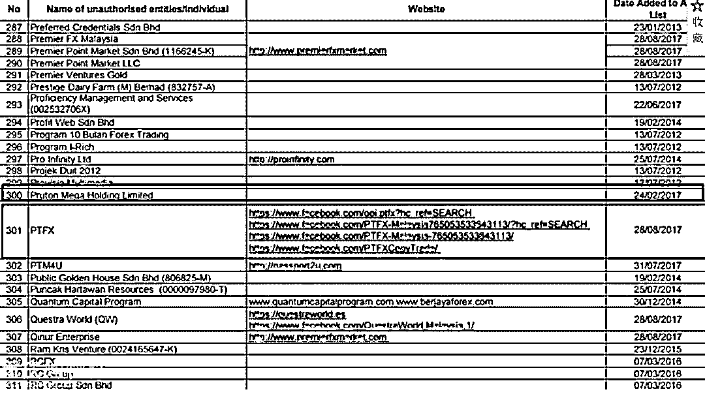

中国外汇管理局明确表示这个有问题，商务部明确表示 PTFX 背书和他们无关不要相信，马来西亚央行明确把 PTFX 列入黑名单。

那么他们还有什么花招？

**有的，PTFX 表示在自己的大本营印尼，自己是受到监管的合规公司。**

**PTFX 宣称自己受到印尼 JFX/PTKBI/BAPPEBTI 监管，这 3 个确实也都是印尼的机构，那么是不是他们就靠谱了？**

**并不是，这反而更说明他们不靠谱了，直接就是骗。**

**06**

我给印尼的公司设计过整体风控，对印尼的监管还算比较熟悉，打过的交道也不少。

我来讲明白这个事情，所谓的 PTFX 的海外背书。

首先，JFX 和 PTKBI 根本就不是什么监管机构，也不会去监管什么公司的行为。

JFX 和 PTKBI 只是一个交易所，只提供交易服务，本身不对交易双方进行监管。

JFX 是证券，PTKBI 是衍生品，都是做交易服务的。

差不多可以理解为上海证券交易所（JFXorPTKBI）和 A 股公司（PTFX）的关系。

证券交易所只是提供了一个买卖双方的平台，并不会去干涉双方的行为，如果出现了异常，出手的是证监会，证券交易所只是提供交易服务的。

**PTFX 在国内找一群人去印尼 JFX 参观，说双方有合作云云，这不废话吗，你在交易所进行交易，当然是有合作呀，但是你出了问题，和人家交易平台有什么关系？**

**你见过在菜市场买到了不新鲜的鱼去找菜市场保安赔偿的吗？肯定是哪个摊位卖你的找摊位。**

**你见过 P2P 跑路后支付机构说还钱的吗？交易所和支付机构只是一个工具，无法对骗子公司进行筛查和背书，这是常识。**

**骗子们骗的就是国内人对于印尼机构体系的不了解。**

至于 BAPPEBTI，确实倒是印尼的监管机构。

但是这个机构怎么说呢，有和没有是一样的。

印尼这个国家，以及整个东南亚，其实都是非常混乱的，腐败横行，博彩高利贷肆意收割民众，监管机构不作为只顾贪钱，真到了干事儿的时候都是撇清关系。

**为什么网络赌博的大本营都在菲律宾和老挝？因为那边只要塞钱，搞这个骗中国人合法。**

**为什么国内被重点打击的高利贷现在在印度和印尼非常潇洒的收割？因为那边只要塞钱，随你怎么玩儿。**

**为什么国内被赶出去的炒地皮的那帮人去东南亚搞收割了？**

**1 万元 1 亩批发来的地动不动卖给韭菜们几十万一亩？**

**因为那边根本不管。**

为什么现在各路骗子都在东南亚？因为国内跨境执法难度高，成本高，所以他们就吃准了这个就是个骗。

这个印尼的 BAPPEBTI，建议懂英语的人去打打电话试试，你打 30 通能通一次算你运气好，能跟你电话交流 1 分钟算你口语扎实，你提 PTFX 直接给你秒挂。

**你指望这种机构保障你的权益？别逗了，他们自己的工资还要靠各类沙雕外汇资金盘行贿和赞助才有的发呢。**

**这种小国家以及不知名的监管机构，等同于没有监管。**

之前卷款 300 亿跑路的外汇资金盘 IGOFX（和 PTFX 的玩法模式一模一样，像素级克隆），说自己受到一个瓦努阿图国家的 VFSC 监管。

最后直到跑路，这个念起来都拗口的国家的机构也没说啥。

还有一个瑞士的 API，跑路之前号称受到全世界最严格的的瑞士 FINMA 监管，其实只是 FINMA 组织下面的一个 SRO 自律组织，没有权利和义务去管这些公司。

我们总结一下，PTFX 所谓的受到印尼三大机构的监管，2 个机构根本不负责监管，全是骗子。

1 个机构只是存在理论上监管，实际上也没法执行。

这 3 个哪个都不靠谱。

而且最荒谬的是，你作为中国人，参与一项中国政府不允许的活动，把钱往印尼塞，印尼监管机构才懒得管你死活。

里外不是人。

**07**

当然，我们说的都是一些硬知识和客观现实，接受起来还是有点门槛的。

骗子为了能够骗到大家的钱，肯定付出的努力要多得多得多。

毕竟我们还要上班，他们上班就是骗人。

光熬时间也能熬的受害人被洗脑，这是客观事实。

但我觉得还是要对骗子们的标准话术做一个 QA 反驳，不能这么简单便宜了他们。

骗子们经常挂在嘴上话术 1：

> PTFX 外汇托管 2016.10 月进入中国以来，将近三年时间，几十万会员把百亿人民币托管到 ptfx 进行外汇交易，月收益较稳定。并且无一亏损，这在全球的外汇交易领域里，简直就是一个神话。 所以，竞争对手就开始各种造谣、诋毁、抹黑。 但如果你认真去分析这些黑人们说的每一句话，你会发现：他们讲的内容都是捕风作影、是一种臆测，是自以为会怎样的内容，他们根本拿不出来铁证，说不能出金的朋友你把截图上传给大家看看呀？

回答 1：

几十万会员，百亿人民币，无一亏损，在这加了杠杆的外汇交易中，已经不只是神话了，这叫做天神下凡，这么牛逼的的天神公司，为什么要帮人理财呀？自己凑个几千万，玩儿个几年就世界首富了，还盯着国内这些老头老太小白领的万把块干嘛？不丢分吗?

当年席卷整个美国的庞氏骗局，麦道夫骗局，年化也就 10 个点。

建议各位朋友直接去百度贴吧的 PTFX 吧里面看看帖子，里面不能出金的截图一大把，恐慌已经在蔓延了。

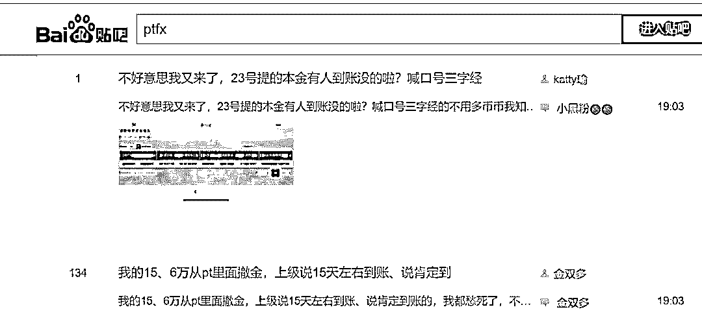

话术 2：

> 你说 PTFX 骗钱了，可那些早期来玩儿的人都把本金赚出来了，现在都是纯赚，你怎么解释？PTFX 骗谁的钱了？有什么亏损的吗？

回答 2：

资金盘的一大特性就是崩盘前所有人都不会亏损，因为本质上就是借新还旧，只要不断有人加入，那么盘子自然越滚越大，有无数的后人的钱可以拿来还前人的钱。

而资金盘的另一大特性就是，借新还旧到一定程度后，新增的规模会逐渐无法覆盖前人的利息，到这个时候，就是资金盘要崩塌的时候，无人可以阻挡这个趋势，因为钱本来就那么多，击鼓传花到后面，后面的人的钱没有再后面的人来还了。

这也就是为什么资金盘的早期参与者运气好的时候盆满钵满，因为有人接盘。

到了后面入场的人，无人接盘，只能投胎。

PTFX 是一个已经持续了近 3 年的资金盘，基本已经快要走到尾声了，今年以来整个系统的维护已经是越来越多了。

资金盘这个东西，最好是永远都不要碰，因为你完全不知道自己到底是在什么时候加入的，游戏什么时候玩不下去。

话术 3：

> 既然 PTFX 是资金盘，那为什么警察不抓呀，为什么还发展这么快呀？

回答 3：

PTFX 的主要组织都在东南亚，跨国执法的难度很高，而且参与 PTFX 这类外汇盘的人，本来就是不受法律保护的（见前文外汇管理局的回复），公共资源是有限的，有限的资源肯定是要先保护守法公民的权益，那些明显优先级更高。

另外 PTFX 这类机构不是不抓，只要在国内形成规模，再加上举报，立刻就会开始打击，之前福建那次打击就是范例。

那一波打击差一点直接干掉 PTFX，下一波打击什么时候来，我们拭目以待。

话术 4：

> PTFX 就是带着大家炒外汇，有什么错误？而且还带着大家去印尼总部考察，真实可信，黑狗别来黑了。

回答 4：在印尼这种地方，只要有钱，搞个富丽堂皇的总部没有任何难度，君不见国内各种非法集资公司的总部还在国内呢，也是各种富丽堂皇，这东西根本不能说明任何问题。

这么多博彩公司，高利贷公司，都在东南亚有高大上的办公室，就说明他们是正常的吗？这种花点小钱就能搞定的事情有什么门槛？

而且就不说国内不允许公民炒网络外汇这件事情了，你 PTFX 这么大的入金，是如何绕过外汇监管变成国外货币的？国内对于公民个人外汇兑换是有限制的，谁能讲清楚这个？外汇管理局特别感兴趣。

这也是外汇管理局明确打击这类外汇盘的一个原因，如果是真的，就是非法兑换外汇；如果是假的，就是骗局。

横竖都是骗。

**08**

授人以鱼不如授人以渔，作为平民，想要为打击以 PTFX 为首的各类外汇资金盘，应该如何操作？

很简单，这些机构既然要投资人入金，那就必须有国内的主体来接收钱，这些主体往往都是皮包公司甚至个体经营户。

可以直接向 12315 举报这些公司。

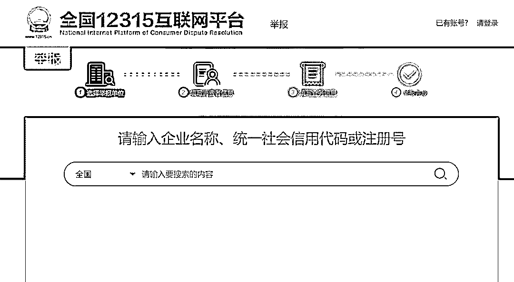

在这里面输入要举报的公司，然后举报内容写 PTFX 非法外汇交易，当地的市场监督的人员会直接上门去检查是否有问题，只要是 PTFX 在国内的收款公司和对公账户，都可以举报。

有一家算一家，都有问题。

取几个举报案例。

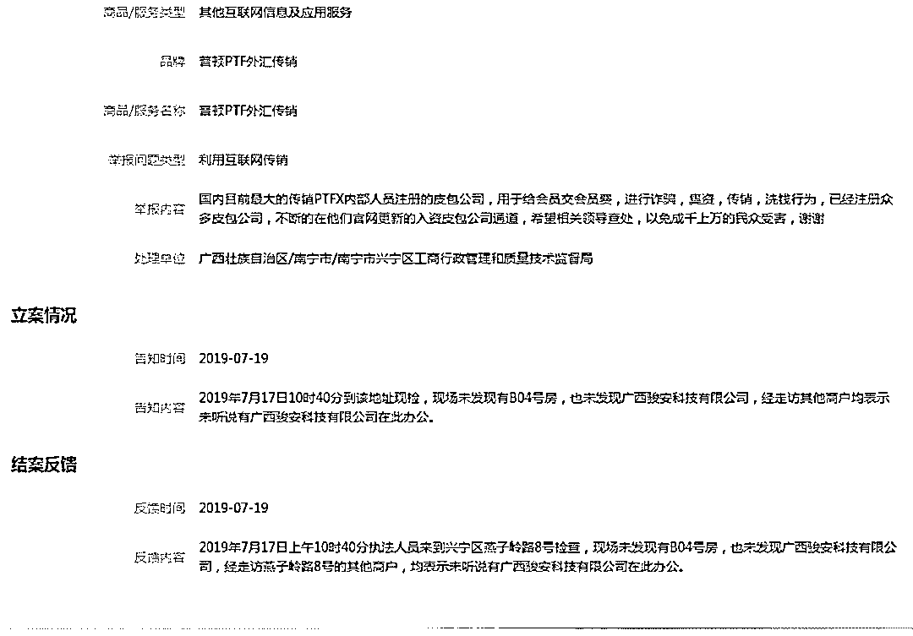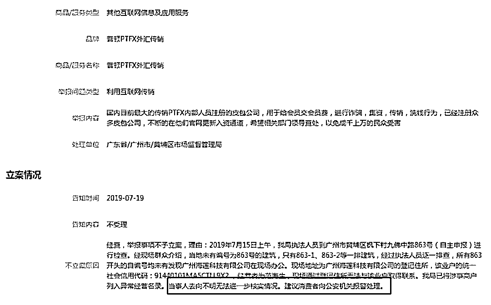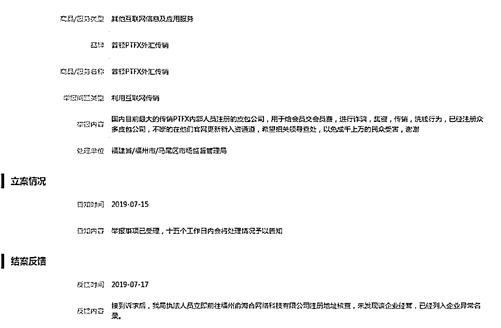

这些皮包公司，基本一举报一个准，因为都是用来收款的空壳。

这个已经是非常明确的证据和处置手段了。

打倒骗子，需要大家一起努力。

**09**

从相关法律法规，到资金盘特点，到传销关系链，到宣传谎言，到官方公告再到市场监督部门的反馈，PTFX 基本全身都是窟窿。

其他的网络外汇资金盘也是一样的情况，记住这一点，不要再问我哪家靠谱不靠谱了，都是骗子。

因为说穿了就 2 种情况，真的有外汇交易和纯借新还旧。

如果真的是做了外汇交易了，那么这么大的人民币外汇怎么出去的？

外汇管理局不是吃素的，打击违规货币兑换可是连人民银行都盯着的事情，欢迎直接举报。

如果没有做外汇交易，那确实不用被人民银行打击。

但这就等于是诈骗，公安和市场监督管理局非常想和他们聊聊，只要举报。

所以最终他们不是骗子，就是违法。

国家不允许的事情，一堆东南亚沙雕公司（背后也都是国内过去的）偷偷摸摸进来拉人做，还给正常人做不到的高收益，大家稍微动动脑子，也能觉得不对劲了。

即使抛开这些，单看他们群里的发言，也能发现不对吧。

例如这句发言，就透露出很多问题。

不让用 Wifi，经常被运营商封杀，这就是非常明确的非法了，运营商都不愿意为这些垃圾网站服务。

**网站里面带 Dashboard，Dashboard 是仪表盘的意思，作为一个这么牛逼的商业公司，为什么网址里面会有 Dashboard，这种东西是后台修改数据用的，正常情况下不对外暴露，这个链接带 Dashboard，基本代表了链接中的数据是可以被随时篡改的。**

一个做交易的外汇网站，可以随时被篡改数据，我想各位都知道这意味着什么吧。

当然我也知道，很多人其实是知道这件事情的，人家一开始就不相信外汇的鬼话。

他们就是赌，赌自己参与的早，赌资金盘没那么快崩盘，赌的就是后面那些人的钱被拿来填补自己，甚至赌的就是自己骗来更多人投，自己吃更多的提成。

这种人才是这种资金盘肆虐的最大原因，他们不傻，他们就是坏。

他们自己积极参与不说，还积极拼命去拉人下水，他们比反诈骗的人更努力，资金盘策划方都没他们这么积极，他们努力骗人，努力拉下线。

这些坏人，往往打着为你好的旗号在骗你。

他们嘴上的甜言蜜语，不是说给你的，是说给你的钱的。

最后我们再总结一下 PTFX 这个盘子。

1.玩儿的是国内政府不允许的业务，外汇管理局明确回复。

2.利益链超过 3 级，拉人头，且要求入金，符合传销定义。

3.主体在印尼，跨国执法难度大，且国内法律不保护做外汇资金盘的。

4.整体的资质背书都是造假，毫无可信度。

5.整套玩法流程和之前跑路的外汇盘没有区别，资金盘+传销，相关案例多不胜数。

6.跑路门槛低，受害者也没法去印尼讨债，人家当地监管不管这个。

7.被国内运营商限制，只能用各种手段绕过。

8.超高收益，超低参与门槛，比贩毒都暴利的收益率，是 6%安全线的 100 倍。

9.大笔资金出境，无法解释如何绕过监管，另外国内各种收款账户主体都是皮包公司，举报一家，工商打击一家。

这 9 条问题中的任何一条，出在任何一个投资产品上，都是可以直接拉黑的。

PTFX9 条全中，还有这么多参与，我只能说有钱和智商在线本身没有强相关性。

真正为你好的话，可能往往不太好听。

有时候不听劝，也是命不好的一种表现形式。

祝好运。

← 向右滑动与灰产圈互动交流 →

**阅读原文加入灰产圈高端社群**