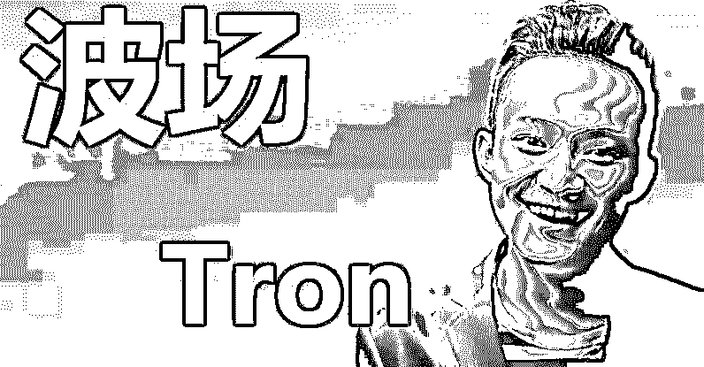
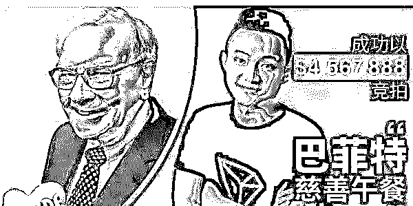
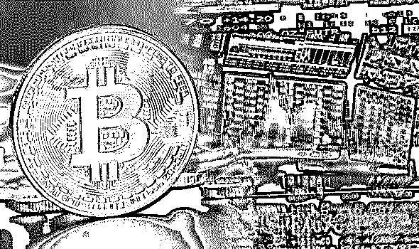
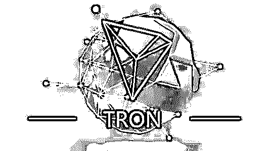
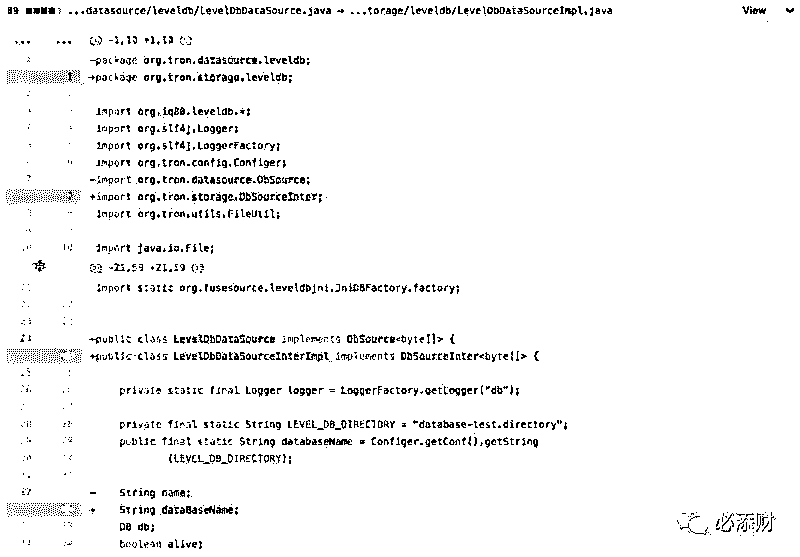
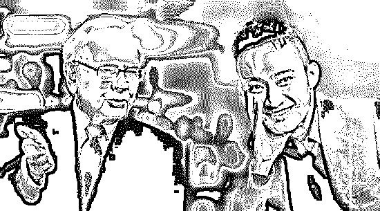
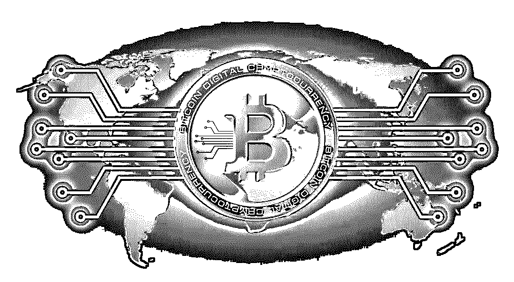

# 戏精孙宇晨：耍了巴菲特，利用了马云，怼了王小川

> 原文：[`mp.weixin.qq.com/s?__biz=MzIyMDYwMTk0Mw==&mid=2247495813&idx=1&sn=e61829a9c5e2a5822736af9d79c9277e&chksm=97cb3bbda0bcb2ab47b587bfa49909ed44c23a077596ccb81c258f091dfffddae64ed8b4d172&scene=27#wechat_redirect`](http://mp.weixin.qq.com/s?__biz=MzIyMDYwMTk0Mw==&mid=2247495813&idx=1&sn=e61829a9c5e2a5822736af9d79c9277e&chksm=97cb3bbda0bcb2ab47b587bfa49909ed44c23a077596ccb81c258f091dfffddae64ed8b4d172&scene=27#wechat_redirect)

**点击上方蓝色字体免费订阅“灰产圈”**

**孙宇晨“耍了”巴菲特。**

昨天早上，孙宇晨在微博表示，他因突发肾结石正于医院治疗，将取消与巴菲特的午餐会面。

消息一出，有人爆出一张孙宇晨与人的私聊截图，称自己取消巴菲特午餐并不妨碍自己割韭菜，对此孙宇晨回应燃财经，图片不属实，为 PS。同日中午，孙宇晨发布微博，澄清了非法集资、洗钱、陪我 App 以及波场协议等内容。

7 月 23 日晚，财新报道称孙宇晨已被边控（边境控制），互金整治办已经建议公安机关对其立案，孙宇晨今天凌晨在微博回应称，“财新网的报道完全不实，我一切平安，待病情恢复好转后，就会与外界见面。”同时，波场也在凌晨回复采访时表示：正如我们昨天宣布的，双方都同意将原本约定好的午餐会推迟。孙宇晨目前正在他位于旧金山的家中养病。

从开始的密集炒作，到怼王思聪、怼王小川，再到取消午餐，在过去的 53 天里，孙宇晨靠着标价 456 万美元的巴菲特午餐，疯狂刷屏炒作，成为全网热点。有人说他是戏精本精，有人说他是追风者、抄袭者、营销炒作高手、收割者......**随着午餐会搁浅，孙宇晨手中的筹码还剩多少？**

**孙宇晨从来都是一个充满争议的人，尤其在以 456.7888 万美元高价拍下巴菲特午餐后。**

孙宇晨自认为是带着“增进顶级传统投资人与数字货币的理解和友谊，让整个行业真正收益”的使命来与巴菲特共进午餐的，但外界更多的认为这是孙宇晨的又一场个人营销大秀，“本质还是拉高波场的价格”，起码在消息公布的一刻钟内，孙宇晨的波场币价就上涨了 6%。

6 月 4 日凌晨，当孙宇晨通过微博公开宣布自己拍下巴菲特午餐之后，有网友留言让他买个热搜。上午 9 点，孙宇晨公开回应：真微博热搜，并配上该消息登上热搜的截图。

他并不排斥以这样的方式站在舆论场中心，在被王小川认为是骗子之后，他也在微博回应，单方立下三年之后看波场与搜狗的市值谁高谁低的赌约，并附上 300 个比特币的赌注。

在公开场合云淡风轻又颇带戏谑的方式回应一切，孙宇晨赚足了人们的眼球，而比这些更有看点的是孙宇晨的多面人生。

孙宇晨身上有多重标签——北京大学历史系学士，GPA 排名第一；美国宾夕法尼亚大学硕士；锐波科技创始人、董事长兼 CEO；中国 90 后创业者领军人物；世界经济论坛（达沃斯论坛）全球杰出青年；福布斯 2015 年中国 30 位 30 岁以下创业者；马云创办的湖畔大学首批学员中唯一 90 后学员……

当然，这更多的是被包装出来的硬币的一面。硬币的另一面，这位身价百亿的年轻人更像是追风者、抄袭者、营销炒作高手、收割者......有意思的是，他将每一个身份都演绎都淋漓尽致，恰如当初一位投资人对他的评价——一个成功的创业演员。

01 要做第一的追风者

孙宇晨似乎对所有的事情都只有三分钟热度。

上个世纪 90 年代演讲热兴起，刚上小学他就被母亲带去各种传销班听课；围棋热兴起，小学三年级只身一人到武汉学围棋；中学时，“.com 时代”来临，他又投身于计算机奥林匹克竞赛；读大学时，孙宇晨从中文系转到了历史系；2010 年前后，微博崛起，公知火热，孙宇晨模仿胡适开设《每周评论》，大声疾呼救中国......

但这些都只是表面现象。**孙宇晨面对所有事情都只有三分钟热度的背后是他从小就践行的人生信条——一定要当第一，如果在一个领域当不了第一，马上换下一个。**

中学之前频繁换兴趣是因为他浅尝后发现自己做得都不够好，大学转专业是因为历史系容易获得高分（本科毕业他的绩点在历史系排名第一），当公知写评论则是为了出名。

美国留学回来之后，孙宇晨搭上了创业的大潮，并给自己贴上了 90 后创业领袖的标签。2013 年，孙宇晨以 Ripple Labs 大中华区首席代表的身份回国创业。同年比特币迎来了一个小牛市，这一年的比特币从年初的 13 美元一路飙升至 1147 美元，但好景不长，比特币马上开启了长达 2 年多的熊市。

币圈不行了，该如何固化自己“90 后创业领袖”的标签呢？孙宇晨迎来了新的风口——陌生人社交。于是，已经完成原始积累的孙宇晨买下了"陪我"——一款主打匿名聊天匹配与收费语音通讯的陌生人社交 APP。

**当然，陪我只是权宜之计。比特币才是真正让孙宇晨念念不忘的。**一位和孙宇晨早期有过接触的人告诉燃财经，当初和孙宇晨见面，对方满口谈得都是比特币。

2015 年到 2016 年间，比特币熊市，孙宇晨始终以 90 后社交 APP 创始人的身份活跃于互联网创业舞台之上，这一时期几乎已经不在有人提起他“Ripple Labs 大中华区首席代表”这一身份，Ripple 逐渐在孙宇晨的生活中淡去。

直到 2017 年 7 月，区块链大热，孙宇晨创建区块链项目“波场 TRON”，他才再次以一个区块链从业者的身份出现在众人眼中。借助波场，如今孙宇晨已经成为身价 300 亿的币圈新贵。

**不停更换风口背后是极度渴望被关注的心态。**读书的时候，“第一”的排名能给他带来关注，他便专注于自己能当第一的领域；南方周末实习时，过激的言论能给他带来关注，他的文风便是过激的；毕业后，90 后创业者的标签能让他获得更多曝光，他便不断更换风口赛道，固化自己的创业者标签。

这背后是一段并不快乐的童年。父母经常在他面前指责对方的不是，父亲不停殴打母亲，离婚后，母亲远嫁意大利，父亲仕途受阻，导致小学三年级以后，他就没有体验过家的滋味了，他去哪里，家就在哪里，“一个人就是一个家”。

**关注能带来安全感，“名气对别人来说可能是锦上添花，对他来说变成了必需品”。而为了获得足够的安全感，孙宇晨也走了一些“捷径”。**

02“越挫越勇”的抄袭者

孙宇晨被认为是抄袭者。

2018 年 3 月，波场测试网上线，为了给波场造势，他将目光瞄向了公链老大哥以太坊。在 Twitter 上，孙宇晨列举了 7 条波场优于以太坊的理由，其中包括 TPS、手续费、底层语言等等。

V 神（以太坊创始人 Vitalik）立刻回怼，称在这 7 条之上，应该加上第 8 条：“更强的白皮书书写能力（Ctrl+C 和 Ctrl+V 比键盘键入新内容有更高的效率）”，讽刺波场白皮书存在抄袭行为。

但孙宇晨拒不承认抄袭。他表示“波场白皮书没有抄袭，其最初版本的白皮书是中文的，英语、韩语、日语和西班牙语版本是志愿者翻译的，所以“我们不能为英文版本的失误负抄袭的责任”。

他甚至坦言，**“商业社会中，老问抄袭这个事情，没有任何意义。****币圈代码都是开源的，大家都是互相借鉴，以太坊也借鉴了很多比特币的内容”，“在币圈里面 idea 和白皮书本身价值并不大的，核心还是把它做出来，以及在商业层面把它做好。”**

2018 年 6 月 22 日，数字资产研究公司(DAR)的研究人员在波场 Tron codebase 中发现了多个从其他项目复制的代码实例，并表示似乎 Tron 开发者在其他项目中剽窃了以太坊的代码，并且修改了文件名，使得代码的来源难以识别。即便有了实锤，孙宇晨依然矢口否认，而这些都为波场和孙宇晨带来极高的曝光度。

 

DAR 给出的问题代码

事实上，这已经不是孙宇晨的第一次复制粘贴了。波场前 COO 刘明在一次公开直播中表示，读宾夕法尼亚大学期间，孙宇晨曾与朋友一起创办《新新青年》。2011 年 10 月 11 日创刊号发表了孙宇晨的文章，后被普林斯顿大学沈诞琦指认抄袭。事发后，《新新青年》编委会整体认为抄袭属实，向沈诞琦致歉。

但孙宇晨本人则在失联数日后在人人网上发表长篇声明《我的最终回应》，否认抄袭，称两文只是风格相似，但这并未起到他期望的效果，关于抄袭的批判连绵多日。

**两次被指抄袭之后，孙宇晨的反应截然不同。**第一次抄袭事件后，“留学生孙宇晨陷‘抄袭门’ 曾为《亚洲周刊》封面人物”的标题见诸报端，孙宇晨称那一次自己被彻底打蒙了，失联数日之后才发声。而第二次，孙宇晨则“越挫越勇”，当天给出了一个“漂亮”的回击，拒不承认抄袭，并公开接受采访，大谈商业社会谈抄袭无意义，执行力才是最重要的。

不过，好在这两次抄袭事件之后，孙宇晨的知名度都得到了提高，也算是有得有失。

03“天生”的炒作高手

更有意思的是，孙宇晨能巧妙地借负面新闻为自己造势。

当 V 神质疑波场抄袭其代码时，孙宇晨在微博回应称：感谢 Vitalik 对于波场的评论，波场从以太坊受益良多，以太坊也激励我们能够发展出更好的平台。

另一方面，他则巧妙地抛出了波场上线的时间。他在微博写到：如果 Vitalik 更了解波场的话，会发现我们已经不仅仅是白皮书阶段，我们已经在 3 月 31 日上线了测试网（主网 5 月 31 日），扎扎实实在以太坊不足之处做了长足的改进！

**不仅如此，孙宇晨几乎抓住了一切蹭热点的机会。**

2015 年，孙宇晨入选马云创办的创业者培训营“湖畔大学”，是其中唯一的 90 后。刚一入选，“马云最年轻的门徒”就出现在他的百度百科词条里。

孙宇晨也喜欢以**“马云门徒”**自称，他甚至坦言自己与马云“相见恨晚”。据报道，如果哪篇合作稿没用这个称呼，孙宇晨就觉得对他“定位不准确”，要改一改。

**不过后来，孙宇晨自己主动撕掉了这个标签，原因是阿里巴巴向他提出了警告。**但这种警告并没有洗清过去所有的痕迹，如今网络上到处是“马云门徒孙宇晨”等字样。

去年小黄车深陷押金退还危机，和戴威同为北大校友的孙宇晨站出来称可以先帮一万个 ofo 用户把押金退了，当天波场市值涨幅 10%。今年 2 月，热心人士赵宇从犯罪嫌疑人手里解救女孩反被拘留 14 天后，在微博阐述遭遇，孙宇晨第二天便在微博宣布将为赵宇提供一千万的捐助。这条微博，转发 6 万＋，评论 6000＋，点赞 20 万＋。孙宇晨的热度是整个币圈 KOL 之最，堪比一个小流量明星。

**如今，孙宇晨以 3000 多万人民币拍下巴菲特午餐，被认为是一场绝佳的自我宣传机会，而从消息一出开始，孙宇晨的做法堪称经典：**

6 月 1 日 10 时 30 分，午餐拍卖结束。6 月 2 日孙宇晨在微博写道：干了件大事，三天后宣布。6 月 2 日当天，孙宇晨拍下巴菲特午餐的消息不胫而走，孙宇晨却在微博写下“让子弹飞一会儿”。燃财经多次向孙宇晨求证传言是否属实，他发来的是表情和“你猜”。经过预热之后，6 月 4 日凌晨，孙宇晨才在微博公布了这一消息，几个小时后便登上了微博热搜。

面对外界对自己精心炒作的质疑，孙宇晨早有回应。**他解释称，“我们这种初创公司，说白了还是太 low 嘛。只能靠老板狂出台，狂做 PR，才能吸引投资者注意，不然靠什么跟大公司们拼？3 个月没动静，就被干死了。PR 在我们这儿就是跳动的心脏，时不时就得蹦跶一下，不蹦就死了。吃相是很难看，但是没办法。”**

抓住一切能蹭的热点，时时刻刻在借力打力，如今孙宇晨的微博粉丝已有 113 万，Twitter 上粉丝有 40 多万，Facebook 粉丝也超过 30 万，孙宇晨显然已经成了一个不小的 KOL，一手是百万粉丝，一手是百亿身价。

04 极致聪明的收割者

孙宇晨的财富自由之路是如何实现的呢？

赴美留学期间，他先是和一群留学生注册公司，制作视频节目《留美三人行》，收益寥寥，抽身而出。申请数十家金融机构实习，悉数落选。屡次碰壁后，他将原本一年的硕士项目延期一年，备考法学院，寄望成为律师，迈入华尔街。

也是在这个时候，孙宇晨抱着“看能否认识一些美国有钱人，借我点儿钱”的心态，加入宾大投资协会，随后便敏锐地置身于新的风口，先买特斯拉的股票，后炒比特币，声称收益达七八十倍。

**他尤其喜欢离钱近的行业，比特币如此，回国做陪我也是如此。**在陪我中，女方可以选择通话收费，可以设置每分钟多少钱，打出的概念是边赚钱边聊天。

当然，这些都是前菜。让孙宇晨真正名声大噪的还是波场。该项目由薛蛮子和李丰站台，白皮书漏洞百出，但从 2017 年 12 月中旬开始到 2018 年 1 月 5 日，短短半个月的时间，通过几次拉升，就把波场币的价格从一两分钱拉升到了 2 块钱，暴涨 100-200 倍。

有报道称，1 月 5 日当天，孙宇晨抛售了 60 亿个波场币，套现 3 亿美元，约合 20 亿元人民币，次日，价格暴跌 20%。

波场 COO 刘明还讲了一个“80%真实性”的传闻：孙宇晨用多名波场员工的身份在币安交易平台开办账户，将掌握的波场币充入账户卖掉套现。其中一名波场员工发现自己在币安有价值几百万人民币的数字货币，就用身份证重置密码去提币，“这个事情闹出很大的风波。”

孙宇晨公开声明，自己从未将波场币套现。刘明则认为，孙宇晨的表演欲望和表演能力都非常强，“一些他自己都不信、或者谁都知道是假的话，他说起来面不改色！”

据早期信息可知，TRX 发行总量为 1000 亿枚，其中公开发售 40%、TRON Foundation 基金会与生态系统持有 35%，私募发售 15%，陪我欢乐（北京）科技有限公司持有 10%。而陪我欢乐（北京）科技有限公司由孙宇晨个人持股 99.99%，孙宇晨则是 TRON Foundation 基金会的实际控制人，也就是说孙宇晨至少掌握着 45%TRX 总量的支配权，共计 450 亿枚。

没人知道孙宇晨有没有套现，但据公开资料显示，波场成立不到 10 个月，孙宇晨就宣称身价已上百亿。

孙宇晨从来不掩饰自己对金钱的渴望，他甚至在演讲中高调喊出“我衡量一个人的标准就是看他赚了多少钱”。他喜欢离钱近的生意，足够大胆，足够聪明，目标也足够明确。比如，高二时成绩只有 459 分的他经过一年努力便以 650 分考上了北大。

读书时求第一，毕业后求名利，他似乎从来没有被打趴下过。他自认为自己是和王兴比较接近的人，是战将。

**他通过多年的积累获得了名和利，但眼下名和利依旧让他不安。**他在接受采访时表示，成绩、财富、名气、荣誉其实某种程度上都是过眼云烟，这些是别人或者世界给你的承认或者一种认可，但这种认可都是有保质期的，所以即便一个明星表现非常好了，但是可能有几年稍微缺乏一些作为，就会说他过气，原因很简单，就是因为这个时代别人给你的认可永远是有保质期的。

毕淑敏在《在不安的世界里，给自己安全感》这本书里曾经写道：世界的不安宁是个常态，如何在这个不安的世界里，寻找属于自己的安全感，是每个人人生的必修课。

**孙宇晨获取安全感的方式便是“不停地去拥抱这个时代，某种程度上用英文讲就是要有 deliver”。**这就可以解释为什么他一直在追风口，哪里容易出成绩就去哪里。

而为了保住这份名利，身价百亿的他还得继续努力，不放过任何一个机会。

作者| 王琳

编辑| 阿伦

来源| 燃财经

菲凡烽火台

****

← 向右滑动与灰产圈互动交流 →

**阅读原文加入灰产圈高端社群**