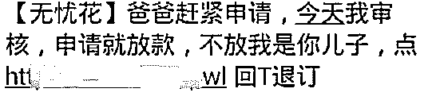
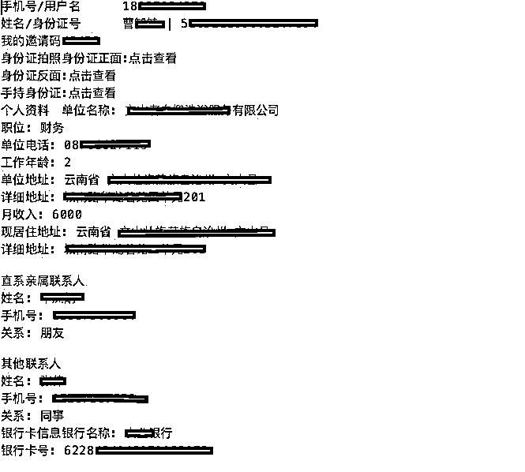

# 数亿条借贷用户数据在地下疯狂交易，被清洗数百次

> 原文：[`mp.weixin.qq.com/s?__biz=MzIyMDYwMTk0Mw==&mid=2247495806&idx=1&sn=c14dfc87fe24c3d6080722c253496573&chksm=97cb3b46a0bcb250d6a44463ae4d1fff97341b51069b7f5dc9418d71fcadf396ad9cd712acf9&scene=27#wechat_redirect`](http://mp.weixin.qq.com/s?__biz=MzIyMDYwMTk0Mw==&mid=2247495806&idx=1&sn=c14dfc87fe24c3d6080722c253496573&chksm=97cb3b46a0bcb250d6a44463ae4d1fff97341b51069b7f5dc9418d71fcadf396ad9cd712acf9&scene=27#wechat_redirect)

**点击上方蓝色字体免费订阅“灰产圈”**

最近，地下超利贷的数据买卖市场极度疯狂。

许多超利贷用户的借贷数据，在系统商、流量代理、甲方、黑客、短信渠道商之间反复流动。

后者拿到数据之后，就会给这些用户发短信，或者打电话营销。

这些数据量之大，超乎人们想象。

“现在一家系统商在地下流通的数据就上亿，整个地下市场至少有数亿条数据在流通。”多位业内人士均证实了这一说法。

这些数据的清洗速度惊人，很多数据甚至被清洗了几百次，用户正在加速“坏死”。

一位流量代理通过买数据导流，“月入 200 万”。

反复清洗的数亿条数据，正在成为地下超利贷的黑色土壤和肥沃养料……

01 **疯狂的料**

华灯初上，各家超利贷平台的员工，基本忙完一天的放款指标，开始进入休息状态。

而各大超利贷交流群开始骚动起来：

“群主出一手实时，隔夜，周，历史，跑 AS 可选地区和运营商。价格美丽！”

为了吸引买家，有些广告直接拿出数据说话：

“支持实时半价测试，接通率 70/80%，添加率 10/20%。”“下款 30%，回款 95%。”

****卖家们疯狂叫卖的所谓的“料”，到底是什么？****

****它们都是底层人群的超利贷借贷数据，维度包括这些人的姓名、身份证、银行卡、借款金额等隐私。****

****这些料主要用来做什么？获客。****

在今年“3·15”晚会曝光 714 高炮之后，很多头部贷超不敢再给超利贷导流，新的流量和用户无法再进来。

行业想到的自救办法，就是买卖借贷用户的数据，再来获客。

借超利贷的老哥们共债情况非常严重，一位老哥同时借 30 到 50 家平台，是常有的事。

所以，一旦知道某位老哥借了超利贷，马上给他发短信或者打电话，让他来自己平台借款，是一个非常有效的获客方式。

通常来说，越鲜活的料，转化率越高。

按照效果好坏排序的话，实时的料比隔夜的好，隔夜的比一周的好。而一个月之前的料，基本就失效了。

****“一些平台的实时数据，转化率可以达到 5%以上，隔夜的可能是 3%，周放款数据可能只有 1%。”一家超利贷平台的负责人孙允夏透露。****

超利贷用户的生命周期极短，有可能在短短数周内，一个用户就彻底“坏死”了。

****料的价格，根据其好坏，有很大差距，从 8 分到 8 元不等。****

但通常情况下，流落在这些社群、被公开叫卖的数据，都不是好料。有很多是以次充好的假数据或假料，料商中有很多骗子，专门“黑吃黑”。

****“一手的料，都是朋友之间自行消化，市场上的料很多都是被洗过很多手的残料。”孙允夏直言不讳，称自己从朋友的超利贷平台直接买料，“已经拿了十几万条数据了”。****

现在，他的平台每个月放款上千万，“一个月能赚 300 万左右”。

****其实，直接买料的甲方并不多，大部分时候，都是流量代理在“批发”。****

流量代理张彦森透露，自己也是买料获客，然后再导给各个超利贷平台。

这么操作，流量的转化率更高，因为一个老哥进来，可能不止借一个平台，甚至不止借十几个平台。

况且，被 A 平台拒绝的用户，可能在 B 平台就能过，老哥们的价值可以被榨取殆尽。

这样的批发方式，让变现效果翻倍。

****张彦森称，自己一般买的料都是 2-4 元一条，每月购买 20-50 万条，“花个几十到一百多万，一个月就能赚到 200 万元”。****

****目前，有多少超利贷的料在市场上流通？****

****多位业内人士坦言，至少有数亿条数据，甚至更多。****

当然，这些数据会有重复，因为一个老哥会同时借很多平台，每借一次，就会产生一条数据。

“我了解到，有家头部贷超在高炮市场上流通的交易数据，已经达到了上亿级别。”孙允夏就曾看到人公开叫卖这个数据包。

****数亿条数据在地下市场疯狂滚动，被不断清洗，一些数据甚至被洗了几百手，直接洗成残渣。****

而老哥们甚至他们身边的联系人，都在遭遇疯狂的短信轰炸。

“爸爸赶紧申请，今天我审核，申请就放款，不放我是你儿子。”

02 **玩家集结**

目前，超利贷市场的料商，主要分为五类。

****第一类是超利贷系统商。****

****某系统商销售人员称，他们只卖姓名、电话、身份证号三要素，“每条 6 元，每天提供几千条实时放款数据”。****

业内人士普遍认为，系统商是一个“料子集中池”。

因为很多系统都是云端部署，各个平台上的借款数据，都会汇总到系统商这里。

此外，就算是独立部署在本地电脑上的系统，“很多系统商也会留后门，监控他们的数据”，业内人士陆易安称。

****去年 11 月，最大的系统商有脉金控被警方调查，也是因为数据问题。****

因此，在今年，系统商卖料都非常保守。

“都是偷偷指派一个小弟在外面卖，而且卖的时候只给你电话号码，姓名和身份证都不提供。”陆易安称。

****因为短信营销，只要有电话号码就够了。****

****第二类是贷超机构。****

****它们会将自己没有转化的用户，再次卖出去，以此削减获客成本。****

****第三类是超利贷平台。****

行业通常认为，一个客户的生命周期是 4 期，也就是说，一个用户在一个平台上复贷 4 次左右，可能就不再借了。

所以一些平台在给用户放 3 期款后，就把这些数据直接卖了，让别的平台去接盘。

****第四类是黑客。****

****这类玩家是最新加入的，他们盯上了这片黑暗江湖，开始寻找漏洞渗透。****

他们入侵各个超利贷平台，拖走数据库里最鲜活的、刚刚放款的用户数据，并在市场上抛售。

“我们已入侵了几十家平台，拖出几百万数据来卖了，而且可以反复卖。”一位黑客透露。

****第五类玩家，通常大家都想不到，就是短信渠道商。****

“没有谁手上的数据比短信渠道上的更多，各个平台涌过来的数据，都会在这里汇总。”陆易安称。

他曾经在一个短信渠道商那里买过数据。“对方把各个平台过来的数据去重，还进行了分类，告诉我被洗过 20 次的，就是差用户，才洗过 1 次的，就是好用户，两者价格差了 10 倍。”

****陆易安估算，这家短信渠道商大概有上亿条数据，去重后，还有数百万位用户的数据。****

****这群卖料者，赚的都是快钱。****

帮系统商卖料的一位小弟透露：“一个月卖了上千万条数据，一条 4 元，就是 4000 多。”

****多位行业内人士称，目前，市场上的超利贷卖料商已超过上万人。****

****甚至有很多数据是多维度出售。****

一个被出售的用户数据条

因为毫无技术含量，他们觉得自己比超利贷平台放贷更赚钱。

“超利贷市场波动性很大，还要风控，还要担心逾期。我们就是送水的，无论市场好坏，都是净赚。”该小弟称。

03 **交易谨慎**

国家网络安全法规定，交易 50 条以上的用户隐私数据，即可获刑。

****因此，数据买卖双方都在“提着脑袋”做交易，极为谨慎。****

******在社群里，他们从来不提“数据”一词，全部用“料”代替。******

**交易时，如果提到“数据”，对方会要求马上撤回，甚至终止交易。**

**料商小 P 透露，他最常用的交易方式，就是邮箱和百度云盘。**

**首先，将数据上传至邮箱草稿，但不发送。然后，将账号和密码发给买料者。**

**“我怕被查，在申请邮箱的时候，还会改一下 IP 地址。”小 P 称。**

**此后，买料者可以登录邮箱，从草稿箱下载数据。**

**而另外一些买料者的手段，更加高明。**

**他们直接在短信运营商那里开一个账号，然后将账号与密码分享给料商。**

**“付款后，我会直接将电话号码导入运营商账号，然后发送短信。”料商周彦称，买料者根本碰不到数据。**

**这样操作，买料者可控性低，所以数据更便宜。**

**“我手上也有三要素，可以卖出更好的价格，但现在风险高，要谨慎。”周彦表示。**

**当然，也有人更相信线下交易的安全性。**

**陆易安介绍，一些料商会将数据资料导入硬盘，一手交钱，一手交货。**

******因为超利贷市场的料子交易如此疯狂，行业的清洗速度极快。******

**“以前，一个用户的生命周期可以达到 3 个月，现在基本 3 周就死了。”陆易安称，如果一个新用户开始借款，两三天之内，就会有几十条营销短信发过来。**

**用户的生命周期缩短之后，行业的生命周期也在缩短。**

**“最近 3 个月，整个行业已经经历了两次逾期潮，也就是说，行业一个半月就是一个周期。”陆易安称。**

******市场过于疯狂之后，就不再是谁都可以来捞金的了。******

**在过去的两个行业周期中，绝大部分的超利贷平台并不赚钱，它们才是被收割的一方。**

**但铁打的营盘，流水的甲方。洗完一批甲方，又有一批新的甲方站了起来。**

****

**底层用户的数据，在地下市场肆无忌惮地流动。**

**这些料子，变成了超利贷这个疯狂市场的养料和土壤。**

**只是，这些用户正在加速死亡。当他们被榨取殆尽，连最后一滴血都被吸干之后，这个行业，是否还会存在？**

***文中部分受访者为化名。**

****

****

****

********

**← 向右滑动与灰产圈互动交流 →**

****

********阅读原文加入灰产圈高端社群****