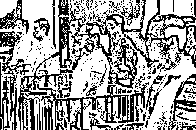

# 传销忽悠人！看中国式传销发展史，是怎样演变成骗局的？

> 原文：[`mp.weixin.qq.com/s?__biz=MzIyMDYwMTk0Mw==&mid=2247495754&idx=1&sn=9027c631c541b5b922a1bf6184b801fb&chksm=97cb3b72a0bcb26474bf05780c591208b45e5ad9cb1ef6e8c8d142383e819a987a6e32b850bb&scene=27#wechat_redirect`](http://mp.weixin.qq.com/s?__biz=MzIyMDYwMTk0Mw==&mid=2247495754&idx=1&sn=9027c631c541b5b922a1bf6184b801fb&chksm=97cb3b72a0bcb26474bf05780c591208b45e5ad9cb1ef6e8c8d142383e819a987a6e32b850bb&scene=27#wechat_redirect)

**点击上方蓝色字体免费订阅“灰产圈”**

**传销是指组织者发展人员，通过对被发展人员以其直接或者间接发展的人员数量或者业绩为依据计算和给付报酬，或者要求被发展人员以缴纳一定费用为条件取得加入资格等方式获得财富的违法行为。**

传销在不同的地区有着不同的含义。在香港和台湾，它是合法直销；在中国大陆，传销是多层次直销和层压式推销的合称，属于一种经济犯罪行为。

传销起源于美国，发展于日本。在国外这是一种比较常见的销售方式，并非空手套白狼的伎俩，也不会比别的销售方式带来更多的发财机会。然而，到了中国，却被渲染为**“21 世纪最后一次暴富的机会”。**

传销组织洗脑上课

中国式传销是虚假的公司，虚构的产品，什么都是空的，就只是让你拉人头，从入会费或者加盟费中提取少量提成。或者控制人身自由，没收财物，让你无法与外界联系，天天学习那些传销培训教材，让你学会怎么骗人，然后列名单、电话或书信邀约、摊牌、跟进、直至以各种方式交齐入会费或者加盟费。

中国是个人情社会，在传销的盅惑下，人情就成了发财优势，完全忽视产品的质量和市场需求，通过人情发展下线赚钱，变得完全失去经济常识。

其实传销并不是一个简单的营销模式，在进入中国 20 多年以来，传销曾经被推上神坛奉为商业神话，也曾被视为过街老鼠，人人喊打。然而，传销就像被打开的潘多拉的盒子一样，不断在通过自我升级来适应这个多变的时代。

打着直销幌子的传销

1**“法无禁止”的灰色地带**

二战结束后，百废待兴，美国的家庭主妇们主动分担家庭压力，兴起一种边消费边赚钱的新型商业模式----传销，它以顾客使用产品产生的口碑作为动力，让顾客来帮助经销商来宣传产品后分享一部分利润。随后，传销逐渐风靡日本、台湾，而在中国大陆更被冠以“二十世纪商业新模式”被捧上神坛。

1990 年，雅芳作为第一家正式以“直销”申请注册的公司进入中国，而仅仅 3 年的时间，几乎所有省会城市、沿海大中城市都有传销活动。而部分传销逐渐脱离销售商品这一初衷，从商品分享变成了赤裸裸的骗钱行为，上线成员以其直接或者间接发展的下线成员数量或者业绩为依据，计算和给付报酬，其模式极富煽动性和欺骗性。

雅芳被查

在“雅芳”案例中，一瓶定价只有十几元的护肤品经过传销人层层转手，最后交易价格竟然高达 1000 多元。大多数传销组织像“老鼠会”式的大肆炒作，以暴利为诱饵，用新拉来人的入会费补给老会员，整个体系像倒金字塔畸形发展。

传销的粗暴生长引起了各种纠纷，媒体不断曝光，政府有关部门也开始关注传销行业的发展动态。

这期间大多数传销人员是被亲戚、朋友或同学以介绍工作为手段欺骗入行的，并且人身自由被控制，通讯工具和身份证被扣；传销团伙要求新来者以各种谎言动员亲朋好友急速汇款，新来者想摆脱或者退出几无可能，由此导致的纠纷、斗殴、伤害案件层出不穷，社会治安一片混乱。

此时当老会员越来越多，而新入会的人越来越少，造血机制几近枯竭的时候，庞大的营销网络即面临崩盘危险，到了了非整顿不可的地步。

杀熟

1994 年，上海、深圳、广州等地行政管理部门开始组织人员，草拟有关管理办法。1994 年 8 月 11 日国家工商管理局发出 233 号《关于制止多层次传销活动违法行为的通告》，9 月 2 日再次发出 240 号《关于查处多层次传销活动中违法行为的通知》，至此传销在中国进入第一个平静期。之后从 1995 年开始直至 1998 年，传销开始进入狂热期。

1998 年 4 月，国务院正式颁布了《关于禁止传销活动的通知》。至此，中国大陆的传销迎来了分水岭，合法的直销和非法的传销从此走上了阳光大道和独木桥，而传销也悄然进入有实物的洗脑时代。

2**有实物的洗脑传销**

2004 年，让 2000 多名大学生身陷传销泥潭的“欧丽曼”事件轰动一时。当时在重庆渝北县的小房子里，云集了来自河北、湖北、云南多个省的高校学生，这些大学生以大三、大四居多，大多数来自农村贫困家庭，单纯又急于在社会上获得成功。

而给他们讲课的“专家教授”用一个发财致富的秘诀激励着他们，让他们陷入毫无意识的集体亢奋中。

欧丽曼事件

发财致富的方法很简单：每个人先交纳 3350 元的入会费购买“欧丽曼”的产品成为会员，以后每介绍来一个新会员，公司都有奖金作为提成。每个级别的负责人也会按不同比例提取新会员的人头费。

当作到总代理以后，就成了百万富翁。而每个人都不是一个人在战斗，他们有一个家支撑他们的成功梦。

一个“家”有 7 个人组成，1 名“家长”、1 名“主任”、1 名“制理”和 5 名“家庭成员”组成。“家长”最大，主任打理日常事务。“制理”的工作责任很大，相当于随军牧师，负责用思想手段控制成员。奖励机制实行“五级三奖”制。“五级”指信誉顾客、家长、主任、经理、总代理（超级总代理）。

“三奖”是指分配方案。以“经理”为例，第一级是“直接奖”,每发展 1 名直接下线，提成 43%;第二级是“间接奖”,自己的下线再发展 1 名下线，他提成 12%;第三级是“育成奖”,自己下线的下线再发展 1 名下线，他提成 2%.“家长”、“主任”的提成比例比“经理”低很多。

欧丽曼传销组织结构

而令人讽刺的是，激发这些大学生发财梦，不能自拔的幕后总代理，居然是河南省一个普通农民秦永军。被捕后，据秦交代，他们冒充西安某学院学生，骗取大学生信任，再通过讲课、培训等方式，让这些学生深信传销能赚大钱，随后让那些学生根据大学生的心理需求，设置讲课内容，发展下线。

这一时期培训讲课内容基本上是结合社会实际和培训主讲者个人经历，分析影响成功的因素——环境、观念及人的胆量。

主讲者、会结合经济转型时期个体户、股票暴发户等等相关典型成功案例，突出成就的特征，向听者灌输速成、暴富理论，强调成功要从现在做起、从身边的小事做起，看准目标、不考虑事情，调动听众激情，之后转入呼喊口号等议程。

洗脑上课

不难发现这个时期传销的典型特征是有实物，看得见，摸得着，但价格虚高。比如深圳生产的“爽安康”牌摇摆机，出厂价 260 元，传到福建 4000 元，而传到新疆就高达 8000 元，价格与价值严重背离。

商业模式也背离了销售商品的宗旨，靠的是人传人，发展下线所获得的高额报酬，并且在巨大利益的驱使下，大量假冒伪劣、三无产品出现。

欧丽曼”传销事件主犯受审

从 1998 年到 2005 年，改革开放刚走过二十年，民众思想已经解放，商品经济深入人心，而经济知识却相对匮乏，容易被新概念、新商品所迷惑，强烈的好奇心也孕育了大批传销组织。总体而言，这一时期的传销手法比较传统，有实物，靠的是“人身禁锢+包装实物”,随着政府打传的深入，有实物传销时期相对短暂，很快就演变为依靠资本动作的版本。

3**依靠资本运作的传销**

2008 年到 2010 年，一个名为“1040 阳光工程”流传至今，这个轰动一时的传销案让广西北海闻名全国。当时绝大多数外地人来到这个海边城市的原因都是一个名叫 1040 工程的资本运作项目。

1040 工程，简单说，就是入伙时先交 69800 元，购买 21 份、每份 3800 元的份额，入伙次月，“组织”会退 19000 元，实际出资额即为 50800 元。之后需要发展 3 个下线，3 个下线再分别发展 3 个下线，当发展到 29 人的时候，即可晋升为老总，开始每月拿“工资”,直到拿满 1040 万元，就从“组织”里出局，完成“资本运作”。

北海“1040”阳光工程

来北海做资本运作的这些人中，有一对贵州亲兄弟在北海市北部湾广场因钱财分配产生矛盾，持尖刀斗殴，弟弟被哥哥刺死，哥哥被判有期徒刑 12 年。他们中还有放弃了在家乡经营的汽车用品店，先后投入了 30 多万却收效寥寥，不知是进是退的受骗者。

2005 年以后，人们的物质生活得到了极大丰富，仅仅依靠几件实物就开展传销的成功率越来越低。

从 1040 阳光工程，我们可以发现这种传销并无实物，纯玩概念，擅于偷换概念，把传销项目上升到“国家控盘”、“政府扶持”的层面。常用的话术是“项目实际是由中央操盘，在地方政府布局，暗中实施的一个国家秘密政策”、“国家领导人秘密提出允许存在，限制发展，严格管理，低调宣传”,单靠一张嘴干传销，连实物都省了。

1040 阳光工程单独洗脑

辅助这一概念的另一重要要素是精神控制，即用洗脑的精神控制取代传统的人身禁锢。“是的，是我把你骗来的，可这是善意的欺骗”,这是很多人刚加入传销时听到最多的一句话，接着从“犯不犯法”、“中央默许”、“高额回报”等角度，进行单独式、轮换窝点式轮番洗脑，再配以完善的家庭关爱、潜力激发，短短 7 天就可以让一个正常人感受到人生的希望，而且这种上升为“国家战略”的谎言，也让全国各地很多成功人士、优秀人才被掳获。

杭州余杭"1040 阳光工程"传销案开庭 ，涉案金额 3000 万

反过来，这些成功人士又成了传销组织者迷惑其他人群的有力论据。由此可见，这种传销方式的进步在于从实物演化为概念，脱离了依靠实物的低级玩法，进入到概念包装的崭新时代，精神鸦片相对于实物传销是更胜一筹。

4**消费人情的网络传销**

互联网时代，传销的门槛降的更低。用户只需要有人推荐，微博、微信等免费的社交软件成为传销的生存空间。然而从类型来看，目前网络传销主要包括三种：**第一种是传统传销的“网络版”,借助互联网推销实物产品，发展下线。**但这种模式过分明目张胆，已经被逐渐抛弃。

互联网传销

**第二种是靠发展下线会员增加广告点击率来给予佣金回报，通过网络浏览付费广告获得积分，并由单一的点击广告发展为点击广告、收发 email、在线注册等多种方式并存。**

这种在线注册多为免费的，在我国发现不多，但对维护网络个人信息安全、免受垃圾邮件骚扰造成极大威胁。

**第三种：执法部门目前发现最多、查处最多的，是所谓的多层次信息网络营销模式。**以近期被查处的善心汇为例，在短短一年之内，以“扶贫济困，均富共生”为名采取拉人头的方式，善心汇吸引注册会员超过 500 多万人，发展速度惊人。

去年底，微信在接到用户投诉后，依据“多级分销欺诈”的平台规则对传播善心汇内容的违规公众号和微信群进行清理。

网络传销

然而善心汇并不是网络传销的始作俑者，恰恰是网络传销的典型。善心汇的系统分为特困社区、贫困社区、小康社区、富人社区、德善社区五个等级；在这里，打款行为称为“布施”,收款行为称为“受助”;在社区内投资，排单打款时需要用到至少 1 个善心币，善心币价格为 100 元/个；然后系统按照排队时间安排“布施”,打款成功后，进入“受助”队列，等待收款。

比如在贫穷社区投资 3000 元，半个月可以收益 900 元，减去购买善心币的 100 元，可以获利 800 元；一个月差不多能排两次单，就可以获利 1600 元。如果一个家庭有 5 个账号，一个月家里就可以多收入 8000 元，对于农村地区或者困难家庭，这就是脱贫了。

善心汇传销组织等级

而这种布施和受助只是静态收益，系统还设有动态收益，推荐朋友加入善心汇，可以获得系统独有的跳级制推荐奖，第一代拿 6%的推荐奖，第三代拿 4%的推荐奖，这个设置鼓励会员不断拉人加入。

比如，甲推荐乙进来，甲可以拿乙每次排单的 6%,以投资一单 3000 元为例，推荐人甲可以获得 180 元的推荐奖，若一个月排两单，就可以赚取 360 元；乙再拉丙加入，甲没有推荐奖，乙可以拿丙的 6%;丙再发展丁加入，乙没有推荐奖，甲可以拿丁每次排单的 4%.不过，推荐奖并不能全部提现，只能提取一半，另一半奖金转为“善金币”,用于旗下酒店、商城、旅游景点等消费。

此外，还有第三种赚钱模式。直推十个人就可以做“功德主”,向公司交 5 万元后，购买“善种子”和“善心币”可以打七折：每个人注册入会时需要交 300 元获赠一颗“善种子”、排单时需要花 100 元购买“善心币”,而成为“功德主”可以用 210 元“善种子”、70 元“善心币”的价格购买到，再按全价收取会员费用，赚取中间的差价。

互联网连接了人，而传销恰恰是消费人情的，因此传销借助互联网的便利性更轻易的发展下线和洗脑。在传销初始时代，传销人员还需要借助一个封闭的场所来发展新人，需要专门的“培训讲师”来洗脑，激发新人对金钱，对所谓的成功的欲望，而互联网降低了这个成本。通过建群，洗脑随时随地进行，先进入传销组织的人能更低成本地介绍新人加入。

新式网络传销

实物传销和概念传销，其成功发展下线的关键在于面对面交流，忽悠亲朋好友的能力。而互联网高速发展，不仅让人们享受到前所未有的便利，也给传销带来了新的土壤，让传销跑步进入网络时代。

相比传统传销，网络传销发展速度更快，更空手套白狼。网络时代，传销人员甚至不用担心口才不好，只需动动手指把已经编辑好的项目资料发给身边的每个人，也不用费劲心思把钱转来转去，因为传销组织已经开设了网站和平台，只要会上网就可以完成操作即可。

网络传销

这一时期的传销分为 3 类，消费返利、积分拆变和金融互助，其实这些骗钱的伎俩都可以脱离传销手段而单独存在，只是传销让每一个用户变成业务员，都能依靠人情链赚取利润，这也促使网络上的金融骗局纷纷加入了传销的元素，使得网络传销变得琳琅满目，令人目不暇接。

5**传销与直销的区别**

1、直销分为单层次直销和多层次直销两类，前者是目前我国《直销管理条例》规定，经批准允许存在的一种经营模式，后者是《禁止传销条例》明令禁止的—传销行为。

2、从计酬方式上看：直销人员间没有连带关系，依赖个人业绩计酬；传销人员之间具有连带关系，实行团队计酬。

直销完美产品

3、直销运作规范，相关信息公开，可通过网上查询；传销信息不公开，组织严密，欺骗性强。

4、传销要收入门费。非法传销公司要收取硬性的入门费，非法传销团伙参加者通过缴纳入门费或以认购商品等变相缴纳入门费的方式，取得加入、介绍或发展他人的资格，并从中获得回报。直销公司不收入门费。

5、直销公司销售的是通过国家有关部门认定的合格产品，传销企业销售的则是“三无产品”。

6、传销公司销售的产品不在市场上流通，而只作为“拉人头”的样品或宣传品。直销企业的产品在市场上销售较好。

绿叶直销产品

7、传销企业的产品没有退货保障制度，一旦购买就无法退货。直销企业的产品则和市场的商品一样有“三包”制度。

8、直销的运作：企业经过批准成为—直销企业—在拟从事直销活动的省、自治区、直辖市设立负责该行政区域内直销业务的分支机构—在相关行政区域（县级）建立服务网点—招募直销员—经培训和考试取得直销员证后，方可以开展直销活动。传销的运作：介绍加入—交纳费用—欺骗、约请他人加入—从被骗者交纳费用中提取报酬—被骗者再骗他人—以此模式循环。

6**传销制度**

不同传销组织有不同的制度，其中较为普遍的是五级三阶制，也有四级的，从低到高依次是：经销商，主任，科长，经理四个级别，做到了经理就出局了。

当前中国本土非法传销组织特别钟爱的“五级三阶制”（简称“五三制”），据说是哈佛大学的两名学者经过 17 年的研究设计出来的，在 1995 年新加坡亚太直销大会上获得最高奖项银鹰奖。

五级三阶制

五三制最早是由台湾兴田企业股份有限公司所实行的，该公司用于传销的“爽安康有氧健康摇摆机”当年传遍大江南北，通过约十五个代理公司从大陆卷走了上亿元台币。

1998 年 4 月，国家发布传销禁令后，为规避风险，兴田通过那些代理公司改变营运模式、积极建立和维持与地方政府的关系、强调在科学税务上与地方政府相配合、同时利用赞助各项公益建设等手段变通转型，在同时代的其它传销公司相继停业破产的时候，它则采用地下化批发零售的方式茁壮成长。

爽安康有氧健康摇摆机

从查处的传销和变相传销案例里，各传销组织所采用的制度几乎都是五三制，传销组织内部分为五个级别，分别由英文安母 E、D、C、B、A 来表示。一般做到 A 级的就是办理申购发放产品的人，新被骗来做传销的人的“上线款”统一交到他们手中，由他们去厂家进货。一般的进货价格仅为零售价的 10%。扣除发下去的“奖金“后，其余的都塞进了上线们的腰包，基本可以达到 “无本万利”。

7**传销的危害**

传销是一种 “洗脑”过程，结合社会实际和培训主讲者个人经历，利用暴发户的成功案例，突出成就的特征，向听者灌输速成、暴富理论，强调成功要从现在做起、从身边的小事做起，看准目标、不考虑事情，调动听众激情。

传销洗脑

传销以欺骗为直接手段，出售人与人之间的信任资源。参与者一旦发现自己被骗，解脱的方式就是发展下线，骗别人。一个庞大的骗子网络建立起来。假如传销无限制发展下去，社会上人与人的信任资源将无限流失，终究会动摇市场经济赖以发展的基础。

传销能瓦解家庭，动摇社会稳定的基础。传销活动参与者多有相同的经历，就是被亲戚朋友以做生意、介绍工作为名，骗到外省市。参与人员中，多是弱势群体。最后结果往往许多人妻离子散，家破人亡，有的因“洗脑”过分投入，精神接近崩溃边缘。

传销突破了道德和法制约束，危害人的思想信念基础。传销的“洗脑”，让人不以欺骗为辱，反以为荣。

传销培训出了不受道德约束的成员，即便组织被取缔，不再从事传销，已经没有正常人做不道德事时的内疚感，变得极端自私，惟利是图。这样的社会成员如果达到一定规模，社会控制体系将面临崩溃的危险。

取缔传销

传销既是经济问题,也是政治问题、社会问题，我们决不能掉以轻心。决不能让非法传销侵蚀和危害社会。我们必须自觉提高自身的综合素质，树立正确的致富观念，认清非法传销的真面目，才能使社会和谐，家庭幸福。

文章作者：刚日读史，菲凡烽火台

****

← 向右滑动与灰产圈互动交流 →

**阅读原文加入灰产圈高端社群**