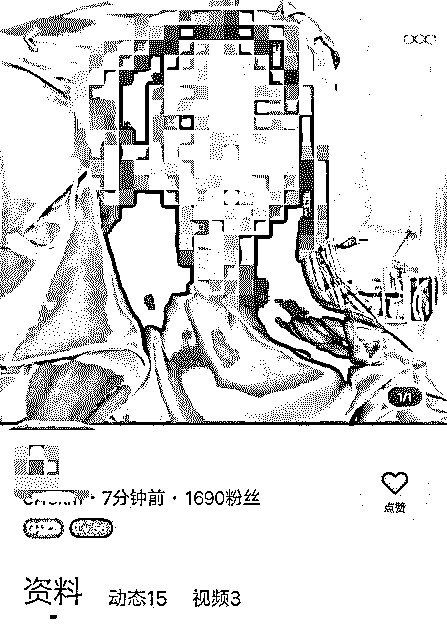
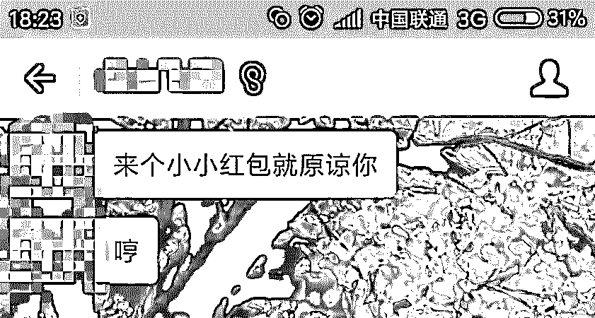
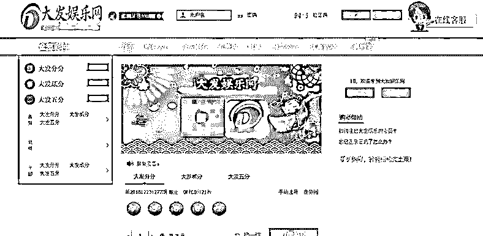
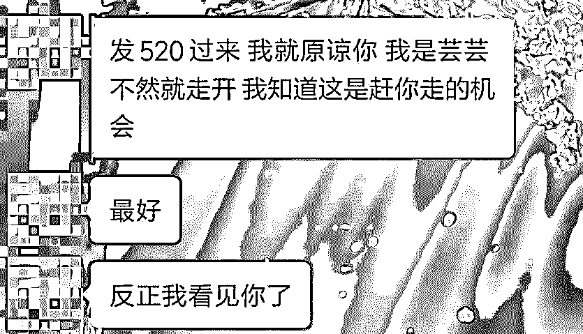
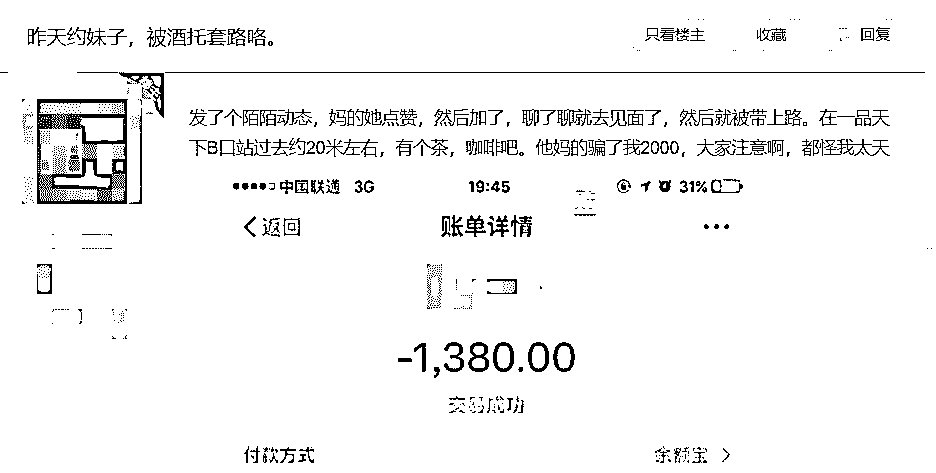
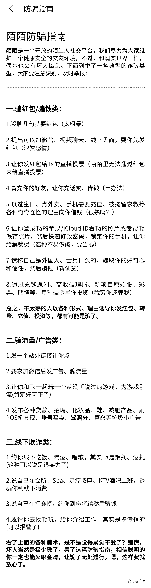

# 陌陌非官方防骗指南：屌丝逆袭“白富美”？“投怀送抱”想得美！

> 原文：[`mp.weixin.qq.com/s?__biz=MzIyMDYwMTk0Mw==&mid=2247495743&idx=1&sn=5c514194de06e02608ae5775e37828f8&chksm=97cb3b07a0bcb211180061bda97de666ffadb8d333a03b650653e572f71154a4727641d4089b&scene=27#wechat_redirect`](http://mp.weixin.qq.com/s?__biz=MzIyMDYwMTk0Mw==&mid=2247495743&idx=1&sn=5c514194de06e02608ae5775e37828f8&chksm=97cb3b07a0bcb211180061bda97de666ffadb8d333a03b650653e572f71154a4727641d4089b&scene=27#wechat_redirect)

**点击上方蓝色字体免费订阅“灰产圈”**

有一种人叫老实人，感情路上坎坎坷坷（说的就是你）。

现实中没有社交场合可以认识心目中的女神，大多数情况下他们都会把希望寄托于网络社交约会 app-以陌陌为代表！！

在社交 App 引领下，大多数时候你以为自己是百毒不侵，其实可能遇到的都是陌生网友下的套，漂亮小姐姐背后是抠脚大汉组成的职业”抠脚“团队。

也就是我们俗称的网络爱情陷阱。

网络爱情陷阱对于骗子们来说，可以让对方感受到“人在家中坐，骗局天上来”的惊喜，骗完后还能注销账号全身而退，简直是 0 成本的犯罪。

好比目前最最火的约会 APP——陌陌，很多网络骗子已经把它当成了行骗的主要工具，而且套路还不少！

一般来说，骗局无非分为线上和线下，线上骗局最多被骗点钱，举报拉黑一套操作，吃一堑长一智，以后留个心眼就是。

但约到线下的骗局还包含受到人身伤害的风险，万一骗子不让走呢？

我今天就给大家总结一下，那些年，骗子欺骗你会用的手段

可能有朋友对约会软件很陌生，认为上面随便一个人都是来找 YP 的。。。 

实际上，找 YP 的人有，想交朋友的也有，盯着你钱包不放的格外多。

这类人，不管她们照片多好看，资料看起来多真实，都改变不了骗子的本质。

陌生人之间的聊天无非就是从“你好”开始，注重礼节才能给别人有好的印象。

但不管怎么说，让人真正对一个人信任，是需要时间的。

可大多数骗子就是那么猴急，聊个两三句就让你加微信给她发红包，不发就拉黑！ 

这种套路是最低级的，会上当的人，基本上都没了，因为大多数人都上过当。

还有一种线上骗局，专门以游戏为借口。

为获得你的信任，骗子会从资料入手，打造一位白富美，不是开豪车就是做 SPA。

话说这图，是不是有点过分。。。

一样从聊天开始，当聊天记录多了之后，你会发现你们爱好性格都一致，下一步她就开始邀请你陪她玩游戏，还很友好带你玩教你注册。

这种网站非常小众，点开还能看见那种最高一赔七的广告位！

也有很多人以为，愿跟你聊这么久的应该不是骗子吧，以为遇到了贵人和发财的项目？！不存在的！

还有些说到不想说的低级骗钱手段，比如说推荐理财项目啦、卖保险啦，卖茶叶啦，卖保健品啦，推荐区块链项目啦，原始股啦......

约会 App 上不管对方怎么有钱，怎么跟你保证，都不要给对方转过去一毛钱！再多的信任，至少也等见面了再说（嘿嘿嘿）。

这类人最喜欢加微信再聊，这样他们以为就能躲过陌陌的监管，可是逃不过微信的监管啊，几天内必封号，然后就找不到他了。

在我看来，聊着聊着就加微信转钱的人，都是一个文案出来的，专业词：“话术”，再说通俗点，“虚拟网络乞丐”！要饭的那种，还抠脚大汉问你要红包。

你以为真的只能在网上行骗么？真是见面行骗的还真不少！这些人想方设法的勾搭你跟“他”见面，线下才是他们的主场。

你可能没经历过，但你一定在看见过这类新闻：“某某男子/女子见网友不幸被骗（仙人跳，酒托，各种托）”

其实最高级的我觉得当属酒托、饭托，让你主动投怀送抱，被坑了钱还美滋滋的想好事，花钱于无形，还让你酒足饭饱，结账了 才知道自己是冤大头，甚至结账之后第二天都觉得是如此的自然，就是多花点钱而已嘛，自己开心就好 。。。 

第二天，他也到了跟你说拜拜的时候了（拉黑，屏蔽）。

教你怎么分辨这些骗子：只要对方死也不肯更换约会地点，硬要去她指定的地方，那十有八九是托无误。

或设麻将局谎称 3 缺 1，一个不小心你就变成案板上的小鱼苗，任人宰割，设局下套。

最普遍的当然要数邀请你上会所、做足疗等做那些“你懂的 XX”的事情，然后你享受了，人家也赚到提成了，双方“互赢”？

这些约会 App 里的“老鼠屎”，不但黑了社交 App 这锅粥，还让很多不了解的人，认为约会 App 就是个祸端。

其实 App 从来都没有错，错的都是那些利用它来违法犯罪的坏人。

以约会为话题开展聊天确实是有利于行骗的一种方式，这就是利用了人心的最高骗术：“情感营销”，此手段 骗你于无形，当你意识到被骗之后，人家早就把钱洗白了，报警的话几千块很多都不受理的。

最后，附上《陌陌》官方防骗手册，人手一本，自己看的同时也可以转给身边的朋友，官方出品，必属精品呀！

← 向右滑动与灰产圈互动交流 →

**阅读原文加入灰产圈高端社群**