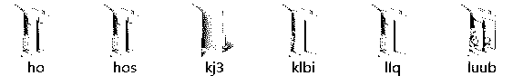
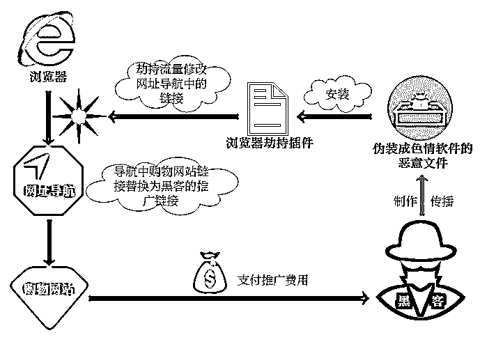
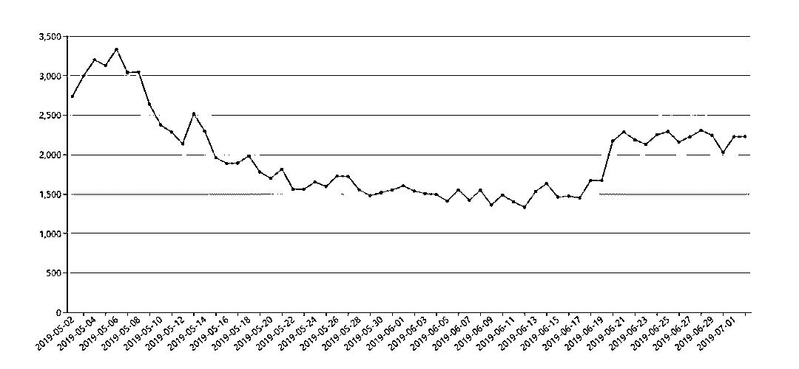
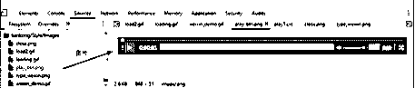
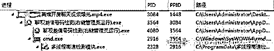
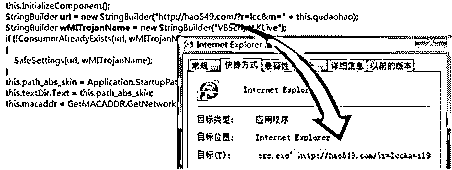

# “桃色陷阱”——网络色情软件揭秘

> 原文：[`mp.weixin.qq.com/s?__biz=MzIyMDYwMTk0Mw==&mid=2247495735&idx=1&sn=21f5dd31b0b86c5d0a2a0902f6311735&chksm=97cb3b0fa0bcb219d0c8322dfadad094c9b7b0ddbfd3fa2754e7d6df9e68ea9e8e80178b7062&scene=27#wechat_redirect`](http://mp.weixin.qq.com/s?__biz=MzIyMDYwMTk0Mw==&mid=2247495735&idx=1&sn=21f5dd31b0b86c5d0a2a0902f6311735&chksm=97cb3b0fa0bcb219d0c8322dfadad094c9b7b0ddbfd3fa2754e7d6df9e68ea9e8e80178b7062&scene=27#wechat_redirect)

**点击上方蓝色字体免费订阅“灰产圈”**

作者：安全客

通过色情内容来引流已经是许多黑灰产的常用手段，比如最常见的小广告弹窗、只有特殊渠道能访问的色情网站、某某美女视频资源等，都是裹着糖衣的炮弹，实际是黑客特意制作等着用户上钩的诱饵。

依据**《中华人民共和国网络安全法》**、**《互联网信息服务管理办法》**等相关法律和法规，在网络中传播淫秽色情信息是违法行为。而且网络中与色情挂边的内容几乎都伴随着木马，流氓推广，诈骗及赌博等一起出现，用户不经意之间跳“坑”，轻则电脑中毒，重则倾家荡产，望广大网友珍爱生命，远离网络色情。

经过 360 安全大脑的追踪，在用户电脑里找到了作恶的文件。

就是这些文件向浏览器添加了恶意插件。恶意插件劫持了购物网站的地址。劫持购物网站的具体过程如下，攻击者通过这种方式赚取推广费用。

据 360 安全大脑统计样本近两个月的活跃情况如下，样本目前仍然活跃在网络中，而且保持了较高的热度。

360 安全大脑给大家盘点了隐藏在网络色情软件背后常见的套路和猫腻，希望广大用户引以为戒，小心防范，安全上网，远离“桃色陷阱”。

色情会员充值骗局

1

通过诱惑性的内容，勾起用户的兴趣，如果用户想要继续观看，就必须注册会员或者充值账号，用户一旦充值，就走进了圈套。

以下某款软件页面展示大量诱惑性影片资料，诱导并欺骗用户注册充值。当欲望压过理智，用户扫描支付以后，发现无法观看。反复充值，仍然无法观看。

值得一提的是，分析人员发现这个所谓的播放器竟然是由一张张动态图片组成的，不具有播放功能。如下图所示，播放进度只是一张图片，这完全是一个以情色为饵的骗局。

沉迷于网络上的色情内容本身就严重损害身心健康，影响家庭和谐。而类似的色情会员充值圈套，导致用户不但损失了金钱，还将面临软件包含其它恶意捆绑的风险。本以为注册充值有惊喜，结果却变成惊吓。

如何避免落入这种色情会员充值圈套呢？

首先，用户平时上网时要管住好奇心，远离网络色情内容；

其次，不轻信来源不明的充值要求，守住钱袋子；

然后，关注杀毒软件风险提示，不运行风险软件。

披着色情羊皮的木马

2

## 木马病毒最爱伪装成色情视频或者图片资源，蹭热点或花边新闻，借助色情网站、资源分享等途径快速扩散。

这类木马一般会结合色情信息来制作诱饵文件，将文件命名为某某明星视频、某某开房视频等，利用人性的弱点来传播。下面这些都是伪装成色情资源的恶意文件，这只是冰山一角。

例如这个名为“xxx 宾馆聊天视频曝光”的文件，通过伪装图标和文件名的方式，使其表面上看是一个 mp4 视频文件。不特意查看文件类型扩展名，用户很难发现这实际是一个可执行程序（exe）。

这个伪装成视频的木马会播放一段色情视频来蒙蔽用户，然后在背后偷偷“干活”：启动一个名叫“聊呗潮信号码检测”的软件，来抓取聊呗、潮信这两款社交软件的账号，之后在开机启动项中添加了一个远控木马，而这个远控木马文件名则伪装成 Windows 系统进程“svchost.exe”。

该木马的执行过程如下图所示。

藏匿在系统中的远控程序，为黑客打开了一扇方便的大门。用户电脑随时可以被黑客控制，被用作肉鸡进行 DDoS 攻击、挖矿、刷流量等操作，甚至会被用作攻击其他目标的跳板。这时候用户的电脑就被吸入黑色产业链中，成为无辜的工具。

而木马获取的社交软件账号信息可以被反复出售，进行进一步的广告推广或精准诈骗。很多时候人们基于猎奇心理去寻找色情资源，最终却成为木马病毒的精准目标。互联网是有记忆的，电脑中毒可以重装，但是泄漏的个人信息，则在不法分子之间反复倒手，而后诈骗、垃圾广告接踵而来。

与其问“为什么中毒的总是我，我的个人信息是如何泄漏的”，不如遵循以下建议，从源头远离风险。

增强自制力，不主动搜索、不关注网络中的不良信息；

调整个人电脑的系统设置显示已知文件类型扩展名，“工具”ð“文件夹选项”ð“查看”ð取消钩选“隐藏已知文件类型扩展名”；

重视安全防护软件的风险提示，不要运行被拦截的程序；

保持警惕性，注重个人隐私，不随意添加陌生好友。

借软色情推广的小工具

3

网络中敢于触犯法律的毕竟是少数，但打着色情的名号吸引人气的行为比比皆是。有些小工具软件打着软色情的幌子吸引流量，背地里无恶不做，改首页、挖矿、劫持网站流量、静默安装软件，游走在法律的灰色地带。

诸如“影视资源搜索器”，“美女图片鉴赏器”之类下载工具，号称是宅男福利，可以搜索任意感兴趣的资源，支持下载离线观赏，来吸引眼球。这类软件主要通过爬虫技术全网抓取图片，视频等资源，而其在下载功能之外往往带着一些不可告人的秘密。

例如，下面这款图片鉴赏器，界面上的标签都是都是诱惑性的选项。

用户如果对这款软件感兴趣就中圈套了。分析人员发现，这款软件的资源文件中包含恶意模块。

用户运行这款软件，浏览器首页就会被恶意篡改。

许多小工具软件打法律的擦边球，通过软色情进行营销推广，以求跨越不同兴趣人群，保证持续的流量和曝光度，从而广泛传播。软件暗地里则通过劫持流量、捆绑推广流氓软件、运行挖矿程序等实现快速变现。打着软色情的幌子吸引用户使用，却苦了不明真相的用户，反复中招，电脑经常出现卡顿、各种奇怪的软件甚至是木马病毒。

如何撕下网络上形形色色的软色情面具？

首先，保持良好的上网习惯，不要浏览不可信的小论坛、网站；

其次，自觉抵制各种软色情信息的诱惑，不轻信软件的鼓吹；

然后，保持杀毒软件的开启状态，不要运行杀毒软件提示风险的文件。

狡兔三窟的色情网站

4

传播淫秽色情信息在我国是违法行为，然而为了牟取巨额利润，这些违法份子仍然铤而走险。用户沉迷于“小黄片”会影响个人的身心健康，更别说色情站中还充斥大量赌博网站引流信息和色情诈骗陷阱。用户一旦遭遇诈骗，甚至误入歧途参与赌博，极有可能摧毁整个家庭。

色情网站经常利用技术手段来逃避相关部门的查处，境外搭设服务器、限时开放网站、频繁更换 IP 及域名等。然后结合一种地址发布器之类的工具来保证网站地址更换后，用户还能找到最新的网站地址，从而再次将用户引流到线上黄网。

比如下面这款发布器，不仅把地址服务器设置在境外，而且还具备多种模式，一种模式对应一个服务器。只要任意一种有效，就可以将用户成功引流到线上黄网。为了便于国内用户记住网址，还会特意注册中文域名。

用户被引流到黄色网站后，网站除了提供色情淫秽图片视频，还会穿插大量的赌博广告，色情聊天室弹窗，线下色情服务，网赚推广等信息。

色情网站推送的广告信息，通过各种方式来刷存在感，绘制虚假关闭按钮，诱导用户点击；跟踪用户操作，弹出新的广告页；强制广告播放等持续骚扰用户。

色情网站还会承诺发布器不存在木马，提示用户关闭杀毒软件。用户一旦关闭杀毒软件，等于在网络中“裸奔”。色情网站内容庞杂，来源未知，用户时刻面临网站挂马风险。

除此之外色情站中还有充斥大量赌博网站引流信息和色情诈骗陷阱，用户防不胜防。

假如遇到色情网站或软件怎么办？

传播淫秽色情信息是违法行为，用户如果遇到色情网站之类的违法现象要主动向相关部门和组织举报，对网站和相关软件进行查处和屏蔽；

对于色情站中的木马病毒，杀毒软件就可以解决，开启杀毒软件的防护功能，重视风险提示，不运行风险软件；

色情网站背后的情色陷阱和赌博网站就需要用户的自制力和警惕心了，自觉远离不良信息。

结语

5

网络色情软件不仅影响身心健康，也是病毒、木马的温床。广大网友要自觉抵制网络色情内容，保持健康的上网习惯，不使用、不传播色情应用，发现违法软件主动向相关部门举报。

← 向右滑动与灰产圈互动交流 →

**阅读原文加入灰产圈高端社群**