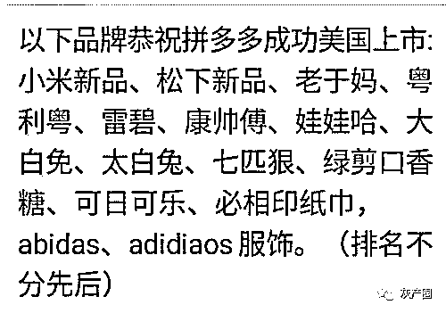
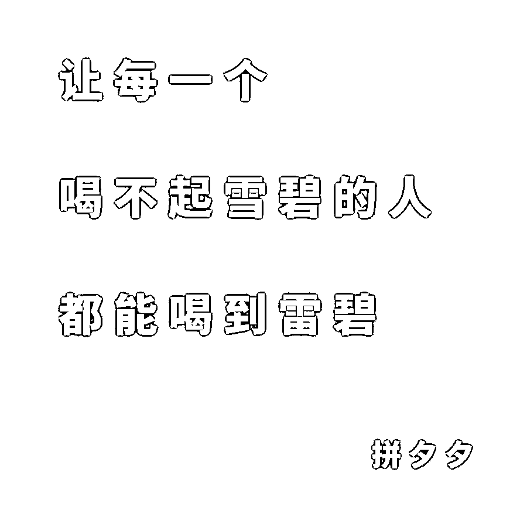

# 是拼多多？还是“拼夕夕”？

> 原文：[`mp.weixin.qq.com/s?__biz=MzIyMDYwMTk0Mw==&mid=2247495688&idx=1&sn=61044447880c23e2fb38ba920eee4d2d&chksm=97cb3b30a0bcb226ec18a050e54dfdc877e487a0fd990d6ca72acadc79b4caea21f689727351&scene=27#wechat_redirect`](http://mp.weixin.qq.com/s?__biz=MzIyMDYwMTk0Mw==&mid=2247495688&idx=1&sn=61044447880c23e2fb38ba920eee4d2d&chksm=97cb3b30a0bcb226ec18a050e54dfdc877e487a0fd990d6ca72acadc79b4caea21f689727351&scene=27#wechat_redirect)

**点击上方蓝色字体免费订阅“灰产圈”**

导语

关于拼多多的新闻，相信大家已经看过不少，大多数都是负面新闻，类似于之前灰产圈报道过的：山寨泛滥，假货横行，质量问题，售后问题，等，被网友调侃为“拼夕夕”。

7 月 5 日，微博上一条信息引起了我的注意：

天眼查监测信息显示，未来 30 天里，拼多多因知识产权保护、售假等问题面临 171 项法律诉讼，日均 6 件！原告包括小米、361、安踏、九牧王等多家知名企业（天眼查曝光台）

拼多多一再纵容山寨商品的行为已经到了忍无可忍无须再忍的地步了？很多知名公司纷纷起诉拼多多？背后的真相究竟是什么？请看深度报道。

被 999＋公司起诉的拼多多

第一时间，我们通过天眼查查询了拼多多所属的上海寻梦信息技术有限公司，天眼查显示，司法风险 999＋，也就是说拼多多滩上的官司已经大于 999，实在让人惊叹，如下图所示：

我们仅仅截取了前四页，就出现了很多知名的企业：

**oppo 柒牌 361° 罗莱 七匹狼  欧派 上海家化 小米 飞科 劲霸 安踏 **

基本都是 数码产品 服装 家纺 家具 化妆品 等拼多多主营产品，涉及纠纷多半是 侵权 山寨 等行为，我猜拼多多的法务部应该是他们加班最长的部门吧！

再起底“拼多多”

为什么要加“再”呢？因为我们写了不止一篇文章报道拼多多，实在是不想吐槽了，但是，责任感让我们再次拿起手中笔，再起底“拼多多”！

不过，首先感谢一下知乎网友**@伽利略略略**

以下是超 5K 点赞量的**@伽利略略略**  在拼多多的真实事件纯吐槽！

这一天早晚会来的。

我也算是拼多多前段时间诸多假货维权事件的一个亲历者，虽然对维权之难已经有一定的心理预期，但是这个平台的很多做仍旧是出乎了我的意料。

简单的讲一下整个维权的过程和我的遭遇。

事件还原

故事发生在刚刚过去的 6 月份，北京的大风带来了蓝天白云，也带来了换季买衣服的热潮，主任我准备也买双几鞋。

正所谓好马配好鞍，主任这种级别，一般的鞋配不上咱身份，必须得足够有个性。

为了寻到一双既配得上我好看的皮囊，又装得下我有趣的灵魂的战靴，我来到了拼夕夕。

试着搜索了一下，这里简直是个大宝库，几块钱，十几块钱一双运动鞋，竟然也能包邮？

甚至是一些品牌鞋，也不过百元左右：

但是你是知道的，这些都配不上主任我有趣的灵魂。

于是，我来到了拼夕夕大牌专区，看上了一双官方授权，质量保证的新百伦凉鞋：

奥不，定睛一看，是“浪新百伦威”凉鞋，好一个狡诈的卖家，差点上了李鬼的当，但是这双鞋看起来仍旧不错，尤其是脑门上印着的大写的“NB”，十分匹配我的气质。

又或许这双韩版潮流街拍运动鞋，和主任我的身份更搭一些。

画面过于刺激，主任我只能先吃几根烤串，冷静一下。

我最终决定，还是得买一双正宗的耐克。

于是我斥资 158 块大洋，买到了一双莆田发货的“正宗”耐克。

不愧是拼夕夕，体验相当不错，当天莆田发货，三天就能抵达京城。

怀着无比激动的心情，我收到了包裹：

这外包装真 TM 高档

大家好，这是我的高档进口耐克鞋的盒子：你看，真红！

打开之后，简直正规：发票，纸袋，防伪扣，一应俱全。

似乎每一样东西都在告诉你：我不是假货。

你看这防伪扣，多白！

你看这发票，多大！

把鞋拿出来之后：

这做工，快赶上俺村头大爷纯手工打造的老北京布鞋了。

但是你也不能说它都是缺点，它虽然长得丑，但是鞋底硬啊，虽然鞋底硬，但是气味大啊。

算了，我说不下去，还是多欣赏欣赏鞋子吧，这一组 899HKD 的发票引起我的兴趣。

原价 899HKD，拼夕夕卖 158，难道这是美帝国主义的慈善家做的好人好事？

全是英语，真 tm 高级

这发票套装，看着真眼熟，好像在哪里见过？

我想起来了，万能的朋友圈里有牛人啊：

主任之前常逛淘宝：

这造假也太不走心了吧？

多花点成本，买套 1 块钱往上的作案工具不行吗？

到这里，我觉得我被拼夕夕欺骗了感情。

主任心疼那 158 的巨款，所以我准备退货。

我尝试联系了一下卖家：

结果，到现在都半个月了，还显示未读呢，卖家现在都这么吊吗？

那我只能找拼夕夕来替我主持公道了，申请投诉吧。

投诉之后，很快拼夕夕发来了一条短信：

然后 APP 上，软件自动把投诉转为了退货，让我自理运费退回？

而且，就在我投诉当天，半夜里，莫名奇妙打来了无数骚扰电话，两三秒钟一个，接起来马上就挂，手机一会就发热没电了，半夜看着甚是诡异，我被人报复了，设置了“呼死你”：

我说商家怎么这么硬气呢，原来是平台在撑腰：

对不起，平台方不是检验机构，所以我们管不了奥，建议您向政府投诉呢，亲

说实话，商家让我找政府部门投诉，这个要求，我真是第一次见，这个锅甩得妙，之前淘宝也投诉过，人家马上响应进行查证好不好？

同样都是平台，但是差距，怎么就这么大呢？拼夕夕的操作可真骚

可惜主任是个头铁的人，不就是投诉吗？投！

艰难的维权路

于是我给国家工商行政管理总局打去了电话

电话里：我们这里不管，你找他们公司注册所在地的工商局投诉吧

？？？？？

成，不就是上海吗，接着投

电话里：我们这里不管，你找他们公司注册所在区的工商局投诉吧

这就是传说中的踢皮球？？？？

主任头铁没办法，不就是给长宁区打电话对吧？接着投诉！

响了半天，终于有人接了：这里是总机，不管投诉，你拨分机号吧 5041

然后我就开始了漫长的等待之路，感觉像听了半个世纪的彩铃，竟然还是没人接，我有点颓了，难道真的就没人管了？

老子灵机一动，拼夕夕不是要证据吗？发票这么明显的问题，一下子就能验证出错误，给发票上的位于香港旺角波鞋街 84 号的专卖店打电话核实一下。

于是，一通电话打过去，还是香港妹妹负责任，很快就帮我查验好了，发票完全对不上，确定无误是假货。

不放心，我又给耐克的官方打了一通电话，做了确定：耐克的客服小妹妹非常肯定的和我说，耐克国内全网线上除了官网的渠道，只有 4 家是官方授权的渠道，淘宝天猫上有 3 家，京东上有一家，拼夕夕根本就没有授权店铺！

好了，证据收集到了，接下来，拼夕夕不是要证据吗？

提交！

于是我整理了一下材料，重新在后台提交了投诉，我话说的很嚣张的

这次拼夕夕反应非常及时，也就过了一个小时，电话就过来了，电话里的小妹妹非常客气，连声道歉，然后解释，大致意思是：都是商家的问题，我们把商家的信息全给你，你去对付他吧，我们配合

然后，我就系数收到了卖家留在拼夕夕的资料，这队友卖的真痛快，不知道当初留信息的商家知道后会是什么感想？

拼夕夕成功的把责任推的一干二净，现在成了我和卖家两方的事情了，和平台彻底无关了。

什么是高手？这就是。

然后，因为退货超时，拼夕夕关闭了我的投诉，现在连货都没法退了，娘的卖西批。

差评：防民之口

退货赔偿是不可能了，那给个差评让自己爽一下，让其他买家避坑总行吧？

NO，拼夕夕告诉你：不行，你得 SHUT UP！

很多人写完差评之后，你会发现，无论怎么刷新，你都看不到这条差评，老子的评论呢？被拼夕夕屏蔽了？？

后来我发现，我错了，拼夕夕默认竟然根本就不显示差评？？

下面是一张我随手截图的拼夕夕商品评价：

8 个好评标签，从质量到款式到快递速度都提到了，可无论如何，都找不到一个负面标签？

当我把这些好评数据相加，经过计算：

全部评价 56828 个，好评相加只有 15771 个，那剩下的 41057 个评价到底是什么？为什么不翼而飞了？

它们是被隐藏了吗？

这其中又有多少是差评呢？

如果负面的评价不展示出来，那么买家评价的意义是什么？

我又多找了几款销量过万产品的评论，无一例外，默认显示还是无差评，一片赞誉：

只有点看那个不起眼的小小的灰色按钮之后，才能在角落里看到一个孤零零的负面标签，只有几条无关痛痒的评论，而且总数还是不对，有超过一半的数据是被隐藏起来的：

有句话说得好：若批评不自由，则赞美亦无意义。

“防民之口，甚于防川”，把你的嘴堵上了，这企业做的不要太牛批啊

我在网上一查，发现主任我并不是孤例，网上还有很多此类案例 ，而且他们比我还惨，这是我在黑猫投诉上找到的一个情况和我差不多的小哥：

什么鬼？即便是做过鉴定，拼夕夕也不会承认产品鉴定的真实性的，这个套路简直是太牛了，而且推脱的手段着实高超，直接把消费者推向当地的行政部门，让消费者自己去政府维权。

如果在平台上购物出了问题，都是消费者自己解决，那平台存在的意义是什么？只是躺在中间挣提成吗？

是不是因为买家提供的证明材料真的不够权威，所以拼夕夕才推诿呢？

错了，我们都低估了拼夕夕，就算品牌厂家亲自拿出产品检测鉴定，也没卵用。

这里还有一个案例：

根据中国质量新闻网的报道：去年 5 月份，上海的孙女士在拼夕夕上买到了 3 罐假冒的麦芽酚。

于是，她向拼夕夕平台提出了申诉。

开始，拼夕夕依旧是拿出老套路，要求孙女士提供品牌的厂家鉴定。

但是孙女士可不是一般人，她不辞辛劳，辗转将麦芽酚送到了该品牌的厂家检验部门。鉴定结果出来，该麦芽酚质量检测严重不过关，包装的防伪标识也不是专用的防伪标识。因此，3 罐麦芽酚是假冒伪劣品。

厂家给出了官方的鉴定报告：

然而，拼夕夕的回复依然非常硬核：

拼夕夕无法验证该鉴定的真伪

都亲自送到厂家鉴定过了，企业的公章也盖上了，为啥平台还是不能鉴定？你能干啥呢？

作为一个消费者，是出于对平台的信任才会来购物。当遇到假货时，平台当然有责任协助处理。拼夕夕的发展速度成为行业奇迹，但是其价值观本质上却是一种忽视规则的野蛮生长。

这家公司就连做广告都不老实，想必这样铺天盖地的广告，大家在微博，知乎上早就无数次看到过了：

说什么高级代步车只要 9.9 元全国包邮，诱导你下载，我他么打开钱包，准备来 100 块钱儿的。

但是真到购买环节，你就会发现实际上这只是个抽奖活动，参与进来的人不仅花 9.9 元根本买不到，而且还要诱导你发各种广告到群里，帮拼夕夕推广。

文字游戏也不是这样玩的吧？

广告这件事情其实就是体现了拼夕夕的价值观：为了达到目的，不择手段。

人家知道灰色地带在哪里，怎么打擦边球，你明确知道他在拿这样的东西虚假宣传，欺骗，但是法律风险，人家的律师团早就研究地明明白边，规避的一干二净，你真的拿他没办法。

前段时间差评爆料，拼夕夕的部分店铺沦为博彩网站洗钱渠道，但是拼夕夕不问是非，不做检讨反思，反手就是一个起诉，要求差评赔偿 1000 万？？！

不管你说的对不对，你要你敢出来说真话，我就用高昂的成本打击你，最后哪怕输官司也不要紧，我的目的就是给你添麻烦，而且要把你当成鸡，杀给猴看，以警告所有的后来者，别惹我，我会让你痛。

什么叫玩弄规则？什么叫讼棍？

这就是

从实用角度来看，我非常理解，拼夕夕也确实做到了比较好的成绩，从淘宝这样恐怖的对手封锁之下杀出重围，不用点特别的手段，是很难做到的。

但是他们最大的问题就在于过于实用主义，实用主义指导一切，完全没有规则的概念：

为了达到目的，践踏一切可以被践踏的规则，可以低成本践踏的规则，也包括法律。

熟悉规则，利用规则，玩弄规则。

最终，求仁得仁，拼夕夕也如愿以偿的转的盆满钵满。

5 月 20 日晚，拼夕夕最新发布的 2019 年一季度财报显示，营收为 45.45 亿元，高于市场预期的 41.43 亿元，股价也随之上涨，看起来一些形势大好。

但是这个钱，扪心自问，拼夕夕同学，你赚的安心吗？

以上所有资料均已经留存备份，截图，录音，保留证据公正，均可以保证来源的真实有效。

到目前为止，稿子发出去很长时间了，删稿投诉收到了不少，货还在手里，但是没有拼多多的官方售后过来，联系处理解决，很多平台的稿子陆陆续续被删掉了，一切就好像都没有发生过一样。

事件之后

早就听说拼夕夕的公关厉害，当时我这边稿子往外发的时候，很多平台干脆就不允许发，他们只要是拼多多的负面就发不出来，还有一些平台，事后就找一些“莫须有”的罪名悄悄给删除掉了，整篇稿子不牵扯任何造谣虚假，全部都是个人经历的一个总结整理，我不知道这些东西有什么不能发的。

这么多诉讼是拼夕夕早晚要面对的问题，毕竟不是所有人都会忍气吞声。

我清楚国内商业环境的复杂，但是还是那句话，不管是个人还是企业，总要对自己的行为负责。

结尾

从拼多多到并夕夕，人们嘲讽着这个充斥假货山寨，动不动就砍一刀的“龙鸣”平台。

渐渐的，并夕夕不仅变回了拼多多，还洗白成功，摇身一变成了一些人口中的“良心”平台，把最廉价的东西卖给广大穷苦人民，真正让他们享受到互联网时代的福利。

村东头的张大妈靠着拼多多用上了大冰箱，村西头的李大爷靠着拼多多买了个新手机，这才是真正惠及全体人们的良心平台，多么有人文关怀，简直吊打 x 宝、x 东等充斥着冷冰冰资本的垃圾平台。

谁都不可以嘲讽拼多多，嘲讽拼多多就是看不起广大穷苦人民，也不可以批判拼多多，批判拼多多就是傻 x 的小布尔乔亚。

就和和珅往救济粮里掺沙子的事一样，和大人一边喝着穷人的血，一边说我这是为你们好，只有这样才能救济到你们。还有一大群人为和大人叫好，说和大人是真正懂穷人。

呵呵，拼夕夕现在做的不也是同样的事，一边打着关心帮助穷人的旗号，一边贪婪着喝着他们的血，最后还有一群“天真”亦或是认为穷人就该如此的人们捧着场。

← 向右滑动与灰产圈互动交流 →

**阅读原文加入灰产圈高端社群**