# 白帽黑客讲述：是谁出卖了你的隐私？

> 原文：[`mp.weixin.qq.com/s?__biz=MzIyMDYwMTk0Mw==&mid=2247495595&idx=1&sn=a66a8fcf62d0d2aae22e05894c0c4130&chksm=97cb2493a0bcad85f16af6262a90bc2c32cdb2c8fdff7fe3faae8985a79d000bb3e74a338fc1&scene=27#wechat_redirect`](http://mp.weixin.qq.com/s?__biz=MzIyMDYwMTk0Mw==&mid=2247495595&idx=1&sn=a66a8fcf62d0d2aae22e05894c0c4130&chksm=97cb2493a0bcad85f16af6262a90bc2c32cdb2c8fdff7fe3faae8985a79d000bb3e74a338fc1&scene=27#wechat_redirect)

**点击上方蓝色字体免费订阅“灰产圈”**

前言

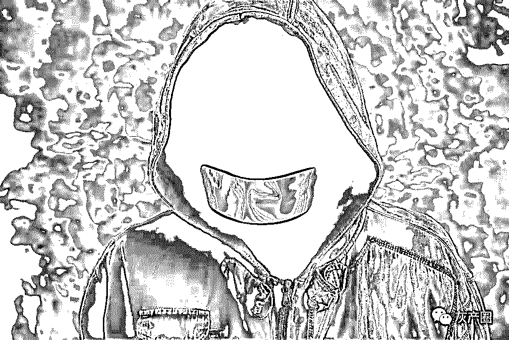

作为一名白帽，有时候撸了某些黑产大佬，那么被社的可能性还是比较大的，如果个人不注重隐私信息的话，很可能自己的隐私就会被暴露出来，这样无疑是很危险的。那么今天我就来总结一下，目前我个人常用的社工方法和防御方法，当然我可能说得不够全面，还请各位表哥轻喷。 

 IP 地址出卖了你

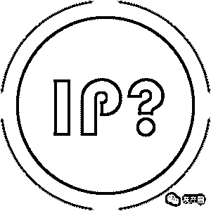

       我想大家都知道通过 IP 地址是可以查询出详细的地理位置的，如果是静态 IP、或者是公司专线的话，查询得到的精准度是相当高的，以下我就来说说目前获取 IP 的方法和如何防御。

 通过 163 邮箱搞到对方 IP 地址。

方法：如果通过前期收集信息发现对方有在使用 163 邮箱的话，可以尝试给对方发一份邮件，邮件内容可以根据自己想象力写，目的只有一个，骗对方回复。 <ignore_js_op>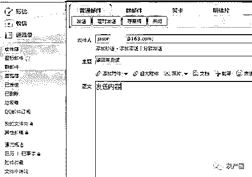 </ignore_js_op>

对方回复以后，我们在自己 QQ 邮箱里面打开对方回复的邮件，点击右边的箭头

  <ignore_js_op>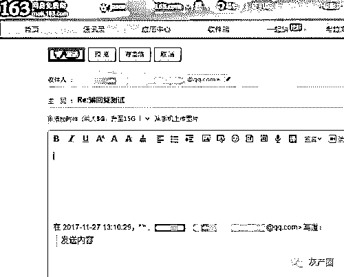 </ignore_js_op>

这是模拟 163 的邮箱回复了我的 QQ 邮件。

  <ignore_js_op>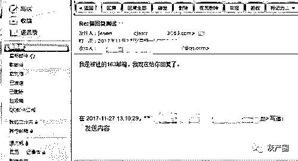 </ignore_js_op>

点开这个按钮 <ignore_js_op>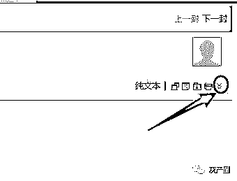 </ignore_js_op>
然后再点击 显示邮件原文，会弹出一个包含很多参数的页面。 <ignore_js_op>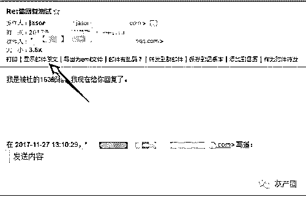 </ignore_js_op>

通过邮件原文发现 163 邮箱发过来的 IP 地址。

 我们只需要在里面找到 Received: from 后面的 IP 就是对方正在使用的 IP 地址，X-Originating-IP:后面也可以看到。

  <ignore_js_op>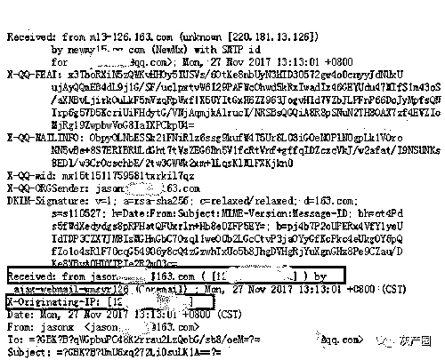 </ignore_js_op>

得到 IP 地址后，通过 http://www.ipplus360.com/ip/定位即可获得对方的地理位置。

 注意：我目前只测试过 163 和 QQ 邮箱，QQ 邮箱发件时会自动使用代理 ip，而 163 会使用你本机的真实 ip 发送邮件，所以正在使用 163 的表哥请小心。

网站记录法获得 IP 地址

方法：如果你有虚拟主机的话，很多虚拟主机都有访问日志记录的，随便搭建个网站上去，然后发给要获取 IP 的目标，对方打开以后，你的 IIS 日志就会记录下他的 IP 地址。

也可以使用 cnzz 的统计代码等等，或者自己搭建个网站，对方访问以后，你查看下网站的日志就可以得到对方的 IP 地址了。 

通过 QQ 显 IP 版本获取对方 IP

网上某些 QQ 插件是可以获取到对方的 IP 地址的，比如 NTRQQ，不过目前好像没有更新了，只有付费版的可以探测到对方 IP。防范对方通过 QQ 探测自己 IP 的防御方法见”3)” 

如何防范对方获得自己的 IP 地址？

1)       如果陌生人给你发网址，请不要直接就打开，请把网址复制到开了代理的虚拟机里面打开，这样有两个好处，如果对方记录 IP，那么抓到的 IP 只是你的代理 IP 而已，如果这页面挂马，中招的也只是你虚拟机，对你没啥危害。

2)       如果你正在使用 163 邮箱的话，陌生人给你发邮件，而你又必须给对方回信时，请使用代理方法隐藏自己的真实 IP。、

3)       防御对方通过 QQ 探测自己 IP，我们可以在登录 QQ 的时候，点击登录界面的设置，然后进入代理设置界面，输入一个代理地址和端口，这样登录以后如果有人探测你 IP，那么他拿到的 IP 只是个代理 IP 而已，（没有代理的话，有服务器也可以自己搭建一个。）

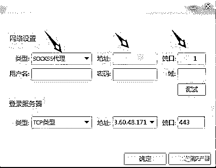

网络上的痕迹出卖了你

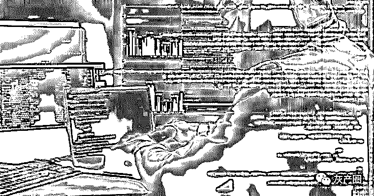

你在论坛、贴吧、社区留邮箱、留手机号、晒照片这些行为，都给别人社你带来了方便。
       你的朋友圈，QQ 空间，发说说、朋友圈喜欢发地址这些都会让你的信息泄露。 

 通过 QQ 查你资料

在得知一个 QQ 号以后，我们可以先百度一发，看看有没有相关的痕迹，没有再 google。
比如下面这位，之前在某个群发布远控，很多不明真相的群众中招，其中我有个 i 春秋的朋友也中招了，然后这人就把对方的桌面截图发到群里装逼。
我通过他 QQ 号直接查到他在百度贴吧晒过照片，而且是在某个中学的贴吧，所以判断他是这个中学的学生。 

<ignore_js_op>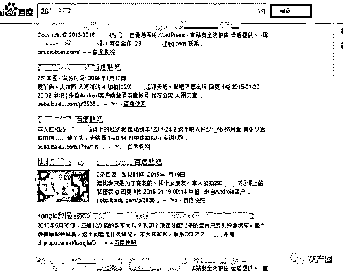</ignore_js_op>

2\. 你 blog 上的 QQ 号出卖了你。

很多人喜欢在自己的 blog 上留下自己的邮箱或者 QQ 号，如果你的 blog 被搜索引擎收录了，那么我查询你 QQ 号的时候，会把你 blog 的相关页面搜索出来的。
比如我表哥的 blog <ignore_js_op>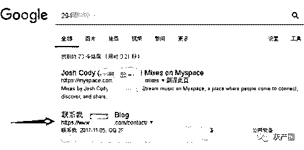 </ignore_js_op>

得到他域名以后，通过 icp.chinaz.com/查询域名的备案，我们就知道他真实名字叫什么了。 <ignore_js_op>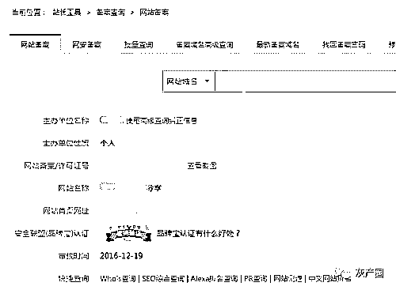 </ignore_js_op>

也可以点击查看截图进入，可以看到更多详细的备案资料。

  <ignore_js_op>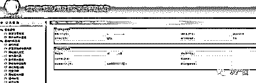 </ignore_js_op>

朋友圈和 QQ 空间的原图出卖了你

用手机拍摄的照片，默认的 exif 里面是有你拍摄的 GPS 地址的，如果你上传到朋友圈或者相册的时候选择“上传原图”那么这些图片就会泄露你的 gps 地址。

比如 win7 下，我们得到一张原图，点右键查看属性。
在详细信息里面可以看到拍摄这张照片的 GPS 经纬度。

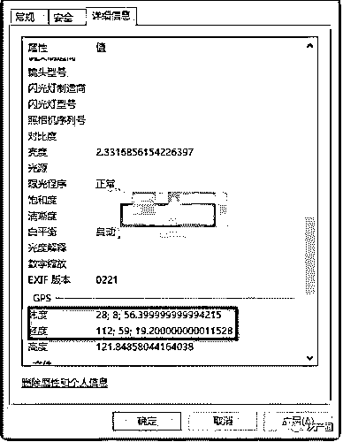

维度：28；8；56,3999999.....
经度：112；59；19.20000......

 我们稍微转换下

  <ignore_js_op>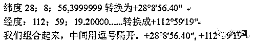 </ignore_js_op>

打开 http://www.gpsspg.com/maps.htm 把组合好的经纬度复制进去，点击搜索按钮。
这张照片的拍摄地址就出来了。

  <ignore_js_op>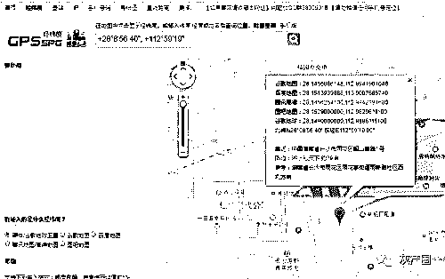 </ignore_js_op>

视频也会泄露你的信息

比如在朋友圈发了一段视频，也就是开车的时候随手录的，但是不经意的就泄露了自己的手机号了。
如果图片不够清楚的话，ps 调整色阶，可以让号码更清晰（号码我打码了......）

  <ignore_js_op>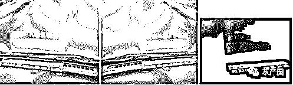 </ignore_js_op>

如何预防自己的隐私信息泄露？

1)       不要在自己的 blog 留下自己常用的 QQ 或者邮箱。

2)       不要在贴吧、论坛、社区等地方留下自己的照片或者手机号等等。

3)       上传图片到相册或者上传到朋友圈的时候，不要选择【上传原图】

软件出卖了你

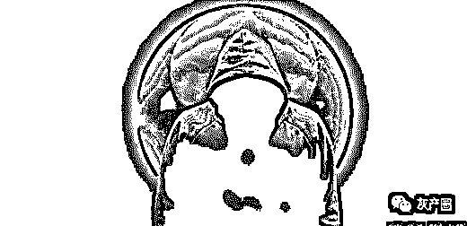

支付宝出卖了你的真实名字

如果你的支付宝是通过 QQ 邮箱或者手机注册的，假如黑客拿到你的 QQ 号或者手机号以后，通过添加好友或者转账的方法进一步收集到你的资料。

比如我之前的一个案例，得到手机号：185******
为了证实手机号是否绑定微信，我通过这个手机号添加微信，证实该手机号的确是他的。 

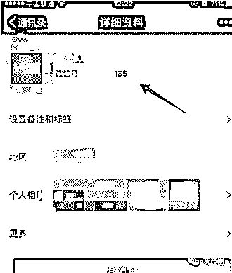

然后通过这个手机号查找对方支付宝，然后点击转账，这时候在他名字后面会有个“点击验证”我们可以尝试猜测两次姓氏，如果失败的话，就要通过其他方法了，支付宝以前每天只能验证 10 次。

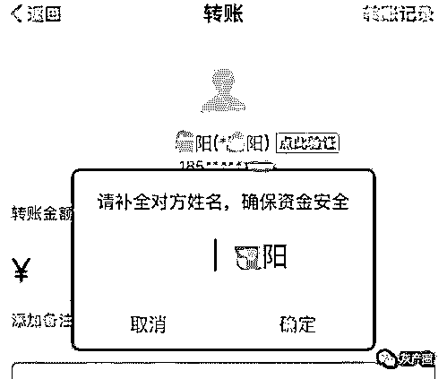

我一般会通过社工方式拿到姓氏，通过这个手机号，添加对方的微信，然后套路对方的姓氏就行了，如下图。

  <ignore_js_op>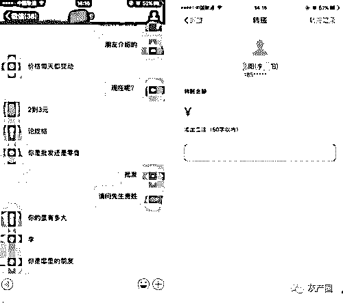 </ignore_js_op>

QQ 附近的人出卖了你

很多表哥晚上睡不着就会打开 QQ 附近的人搜索妹子，可是在你打开的时候，QQ 会先获得你当前的 GPS 地址，然后再计算附近的人 GPS 地址和你的距离。

假如：我住在离你家 100 米的地方，我离你的距离现在是 100 米，如果我把我本地的 GPS 地址修改在很远的地方，那么重新打开 QQ 附近的人，我和你的距离肯定就不是 100km 了，不知道这样说大家能否理解。

我拿到对方 QQ 号以后，先查找好友，然后点开资料，给对方点赞，然后用安卓模拟器登录 QQ，打开附近的人，再点开我赞过的人，就会显示我们之间的距离。
现在我们通过模拟器修改自己的 GPS 位置，然后重新进入点赞页面，你会发现距离有变化，这个过程一直重复，最后显示距离很小的时候就可以确定对方就在你当前定位的地方了。 

常用密码出卖了你

       如果你很多社交、购物、论坛、都是用同一个密码。
       那么只要得到你手机号或者 QQ 号，通过社工库查询你以往是用过的密码。
然后再查找你注册过哪些网站 https://www.reg007.com/

挨个登录上去收集信息就行了。

如何预防软件泄露自己的隐私信息？ 

1)       支付宝设置关闭通过手机号找到我，关闭向好友展示我的真实姓名。

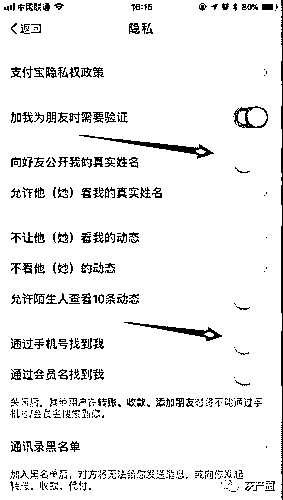

2)       手机端打开附近的人，撩完妹以后，要清理自己的位置信息。

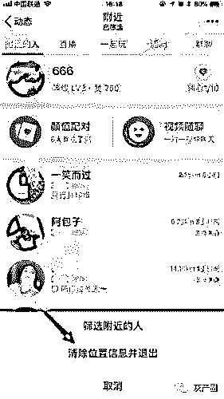

3)       进入微信 设置-隐私-添加我的方式-关闭通过手机、QQ、群聊添加我为好友。 

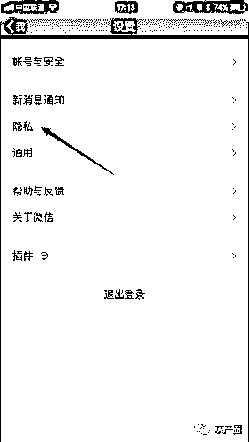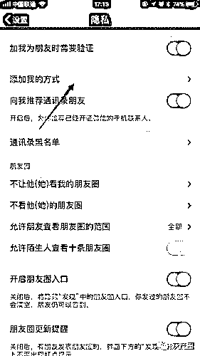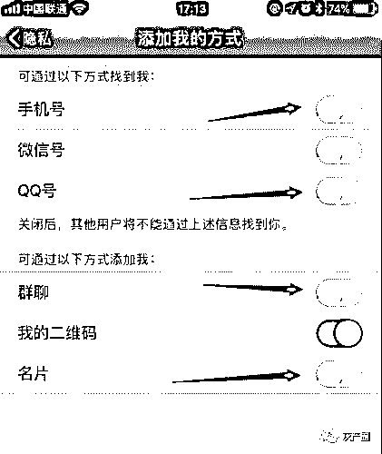 

结尾

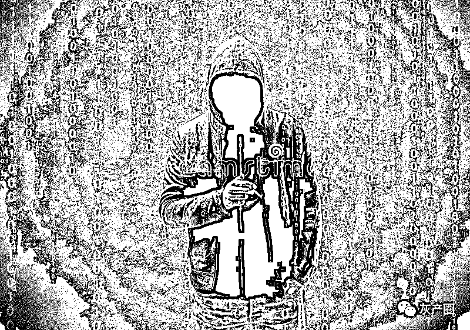

世上没有完美的防范个人隐私泄露的招数。文中所提到的方法也只能最大程度地保护我们的隐私不被侵害。

但是我们仍然阻挡不了个人隐私泄露的风潮，比如现在的垃圾短信、垃圾电话等等。

不管怎么说，最重要的还是在我们自身加强隐私权的意识，做到一定的防范，才能保证自己平稳的生活不受侵害。

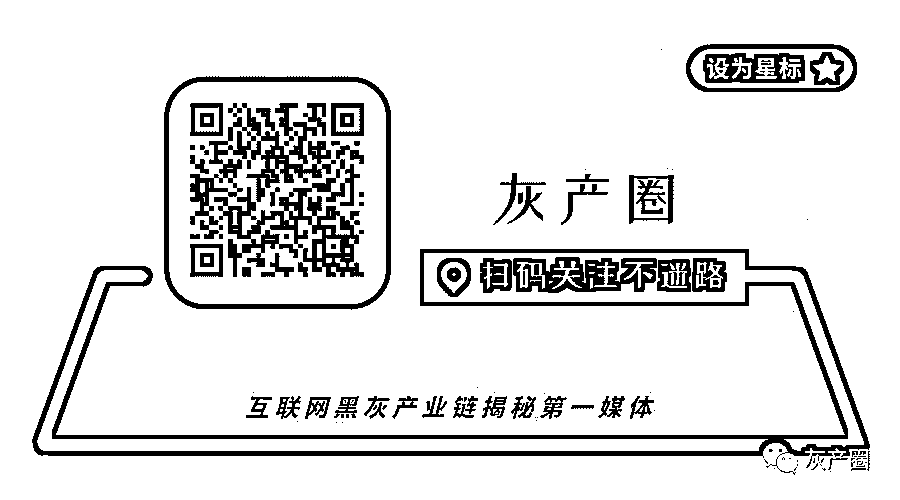

← 向右滑动与灰产圈互动交流 →

**阅读原文加入灰产圈高端社群**