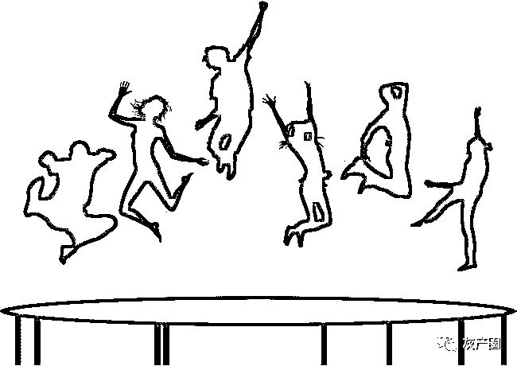

# 年轻人是怎样被网赌拖垮的?

> 原文：[`mp.weixin.qq.com/s?__biz=MzIyMDYwMTk0Mw==&mid=2247495554&idx=1&sn=f7b7b7ac71c5a7857d352c4757e71913&chksm=97cb24baa0bcadac43b1db748c11076a223079780392847d97093cb31f9d3d82f1a8f61fabf2&scene=27#wechat_redirect`](http://mp.weixin.qq.com/s?__biz=MzIyMDYwMTk0Mw==&mid=2247495554&idx=1&sn=f7b7b7ac71c5a7857d352c4757e71913&chksm=97cb24baa0bcadac43b1db748c11076a223079780392847d97093cb31f9d3d82f1a8f61fabf2&scene=27#wechat_redirect)

**点击上方蓝色字体免费订阅“灰产圈”**

01

儿时，村里小卖部有个赌博的场子。

傍晚六点，永远有一堆男人在那里叫嚣。

村里有个帅气的男人，年轻聪明又有才华，公认的好男人。有份稳定的工作，有个美丽的老婆，还有一双可爱的儿女，婚姻美满，前途光明，完美人生。

从他染上赌博后，幸福就走到了尽头。

在那个场子赌了两个月，他欠了 20 万。

那时候对一个普通家庭来说，拿 20 万还债相当于拿命，相当于把一棵树连根拔起。

妻子知道后崩溃，哭瞎了眼睛。

后来，妻子带着一双儿女离开了。而他，逃到了穷乡僻壤，再也没有出现过。

有人说，他被乱刀砍死，是追债的人干的。

大好青年，一入赌局，葬身火海。

在过去，赌博欠债，妻离子散，几乎是必然的结局。

现在，那帮人早没了人影，小卖部也倒闭了。互联网发达，人们有了新的娱乐活动，赌博也有了新的形式 —— 网赌。

2018 年初， 有两个年轻人组建了个社群，名为某某上岸群。社群的成员，深陷网贷，聚在一起，共同研究上岸之法。

发起者说，“起初我们推测，大学生网贷的原因大多是因为膨胀的消费欲。后来发现，46%的群友是因为赌博才上了负债的路。每 2 人入群，就有一个深陷网赌泥沼。”

网赌圈里，23 岁，月薪 3000，负债 100 万的故事，比比皆是。

时代变迁，经济发展，但骗子收割傻子的规律，从未打破，人性里的贪念和赌性，从未泯灭。

02

越来越多年轻人

葬身网赌坟墓

有个自称是资深玩家的网友，谈起了自己是如何入坑网赌的：

四年前，好奇害死猫，接触了网赌，一开始输了 200 元，一头雾水加悔恨当初。

等到发工资后，忍不住再下手一次。那次输了 3000 多元，最后一次想垂死一搏，然后金盆洗手，结果这次赢了 500 块，手没洗成功，反而越陷越深。

四年时间，最初从几十一注开始，后来的几万一注，前前后后大概输了 50 万。

输钱了和大多数人一样，加群找安慰，看到很多几千万家产沦落到看门的下场，还知道了网赌平台不给提款的无奈。

可是，大多数赌徒明知是假，还会抱着幻想以赌还债。

他没资金就去撸小贷，结果债务不减反增，陷入死循环：为了还小贷继续赌，赢了还小贷，输了套小贷。

大好青春，就这样没了。

像他一样，被网赌拖垮的年轻人，多到难以想象。

没有哪个赌徒愿意面对自己负债的真相。在这样的死循环里，他们只能自我欺骗说，等到哪天我还清了钱我就怎样……

特别是在校园，又或者刚出社会没多久的人，价值观尚未建立，欲望极容易膨胀。哪怕是他们意识到走错了路，也恐惧来自各方的斥责，所以很难面对真相，也不会解决问题。

他们很难跳出这个金钱游戏。

哪怕有一天天赐良机，亲人帮忙还了债，也难保他们不会再次进入金钱游戏里。

网赌是座坟，葬的是未亡人。

03

贪念勾引贪念的骗局里

他们是绑匪，也是人质

网易里，报道了一个故事：

某某 22 岁，在老家超市当收银员，每月 2500 元工资。有天接到了舅舅的电话，说有份工作介绍，“每月 6000 元底薪，能拿多少看能力。”

某某问这个工作具体做什么，舅舅介绍的很含糊，“就是聊微信和 QQ, 把客人带到网站里注册账号，让他们玩游戏。”

半信半疑，但听着 6000 元的数字，某某心动了。

她坐着火车，去到了舅舅说的公司。入职那天，老板娘很凶，啥也没说就发了份文档，里面都是些聊天话术，让新人当晚背熟。

工作流程是这样的：先与客户建立信任，再慢慢把他们带到赌场；接着让他们完成充值。

舅舅支招：先利诱再色诱。

一是发一张赚钱蓝图，比如是“1000 元本金 10 个月 100 万”；接着发一个网上买来的美女视频，然后说 “如果你玩得好，就陪你吃饭看电影。”

某某先是骗了个老乡充值 2000 元。某某有了成功的经验，就开始大量发展下线。

直到有天，警察找上了门，团伙落网。

某某 2017 年毕业，工作还不到一年，这份“工作”像铁路的分岔线，带着她拐向了另一条路，最终停靠在冰冷的高墙里。

他的舅舅 XXX，在事发后冷漠的说，我也是受害者，为了活路，只能发展下线。

2017 年，XXX 注册了网赌账号，下注“百家乐”和“龙虎斗”，几个月输掉全部身家。他开始借贷翻本，签了月息 5%的借条。

“剩下的几万还不掉，徐老板说什么我只能照做。知道这个犯法，只能走一步看一步，想做代理看能不能翻本。”

网赌实行代理制，以金字塔传销的形式逐级发展。亲朋好友共同作案，发展参赌人员；参赌人员不断残害下一个人，收割金字塔最底层的利益。

无声的骗局里，人人是人质，也是绑匪。

他们一开始输了钱，然后为了活命，通过骗钱来赚钱，彻底进入一个尔虞我诈的骗钱圈里。

我们这代人是在温饱时代成长起来的，接受的教育里就是谈钱俗气，以至于没有多少人建立起财富观。

比尔盖茨、巴菲特为什么可以当首富？乔布斯为什么有身价？钱是怎么来的？什么才叫财富？

很少年轻人能在出社会前想明白这些问题，财富观不明确，受诱惑被骗是必然。

04

赌输的不是钱

而是本性

有个软件硕士，在阿里工作过，很出色，但也深陷网赌，过程和上面的例子没有区别。

输输赢赢的钱，近 100 万：女友和自己积攒的 8 万，妈妈的 20 万，同学的 50 万，借呗信用卡等网贷有 40 万左右。

输了触目惊心的 100 万，他还戒不了赌。

“我只剩下躯壳，妈妈被我折腾的只有半条命，自己没有任何信用可言，说了几百个谎言。现在月薪 1.3 万，可总想着哪天能翻本，只要有几千块就想着赌。不知道怎么面对女友还有我妈妈，很想回到过去，很想当回阿里那个出色的我，但真的戒不了。”

为什么戒不了？

几百万从手里流过，分分钟赚几万，分分钟亏几万，而朝九晚五上班到手才 1 万，负债生活什么时候才能是个头？当然是渴望赌一把翻身。

年纪轻轻，财富观在赌局里彻底被毁了。

有个工程师，也无数次发誓戒掉，但债务一得到控制，就不甘心：为什么要工作几年去还这笔钱？为什么一次打的没赢？这次试一下说不定会赢，赢了钱可以活得跟普通人一样轻松。

抱着这种想法，四度跌入深渊。

他家里有个老母亲，身体不好，还上班还债，他却在偏僻的网吧沉沦。

23 岁的年轻人，半死不活躺在出租房里，不是搜着赚钱的帖子，就是撸着小贷，一天差不多吃一顿，抽两包烟，睡三四小时，无限透支生命。

得失极易的金钱游戏里，他们习惯了以逸待劳，习惯了投机取巧，习惯了自我欺骗，就不会愿意走上正道。

网赌最可怕的不是你输了多少钱，而是你输掉本性。

在死循环里，你恐惧，你焦虑，你自我欺骗，你在精神地狱里出不来，你浪费人世间最宝贵的时间资源。

05

和你对赌的不是运气

而是上帝

某平台充值 1000 元，会送给你 20 元，有时候做活动会送你一些彩金。

阿鑫有次赢了 2 万元，提款时没到账，找客服理论，客服说是银行 24 小时延迟到账，如果 24 小时还没到账再打电话。

24 小时没到账，再打客服电话，客服说等银行退款后再转账过来，结果一等就是 3 天。

阿鑫幸亏自己玩的是大平台，接着升级了 VIP6（充钱），平台送了 5688 彩金。拿着这 5688 彩金，赢了 10 万元，美滋滋的提款，坐等到账。

第二天没到账，阿鑫打电话问，客服说是线路维护。阿鑫等了 3 天没忍住，把 10 万输光了，结果第四天，客服说线路维护好了，可以提款了。

阿鑫很气，充了 1.2 万，又赢了 4 万。这次吸取上次提款 10 万的教训，提款 2 万，剩 2 万继续玩，结果还是以线路维护不给提款。

后来又赢到了 10 万，客服还是说等维护好了再给提款，阿鑫用这 10 万玩，赢到了 30 万。

阿鑫想提款 30 万上岸，问啥时能提款。问了 2 个月后账户登录不了，客服一听是他直接挂机。

玩了四年的平台，最终以黑了他 30 万而结束。

可能有人说，他是遇到了黑平台，我的平台靠谱。

阿鑫说，“醒醒吧，能提款几十万的是因为你输了有几百万。还没被黑，是因为他们觉得你还有油水榨取，不是不黑你，而是你还不够资格被黑。”

网赌软件的后台，会让“庄家”第一时间了解赌徒的信息，然后为赌徒定制沉迷下去的方案。

和你赌的不是运气，是上帝。

06

世界各地最受欢迎的赌博游戏就是百家乐。

人们沉迷，是因为它的输赢看上去就是 50%。

但赌场出老千，是再正常不过的事。那网络游戏，就更容易出千了 —— 在程序上做控制，可以让玩家永远是输家。

举个例子，数据造假，模拟几十上百万的人同时在线下注，设定下注重的乙方输多赢少。

这种程序很容易做到，玩家即使短时间挣了钱，只要不及时收手，就会全部赔进去。

有些专家说，百家乐是种数学游戏，用数学方法才能在百家乐里找机会盈利，这也给赌徒们沉浸赌局的理由和信心，戒不了。

专家说的没错，百家乐数学知识运用完美，庄、闲、和、对子，都是数学精心设计的陷阱。

这个陷阱就是：你只要长期在这里玩，一定输。

你用数学知识可以赢一局，但你用数学的哪门知识都跳不出这个陷阱，因为人的赌性在欲望面前只会越来越大。

为什么赢的总是别人，输的总是你？

因为别人赢的，就是你啊。

你去研究那些庄闲规律，排列变化，就是自欺欺人。

07

大多数读者可能会觉得，文章的故事和你没关。

我想说的是，年轻人网赌是个缩影，它反映的是当代年轻人的心态 —— 急于暴富，空想主义

这个社会鼓吹快，割韭菜的都在用“教你月入过万”“年入百万”来引诱你，好像全世界都有钱，就你差了点运气和速度。

有人还没干点啥就当起了青年导师，大吹一顿，啥啥啥都是风口，抓不住你就是傻子。有人刚毕业就嚷嚷创业，说这是要追求梦想，要追求财务自由。

年轻人都有理想主义，我也有，但看过太多德不配位的人，吹完牛后没几个月就迎来灾难，一夜爆红，一夜人设崩塌；一夜暴富，一夜倾家荡产。

鲜花掌声容易迷乱了心智，轻而易举得到的金钱更容易毁了价值观。

我不想要这样的理想主义人生。

很少人接受这种规律：你 20 岁许的愿，要 35 岁才会实现。

我们没有耐心。

我们更愿意相信捷径，跟潮流，这玩几个月，那试一两年。

看着别人做的那么好，就觉得自己是差了运气。

可财富永远遵循均值回归定律。

就像没多少个买彩票的人能进入真正富人阶层，你轻而易举得到的财富也会轻而易举失去。

你值多少钱，就吸引多少财。

← 向右滑动与灰产圈互动交流 →

**阅读原文加入灰产圈高端社群**