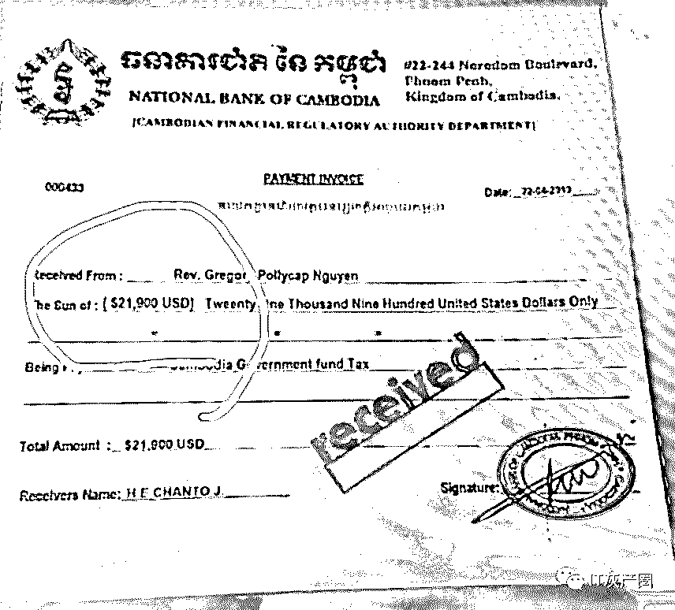
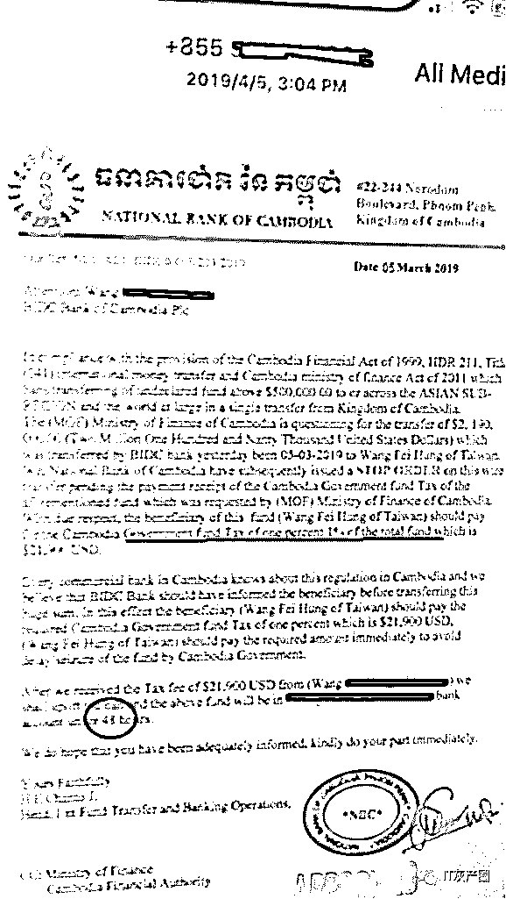
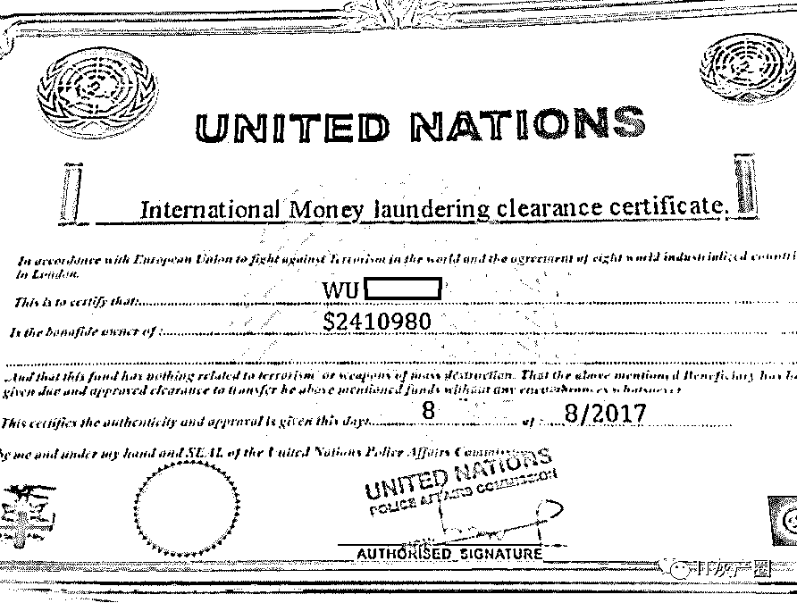
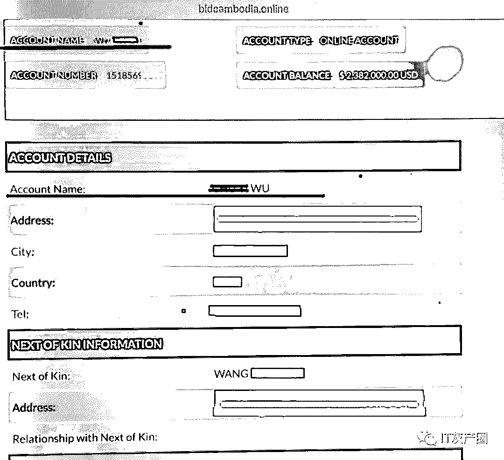
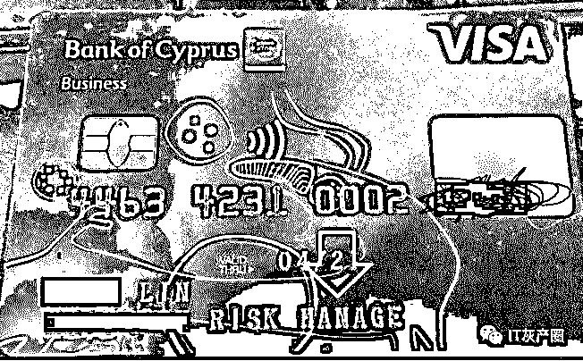

# 200 万美刀的玫瑰陷阱：讲述一位老人和外国情人的爱恨情仇...

> 原文：[`mp.weixin.qq.com/s?__biz=MzIyMDYwMTk0Mw==&mid=2247495549&idx=1&sn=605d8e3f0205b150bf99afba2bb03e39&chksm=97cb2445a0bcad5386988bbc8d13583c402b64b5b78da774c91f3ac84034b8d7ac106ff066f9&scene=27#wechat_redirect`](http://mp.weixin.qq.com/s?__biz=MzIyMDYwMTk0Mw==&mid=2247495549&idx=1&sn=605d8e3f0205b150bf99afba2bb03e39&chksm=97cb2445a0bcad5386988bbc8d13583c402b64b5b78da774c91f3ac84034b8d7ac106ff066f9&scene=27#wechat_redirect)

**点击上方蓝色字体免费订阅“灰产圈”**

粉丝投稿，作者：Nanara

关于资产继承的骗局灰产圈已经写过很多次了，一般都是仅限于国内发生的骗局，有类似于“民族资产解冻”的骗局几十年了还在继续，灰产圈接到粉丝的投稿讲述了一个跨国资产继承的骗局，这位粉丝来自国外，中文可能不是很好，翻译如有不顺，敬请体谅，这位粉丝从事金融安全相关工作，这个故事也是发生在她身边的真实案例，

来分享一下个故事吧

有个北京的老人看起来非常忠厚老实跟我说了

“我这边需要你的帮忙，因为我当年跟我一起上战场的老兵的女人好上了”

“后来一直没敢跟他联系”

毕竟身为一名隔壁小王给自己的朋友戴上了原谅帽

我问他

“那你需要什么帮助呢 ？”

虽然这老人结节巴巴的听了让人非常心烦，但是毕竟是自己的乾爹介绍来的

也是一间公司的老总（他要把钱搬回国内，也就是洗钱）

（再一次声明

他结巴的程度耗损了我的脑驱动 95％差点再也无法重启）

他说那个跟他好上的女人后来嫁给了一个国外的富商

富商死的早给这女人留了大笔的财产

于是他就把手机里头的网银上的余额给我看了， 200 多万美刀！

但是这女人把钱放在了柬埔寨…

就给他传了讯息

这女人号称也快死了得了肺病。

会有外籍牧师跟他联系的

然后在海关的监管仓间也有放了 800 万的现钞箱由 G4S 公司（士瑞克保全公司，英文名称为 G4S Secure Solutions，缩写为 G4S。全球第一大保安公司，为 2012 年伦敦奥运安保承包商）所处理的

他就陈述了他已经缴纳了多少的钱多少的证人费用都有收据的

看了一堆证明文件

说实在的

身为一名国际反洗钱师第一件事情就是要求他把文件给传给我

一看问题来了

这是属于高级智商骗术应用在记忆力不是很好的老人来下手的阿

个人觉得有点浪费不过也罢

（真的很不错还有用心在做素材）

户头有 219 万多老人觉得缴纳个 21900 美刀给

柬政府合理吧

右边这张图有个来自+855 的简讯

反正就是缴了 21900 美刀我就 48 小时给你放款

后来又说了因为行政程序要多缴纳 21900 美刀的

一半作为罚款 ？

还有证人费并且涨价版本的

各种要钱然后都是跟这个当初给人帽戴的小王说下

个步骤就差不多了

反正就跟水煮系列一样

水煮牛 水煮鱼 水煮三鲜 各种大大小小的款都指向

了最后的国家宝藏

他们捉著的也是一份老情感的寄托我猜

只能说相见恨晚不然我一定管他叫乾爹的

 

各种联合国名义反正英文他们看不懂 上面写著就是联合国证明的资金乾净没问题证书

（然后这样再收个 700 刀+印花税 800 美刀）

 

当他给我看这个继承的时候我火气全部上来了

……..

你在跟我开什么玩笑？光上上面的帐号名称就该一样的 WU 小美 跟小美 WU

帐号会是同样的吗 ？

这时候自称为牧师的骗子跟他说柬埔寨这国家就是这样

这是一样的

我是老天派来协助您的

“你们为什么要这样欺负我未来的乾爹？”

太多太多太多到现在我这个无缘的乾爹居然跟我说

他要转 5000 美刀因为在海关 G4S 监管的箱子他需要做点处理

无缘的乾爹：

这牧师找来了一个来自赛普洛斯的外交关，

这外交官还要再申请一份外交标签封面来掩盖我的资金，

因为这是我老相好的钱我要好好保管著的，

完成后他就会把全部的美金现钞通过顺丰快递送到我住的小区了….

然后让他把款项汇款到一个他指定的越南帐户 ？？？？

为什么赛普洛斯的外交官要指定到那边

他居然说这是因为 BIDC（投资与发展银行）这间银行在越南有个

BIDV（越南投资发展银行）是主行，要中转才能给到 BIDC 柬埔寨

银行……他才能处理

我实在是受不了了我只好拿出我的赛普洛斯

名下的公司证明给他…

如下图……很荒谬的….本美少女开的还是

风险控制与管理公司……

结果他还是相信骗子………..

骗子改口说她是联合国的那种只是刚好经过赛普洛斯…..

这故事之前，其实老翁经过了半年钱前后后已经付掉了 20 万美刀了

重点是故事未完待续

后来我就通过关系联系上了柬副总理身边的远亲

那一名国内人士居然说这很正常的

常常都有过来说继承了多少遗产，天天都有人问。

一开始也觉得都是祖国同胞发现这种国家宝藏等级问到最后都是空的也不敢说

因为以前说了有人在当地就选择自我了结了…. 

← 向右滑动与灰产圈互动交流 →

**阅读原文加入灰产圈高端社群**