# 四折买乐币？醒醒吧！你是不是个“撒币”？！

> 原文：[`mp.weixin.qq.com/s?__biz=MzIyMDYwMTk0Mw==&mid=2247495512&idx=1&sn=0d2538c224de1c3dab2224a8a00d2b2a&chksm=97cb2460a0bcad76d99f5351e9b9234a0ce3731a0fddcfe41a25b0a674b31567ebda507ee0bb&scene=27#wechat_redirect`](http://mp.weixin.qq.com/s?__biz=MzIyMDYwMTk0Mw==&mid=2247495512&idx=1&sn=0d2538c224de1c3dab2224a8a00d2b2a&chksm=97cb2460a0bcad76d99f5351e9b9234a0ce3731a0fddcfe41a25b0a674b31567ebda507ee0bb&scene=27#wechat_redirect)

**点击上方蓝色字体免费订阅“灰产圈”**

导语 

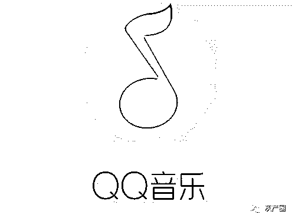  

6 月 6 日，QQ 音乐通过官方小助手发布了一条打击网络黑产的公告，称 QQ 音乐近期发现有网络黑产通过 App Store 漏洞低价刷取大量乐币。

这一行为将致使 QQ 音乐实际零到账，因此将对通过非法渠道违规获取乐币的账号及乐币进行处理。

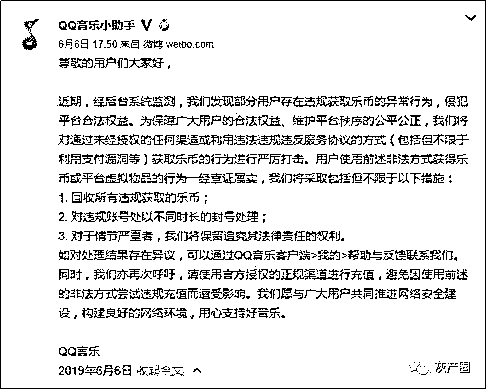

“乐币”事件回顾

近年来网络黑产无孔不入，总是找各种漏洞和空子去刷大量非法财产，既薅了平台的羊毛，又伤了用户的利益。

**想要了解清楚这一事件的始末，首先要搞清楚乐币是什么。**

> ## **乐币是什么，可以做什么？**

乐币是 QQ 音乐内的虚拟货币。目前可以在音乐弹幕和直播中购买礼物，用于歌曲打榜、彰显个人等趣味玩法。

乐币是由 QQ 音乐发行的一种虚拟货币，通常用于音乐弹幕和直播中购买礼物，或可进行歌曲打榜以及数字专辑购买等操作。

在此次事件中，qq 音乐发布公告称，有部分用户涉嫌违规获取乐币。

先看看 qq 音乐官方对于乐币的获取方式及乐币的兑换比例

> ## **2、乐币怎么买？**

目前 1 乐币=0.1 元，你可以在如下位置购买乐币：
①QQ 音乐-音乐馆-排行-人气榜-打榜-【获取乐币】
②QQ 音乐-单曲弹幕列表页-送礼物-【获取乐币】
③微信公众号“QQ 音乐”-豪华绿钻-【购买乐币】
④微信公众号“QQ 音乐 VIP"-VIP 服务-【购买乐币】 

根据以上信息我们可以得知的是，官方的乐币充值渠道，仅以上四种。当然，还有一些乐币，我们可以通过各类 qq 音乐的活动获取。

那么 qq 音乐公告中宣称的，

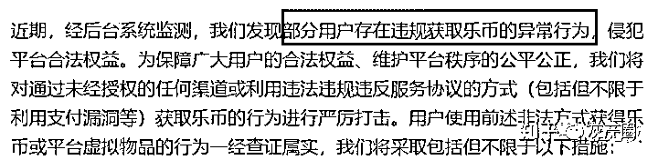

违规获取乐币是怎么回事呢。

根据推测可以得知，通常存在以下情况。

*   **qq 音乐关联的第三方平台支付流程有误，如常见的利用 APP store 的退款机制，不花钱就可以获取到对应数额的乐币。**

*   **qq 音乐活动问题，导致乐币并未流通到对应的客户手中，而是被“羊毛党”批量薅羊毛，再转而出售给其他需要乐币的用户**

*   **qq 音乐内部人员存在贪污受贿情况，导致乐币大量流出**

那么为什么是在这个节点上发出此公告呢？个人分析后认为，原因可能有以下几点

*   **大量违规乐币被使用，导致财务对账过程中发现异常，由此发现乐币机制存在一定问题**

*   **违规乐币被使用后，对应专辑公司要求进行结算，财务计算后发现存在亏损情况**

首先我们要明确的是，无论是 qq 音乐，还是常见的各类 app，通常都会有一定的运营费用，例如支付宝经常存在的各类扫码送红包，年终的红包节，以及最近的 618 红包活动等。

因此少量的违规乐币使用，很容易被误认为是活动运营导致的亏损，因此可能不太重视。

有意思的是，在 qq 音乐的公告中也体现了这一点

也就是说，大量违规乐币的使用，发生在近期。而为什么是在 6 月 6 日这个时间点发布公告，则可能是内部流程中，发现了异常，而对于腾讯这样的巨型企业而言，内部流程一到两个月，转而发现异常，根据分析后，发布公告，是再正常不过的流程。

其实这本该是一件小事，只不过是互联网过程中不能再常见的“薅羊毛”事件，请容许我暂时这么形容。

**但有意思的是，对于流量粉丝们，这却如平地惊雷一般，炸出了无数的鱼**

火箭少女 101 成员孟美岐，近期发布了新专辑，而她的粉丝们，也对专辑做出了热烈的响应，截至当日，据其粉丝称，该专辑购买总金额已超出 1000w 人民币。

有意思的是，在 qq 音乐官方公告宣传该成绩不久后，就发出了这篇公告，提示有用户存在违规获取乐币。

根据其粉丝宣称，孟美岐后援会可公布本次 ep 打榜的账单明细，而在账单明细以及对应的支付截图中，我们可以看到，乐币购买存在大量高额折扣，平均折扣率为 5 折，且支付对象非官方帐号，均为个人微信帐号。

这就显得十分有意思了，我们再回过头来看一下乐币的获取渠道。

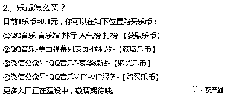

并不存在对个人微信帐号转账购买的形式获取乐币，也就是说，这些乐币的来源，均为第三方提供。

第三方提供乐币，说来也是十分正常的事情，淘宝/天猫，等等平台，都有无数的代充平台，但有意思的是，即使是代充平台，其折扣率通常也不会低到 5 折的程度，也更不会使用个人微信帐号接收汇款。

> **那么 qq 音乐的这次公告，到底是针对谁呢？**

再联想到火箭少女 101 成员孟美岐粉丝近期在微博上使用的控评语言：

华语乐坛首位 90 后数字专辑销量破千万的女歌手

则显得有些奇妙

而更有意思的是，在该问题下，华语乐坛首位 90 后数字专辑销量破千万的女歌手的粉丝，正在疯狂的攻击同队队友火箭少女 101 成员-杨超越的粉丝，认为杨超越粉丝出于眼红，便“黑”她们，个人先不讨论这种逻辑是否合理，对于漏洞百出的孟美岐后援会，她们都没有一丝想要去确认真相的想法，而是在微博粉丝大 V 的“带领”和“号召”下，下载知乎并注册帐号，以对该问题下的高赞回答点踩或举报。

这里，不是微博，控评不能解决问题。

同时，追星，是要变成更好的自己。

同时我也深刻的理解到国家对于大多数“流量明星”的态度。

如果粉丝群体不能正确认识问题，而只是为了“偶像”去战斗，在“职业粉丝”的带领下冲锋陷阵，或是为“职业粉丝”们提供海景房的机会。那么这样的“流量明星”，无疑是会误导那些尚未形成三观的小孩子们。

希望孟美岐粉丝能够正确认识问题，追星不是为了自我以及偶像的虚荣，而是发现并学习偶像的闪光点。所谓的千万 EP，若是造假得来，不要也罢。

根据目前可得的官方信息，正常数字专辑的流通图如下

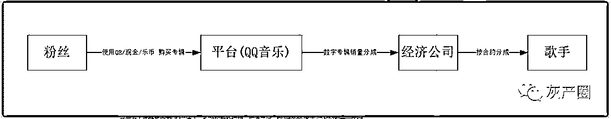

粉丝使用 QB / 现金 / 乐币 购买数字专辑

平台方（此处举例为 QQ 音乐），扣除企业所得税，渠道费后，给与经济公司或唱片公司一定比例的销售额分成

经济公司拿到分成后，会根据与歌手本人的合约，给予定额或比例的分成

而 QQ 音乐本次的公告中，所涉及的流程是哪一块出现了问题呢？

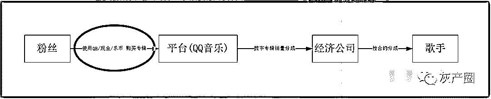

粉丝在购买专辑时，使用的是非正常来源的乐币，即之前所述的

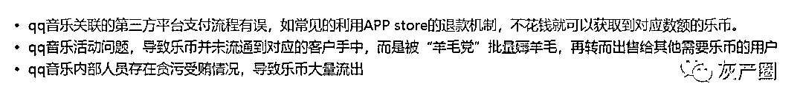

以孟美岐此次专辑为例，若乐币为违规乐币，则平台方实际收入可能仅为销售额 1000w 的一半，即五百万。

但缴税仍以一千万计算，按中国现行企业所得税

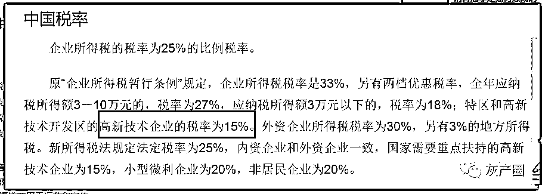

QQ 音乐应为 15%税率，扣除税费，到手后需要给经济公司一定分成，根据经济公司的议价能力，其比例暂无公开信息可得，但仍有可能无法覆盖该部分分成金额，而 QQ 音乐本身，还需要扣除一定的渠道费用于运营和宣传。

且，如果违规乐币的来源中，有大量金额若是使用 APP store 的退款机制的话，QQ 音乐对于该部分乐币，是收不到一分钱的！

我们再来分析一下，该环境出现了什么问题

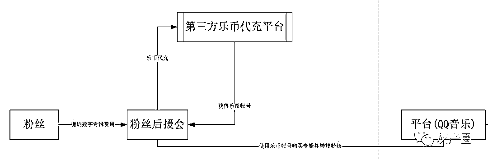

在粉丝与平台之间，多了一个粉丝后援会，以及第三方的乐币代充值平台

粉丝给予金钱交由粉丝后援会，由粉丝后援会执行乐币购买及专辑购买操作，在乐币购买时，根据不同的代充平台，可拿到不同的折扣程度，而粉丝对于后援会所商议拿到的实际折扣程度，一无所知。

而由第三方乐币充值平台获得的乐币，平台方或许可能拿不到一分钱，甚至可能还需要倒贴税额和分成。想来也是 QQ 音乐此次公告时话语间充满警告意义的源头。

当然了，QQ 音乐背靠腾讯，财大气粗，对于本次事件，也仍以警告为主，并且暂未追溯过往问题乐币。

只是对于粉丝而言，辛苦赚来的钱，交由粉丝后援会进行打榜，却没有任何的议价权，只能任由粉丝后援会给出的所谓漏洞百出的账目，而那些真金白银，则是实实在在的落在“职业粉丝”的口袋中。

QQ 音乐官方最新公告

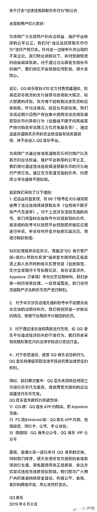

提炼要点如下：

*   **IOS 渠道出现坏账问题**

*   **涉嫌黑产及第三方代充问题**

*   **使用非法途径购买的资金 QQ 音乐拿不到一分钱**

*   **暂确认已有 96 个帐号涉嫌高额盗刷乐币**

根据以上要点基本可以确认此次事件是由于：

*   **高额乐币代充**

*   **IOS 结算失败，QQ 音乐需要额外支付包括但不限于 IOS 手续费 / 税费 / 销售额分成**

通俗点来讲，就是 QQ 音乐一分钱没赚到，还要倒贴钱。

不负责任的猜想一下，若经济公司分成比例只需要比乐币折扣比例高，那么经济公司完全可以使用这种方式，既可以赚到销量作为明星的成绩，又可以小赚一笔，若是野心稍大，投一千万赚两千万也不是不可能，这也是 QQ 音乐此次公告第三点中

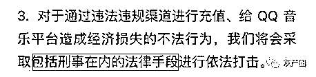

结尾

通过网络黑产获取虚拟货币，蒙受损失的并不仅是平台，用户权益也有可能受到严重损害，因为黑产一旦被平台发现，不仅非法获取的虚拟资源会被冻结，严重者甚至还会面临账号被封、法律诉讼等风险。

因此打击非法充值等网络黑产，除了音乐，实际上也是游戏等各个产品的日常重点工作。

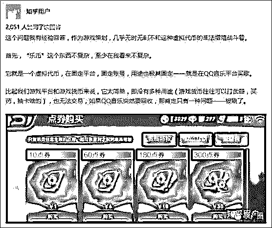

**如此看来，QQ 音乐此次举措非常合情合理，那为什么部分粉丝大号反应会如此激烈呢?背后的原因可以说是非常耐人寻味了~~**

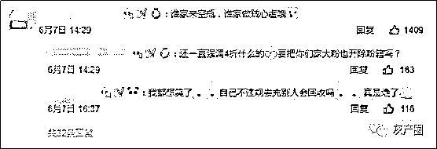

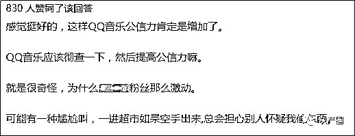

众所周知，在饭圈有一个不成文的潜规则，就是职业化的粉丝头子往往收入惊人，而且这些收入还不是能见光的那种。

在知乎讨论《如何看待 qq 音乐于 6 月 6 日宣布部分乐币违规获取并进行回收?》上有一个高赞回答，就讲述了这个产业的种种乱象。

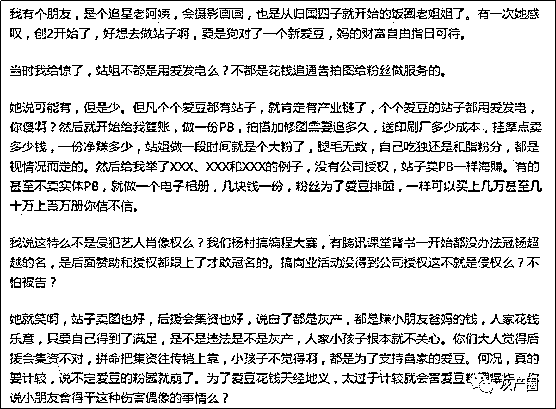

近年来国家对网络黑产和非正常充值的监管和打击力度正在加强，相信随着时间的推移，想通过网络黑产来大量获益的手段将变得不再可能。同时，也希望粉丝们在为爱豆买专辑打榜时可以擦亮眼睛，拒绝网络黑产，共同创造一个公平公正的良好环境。

← 向右滑动与灰产圈互动交流 →

**阅读原文加入灰产圈高端社群**