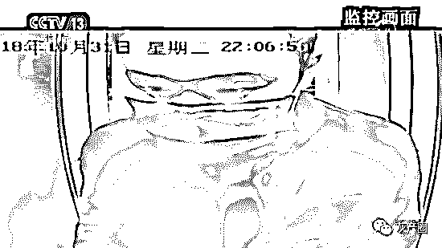
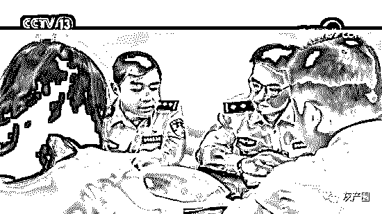
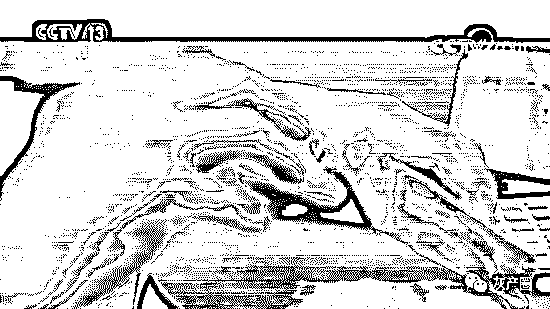
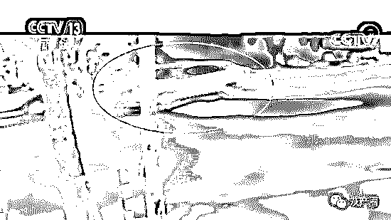
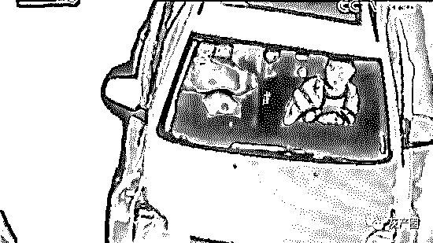
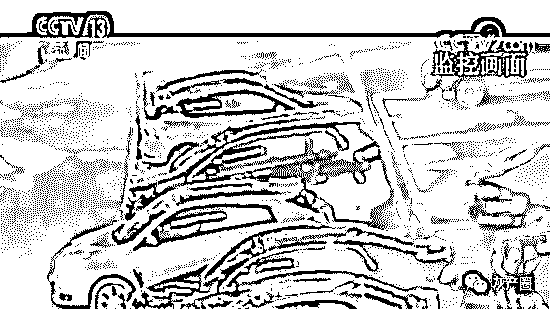
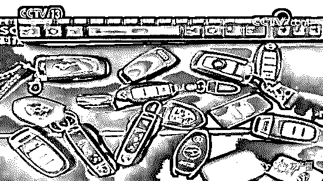
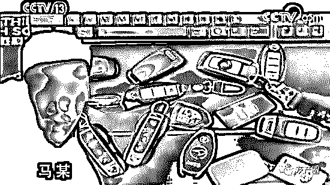

# 银行漏洞改存单，50 元变身 50 万，半年骗取 3000 万！这是什么骚操作？

> 原文：[`mp.weixin.qq.com/s?__biz=MzIyMDYwMTk0Mw==&mid=2247495497&idx=1&sn=f1d0c52aacf085f4729fb8ae0cecc913&chksm=97cb2471a0bcad67904f9de57f0933eae8730e4687d03e7f0097fc584fe6d876516266105e92&scene=27#wechat_redirect`](http://mp.weixin.qq.com/s?__biz=MzIyMDYwMTk0Mw==&mid=2247495497&idx=1&sn=f1d0c52aacf085f4729fb8ae0cecc913&chksm=97cb2471a0bcad67904f9de57f0933eae8730e4687d03e7f0097fc584fe6d876516266105e92&scene=27#wechat_redirect)

**点击上方蓝色字体免费订阅“灰产圈”**

导语

大家都知道银行卡的存款数据，个人是不可能随便修改的，然而在辽宁沈阳，却有这么一个二手车销售员，天天都梦想着能够找到银行的漏洞，把自己的存款余额修改了。

他抱着这个想法，用五年的时间不停地在网银上尝试，而就在去年的 5 月份，他这个看似不可能的想法，竟然还真的实现了，一张只有 50 元存款的银行卡，被他篡改成了 50 万，随后他用这张虚假的存单从银行贷出了将近 50 万元的现金，短短半年时间，他用这种方法，从银行骗取了将近三千万的贷款。如此匪夷所思的操作是如何实现的呢？

事件回顾

这是上海松江警方调取的一段监控视频，一名带着口罩的男子趁着夜色走进了辽宁铁岭市的一个 ATM 自助存取款机。

男子的口罩遮住了半张脸，而他似乎对外界也十分警惕。更让人觉得可疑的是，男子在 ATM 机上操作了近三分钟，却只是向帐户里存了 200 元钱。

这名男子是谁，他为什么在夜里如此乔装打扮，大费周章地跑到自动存款机上去存 200 元钱呢？

这还要从上海松江警方接到的一起巨额诈骗的报警说起。

上海市公安局松江分局刑侦支队反电诈队队长 KK（化名）：

我们接到银行报警，说他们这里有下属的一个支行，有一张银行卡，发现有一个诈骗的行为。

银行的工作人员在内部审核当中发现，这张银行卡有虚开这个存款单的情况，来套取银行的贷款，涉案金额从他们统计的这一张银行卡一共是 300 多万。

据银行的工作人员介绍，之所以会发生这样的事情是因为该银行不久前才推出的网上“存单质押贷款”业务系统存在安全漏洞。

上海市公安局松江分局刑侦支队反电诈队探长 CC（化名）：

就是按照正常情况下，必须是达到一定的存款金额才能把这个贷款给贷出来，但是这几笔交易明显就是只有五十元的存款，但是却贷出了近五十万元的贷款，所以说这明显是不符合他们这个行内业务的规范的。

这家银行的工作人员向警方说明，在 2018 年初，银行在自己的网银客户端上推出了在线“存单质押贷款”业务。

只要有这家银行没有到期的定期存单，在线就能申请不超过存单金额的 90%的贷款。

可是到了 2018 年 9 月底，该银行上海松江支行工作人员却发现，有人竟然通过这项业务，利用 50 元存单就骗取了近 50 万元贷款。

银行发现漏洞后，立即进行了全国范围内的自查，最终发现这笔被骗取的贷款仅仅是冰山一角。

CC（化名）：该银行分行自己一共是三笔，但是他们把这个情况上报到了他们的总行，总行在他们全国范围内进行了自查，发现总共涉及到五个地区，总涉及贷款金额大概有三千万。

由于案情重大，上海松江警方在接到报警后，立即成立专案组，调集专业的反电诈刑警展开调查。

KK（化名）：包括银行，包括其他的数据公司，我们反电诈队应该说相对来说，专业性还是比较强的，沟通联系比较多，所以当时我们刑侦支队把这个案件接下来之后，就直接交给反电诈队来进行侦办。

反电诈队的成员立即对银行提供的涉案卡号进行了调查分析。经过统计，民警发现共有五个账户涉嫌用同一手法来骗取贷款。

嫌疑人利用银行安全漏洞，将账户内的小额存款篡改成了大额存款，随后再进行大额的贷款诈骗。

CC（化名）：也就是说把他的 50 块钱存款修改成了 50 万元，变成 50 万元之后，那银行贷款服务器上面就审批通过了他的贷款申请，他就把这近 50 万元给贷出来了。

虽然作案手法一致，但是涉案五个账户的持卡人却分散在不同的省份，相互之间也并没有什么关联。

这五个异常账户，造成银行巨大的经济损失。虽然作案手法一模一样，可是经过调查，警方发现这些持卡人根本不在同一地方，更不相识。

经过进一步调查，警方排除了持卡人作案的可能性。那么这就意味着，有人冒用身份获取了这些银行账户。于是警方把把调查目光转向了存款人。

上海市公安局松江分局刑侦支队反电诈队探长 JJ（化名）：他是利用银行的漏洞，将小额的钱就是篡改成大额的。那么他的银行卡中一定需要存有一定的金额的钱。

那么这些存款都是在什么地点存的，

找到向账户内存款的人是否就会成功将案件侦破呢？

JJ（化名）：马上重新去翻阅大量的银行流水，在每一笔银行流水中都看到了有小额的存款，然后我们马上就从银行调取了小额存款的记录，发现有几笔是在辽宁铁岭这个地区的。

专案组民警立即赶赴了辽宁铁岭，并第一时间调取了涉案的存款视频，随后画面中这名年轻的男子出现在了警方的视线中。

KK（化名）：

应该在 20 岁到 25 岁的样子，因为从他的发型也好，包括他走路的步态也好，肯定应该是不超过 30 岁的这样一个年龄，那也比较符合这些新型犯罪的主要嫌疑人的特征，他毕竟肯定是抓住这个银行的漏洞之后，肯定是首先要对电脑这个东西比较熟悉。

民警发现，男子在夜间带着口罩出现，看上去十分谨慎，可他却又不合常理的只存了 200 元钱，那么这名举止异常的男子是否就是那个利用银行漏洞进行骗贷的犯罪嫌疑人呢？

KK（化名）：银行的监控是没有照到嫌疑人有交通工具，是走过来的，我们当时就翻看了周边马路边的所有其他商户的监控，发现有一个烧烤店，有一个监控是对着这个银行，通过这个烧烤店的监控发现这个嫌疑人来之前是开了一辆白色的 SUV 的轿车。

白色轿车停在了离银行较远的地方，在银行的监控范围内根本看不到这辆

车。民警发现这辆白色轿车后，随即开始追踪这辆车的行驶轨迹。

最后发现这辆车是从沈阳开到铁岭，然后存完这 200 元之后，又从铁岭返回沈阳，那么这辆车的轨迹完全是不符合逻辑的。除此之外民警还发现，那名举止神秘的存钱男子并不是独自驱车从沈阳来到铁岭存钱的，那辆白色轿车上还有其他人的存在。

KK（化名）：

发现车辆上应该是至少有两个人，车辆前排有个驾驶员，后排应该还坐着一个，但是从现场监控来看，只有一个人下车到银行里存款，然后这个人就直接回到车上，然后这辆车就走了，所以当时确定至少两个人以上。

几名男子夜间驱车往返近三个小时，只为存款 200 元钱，这不寻常的举动背后到底隐藏着什么秘密呢？

民警初步判断，这辆车上的几名年轻男子很有可能就是利用银行漏洞进行贷款诈骗的犯罪嫌疑人。

深夜驱车跨城只为存 200 元钱，几人的行为可真诡异，这无疑也加大了他们的作案嫌疑。那么他们的真实身份究竟如何才能确定，几人的落脚点又在哪呢？

KK（化名）：从沈阳到铁岭，然后铁岭又回来，那我们觉得这辆车上的嫌疑人应该居住的应该在沈阳，为什么？因为他当时回来的时候，已经是晚上的 11 点多，那么确定他应该回到落脚点。

此外民警发现，嫌疑人使用网银作案的时间，与他们存钱后驱车回到沈阳的时间较为接近。然而由于几名男子所乘坐的白色轿车没有悬挂车牌，要想以车找人，直接确定几名嫌疑人的身份并不容易。

CC（化名）：我们发现这辆车不止是作案当天不挂牌照，是它从来都是不挂牌照的，而且运行轨迹基本上都是晚上出来，白天基本上不出来。

JJ（化名）：那么我们是希望快速的做出这辆车有可能是谁的，就是车主信息，但是因为 3000 多辆，最后是把范围缩小到了 200 辆。

由于车辆众多，民警无法直接确定出嫌疑车辆的车主信息，专案组民警只有不间断地追踪这辆车的行驶轨迹。好在通过大量的视频追踪工作，民警发现了这辆白色轿车的行驶规律。

CC（化名）：巧也巧的是，他这辆车，他平时的轨迹还是相对比较固定的，于是我们发现这辆车，基本上每天晚上半夜之后，会停到一个酒店的停车场去，然后这个司机会下车去上夜班。就是掌握了这条线索之后，我们才顺藤摸瓜，把这个司机的身份给掌握了。

掌握这名嫌疑人的身份后，警方并没有立即行动，而是围绕他进行了细致地排查。因为当时考虑到这个证据也不是最充足，因为仅仅是凭一个存款，可能导致他狡辩，可能警方以前在办案当中有碰到，他可能说是别人叫我帮他存一下，如果你周边没有找到强有力的证据去印证这个话的话，对他处理是比较难的。

专案组民警针对嫌疑人名下的房产、车辆及其银行卡资金进行进一步的梳理后有了不小的发现。

通过梳理之后，我们发现这个人在 2018 年的 9 月份之后，名下有过几辆豪车，然后根据他的生活圈子，发现另外还有三个嫌疑人，同样在名下也有豪车的登记，应该可能是一个小的团伙，就直接这四个人同时进行抓捕。

四名嫌疑人到案。

那么他们究竟与这起银行诈骗案有无关联，他们名下的多辆豪车究竟从何而来，面对警方的诸多疑问嫌疑人又会如何作答呢？

民警通过讯问发现，所有的信息都指向了其中一名叫马某的男子，他既不是开车的司机，也不是那名深夜存款的男子，但却一直在暗中指挥着其他人。

CC（化名）：是他们这边相当于一个带头大哥，他负责让他们干什么，他就干什么，那另外几个同伙就负责帮他去存钱，他是从来自己不会亲自去干这个事情的。

据监控视频中存钱的男子王某交代，他们之所以要去铁岭开原存钱也是马某的决定，不过王某却并不知道这样做的目的是什么。三名男子还称，他们名下的所有豪车其实也都是马某购买的。

KK（化名）：审讯之后，发现他们其中的三个人对这些车辆的交代显而易见，他们就交代是他们另外一个相对年纪比较大的一个，他们是叫他老大，他们的意思就是都是老大买的车，然后记在我们名下。

那么马某为什么要把他购买的豪车记在别人的名下，他又为什么要指挥他人驱车往返两地只为存款 200 块钱呢？

警方了解到，马某曾在 2018 年初的时候做过二手车生意，然而当时他不断亏本，甚至还向他人借过很多钱，不过 2018 年 6 月之后，马某突然摇身一变成为了一个有钱人。

CC（化名）：他们那几个都是他以前的同学或者邻居，就是平时从小就一起玩的，他们就觉得，这个大哥怎么突然一下子就是出手特别阔绰。

在马某的朋友们看来，马某突然莫名变得富有，但他对于自己挣钱的方式却一直闭口不谈。然后突然到 2018 年 6 月份之后，他变得很有钱了，一下子买了很多很多豪车，然后出手非常阔绰。警方通过银行的梳理，发现案件最早一起发生就在 5 月底，那这个人的作案可能性非常大。

此刻所有的疑问都集中在了犯罪嫌疑人马某的身上，他为何突然从一个负债累累的人，变成了一个可以不停购买豪华跑车的有钱人呢？

而且他的行事风格也让人生疑，抛头露面的事情他都叫人代劳，自己只在幕后操控。

犯罪嫌疑人马某，今年 30 岁，辽宁沈阳人。

民警调查发现，马某并没有正当的工作，家庭经济条件普通，这与他可以频繁购买豪华跑车的消费能力十分不符。

CC（化名）：他（称）反正就是自己之前比特币赚了钱，现在反正就是买理财放在银行里边，他的生活来源就是这个，这是他的说法，那实际上我们掌握并不是这样。

此外，马某声称他之所以购买了多辆豪车是为了做二手车的生意。

KK（化名）：因为没有人会用新车去做二手车的生意，我们查询了一下，他包括名下那几辆豪车阿斯顿马丁，包括迈凯伦，都是北京 4S 店去买的新车。那么觉得不可能有人用新车去做这个二手车的生意。

CC（化名）：他平时没有正当工作，但是住的是大别墅，开的都是豪车，我们在大别墅门口发现停了三四辆都是名贵跑车，那我就问他，你这个钱哪里来的？当时他就有点接不上话。

面对民警提出的诸多问题，犯罪嫌疑人马某最终如实交代了他利用银行漏洞进行贷款诈骗的行为。

那么他又是如何发现银行这一漏洞的呢？

据犯罪嫌疑人马某交代，在实施犯罪前他已经欠下了五六十万元的外债，所以他一心想着赚大钱，这也为他的犯罪行为埋下了一个导火索。

犯罪嫌疑人马某：想挣点大钱，而且欠下那些债的时候，想再还，想就说通过正常工作还，根本还不清。

那马某是如何掌握了足以突破网银系统的能力呢？据他交代，他从小便对黑客技术感兴趣，他还有个特殊的习惯，不管什么银行，只要他们在网银、手机银行上推出新功能，他就去试试有没有漏洞可钻，直到 2018 年马某终于等到了作案的机会。

犯罪嫌疑人马某：然后也是无意当中发现这个漏洞，对计算机方面比较了解，然后想一想或许能存在漏洞，就去试了一下。

CC（化名）：他想看看有没有捞偏门，看看能不能通过这个技术能搞一点钱过来，于是他就把自己手上所有的各个银行的银行网银都去试了一遍，就正好遇到了这家银行正好有这个漏洞。

最初马某只是抱着试试看的想法，用五十元的定期存单，在网银上发起了定期存单质押的贷款申请。

通过技术，马某把自己 50 元的定期存单篡改成了 50 万元，令他没有想到的是这次修改竟然通过了银行的系统审核。网银业务的漏洞，对马某来说如获至宝，他觉得自己发财的机会来了，至此开始了他的犯罪之路。

在上海市公安局松江分局的涉案物品仓库里，从马某处查获的七辆豪车占据了最显眼的位置，这些车都是马某用犯罪所得购买的。

到被捕前，马某共诈骗贷款 100 多次，金额近三千万元，那么马某又是如何将这么多贷款提出来的呢？

CC（化名）：他通过网银操作去购买那个游戏点卡，购买了游戏点卡之后，他再通过网上的那个二手游戏点卡商去低价卖给人家，我们掌握就是他通过了一个，河北唐山的一个二手卡商以七折的价格，将他购买的点卡出售给对方，从而套取那个现金。

结尾

经过进一步侦查，警方将这起案件中涉嫌非法出售个人信息及收取游戏点卡的二手买家依法进行逮捕。

目前，犯罪嫌疑人马某因贷款诈骗罪已被上海市松江区人民检察院批准逮捕，而与马某一同被抓获的另外三名男子由于对马某的犯罪行为并不知情，也没有参与核心诈骗行为，被取保候审。

目前案件还在进一步审理中。

警方提醒：

银行金融机构应不断提升系统安防等级，更新安防措施，抵御各类不法入侵，自觉维护金融秩序和储户安全。

广大群众也要强化自我保护意识，在运用互联网时应当注意保护个人隐私，防止个人信息被不法分子盗取。

← 向右滑动与灰产圈互动交流 →

**阅读原文加入灰产圈高端社群**

# 

> 原文：[`mp.weixin.qq.com/s?__biz=MzIyMDYwMTk0Mw==&mid=2247495491&idx=1&sn=e47b7feb6ef06dca05ca0c4ec9753d18&chksm=97cb247ba0bcad6d48efe34a6367cfb6611ce4491560126b4209e7ceb8f475ec4d72b02a6a3e&scene=27#wechat_redirect`](http://mp.weixin.qq.com/s?__biz=MzIyMDYwMTk0Mw==&mid=2247495491&idx=1&sn=e47b7feb6ef06dca05ca0c4ec9753d18&chksm=97cb247ba0bcad6d48efe34a6367cfb6611ce4491560126b4209e7ceb8f475ec4d72b02a6a3e&scene=27#wechat_redirect)

## 打击网络黑灰产-阿里神盾局

展开