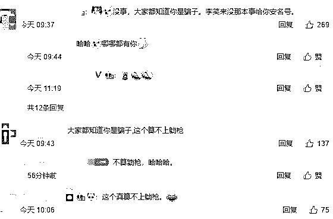

# “对韭当割”孙宇晨：我的字典里只有撒币

> 原文：[`mp.weixin.qq.com/s?__biz=MzIyMDYwMTk0Mw==&mid=2247495490&idx=1&sn=0ff55a52f4efd2bf53cc5632b008127d&chksm=97cb247aa0bcad6ca28846ca94f6698b0ed0574a585ce5ef15447633fead864dcc0107f2c46b&scene=27#wechat_redirect`](http://mp.weixin.qq.com/s?__biz=MzIyMDYwMTk0Mw==&mid=2247495490&idx=1&sn=0ff55a52f4efd2bf53cc5632b008127d&chksm=97cb247aa0bcad6ca28846ca94f6698b0ed0574a585ce5ef15447633fead864dcc0107f2c46b&scene=27#wechat_redirect)

**点击上方蓝色字体免费订阅“灰产圈”**

**1**

由于我一直对于币圈的态度不太友好，所以后台很多人问我怎么评价孙宇晨。

一开始我都不想回答，一个善于包装和炒作的币圈大佬，感觉没太有什么可说的。 

但最近，他花费了 456 万美金，拍下了与巴菲特吃午饭的这个机会。

可谓是装到了极致。

最爱吹虚拟货币的炒作大师和最公开反对虚拟货币的投资大师，这个车祸现场想想都刺激。

我要科普下。

这位孙宇晨在大众眼中可能存在感不足，但是在投资界的垃圾堆，币圈，他可是无人不知无人晓。

人称“韭菜收割拉力赛大满贯选手”，“币圈贾跃亭”，“白皮书复读机”，“空气币净化器”，“东方碰瓷王”，“梭哈主义包装厂厂长”等等等等等等等等等等等等等，总之各种称号加起来得有个小 1000 字。

骂他的人连起来可以绕地球一圈，非常恐怖。

而夸他的人更加恐怖，连起来可以绕地球仪整整一圈。

更恐怖的是，即使绝大多数人都在骂他，但他依然自如的割韭菜，玩儿空气币，还能恶心巴菲特。

币宗强者，竟恐怖如斯。

今天这篇文章，主要是给大家介绍下这位 90 后猛人，世界级韭菜天王，ZB 界的天王巨星的发家史。

纵观他的发迹以及截止目前干的那些事儿，充满着各种魔幻现实。

毕竟在整个五行缺德的币圈，最不缺的就是魔幻。

还有那些产生了幻觉自以为是投资者的韭菜们。

这个圈子本身就是疯的，在一夜暴富的刺激下，人人都是疯子。

而孙宇晨，则是其中的翘楚。

他没疯，但他比疯子表现的还要疯。

**2**

孙宇晨身上的头衔很多，但一个比一个虚，唯一实在的就是北京大学学士和宾夕法尼亚大学硕士，这是两个身份充分说明了他的智商很高，是个聪明人。

但这个世界上最恐怖的是什么？

是聪明人刻意迎合傻子，装傻，带领傻子们做傻事，然后去赚傻子的钱。

所以聪明人需要包装自己，傻子们喜欢什么，他就要变成什么样。

在宾夕法尼亚大学期间，孙宇晨搞了一个网络杂志，很快就被抨击抄袭，帖子至今还在北大论坛挂着。

于是成为第二个郭敬明的路子就断了，但这个时候，他接触到了币圈。

这是天作之合，他醒了，币圈才是抄袭和炒作的最佳场所。

于是孙宇晨就开始回国，然后放飞自我。

他有一个很神奇，并且很高大上的头衔，叫做“2017 年福布斯亚洲 30 位 30 岁以下创业者”。

听起来是不是非常厉害，WOW~福布斯认证。

但这个认证虽然也是福布斯出的，但是和我们熟知的世界五百强和富豪榜等真正具有含金量和影响力的头衔完全不是一个概念。

这是福布斯专门为中国市场设置的评选，大概类似于某某协会编外委员（合同工）的水准。

每年福布斯都要在好几十个领域选出数百个这种 30 岁以下创业者。

只需要交 30 万，你也可以上榜，请转账付费，支持支付宝和微信。

如果你有耐心，等到他们卖不出去了，就会从 30 万降到 15 万再降到 8 万。

我创业的那一年，给我的终极跳楼价是 6 万 5，包酒店和合影。

其实那时候我本来很心动，但是我又仔细一看那些已经提早交钱的人，没几个靠谱的，还有好几个我看不顺眼很久的放高利贷和搞 P2P 的，我这种正经人和他们上一张榜简直是让他们蓬荜生辉祖坟冒烟。

最秀的是 2018 年 8 月 2 日福布斯 30 岁精英获奖者之一，姚坤杰先生。

姚先生 8 月 2 号得奖，但是作为跑路 P2P 平台贝米钱包的创始人，他半个月前就被抓了。

由此可见，这张榜的含金量之高，基本等同于微商和奥巴马合影的水准。

而实际上，很多领域的上榜者，本身就是一群微商和 KOL，毕竟去 4S 店蹭照片以及奥巴马合影都烂大街了，福布斯听起来还能糊弄人。

真的敬业。

虽然我们正经人士都知道福布斯捞外快榜不怎么正经，但是币圈韭菜们不知道呀。

他们对于经济的认知仅限于微商朋友圈，而很多币圈大佬的气质一看起来就像是刚从里面跑出来还没洗干净腿的。

这时候出来一个福布斯，还有北京大学和宾夕法尼亚大学，这种高科技人才发的币，还不赶紧梭哈？

可能他们以为宾夕法尼亚有个嫩模姓福布斯吧。

**3**

给自己包装成福布斯精英后，孙宇晨开始在币圈混来混去。

哦对了，当时他还有一个头衔就是瑞波币中国区代表，他吹牛逼的时候经常甩这个头衔，但是瑞波官方一直辟谣这件事儿。

魔幻的是，当孙宇晨自己靠着空气币波场币身家大增的时候，瑞波再也不辟谣了。

币圈就是这么 Real。

回到当年刚回国的孙宇晨，由于他的学历是实打实的给力，所以博得了很多不懂装懂的投资人的青睐，他们没少给孙宇晨站台。

而孙宇晨当时师从国内公认的割韭菜大师李笑来老师，他们一时亲密无间。

那时是 2017 年，正是币圈 ICO 最疯狂的时候。

各路野鸡纷纷发售自己的各种空气币，靠的就是庄家操盘来割韭菜，发币必暴跌，谁买谁傻币。

当时整个市场已经疯狂到各种瞎扯的侮辱人智商的虚拟货币都在搞，什么 AV 币（号称可以用于买片，这都是重点打击对象）、，什么嫩模币（号称一币一嫩模），什么马拉戈币（别笑，真的有）之类的。

很多投资人都加入进来站台，某几个知名大佬还鼓吹大时代要来了。

其中几个现在还不敢回国。

而孙宇晨大神一出手，就和他们不一样。

这时候他的人脉就派上了用场，很多知名机构给他的波场币站台，当然，更准确的说法是他在蹭投资机构的热度，蹭蹭这种事情他已经非常熟练了。

而他当年在大学时候办杂志搞抄袭的功力也发挥了出来，他的波场币（TRX）的白皮书和技术资料，基本都是把别的知名虚拟货币的白皮书拿来洗稿。

为了蹭热点，他当时还写了 TRX 比以太坊（ETH）好的七大理由，结果被币圈公认的技术大神 V 神怼了，直指波场币的复制粘贴功力才是核心竞争力。

要说 V 神还是太年轻，只要回应，就已经输了。

果不其然，孙宇晨靠着被 V 神骂，成功成为了币圈热点，波场币也被更多人所知晓。

而在币圈，坏名声要比没名声要好的多的多，因为韭菜们根本看不懂白皮书，也搞不清楚哪个是骗子，那就干脆只投知名项目就好了。

事后表明，圈子里反正都是抄，但是他抄出了新意，抄出了精髓，所以很优秀。

而且，中文版没抄，是翻译在把中文翻译成英文的时候水平不足，所以直接抄了别的白皮书。

这个解释真的硬核。

为了蹭热点，他甚至蹭上了马云。

很多微商也喜欢蹭马云，说马云鼓励大家做微商，甚至都没想过为什么阿里的老板会支持别人在腾讯的微信上做阿里的电商。

由于当时区块链实在太热，孙宇晨入选了阿里的湖畔大学，见到了马云本人。

此时不蹭，何时蹭？币圈知名度就是金钱。

于是在各个场合，他都自称是马云门徒，甚至买了很多媒体吹他和马云有多铁，最后惊动了阿里公关，警告了他。

于是他又花钱删他花钱买来的稿，媒体老师们都很喜欢这种大佬。

但这不重要，重要的是，他真的白嫖到了知名度。

2017 年波场币 ICO，一共筹集了 4 亿人民币。

他赢了。

**4**

但欢乐的日子还没持续多久，时间来到 2017 年 9 月。

当时币圈的各种乱象（无底线赤裸裸联合收割韭菜）已经无法无天了，9 月 4 日国家对于 ICO 一刀切，宣布虚拟货币国内非法，并要求所有已完成的 ICO 把钱退还给投资人。

而孙宇晨当时非常抵触退钱，毕竟白嫖了这么多名声，蹭了这么多大佬和热点，凭自己本事骗的钱，为什么要还？

当时的波场币因为孙宇晨硬刚法律不愿退币而十分著名。

然后他一拍屁股，去了美国，过了很久才扭扭捏捏地退钱，一度被称为币圈贾跃亭。

当然我是不认可这个说法的。

孙运晨老师和贾跃亭完全不同。

首先孙老师是币圈大佬，而贾跃亭是古典主义骗子。

其次，孙老师和贾跃亭不在一个地方出生，也没有娶明星老婆，甚至他的波场币要到 2025 年才投入技术研发，而贾跃亭跑路之前还多少造了手机电视买了视频版权有人受益的。

而孙老师的波场币，只有他自己受益。

除了骗钱这件事之外，他和贾跃亭没有任何相似之处。

最重要的是，贾跃亭明晃晃地欠了很多人很多钱，很多人都在找他。

而孙老师自己利用区块链割韭菜，所有人都知道是他干的，但除了骂他之外，他们没有任何办法。

所以不能说孙老师是币圈贾跃亭。

应该说贾跃亭是互联网圈孙宇晨。

2017 年 9 月 4 日之后，国内 ICO 之路算是断了，孙宇晨只得在美国大肆宣传自己的空气币。

而当时大量的币圈大佬都出海了，当然他们中有一部分人至今都不敢回来。

从这点看，币圈大佬们倒是一个个都很像贾跃亭。

四舍五入，都很随孙宇晨。

在海外，孙宇晨又发挥了自己的炒作天赋以及做庄能力，把波场币吹上了天。

波场的代币 TRX，从 1 分钱疯长到了 1 块多，而 TRX 一共有 1000 亿代币，这让波场市值达到了千亿级别，孙宇晨一时春风得意。

得意到嘲讽国内互联网大佬。

当然互联网大佬们也是来而不往非礼也，王小川也正面刚了回去。

当时孙宇晨最喜欢一句话就是当时有人吹捧他的“马云做到 1000 亿用了 10 年，但是孙宇晨只用了 4 个月”。

似乎忘记了自己酷爱自称马云门徒。

嗯，先蹭大佬热度，再踩大佬一脚，真的是 real。

面子爽了之后，就是里子。

这么高的币价，这么沙雕的韭菜，不割两拨都对不起他们。

孙宇晨“蝉联多届割韭菜拉力大赛冠军”的实力开始发挥作用了。

2018 年 1 月，孙宇晨在高位将自己手中的 60 亿 tron 变成了 ETH，然后换成了美金。

3 亿美金，20 亿人民币。

然后就是波场暴跌 90%。

一时之间，无数散户家破人亡。

韭菜收割机盆满钵满。

**5**

20 亿套现事件之后，孙宇晨的名字一时之间犹如过街老鼠一般无人不知。

但还是那句话，在币圈，坏名声也是名声，也要比没名声要好。

孙宇晨非常清楚，只要名声在，不管是好名声还是坏名声，都不重要，只要再控几次盘，再拉一拉币价，那么前脚骂他的韭菜们后脚就会舔他。

甚至因为他套现时的果决，会更加认为他强势。

不怕你坏，只怕你弱，只要你足够强势，就有足够多的人来舔你。

不得不说，他看透了币圈的真谛。

一个没有道德法律的血腥丛林。

韭菜们生长在这篇丛林中，没有未来。

2018 年 2 月开始，三点钟社群突然火了起来。

一群迫不及待割韭菜的投资人们在里面大谈区块链哲学信仰，那时候比特币的价格最高达到了 2 万美金 1 个，无数人提着裤子冲进了币圈，因为腰带都卖掉了。

一时之间人人都在谈虚拟货币和区块链的未来，甚至诞生了很多区块链哲学家。

当一个投资的东西需要用哲学来形容的时候，基本就是要崩盘了。

于是崩盘灾难来临，爆仓者甚众，而此时那些天天讨论哲学，在微博上喊着让所有人都要加速冲入区块链时代的大佬们，也都不说话了。

对嘛，本来就是一个投机品，非得和哲学掺杂在一起，这也太哲学了。

孙宇晨在这段时间选择了低调，没有去刻意蹭热点，而是踏踏实实地抄袭别的项目。

李笑来老师搞的超级空气币 EOS 玩 DAPP，他的波场也玩儿，而且玩儿的更极致。

截止目前，大量境外博彩就在波场上跑着，至于其中有没有孙的身影与提成，就不知道了。

2018 年下旬，李笑来老师的一段录音被曝光。

长达 60 分钟的录音里，李笑来老师说了近百次脏话，不仅承认了自己搞空气币和韭菜，还痛骂韭菜和一些割韭菜不带他玩儿的币圈大佬。

一时之间整个世界都震惊了。

虽然都知道币圈太假，但是李笑来老师的话太真了，而李老师也趁此机会灰溜溜地滚出了币圈，起码明面上是滚了。

在这段录音中，李老师着重强调了孙宇晨和他的波场就是骗子，是忽悠。

某种程度上，一个骗子骂另一个人骗子，其实是一种认可。

孙宇晨知道，热点又来了，蹭蹭又不花钱，于是发了一个微博，表示自己躺枪了。

而广大区块链群众们纷纷安慰孙老师，不要多想，请专注于骗下一波韭菜。

好一个其乐融融的大家庭。

在咱们币圈，就是这么简单直接又真诚，我坦坦荡荡骗你，你坦坦荡荡骂我。

我简直爱上他们了。

**6**

转眼间，2019 年到了，孙老师要考虑自己的年度热点炒作了。

2017 年是马云，V 神和 ICO，2018 年是割韭菜和李笑来，不管怎么说，对自己要求甚高的孙老师是不允许自己越活越回去的。

放眼世界，还能再蹭的热点在哪里？

没错，你想到了，股神巴菲特。

孙老师买了股神巴菲特的午宴机会。

说到中国人买巴菲特的午餐机会，孙老师已经是第四任了，而前三任则各有千秋，个个都是行家里手。

第一任是步步高的段永平，当前国内市场手机份额前五的 oppo 和 vivo，背后的操盘手就是他。

而段永平当时和巴菲特吃饭，并不是为了自己，他早已财务自由。

他是为了提携一位年轻人，叫做黄铮。

而黄铮后来回国后，创办了一家公司，给当代年轻人带来了无尽的欢乐。

这家公司全称叫做。

四亿人都在砍的拼多多。

你今天砍了吗？

而第二任和巴菲特吃饭的人，叫做赵丹阳。

此人是个投资经理，他花了几百万买下了和巴菲特吃饭的机会。

他的操作更加骚气，他在饭桌上向巴菲特拼命推荐物美集团的股票，并且宣扬了出去。

果然事后物美集团股票疯长，而他早在吃饭前就已经大量购入了物美的股票，趁着股价大涨立刻套现，赚了 1.3 亿。

是不是听起来有点耳熟？

《西虹市首富》里面王多鱼的请巴菲特吃饭结果股价疯长，原型就是赵丹阳的操作。

艺术总是来源于生活，不是吗？

由于赵丹阳的神奇操作，搞的巴菲特不得不定下规矩，吃饭期间不能谈股票。

这就给第三任留下了难题。

但我们都知道，敢花大钱和巴菲特吃饭的人，总有办法赚回来。

第三任和巴菲特吃饭的人叫做朱晔，是上市公司天神娱乐的董事长。

老粉丝都知道我的股市修仙传系列，天神娱乐被我称之为仙界的帝王。

2019 年初，天神娱乐利用商誉计提大法，一口气计提了 80 亿的损失，其中大部分都是商誉。

而最厉害的是，天神娱乐当时的市值只有 44 亿。

一家 44 亿的公司计提损失 80 亿，确实是神仙手笔。

这种买 1 赔 2 的操作，让我感觉有点熟悉，好像写过类似的在美国上市的公司，你们不要乱联想。

**7**

前三任和巴菲特吃饭的人，都是狠角色，并且一个比一个狠。

留在孙宇晨面前的表演机会不多了，前辈们过于优秀，简直不给年轻人机会。

但这篇文章读到这里，我觉得大家要对孙老师有信心，过往的经历早就证明了在蹭热点和不要脸这两件事情上，孙老师从来就是王者级别。

孙老师这次花重金和巴菲特吃饭是经过缜密规划的。

除了因为巴菲特比较老了，反抗不动年轻人的疯狂蹭热点，还有更深层次的原因。

众所周知，巴菲特对于虚拟货币一直是坚决反对的态度。

他曾多次在公开场合表示虚拟货币只是投机品，没有真正的价值，玩儿虚拟货币最终都会很惨。

甚至今年股东大会上，巴菲特又重申了这个观点。

这就是孙老师要的。

孙老师币圈大佬，韭菜教父的身份，和巴菲特这种反对虚拟货币的大 IP 坐在一起，想想就觉得很激动。

要的就是这种冲撞和对立。

我再强调第三遍，在币圈，坏名声也比没名声要好的多的多的多。

除了二人身份的对立。

孙宇晨老师又一如既往的开始包装自己。

继马云门徒，区块链门徒之外，他又多了 2 个新身份。

巴菲特门徒和坚定的价值投资者。

巴菲特听了要上吊，韭菜们听了要哭泣。

而孙老师一向是炒作和套现两不误的。

在竞拍午餐的时候，他就已经大量入手了自己的 TRX，此时的 TRX，价格不到巅峰时候的一成。

在拍下午餐机会的第一时间，他发了朋友圈，说自己有重大事项三天后宣布。

然后果然 TRX 大涨，孙老师成功又赚了一波。

而在公布了自己身份后，TRX 又一次大跌，毕竟套现都套现了，不跌留着当爹吗？

而很多韭菜们，又被孙老师的骚操作给扭弯了腰，甚至到孙老师微博下面求助。

但是这些币圈投资者再怎么哭喊也是没用的。

国内禁止炒币，国内认为币圈不合法，这是天字第一条准则，政府警告你不要碰。

你非得碰，就等着丛林法则的教育吧。

而孙老师也不会管你的，他正忙着如何套路巴菲特呢。

可怜的老股神，这次不知道又要被玩出什么花样。

一代后浪推前浪，后浪在前浪面前可劲儿的浪。

像极了这个世界。

← 向右滑动与灰产圈互动交流 →

**阅读原文加入灰产圈高端社群**