# 深度揭秘赌博进化史！

> 原文：[`mp.weixin.qq.com/s?__biz=MzIyMDYwMTk0Mw==&mid=2247495469&idx=1&sn=5fc8598854dcae62ec560005cd1b769e&chksm=97cb2415a0bcad03b3707dc8ffb6321bfda14eacda2e9a6ff04b3b4a12c39bd58bf59889cf66&scene=27#wechat_redirect`](http://mp.weixin.qq.com/s?__biz=MzIyMDYwMTk0Mw==&mid=2247495469&idx=1&sn=5fc8598854dcae62ec560005cd1b769e&chksm=97cb2415a0bcad03b3707dc8ffb6321bfda14eacda2e9a6ff04b3b4a12c39bd58bf59889cf66&scene=27#wechat_redirect)

**点击上方蓝色字体免费订阅“灰产圈”**

说起我们的小时候，和小伙伴们玩的最多的多人游戏大概就是捉迷藏了，而随着年龄的增长，小伙伴变成了大伙伴，玩的游戏也从捉迷藏变成了玩扑克牌，最后升级到打麻将。

有的人把打麻将、玩扑克只是当成一种放松休闲的娱乐，在空闲之余偶尔和家人朋友一起玩会，放松心情；而有的人却把打麻将、玩扑克当成了自己的第二职业，工作的时候也想抽出时间玩；而有的人则把它们当成了第一职业，玩的废寝忘食，乐不思蜀。

当然，**打麻将、玩扑克不玩钱的叫休闲娱乐活动；玩钱的自然就是赌博了。而那些把赌博作为第一职业的人，其实不是为了玩，而是为了钱**。

**赢钱是所有赌徒的目的，****而有句话却是“十赌九输”。**

我们听过很多人因为赌博而穷困潦倒的新闻，而赌博的危害也远不止于此，多的是人因为赌博家破人亡。

**《中华人民共和国刑法》第 303 条明确规定**：

以营利为目的，聚众赌博或者以赌博为业的，处 3 年以下有期徒刑、拘役或者管制，并处罚金。开设赌场的，处 3 年以下有期徒刑，拘役或者管制，并处罚金，情节严重的，处 3 年以上 10 年以下有期徒刑，并处罚金。

这也意味着，只要你玩，就有被抓的风险。那想赌，又怕被抓，怎么办？

**网络赌博随之而来**。网络赌博指利用互联网进行的赌博行为。

网络赌博早期时采用信用卡投注、电话下注、电子划账的方式进行资金转移。而随着互联网的快速发展，方便快捷的支付宝、微信扫码支付早已成为主流的资金转移方式。

**网络赌博类型繁多**，现实生活中主要的赌博方式在网络中都有，比如百家乐、骰子、21 点、轮盘、德州扑克、赌马、赌球、六合彩、福利彩、足球博彩等。而**赌博网站则是不法分子自己购买或搭建的**，根本没有监管机构监管，他们把控着赌博网站的后台，赌徒是输是赢全凭他们说了算。

不法分子为了获利，会希望越来越多的人到他们的网站上充值下注，而要想引诱人来赌博，第一件事情就是把他们的网站推广出去，不法分子为了推广赌博网站更是花样百出。

**网站推广**

01

**网赚引诱**

不法分子模仿如腾讯新闻、今日头条等官方新闻网站，发布带有极强煽动性文字的网赚页面，用**投资 100 月入 10 万、一部手机月赚 15 万等词语以及一些因为网赚成功的案例来吸引受害人加他们的微信**，推广赌博网站。

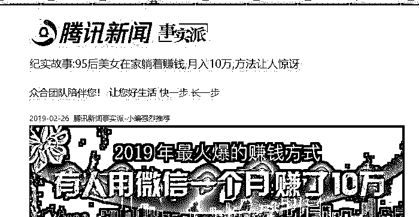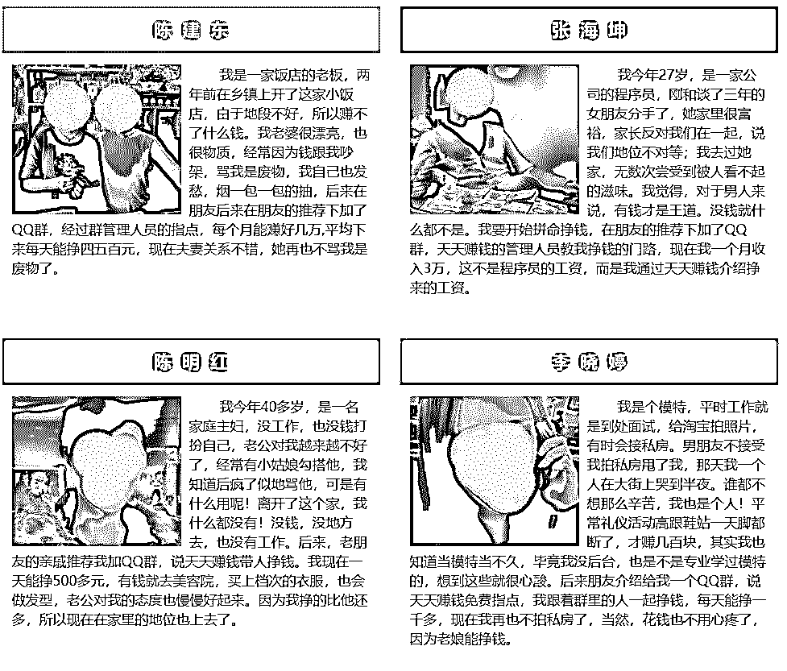

**网赚网站截图**

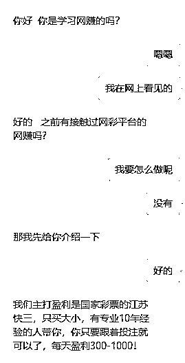

**与网赚人员对话**

**网络交友**

不法分子利用微信、QQ、婚恋网站加好友，在获得对方信任后，就以各种理由要求带对方玩赌博、彩票等，如：自己有个投资、赚钱机会和你分享，有内部信息、在内部工作，有事不方便投注需要帮忙等。

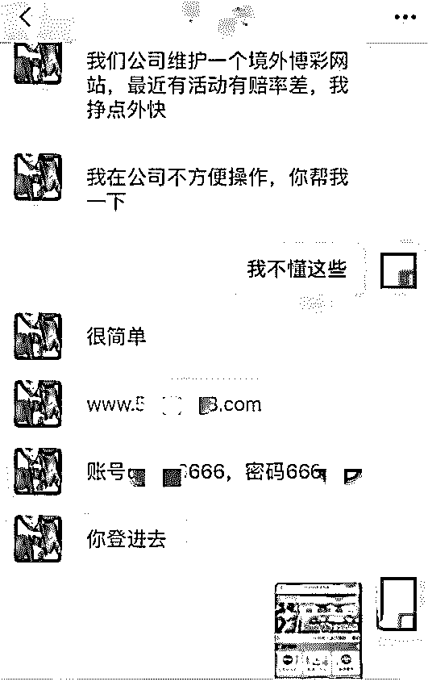

**网友对话**

**网页弹窗**

①不法分子通过技术手段入侵网站，然后非法植入赌博网站广告，引诱人们点击赌博网站链接。

②不法分子在一些不知名的非官方网站（如色情网站等）投放赌博广告。用**安全、正规、性感荷官、真人发牌**等字眼引诱人们点击赌博网站。

**广告弹窗**

**社交推广**

不法分子注册微博、邮箱账号，将赌博信息以邮件、私信、短信等多种方式群发送给受害人，以**充就领 8-888 支持提取等**字眼吸引人们点击链接。

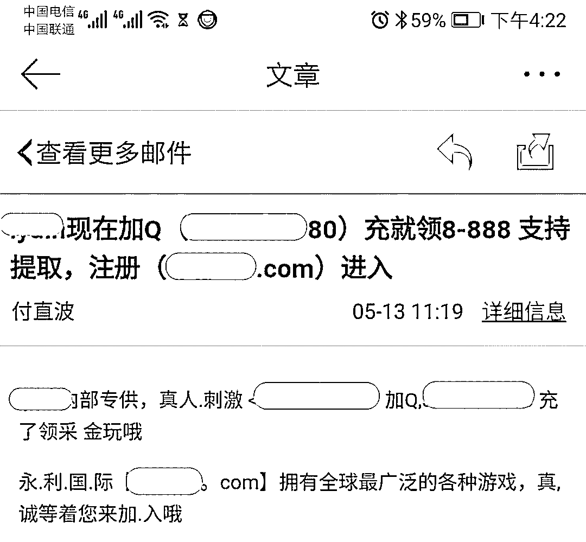

**邀请赌博邮件**

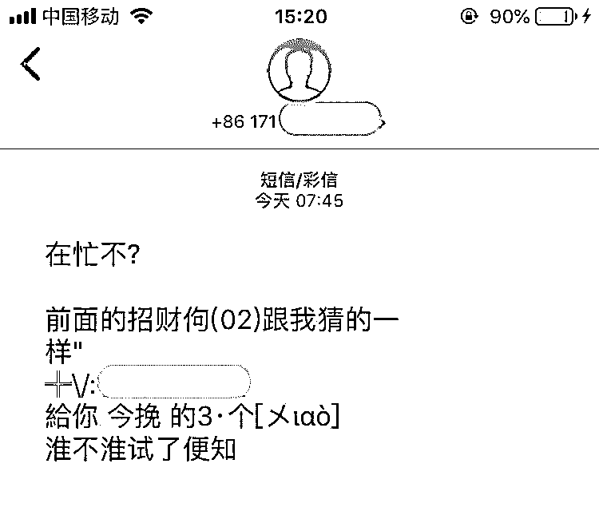

**邀请赌博短信**

**引诱充值下注**

02

**此处有几种情况：**

①   受害人加了不法分子的微信、qq 后，不法分子就会将受害人拉到赌博群里，而群内基本都是不法分子的小号，他们用一些跟注赢了的截图来引诱受害人投注。

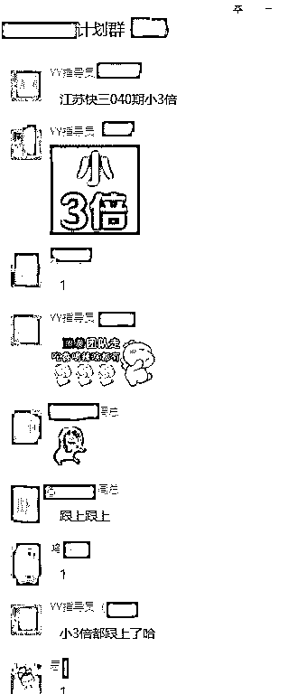

**诈骗群聊天截图**

②   受害人因与不法分子长期交流，信任不法分子，在对方引诱下按照对方要求进行充值投注。

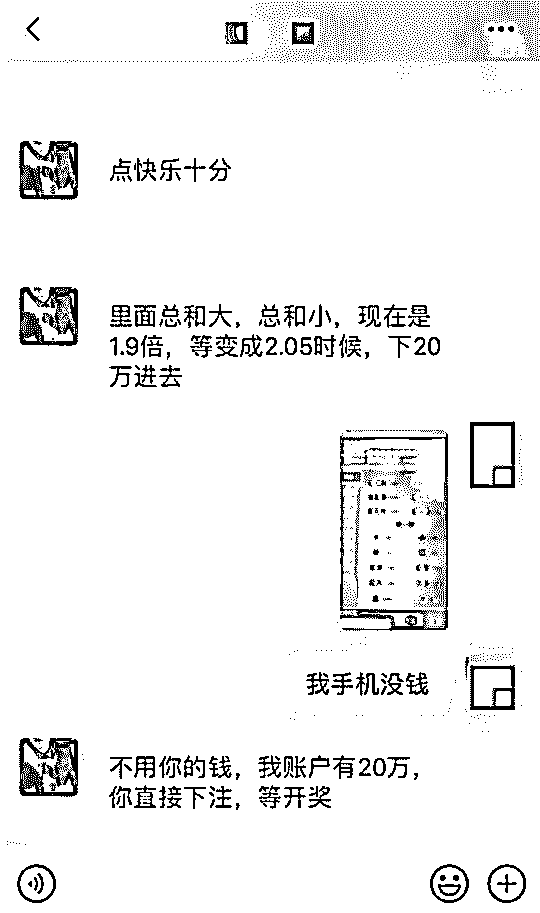

**网友聊天截图**

③   受害人直接点击网站链接，因侥幸、贪欲、冒险等心理进行充值投注。

**赌博网站截图**

**操纵输赢**

03

受害人初期在赌博博彩网站充值投注时，一般都会充值小钱，以试真假，此时他们都会赢钱，且可提现；而当受害人因为赢钱的刺激加大赌资后，就会开始输钱，一些人为了翻本越输越多，直到倾家荡产；而有的人为了保本不再充值选择提现，这个时候，不法分子就**会以网站维护、系统审核，银行卡终端维护、操作违规等多个理由要求受害人继续充值**，而无论如何操作也无法提现后，受害人才意识到自己被骗。

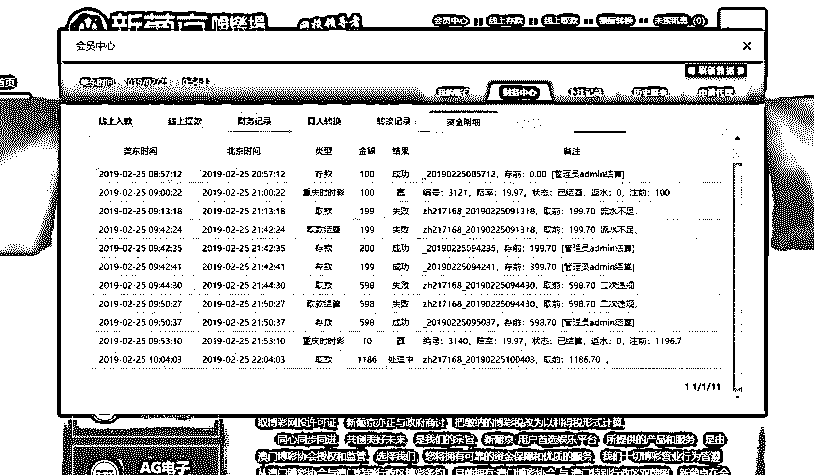

**赌博网站提现截图**

**充值记录**

**庄家洗钱**

04

通常情况下，受害人以转账、汇款、扫码等方式充值的金额都汇入了不法分子的私人账户，不法分子收到钱后，会快速将钱以阶梯式分到十几张甚至几十张卡中，再由“车手”拿着银行卡到各地 ATM 机提现后交还给不法分子，而"车手"则从中抽取高额佣金。

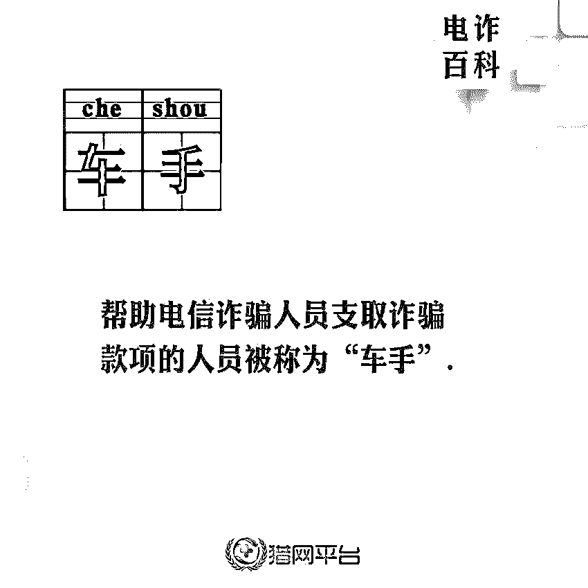

**车手定义**

虽然此种方式不易被追踪，但是投入大，还有一定风险；为此，不法分子以“出借收款码，兼职刷单赚佣金”的嘘头，利用普通人的账号进行洗钱。

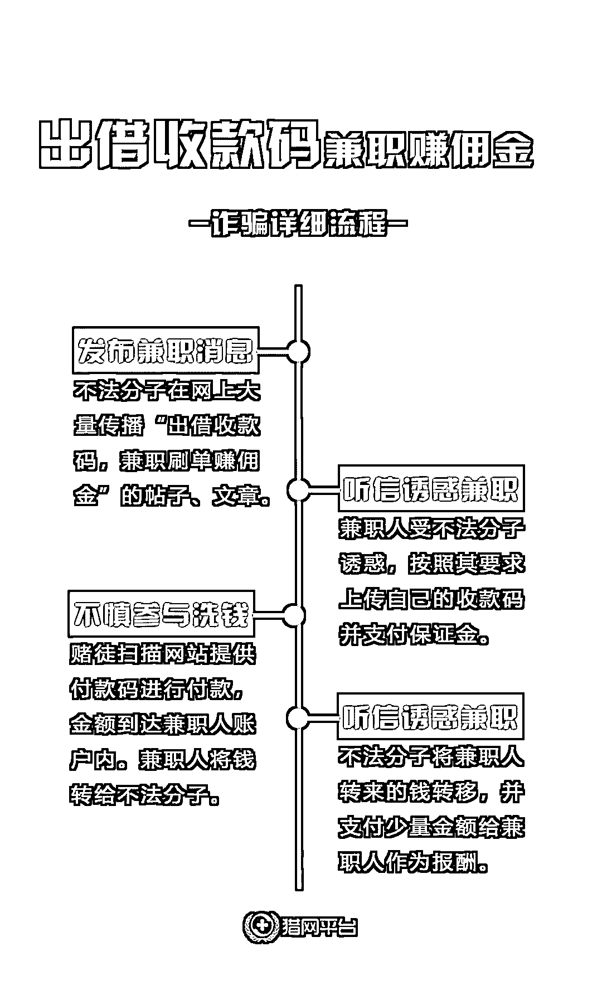

此种操作方式都是正常的个人账号，方式隐蔽，佣金低廉，是不法分子的新宠，却因涉及账号众多，更加隐蔽等特点给警方追踪资金的去向大大增加了难度。

最后小猎再来用一张图捋一下赌博诈骗的套路。

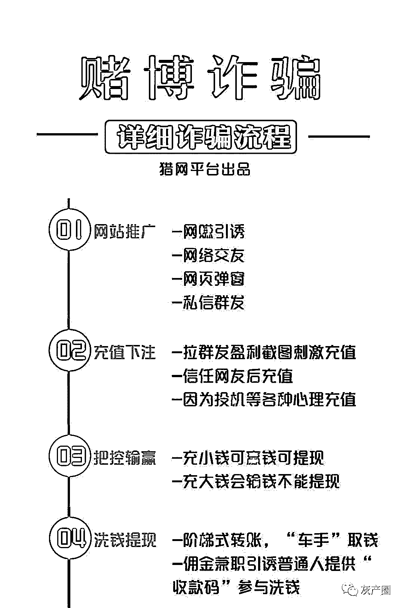

这就是网络赌博/博彩的骗钱套路。一定要谨记我们在网络上看见的各种赌博/博彩都是违法的，是不受法律保护的，兼职诈骗更要小心，自己的私人信息不要泄露。

如果在网络中，有人要求你赌博、玩彩票。不管对方赢了多少钱，都不要相信，对方只是用一个截图数字来骗你的钱而已。

**万事三思而后行。**

← 向右滑动与灰产圈互动交流 →

**阅读原文加入灰产圈高端社群**