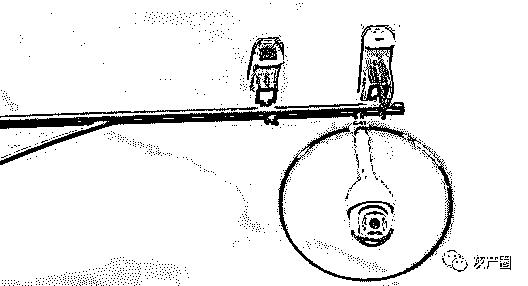
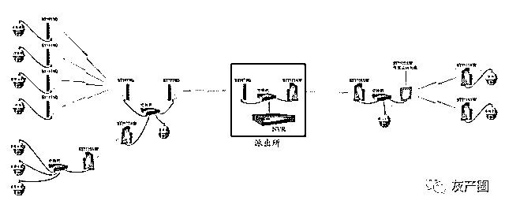
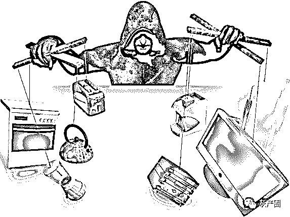

# 一个黑客眼里的世界：千疮百孔危机四伏

> 原文：[`mp.weixin.qq.com/s?__biz=MzIyMDYwMTk0Mw==&mid=2247495464&idx=1&sn=9671f90af4c1760435916a7d76b3d49b&chksm=97cb2410a0bcad06a8df1e68973774c52ba12846782132b7f808ce4cae95150dc03b9378c20f&scene=27#wechat_redirect`](http://mp.weixin.qq.com/s?__biz=MzIyMDYwMTk0Mw==&mid=2247495464&idx=1&sn=9671f90af4c1760435916a7d76b3d49b&chksm=97cb2410a0bcad06a8df1e68973774c52ba12846782132b7f808ce4cae95150dc03b9378c20f&scene=27#wechat_redirect)

**点击上方蓝色字体免费订阅“灰产圈”**

老杨站在台上演讲，台下是几百位观众，不知情的人可能以为他在教唆网络犯罪。

他说，路边的摄像头大体分两种，一种长的，交警用它查违章，一种半球形的，用来治安。这些年国内刑事犯罪率大幅下降，很大程度归功于这套治安监控系统。

他顿了顿神， "下面我来讲讲黑客怎么入侵这套系统。"

其实很简单，一共分六步，老杨说。

第一步，搜集信息：先在路边找到一个摄像头，观察外型，找资料了解它是哪个厂家生产的，型号特点是什么。

第二步，网络接入：伪装成维修师傅，搭个梯子爬上去，找到摄像头后面联网用的线和接口，拔下来，插自己笔记本上去。

第三步，漏洞探测：透过网线，你将进入一个庞大的监控网络中，你不仅能看到这个网络里的其他监控设备，还能找到监控中心的服务器，那是最重要的目标。

**（图文无关，仅用于帮助理解）**

找到中心服务器之后，查看服务器的系统类型和版本，如果运气好，遇到一台很久没更新的服务器，去网上找现成的漏洞和利用工具，很容易就能攻入。

第四步，尝试渗透：试着用现成的黑客渗透工具和漏洞拿到服务器控制权。

第五步，效果评估：拿到服务器权限之后试着控制别的摄像头，查看监控以验证入侵效果。

第六步，实施攻击：做任何你想做的事。如果打算长期潜伏，就得找无线网卡装在摄像头上，让它能时刻连上你的电脑，以实现长期控制。

"这其实是一个真实案例"， 老杨说，几年前的某一段时间，某地区公安部门调用监控时总发生文件损坏、丢失，却怎么也找不到原因，最后怀疑是黑客入侵，就找到老杨让他们协助警方做网络安全排查。

老杨接入公安监控网络后，对该地区的整个监控网络进行了"网络测绘"—— 就像画地图一样，把整个局域网里的每一个设备都找到，并且"画"下来。结果发现其中有一个本应该是摄像头的 IP 地址，居然是一台 Windows 系统设备！

好家伙，老杨找到这台摄像头的物理位置，找过去，搭梯子上去一看，发现背后挂着一张网卡，正一闪一闪对外发送信号。最后，他协助警方抓捕了这群罪犯，而上面那套大致流程，就是罪犯交代的。

"这是一套标准的黑客入侵流程：搜集信息、网络接入、漏洞探测、尝试渗透、效果评估、实施攻击。"

之所以老杨要说这些，是想告诉所有人一个道理：要想防住黑客，你得先了解黑客，唯有站在黑客的视角来看这个世界，清楚黑客会如何发起进攻，才能有的放矢。

哦对了，忘了介绍，老杨是个黑客，准确来说，他曾经自己就是个黑客。不过他现在的工作是专门对付黑客。

曾几何时，黑客并不是一个带有贬义的词，Hacker，本是用来形容追求技术突破的人，类似现在的"极客"。可是后来，有人用技术去干坏事，黑客一词便逐渐被污化。

老杨曾经是黑客，作为中国著名白帽黑客（正义的黑客）团队"安全焦点"的核心成员，老杨曾经被评为"新一代黑客领军人物之一"，可是现在，他已经不好意思说自己是黑客，更愿意称自己是“安全从业者”或者“极客”。尽管，他从来没有停止为“黑客”正名。

如今的老杨，是安全公司"知道创宇"的技术负责人和创始人之一。国家漏洞库、工信部、国家计算机病毒应急处理中心、各省市通管局、网安等国家政府机构，央行、中国电信等机构都用过知道创宇的安全产品和服务。

老杨本人是个络腮胡子糙大叔，头像却是一只手绘的，戴着斗笠，身穿披风的熊猫，有种反差萌的感觉。挺巧，他联合创办的公司知道创宇也有些反差萌，明明是一家高新科技公司，可是上到创始人，下到普通员工，却总是把"侠之大者，为国为民"的口号挂在嘴边。

**老杨的头像**

在老杨看来，作为一个打击网络犯罪的人，必须比坏人更了解黑客的作案方法。就好比你想当个清官，虽然自己不贪，但你必须比贪官更了解官场上的那些明争暗斗和利益纠葛。

人们常常总结出一些防御黑客的方法，比如"三要素模型"，比如"PDRR 安全保障体系"，却经常失效，老杨觉得主要原因是因为这些方法都是站在防御者的角度思考问题，这是不够的，因为攻击者不会按照你的思路来进攻。装了四五道防盗门，最后很可能小偷爬着窗户进来。

# 从攻击视角发现来自物联网的威胁

透过攻击视角，能看到很多原本看不到的事情。

老杨说，某段时间，最高法院的网站经常遭到 DDos 网络流量攻击，导致无法正常访问，一开始尝试防御，可是攻击流量越来越大。于是他们就去查攻击源头，一查吓一跳，攻击源竟然来自三十多万个物联网设备，分布在全球各地。其中，有十七万多个是网络摄像头，就是街上的那种摄像头，另外十几万个是家庭路由器，就是人们家里用来上网的那种路由器。

"这些设备存在漏洞，被黑客控制用来发起 DDoS 攻击，路由器的主人和生产厂商一点都不知道。"，老杨说。最后那件事以国内某摄像头厂商和路由器厂商技术被有关部门责令整改告终。

从 2014 年起，知道创宇就开始关注物联网安全问题，因为他们发现很多网络攻击的源都跟物联网有关。

他说，"跟电脑、手机相比，物联网设备更容易遭到攻击和控制。"，原因主要有两个：一是物联网设备结构简单，一般都是裸奔状，没有自带防御能力；二是长时间不关机，基本一直连在网上，因此黑客可以随时发起攻击和控制。

2018 年，他们用自己开发的网络测绘系统"钟馗之眼"对全网的设备进行探测，发现网上有至少 6000 万台物联网设备直接暴露在公网上，其中不少设备都存在这样那样的安全问题。

老杨像解牛的庖丁一样，从不同层面对网络安全问题层层拆解。

在感知层，很多路由器等设备在出厂时都用的默认的密码，类似 0000、123456 之类的。有些厂商为了方便调试、维修设备，还设置了"超级密码"和"调试接口"，其实说白了就是留后门，他们不会把这些后门告诉用户，但也没堤防被坏人利用。

聊到网络协议层，老杨说，2013 年蓝牙协议就曾经出现过一个漏洞，很多厂商把带有漏洞的协议写到固件里，导致黑客利用这个攻击可以实现任一设备配对成功。

在应用层，很多智能设备同样有漏洞。老杨说前阵子他买了一个能煲粥的智能电饭锅，能用手机控制定时煲粥，用起来很方便。可是他发现智能电饭锅连接服务器时的 ID 号只有四位数，"这就导致了一个问题，只要把 ID 号从 0000、0001、0002……一直遍历到 9999，就能控制所有电饭煲。"，于是赶紧打电话给厂商，帮助解决问题。

看到这里，可能有人会想，"没必要吧？根本不会有黑客来攻击我呀~是不是有点杞人忧天了？"老杨的回答是："你没有被攻击过，说明你的价值还不够。"

# 你没有被攻击过，说明你的价值还不够

老杨说，有一次知道创宇帮一家电器厂商做安全服务，工程师们在企业内网里部署了很多"蜜罐服务器"用来诱捕黑客，可是过了一个多月也没见动静。老杨过去一看，发现问题在于"蜜罐"不够"诱人"，于是把蜜罐服务器的名字改成"密钥分发系统"、"源代码控制系统"，又过了一个月，发现每个蜜罐系统都被深度入侵。

"只要你业务做的足够大，一定会遭遇攻击。"，在老杨看来，如果你没有遭遇过黑客，要么是目标价值不够，要么是已经被攻击，但是没察觉。

这也是物联网设备必须做好安全的原因，如果任由大量智能设备因为漏洞被黑客控制，所有人都会处在威胁之中。

老杨说起自己服务某家共享单车公司。某段时间，全省的人连着好几天下班高峰都打不开车锁，大家都以为是这家公司的服务质量差，其实是遭到了 DDoS 攻击。 还有一家很先进的运输公司也是他们的客户，被竞争对手流量攻击以后，完全无法工作，因根本不知道货物运到哪了。

或许在我们普通人的眼里，岁月静好，在老杨们的"攻击视角"里，这就是一个千疮百孔的世界，他们的任务是跟时间赛跑，和坏人赛跑，尽可能赶在他们之前修补掉更多漏洞，把黑暗阻挡在我们的视线之外。    

← 向右滑动与灰产圈互动交流 →

**阅读原文加入灰产圈高端社群**