# 玩家卧底游戏公司，成双面间谍，掌控游戏地下黑产，月入 1000 万！

> 原文：[`mp.weixin.qq.com/s?__biz=MzIyMDYwMTk0Mw==&mid=2247495431&idx=1&sn=442583e02e5f2b51b8ef902b0d7cd75b&chksm=97cb243fa0bcad29c268cf9e182c1df439411e98941a95c5f6f993d73f291989ae06c61b7027&scene=27#wechat_redirect`](http://mp.weixin.qq.com/s?__biz=MzIyMDYwMTk0Mw==&mid=2247495431&idx=1&sn=442583e02e5f2b51b8ef902b0d7cd75b&chksm=97cb243fa0bcad29c268cf9e182c1df439411e98941a95c5f6f993d73f291989ae06c61b7027&scene=27#wechat_redirect)

**点击上方蓝色字体免费订阅“灰产圈”**

编者语：在国内的互联网领域，游戏产业一直是其支柱产业。游戏产业也是互联网变现最为快速，利润最高的领域。

国内第一科技公司，腾讯便是因为游戏问鼎国内第一的宝座，中国首富马云当初嚷着绝不碰游戏，最后也对游戏下手。在国内的游戏历史，伴随了 80、90 后一批玩家的成长，带来了许多美好回忆。

但是许多人不知道的是，在游戏繁荣的背后，一批人翻手为云覆手为雨，影响着这庞大的游戏产业。

大玩家在对国内知名游戏进行盘点后，从这期开始，将对国内游戏历史产生重大影响的人物或者富有传奇性人物的进行讲述，今天是一个关于卧底的故事。

2000 年是国内游戏历史中一个重要的时间节点，日后许多在游戏产业呼风唤雨的大佬，都和这个年份或多或少有点关系。

在 2000 年中国政府在游戏产业进行了一场声势浩大的整治，联合七大部委，对电子游戏行业重拳整治，实属罕见。

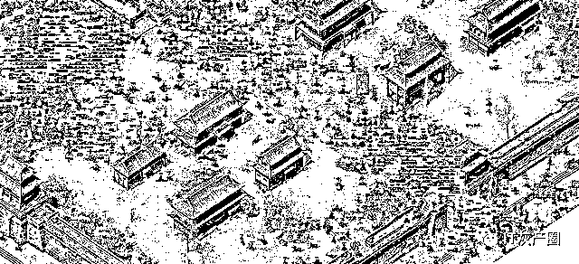

许多年龄稍大的玩家可能相信还依稀记得，那时候遍布各处的电子游戏厅，其中许多都没有营业执照，俗称黑游戏厅。

这次全国从上到下整治的结果，便是国内电子游戏行业被瞬间打入低谷，数以千计的电子游戏机生产制造厂家倒闭，电子游戏产业一蹶不振。

这次的整治虽然让电子游戏行业受到重创，但是却让网络游戏成功上位。

从此国内游戏市场真正的进入了网游时代。其中最有代表性的便是由盛大游戏公司推出的热血传奇。+

（热血传奇的历史大玩家之前已经写过，感兴趣的玩家可以去看看。网游史上最牛游戏，没有之一！300 亿的市场只花了 30 万美元？）

这里将会出现一个盛大游戏公司传奇性的人物，这个人并不是大家熟知的陈天桥，而是一个颇有传奇色彩的双面间谍！

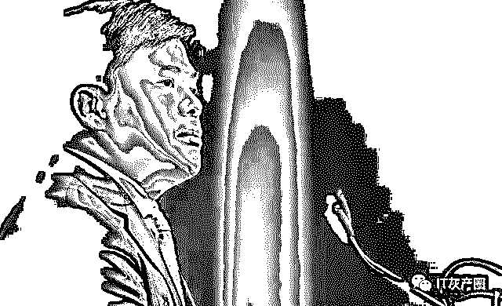

传奇大火，成为全民网游，让陈天桥登上了首富宝座。但很快一个事件的出现，却让盛大陷入了进退两难的情况。

传奇游戏源代码在欧洲被泄露，很快传入中国。一夜间各种传奇私服纷纷出现，短短时间传奇私服产业便成为一个庞大的产业链。据统计，在传奇私服的巅峰时期，全国同时有几千家私服同时运行，就连 2019 年的现在，也有几百家传奇私服正在运营。

传奇私服的出现，很快形成了成熟的产业链。从私服架设到发布私服广告，到私服代理运营。这个庞大的产业链，市场保守估计超过 20 亿。而盛大自然不会眼看着自己的利润被私服分走，从而展开对私服的打击。

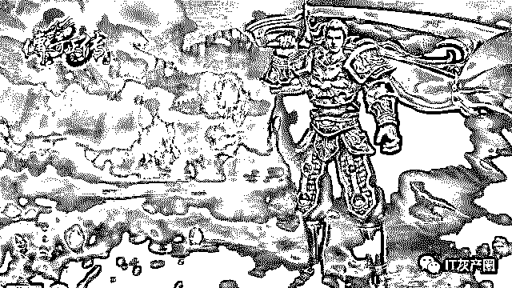

但是盛大面对庞大的私服市场，和打击私服所需要的高额成本，却有点力不从心。当时盛大成立了一个专门负责版权维护的部门，名为稽核部，负责人是出身公安系统的胡儁。稽核部的主要职责便是打击当时泛滥的私服，搜集各种证据协助公安机关办案。

当时盛大面对庞大的私服市场，想到了一个特别的办法，派人卧底私服圈子，搜集侵权证据。而这其中便有今天的主人公陈荣锋。

陈荣锋原本并不是盛大公司的人，而是一名普通的玩家。在当时由于盛大的运营失误，发生了著名的玩家堵门事件。在盛大头痛时，陈荣锋自告奋勇的出现，很快解决了这件事。这件事让盛大和陈荣锋有了交集。

如今看来这次事件起因便是盛大在多年后推出的传奇归来游戏，在一定程度上影响了私服的市场，破坏了一部分利益。陈荣锋在其中到底是扮演者什么的角色我们不得而知，但是陈荣锋在此之后，摇身一变成为了盛大稽核部的线人，也就是大家俗称的卧底。

陈荣锋直接和稽查专员联系，其地位甚至比游戏公司员工更加超然。甚至部分员工还以为其是游戏公司的中高层。在陈荣锋的协助下，很快盛大稽核部便联合公安打击了一批游戏私服。

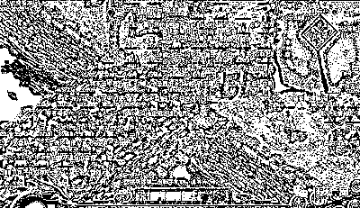

但在打击私服的同时，陈荣锋也发现，盛大游戏似乎在打击力度上并没有想象的严厉，而是采用了杀鸡儆猴的措施。

这其中有打击私服需要高额的成本有关，也和盛大发现私服同样能够带给公司一部分利润有关。查证相关杂志的报道，稽核部每年都可以给盛大带来 5000 万左右的收入，而这主要来自私服侵权的索赔。

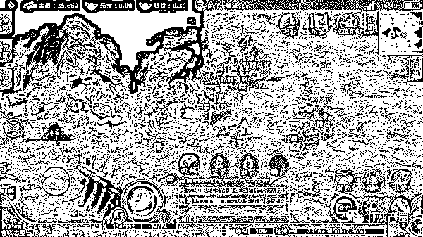

在前几年的国家剑网 2016 的行动中，盛大稽核部协助公安部门，对当时著名的至尊合击、回忆传奇等多款游戏私服进行打击，涉案金额高达 6000 多万，其中侵权索赔更是创下了游戏侵权的记录。从中可以看出侵权索赔的巨大利润。

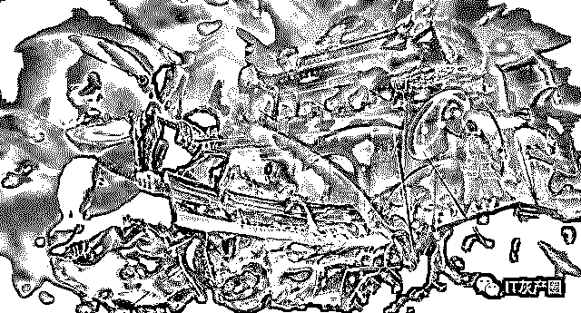

盛大游戏正是因为看到了稽核部的作用，所以在打击私服的方式上，并没有一杆打死。而是采取授权分成的策略。许多私服因此得到授权，违法风险降低。而这让陈荣锋看到了商机。

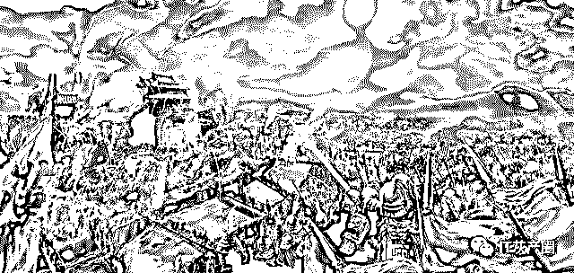

当时在私服圈子有一个臭名昭著的黑客团伙，骑士攻击小组。

骑士攻击团以蔡某为首，采用各种黑客攻击手段，对当时国内较大的几个私服发布网站进行攻击，从而迫使网站屈服，交出私服广告的独家代理，赚取巨额利润。

在骑士攻击小组后期攻击中，甚至联合私服托管的内部人士直接采取断网拔网线的方式，对私服业主进行攻击。骑士攻击团成为私服界谈虎变色的人物，短短时间获利数千万。

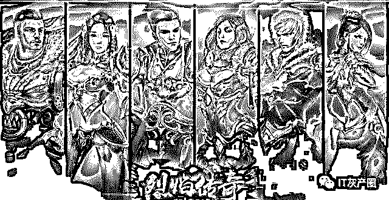

而这一切被身为卧底的程荣峰知晓，很快根据 ip 地址找到了当时的托管机房主管，也就是骑士攻击团的共犯。

在陈荣锋以盛大名义封掉这些 ip 为威胁，很快与骑士攻击团达成了协议。将私服发布站的广告利润三方进行分成。

陈荣锋也很快得知了盛大游戏对私服新的政策，成立的新公司拿到了当时第一批官方授权，从而将骑士团名下的私服产业转到了这家公司，获得了一个看似合法的外衣，但是这只是盛大内部的承诺，并不代表并不违法。

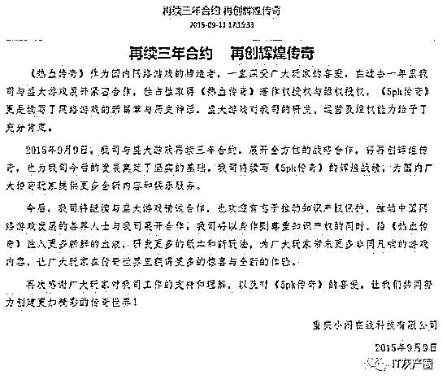

而当一切都进入正轨的同时，骑士攻击小组却遭到了来自公安部的打击，整个团伙端掉，相关人员被抓获，而陈荣锋也很快自首。这起案件在官方的通报中，涉案金额高达 7000 万元。

其中，扣押的涉案车辆中，不但有奥迪、宝马等高档车型，还有保时捷、玛莎拉蒂、宾利等豪车，甚至还有在重庆高达 1300 多平的写字楼，在 2003 年便耗资 1000 多万。

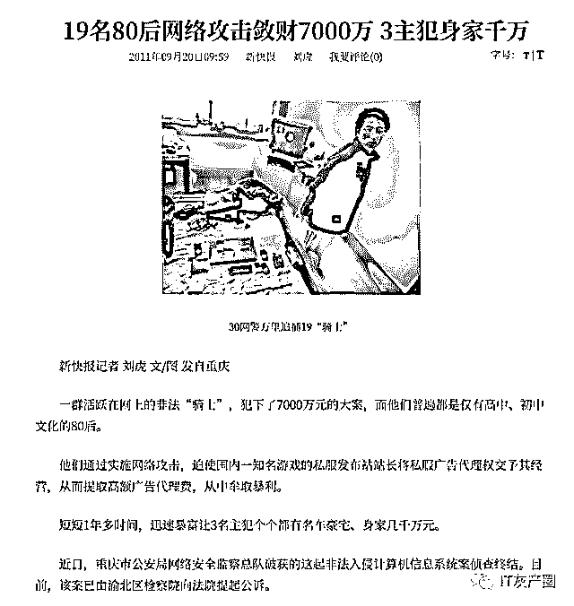

这起案件的最终结果是，涉案人员缴纳了从千万到百万不等的罚金后，均未服刑，只是缓刑。而陈荣锋也很快放了出来。

这个故事本来在这里就应该结束了，但是却发生了神转折。

当时的盛大稽核部，在后期成立了独立的公司盛聚公司，专门负责传奇的版权问题。而在盛聚采取的对私服进行授权的行为被人举报侵权。

而侵犯的正是盛大游戏的知识产权。盛聚公司一行人被警方逮捕，但是其作为公司负责人，前盛大游戏稽核部负责人的胡儁，由于身在国外而未遭到逮捕。这起案件也一直悬而未决。

而这其中的陈荣锋便是举报人。

盛大游戏尽管后期发布了相关申明，称盛聚不存在侵权行为，也没有举报过盛聚。

但是这件案件却因警方管辖权的问题，让盛大并未如愿。陈荣锋利用了这其中争议的管辖权对盛聚进行了反戈一击。

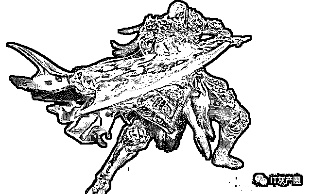

在程荣封看来自己的一切都是盛大授权的，却在关键时刻被作为了弃子。从而策划了举报事件。之后一切随着时间渐渐被人淡忘，人们再也不知道曾经有一个传奇的双面间谍。

总结：陈荣锋从一名玩家到成为盛大线人卧底私服产业圈，到再利用盛大线人的身份掌控私服产业，到最后反戈一击，对盛大进行举报。整个故事构成了一个颇具传奇性的人物。而这一切都只是私服产业下的冰山一角。

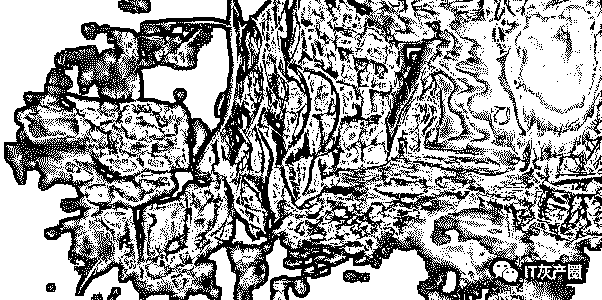

话说有人的地方便有江湖，传奇作为国内最为著名的网游，已经将近 20 年的时间，其带来的影响却一直存在。

如今手游中依然存在大量传奇类游戏，其中很多依然有着盛大的影子。

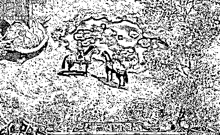

这和当初的私服授权如出一辙。

一款传奇带来的远远不是几千亿的市场，而是国内网游发展重要的一环。背后的利益故事离开了陈荣锋依然还有王荣锋，只要利益存在的一天，这一切便不会停止。

诗曰：游戏市场如江湖，血雨千金险中求；双面卧底造传奇，戏剧人生一场空。

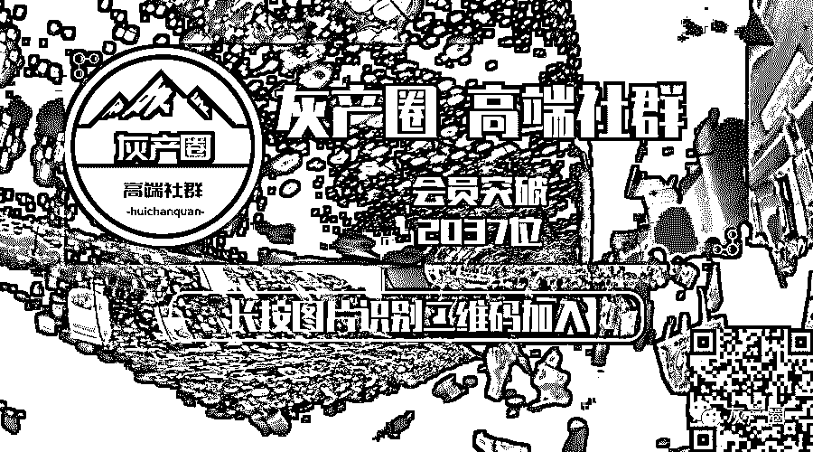

← 向右滑动与灰产圈互动交流 →

**阅读原文加入灰产圈高端社群**