# 一键可发 10 亿苹果用户?揭开 iMessage 背后的黑产

> 原文：[`mp.weixin.qq.com/s?__biz=MzIyMDYwMTk0Mw==&mid=2247495368&idx=1&sn=399fddeeb83abc42b8f74be221465dae&chksm=97cb25f0a0bcace61b97fe38bc41db5b889632ff6ccbaca72f311d19278dc1ff03d6a9e8f595&scene=27#wechat_redirect`](http://mp.weixin.qq.com/s?__biz=MzIyMDYwMTk0Mw==&mid=2247495368&idx=1&sn=399fddeeb83abc42b8f74be221465dae&chksm=97cb25f0a0bcace61b97fe38bc41db5b889632ff6ccbaca72f311d19278dc1ff03d6a9e8f595&scene=27#wechat_redirect)

**点击上方蓝色字体免费订阅“灰产圈”**

　    iMessage 又“火了”一把。

当多年的 iOS 老用户已经被 iMessage 的“澳门赌场”等短信骚扰到麻木时，一个“打开 iMessage 得到整个澳门”的话题将 iMessage 再次拉回到公众关注的视线中——尽管不是什么光彩的事情。

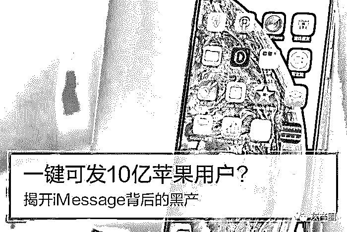

iPhone

　　当我们收到这些短信的时候，大多数反应是直接无视，但是否有人会想知道，iMessage 群发背后的黑色产业，究竟是如何实现如此庞大密集的信息群发呢？这次，PConline 带你深入了解 iMessage 背后的“黑产”。

什么是 iMessage 推信？

　　每个灰色地带都有自己的“黑话”，iMessage 垃圾短信也不例外，提供这项服务的黑色产业大多自称为“iMessage 推信”，说白了，就是用 iMessage 群发垃圾信息。

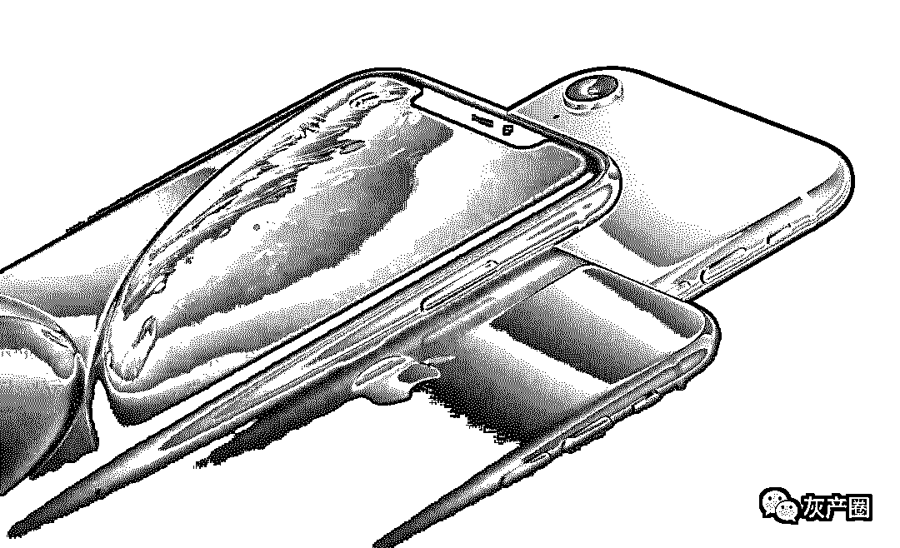

iPhone XS Max

　　根据黑色产业的“宣传”，相比购买 106 号段的短信服务，iMessage 推信推信有这些优势。目标人群明确，均为苹果用户，消费能力较强；文字数量不限，同时还可以添加表情和图片；可以添加网址、下载链接等，用户可以直接通过手机访问不会被手机安全卫士拦截；转发就像手机短信一样方便；无发送成本；送达终端的概率极高。

　　同时，苹果也没有针对 iMessage 的过滤系统，也就是说，iMessage 甚至可以自由发送涉嫌违法的信息。这就是为什么，我们收到的 iMessage 短信内容多是“澳门赌场”、“六合彩”等等内容，一个黑产遇上另一个黑产，“强强联手”让你招架不住。

iMessage 发到手机，只需几秒

　　其实至 iMessage 功能诞生以来，“垃圾短信”就几乎与其如影随行。苹果虽然采取了许多防垃圾短信的措施，但依旧是收效甚微。

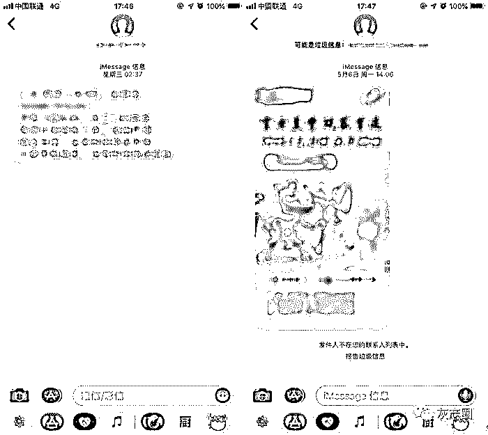

这些短信最终目的只有一个：骗钱

       这些短信最终目的只有一个：**骗钱**

　　过去，通过“删除并报告垃圾信息”功能可以让苹果审核封掉对方的 iMessage 帐号，但随着垃圾短信帐号的数量越来越大，这项措施的用处如今几乎可以忽略；而随着 iMessage“推信”的灰色产业链升级，iMessage 垃圾信息的发送也变得更加“高效”。

　　目前，iMessage 推信主要以**三种**方式实现。

**1.群控类**：基于 mac 或者 iTouch，在硬件运行群发脚本，需要硬件投入，并且对场地、电力要求较高。

**2.API 类**：直接调用苹果的 iMessage 协议，以破解证书形式进行发送，发送速度快，并且不需要投入太多硬件成本。但 API 方式十分容易被封，技术门槛高。

**3.群控+API 类**：最新的技术结合了群控和 API 破解法的优势，通过脚本“群控”MacOS 虚拟机，实现 iMessage 群发，封号风险、硬件成本都更低。

　　过去，iMessage 垃圾信息主要依靠第一种，也就是通过 iPod Touch、旧款 iPhone 等廉价 iOS 设备进行“群控”运行脚本，以一部主机控制多台手机自动操作的形式，发送 iMessage 垃圾信息。

这种方式不仅十分耗费成本，而且在“删除并报告垃圾信息”功能推出后，“群控”设备还有被苹果 BAN 机（禁用 iMessage）的风险。

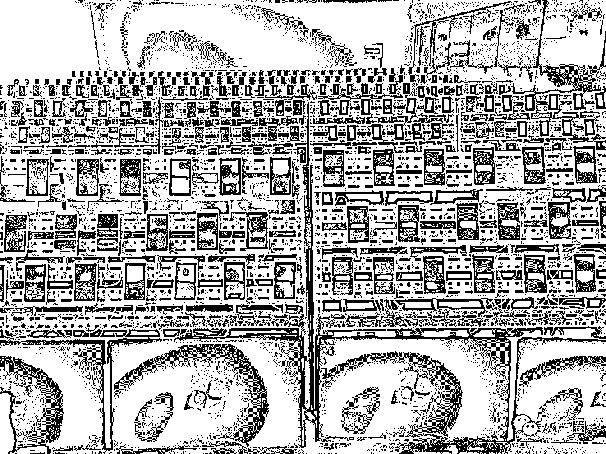

手机群控演示

　　而据 PConline 调查员了解，当前主流的 iMessage 垃圾信息发送技术已经可以直接以第三种方式“群控+API 类”实现，基本只需软件进行操作，整个发送过程甚至不需要苹果设备参与。

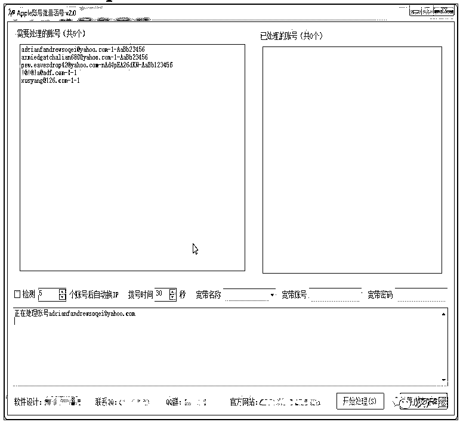

不法商家提供的“扫号”演示

在群发信息之前，黑产会先进行“扫号”操作，目的是筛选电话号码中激活 iMessage 的用户，导出信息发送的目标号码。“扫号”需要用到群控装置和 iOS 设备，运行脚本自动筛选出 iMessage 号码，由于无需发送任何信息，用于“扫号”的设备不会被 BAN 机。 

　　扫号完成后，电话号码会被导入“iMessage 推信”软件，作为 iMessage 发送的目标。所以你收到“澳门赌场”短信并不是因为上了某些“可疑网站”，而是直接被扫号“扫”出来。

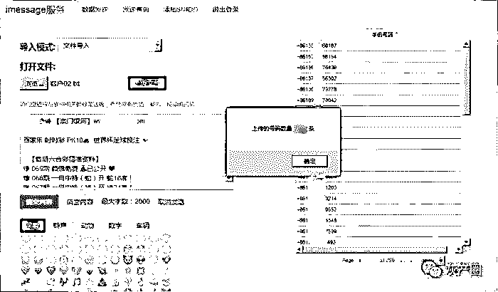

iMessage 推信

　　“iMessage 推信”软件目前已经比较成熟，具备图形化的操作方式，设定好参数后，将会自动运行虚拟机、以及执行虚拟机内部的**AppleScript 脚本**。从而实现批量通过 iMessage 发送不同内容，包括文字、图片、视频等。

imessage

　　**AppleScript 脚本**由 MacOS 内置的“脚本编辑器”进行编写，在“脚本编辑器”的“词典”选中“信息.app”，就能看到用于编写控制脚本的指令，对于略懂些技术的人来说，六七行代码已经可以实现 iMessage 的自动发送。

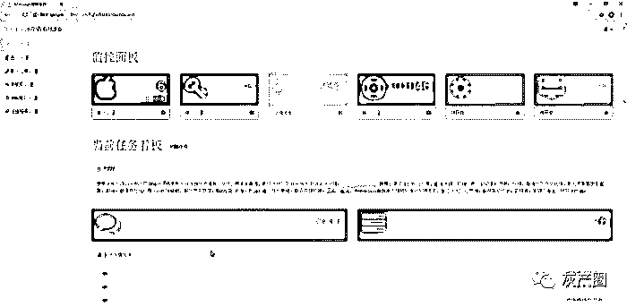

iMessage

　　从“iMessage 推信”软件的界面来看，要实现批量发送 iMessage 信息，虽然不需要实际的苹果硬件，但是仍然需要实际设备的“五码”、苹果帐号、手机号、mac 地址等，说明苹果对 iMessage 的发送还是设下了不少的限制。

　　这些“帐号资源”又涉及到了另一条黑产链，以网络平台售卖的 Apple ID 为例，每个帐号价格约为 1 元左右，实际成本相当低。

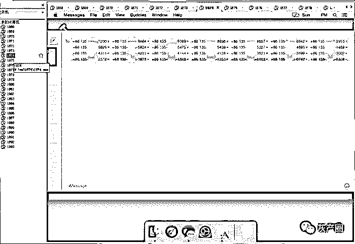

iMessage

　　通过虚拟机克隆“五码”、MAC 地址，在苹果眼中，这些虚拟机就成为了实际存在的“苹果设备”，从而可以正常收发 iMessage 信息，即使被封掉，只需使用新的码重新克隆一台“新设备”即可。

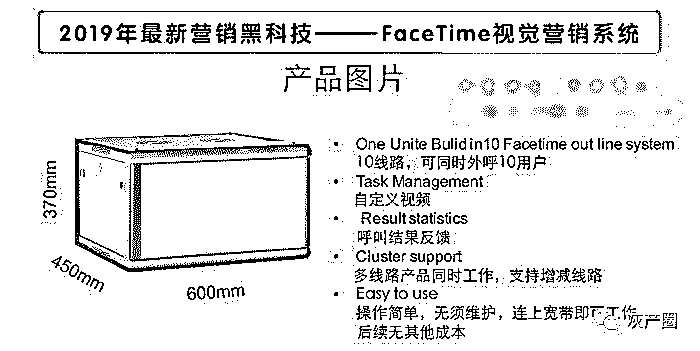

黑产提供的“FaceTime 视觉营销系统”

面对 iMessage 过滤技术的升级，黑产能想到的漏洞可以说还是无孔不入。据了解，已经有利用 Facetime 自动呼叫的“营销”设备出现，比起一般的骚扰电话，使用 Facetime、多线程呼叫，传输视频等图像信息、甚至有可能窃听和盗取用户隐私，危害更大。 

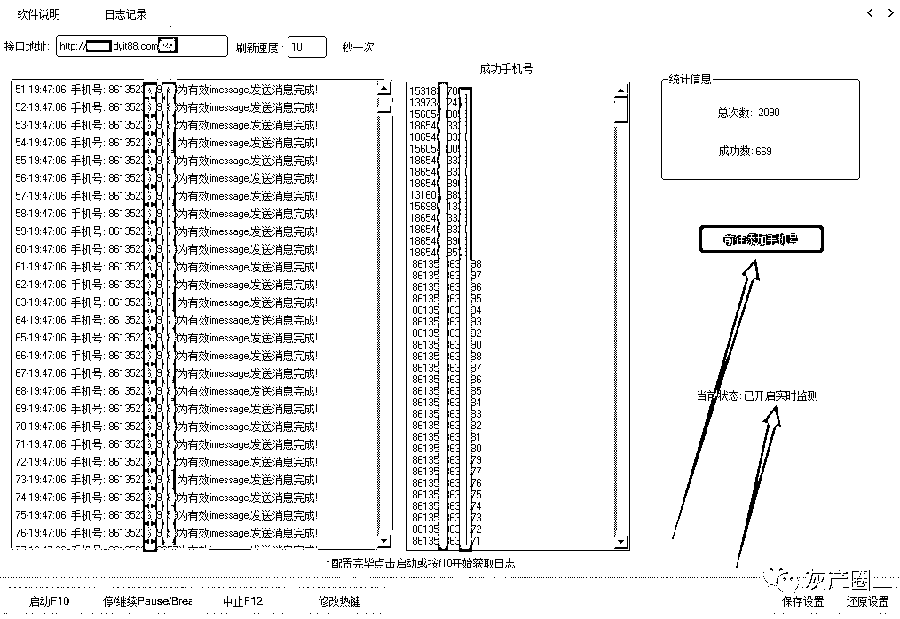

黑产提供的推信后台

　　黑色产业利用了相当简单的漏洞，就能实现 iMessage 的群发，对此苹果作为技术企业，识别虚拟机、封堵漏洞或许并不是难事，为什么时隔多年，iMessage 垃圾信息不仅没有消失反而愈演愈烈呢？趁 FaceTime 营销还没有开始轰炸你我的手机之前，苹果是时候采取措施封堵漏洞了。

如何拦截？看这里

　　拒绝接受垃圾 iMessage 信息并不困难，简单几步，就能让你彻底告别“澳门赌场”.

**方法一，过滤未知发件人**

　　iOS 系统在系统自带了比较简单的过滤系统，在“设置”中找到“信息”，点进下滑可以找到“未知与过滤信息”的选项，打开“过滤未知发件人”功能即可。

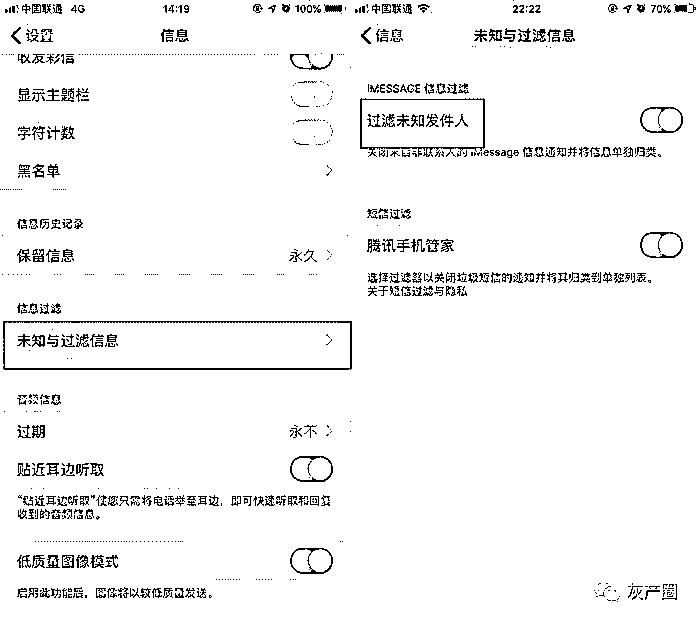

iMessage

　　开启后，不在联系人列表和被苹果过滤的短信都会被归类到信息的“未知与过滤信息”一栏，虽然仍然会继续收到信息，但是这些信息不会被推送提醒，类似于开启免打扰模式的效果。一定程度上可以令人“无视”垃圾短信的骚扰。

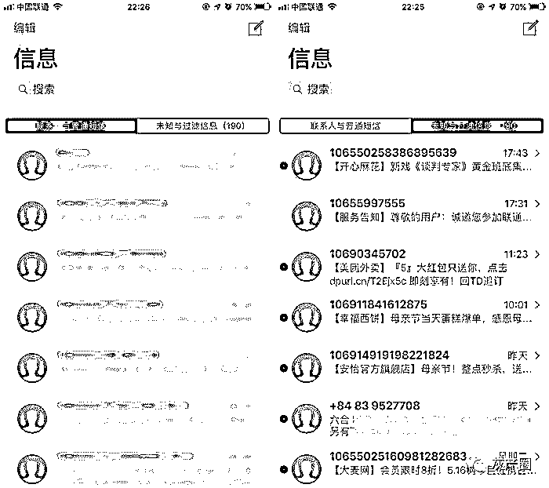

imessage

　　不足的地方在于，这种方法会使得垃圾短信越来越多，像我这样积了几百条，删除起来非常麻烦。

**方法二，第三方拦截 APP**

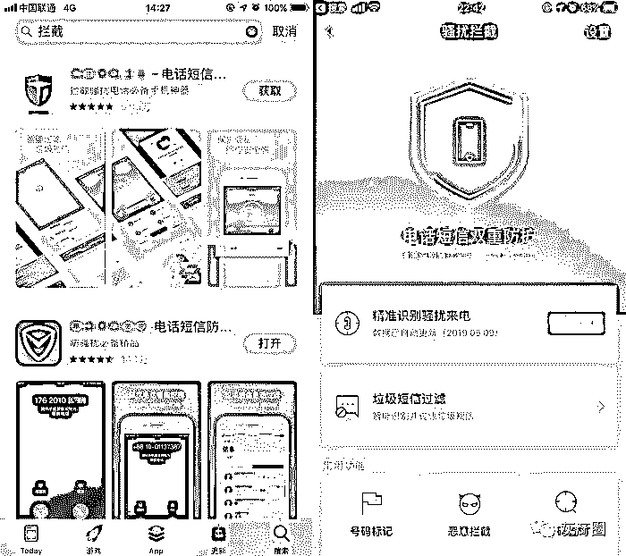

iMessage

　　虽然不能像 Android 一样使用第三方应用全权接管骚扰短信和电话拦截的功能，但 iOS 端也同样是支持第三方拦截应用的，比较有名的几款也是手机管家中的老牌应用。

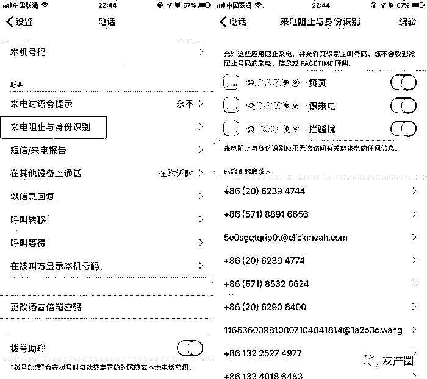

iMessage

　　下载应用后，可以根据应用提示开启电话和短信的拦截功能，比如在“设置”——“电话”中找到“来电阻止与身份识别”，开启第三方应用需求的选项即可。短信拦截则在方法一的“信息”——“未知与过滤信息”当中，可以找到相关功能选项。

**方法三，关闭 iMessage 功能**

　　使用前两种方法，可以有效避免你被垃圾短信和电话骚扰，但它们的作用也仅限于此。由于 iOS 系统集成了苹果自家的即时通讯服务 iMessage，不法分子可以通过免费的 iMessage 对你进行骚扰。

　　iMessage 通讯依靠网络，因此不管是运营商还是拦截应用，都无法为你挡住 iMessage 垃圾短信，这就是为什么我们装了拦截应用，但还是不断被骚扰的原因。

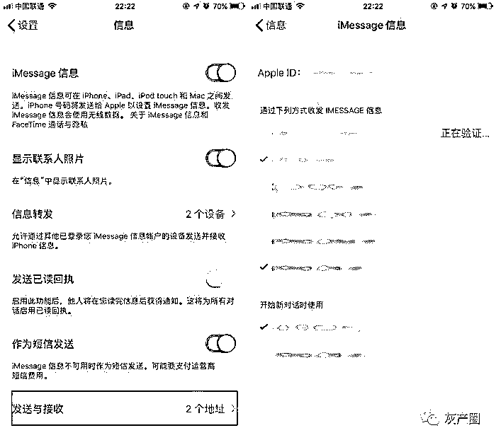

iMessage

　　首先，可以通过关闭 iMessage 收件地址减少被骚扰的机会，因为 iMessage 短信除了通过电话号码发送，也可以通过邮件地址发送，我们在网站注册所用的邮件地址，很有可能就成为这些短信的目标。因此在“信息”——“发送与接收”当中，我们可以只保留一个电话号码，其他邮箱地址接收全部关闭。

　　现在垃圾短信的发送技术也在进步，不法分子通过销售“猜号”应用，可以自动识别哪些号码开启了 iMessage，从而发送短信，因此想要有效防止 iMessage 侵扰，只能靠一个最后大招：关闭 iMessage。

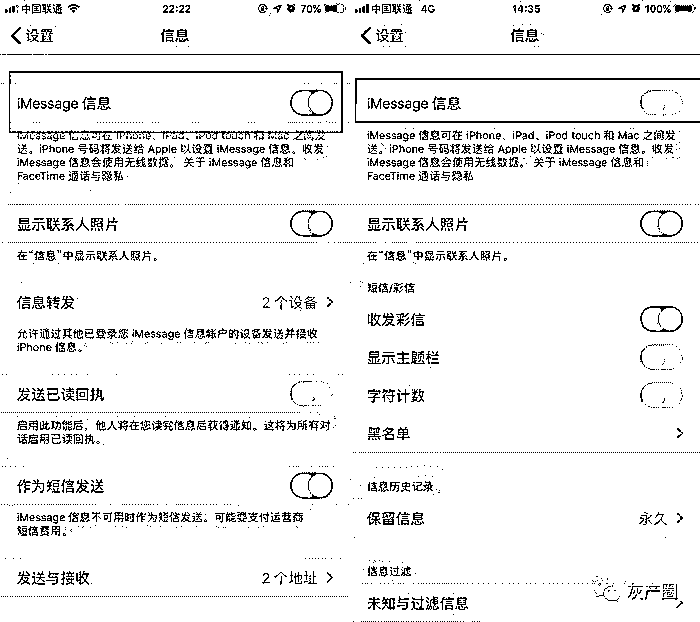

iMessage

　　点进“设置”——“信息”的第一条，在“iMessage 信息”处就可以直接关闭 iMessage 功能，关闭后，iOS 的“信息”应用将不会收到 iMessage 信息，从而真正还你一个清净的体验。

　　不过需要注意的是，关闭“iMessage 信息”后，多设备信息转发功能也会被关闭，对于使用“苹果全家桶”的用户来说，关闭这项功能可能会影响日常的使用体验。

结语

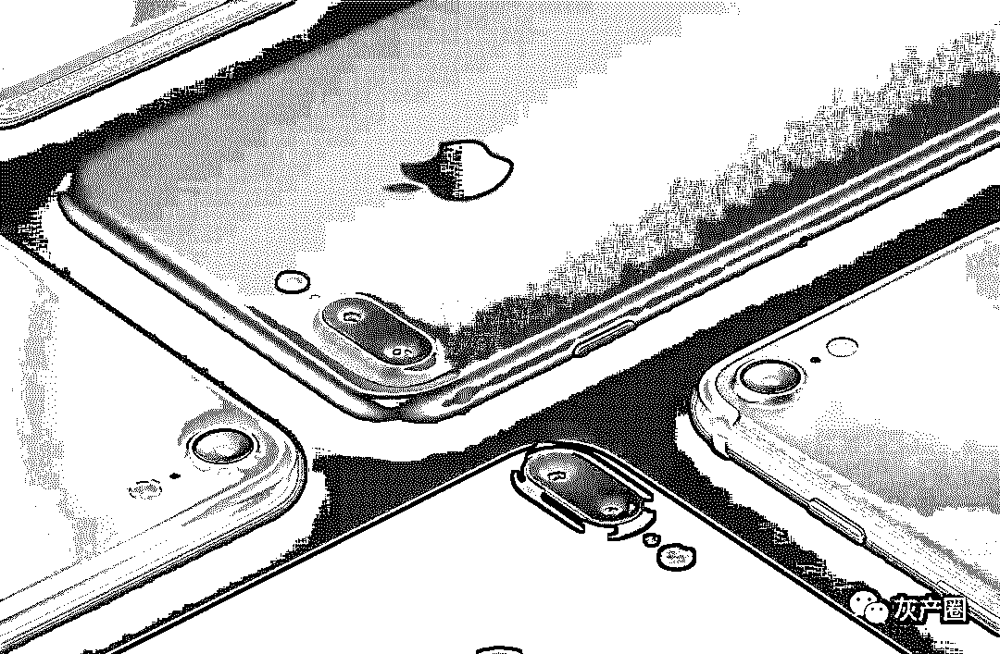

　　毫无疑问，iMessage 诞生的初衷是好的。它以更方便简单的方式，优化了传统 SMS 单调的体验，更能够跨设备接收，为苹果全家桶的用户提供便利。黑色产业正是利用了这种便利，使 iMessage 成为苹果用户不得不作出取舍的“鸡肋”功能。

　　然而我们要关注到问题背后的本质，当我们看到 iMessage 骚扰短信已然成为一个相当成熟的产业链时，更也关注到 Facetime 推广这些“新兴”推信方式的出现，这些骚扰短信背后的推手，其实本身就是一些已经触及法律红线的活动。这些诸如线上赌场、高利贷、六合彩的“真黑色产业”屡禁不止，各种利用非正常渠道进行的推广自然很难消失。

← 向右滑动与灰产圈互动交流 →

**阅读原文加入灰产圈高端社群**