# 手机定位玄学：“是什么(what)”“为什么(why)”“怎么办(how)”

> 原文：[`mp.weixin.qq.com/s?__biz=MzIyMDYwMTk0Mw==&mid=2247495351&idx=1&sn=bcef066befface5326fd90f73e12f7e4&chksm=97cb258fa0bcac99ecb72215a74e277031e798785a3c062c4094b01245f811d1139e26c2dfdc&scene=27#wechat_redirect`](http://mp.weixin.qq.com/s?__biz=MzIyMDYwMTk0Mw==&mid=2247495351&idx=1&sn=bcef066befface5326fd90f73e12f7e4&chksm=97cb258fa0bcac99ecb72215a74e277031e798785a3c062c4094b01245f811d1139e26c2dfdc&scene=27#wechat_redirect)

**点击上方蓝色字体免费订阅“灰产圈”**

导语

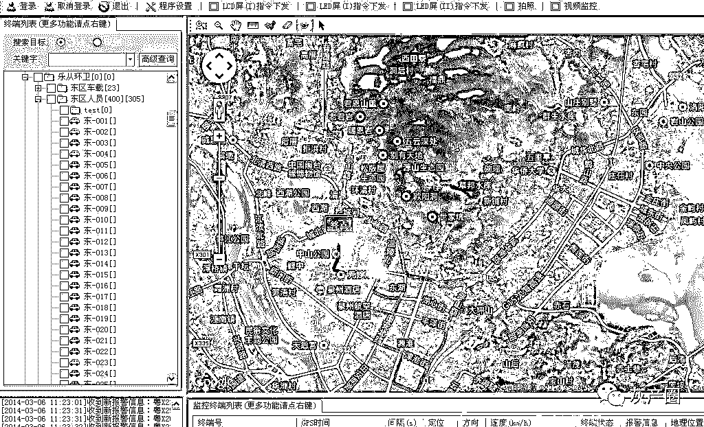

定位是手机最基本功能，在网上简单搜索“手机定位找人”，可以发现不少声称提供这种服务厂商，有厂商表示只提供手机号、QQ 号或者微信号就能定位，这真存在么？

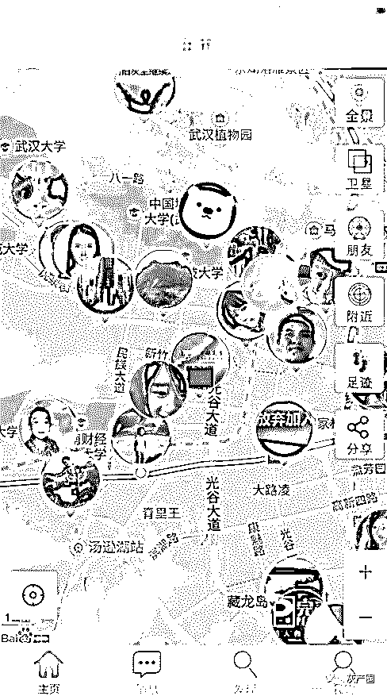

 为什么会被定位？

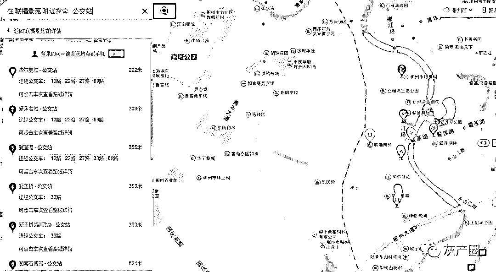

    现在，越来越多 APP 在首次使用时，基本上会跳出一个授权个人位置选项。一般情况下，很多人会下意识点击【允许】，那么该应用就可以一直获取你位置信息。

    大多数情况下，这种定位服务方便我们订餐、订票、使用地图服务，不排除有些 APP 为盈利驱使，将个人位置隐私信息泄露给第三方，用于推送广告等服务。

因此，大家在使用手机一定要谨慎设置位置权限。

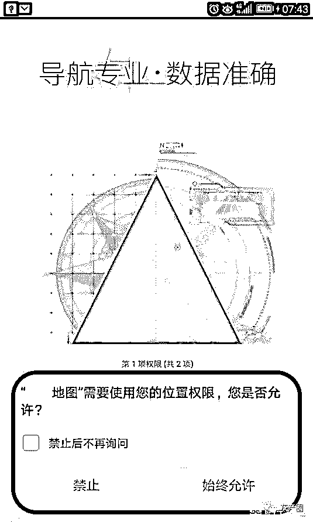

    “被定位”方式

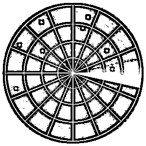

大家平时使用手机定位服务时候，有没有想过这些问题：

手机到底如何实现定位？工作原理是什么？

大家都知道卫星定位，那么，是不是只有卫星这一种定位方式？

如果我们在室内，没有卫星信号覆盖，是不是就彻底不能定位？

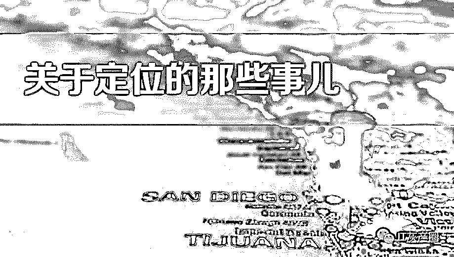

> **卫星定位**

定位，我们通常按使用场景，分为**室内定位**和**室外定位**。

我们先来说说用得最多室外定位。

目前最主流室外定位方式，刚才我们已经提到，就是**卫星定位**。

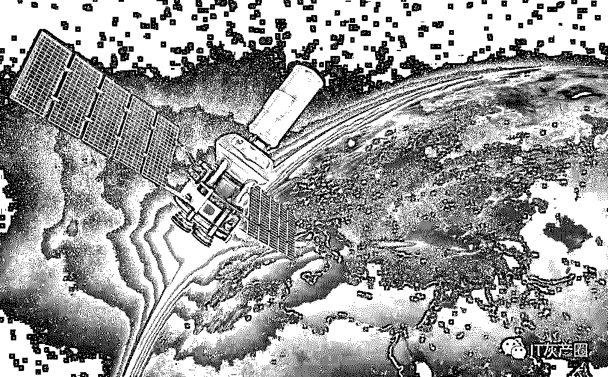

卫星定位，是利用人造地球卫星进行点位测量技术，也是目前使用最为广泛、最受用户欢迎定位技术。它特点就是精度高、速度快、使用成本低。

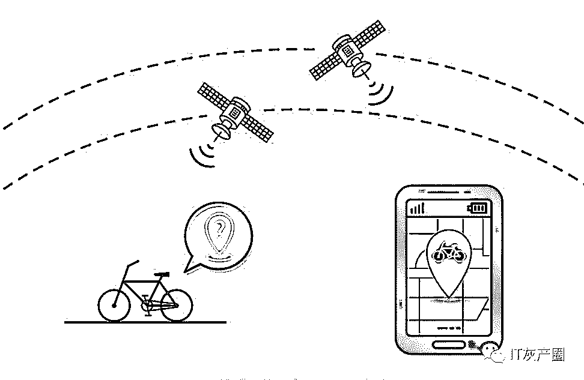

，目前世界上只有少数国家，具备建设和维护卫星定位系统能力。

包括：美国 GPS，中国北斗(BDS)、欧洲伽利略(Galileo)、俄罗斯格洛纳斯(GLONASS)。此外，还有日本准天顶系统（QZSS）和印度 IRNSS。

使用最为广泛**美国 GPS 系统**

GPS，英文全名是 Global Positioning System，全球定位系统。

它起始于 1958 年美国军方一个项目，1964 年投入使用，1994 年彻底布设完成。

GPS 系统主要建设目，是为陆海空三大领域提供实时、全天候和全球性导航服务，并用于情报搜集、核爆监测和应急通讯等一些军事目。

该系统由 24 颗卫星构成，其中 21 颗为工作卫星，还有 3 颗是在轨备用卫星。它们共同组成 GPS 卫星星座。

正常情况下，在地球表面上任何地点任何时刻，平均可同时观测到 6 颗 GPS 卫星，最多可达 10 颗卫星。

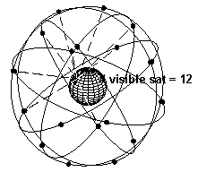

除天上卫星之外，当然还需要地面相关设备进行配合和监测，也就是地面监控系统。

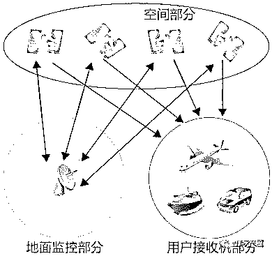

GPS 工作卫星地面监控系统包括一个主控站、三个注入站和五个监控站。

GPS 导航系统基本原理，是测量出已知位置卫星到用户接收机之间距离，然后综合多颗卫星数据就可知道接收机具体位置。

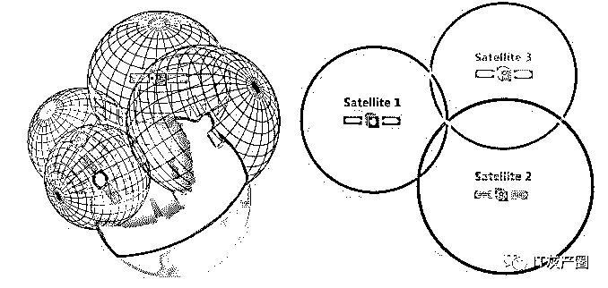

我们手机，内置 GPS 模块和天线，相当于接收机，负责 GPS 数据接收和处理。

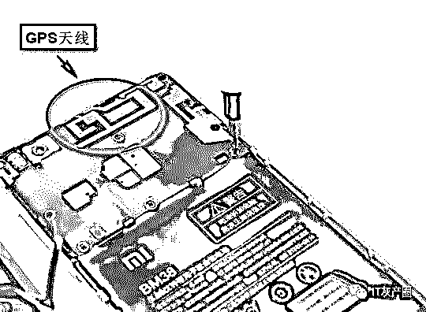

这些数据被手机操作系统或 APP 应用软件（例如百度地图）调用，起到精确定位目。

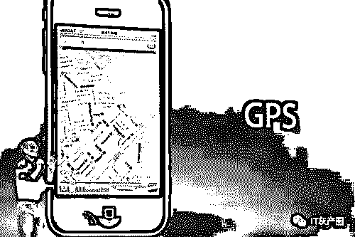

卫星定位这个东西，涉及到国家安全，当然不能完全依赖于国外。

所以，尽管 GPS 系统非常成熟，我们国家还是开发**北斗系统**。

弹道导弹，总不能用人家老美卫星来定位吧？

我们北斗系统已经具备商用能力，配合基准站，能给客户提供精确到 10 米定位服务，和 GPS 不相上下。

北斗也弥补 GPS 不足，具备短报文能力（GPS 卫星是单向广播，不具备双向通信能力，功能略显单一）。

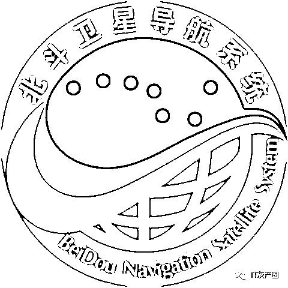

> **基站定位**

说完卫星定位，再来看看**地面定位**。

说到地面定位，大家首先想到什么？哈哈，是不是雷达？

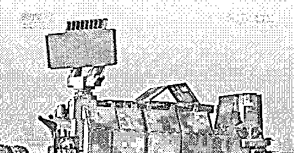

确实，雷达作为一项搜索定位技术，广泛应用于军事和民用领域。

毕竟普通手机数量非常庞大，加之生活场所障碍物非常复杂，不管从技术角度，还是成本角度，都不适合采用雷达进行定位。

那我们采用什么方式呢？

其实可以用方法很多，最常用，是**基站定位**，也就是常说**LBS，**Location Based Service（基于位置服务）。

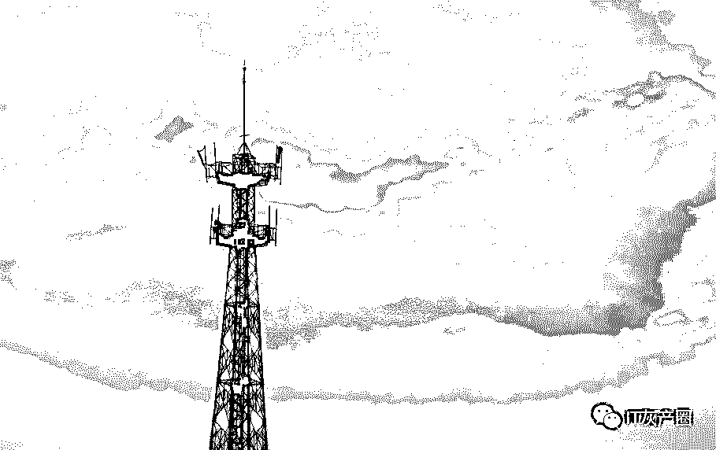

基站定位原理和雷达有相似之处。雷达定位大家都知道，就是发射雷达波，根据目标反射，进行空间位置测算。

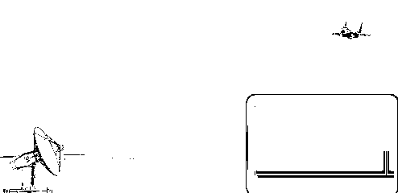

基站定位话，基站就相当于是一个雷达。

在城市中，一部手机会在多个基站信号覆盖之下。手机会对不同基站下行导频信号进行测量，得到各个基站信号 TOA（到达时刻）或 TDOA（到达时间差）。根据这个测量结果，结合基站坐标，就能够计算出手机坐标值。

画个图，一看就明白：

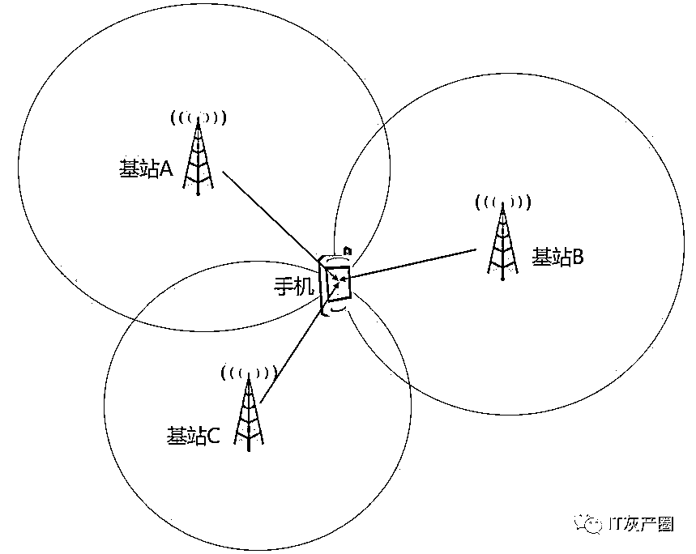

清楚：三点一位。

基站定位精度并不高，误差大概从 100 米到上千米。

主要误差原因，是来自基站位置和密度。简而言之，基站数量越多，密度越高，定位精度也就越高。基站和手机之间障碍物越少，定位精度也会有所提升。

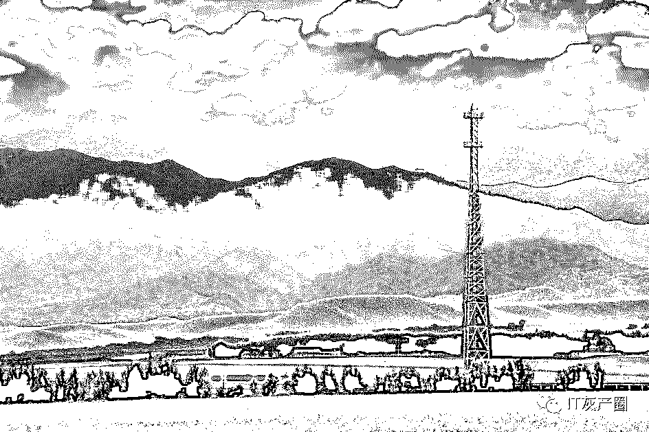

一个站可以定位一个圈，无法定位一个点

除上面所说基站定位之外，如果你对定位精度要求不高话，也可以**直接查看手机当前所在小区信息**，来确认目标位置。

我们所有手机，只要连接到运营商网络，就相当于登记在网络里。当前连接基站信息，在手机中都可以查到。

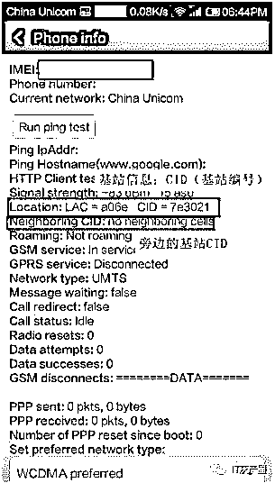

在运营商那边，也非常容易查到这个信息。即使你关机，运营商 HSS（负责管理用户数据设备）都能查到之前你所在基站小区。

这种方式查看位置比较快，精度就很低，一个基站覆盖范围，从几百米到几公里不等。

> **Wi-Fi 定位**

除基站定位之外，还有一个大家可能比较陌生地面定位方式，就是**Wi-Fi 定位**。

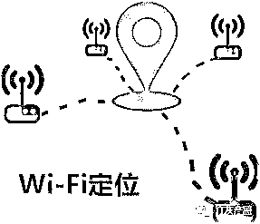

也许你会认为，我所说 Wi-Fi 定位，就是 IP 地位定位。其实并不是。

每个人上网，都会有一个公网 IP 地址。这些 IP 地位，在网络系统中都是有注册，例如属于南京电信或上海联通，之类。

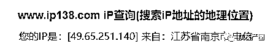

IP 地址确实可以大致追踪到你位置（运营商可以查得更准确），这种定位也有局限性。一方面，现在很多运营商都采用 NAT 技术，不一定会给每个用户分配公网地址，另一方面， IP 地址很容易欺骗，我如果搞一个代理地址，你看到 IP，可能是美国。

我所说 Wi-Fi 定位，和上面 IP 地址定位完全不同，是根据**Wi-Fi 路由器 MAC 地址**进行定位。

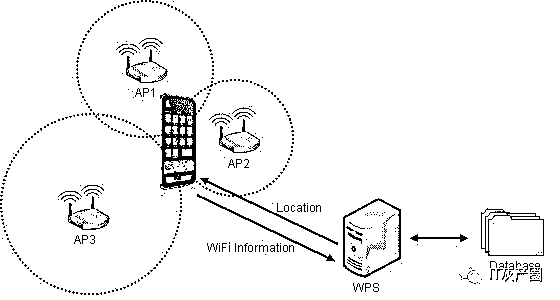

每一个无线 AP（Wi-Fi 路由器）都有一个全球唯一 MAC 地址，并且一般来说，无线 AP 在一段时间内不会移动。

在开启 Wi-Fi 情况下，采集设备（例如手机）可以搜到这个无线 AP 信号，并且获取它 MAC 地址和信号强度信息。

采集装置将这些信息上传到服务器，经过服务器计算，保存为 MAC-经纬度映射。当采集信息足够多，就在服务器上建立一张巨大 Wi-Fi 信息数据库。

当一个设备处在这样网络中时，可以将收集到这些能够标示 AP 数据发送到位置服务器，服务器检索出每一个 AP 地理位置，并结合每个信号强弱程度，计算出设备地理位置并返回到用户设备，其计算方式和基站定位位置计算方式相似，也是利用三点定位或多点定位技术。

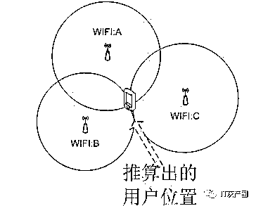

位置服务商要不断更新、补充自己数据库，以保证数据准确性。

和基站定位一样，Wi-Fi 定位在 AP 密集地方有很好效果。如果 AP 很少，那也很难定位准确。

Wi-Fi 这种定位方式执行难度比较大，可用性和准确性也不高。所以，主要还是一种辅助性质定位手段。

> **A-GPS 定位**

说到辅助，我们就要说到**A-GPS**。

A-GPS，Assisted GPS，辅助全球卫星定位系统。从名字就可以看出来，这是 GPS 一个增强功能。

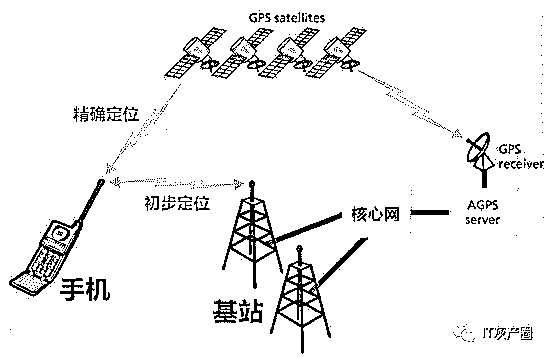

**A-GPS 网络架构**

这个技术，就是将 GPS 定位和基站定位两种技术相结合。

手机通过基站大致定位自己位置，然后把位置告诉 AGPS 服务器，服务器根据这个位置信息，将此时经过你头顶卫星参数（哪几颗、频率、位置、仰角等信息）反馈给你手机，你手机 GPS 就可以快速搜索卫星。

用 A-GPS 话，手机搜星速度大大提高，几秒钟就可定位。

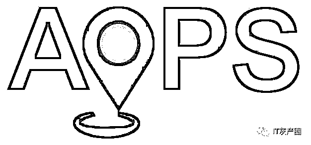

以上，就是常用室外定位技术。

> **室内定位**

像 GPS 这样定位技术，虽然精度高，有一个明显缺点，就是无法穿透建筑物，不能实现**室内定位**。

人们对室内定位是有强烈需求。例如地下车库，人们经常会忘记自己车停在哪里。在大型商场人流较多，找人会存在困难，小孩走失话，也会需定位。

**地下车库，非常考验一个人方向感**

工业方面，也有定位需求，例如厂房内生产线跟踪，资产管理等。

现在我们都在说万物互联

那么，物在哪里，你总要知道吧？

**IoT，物联网**

对于这种室内定位需求，我们应该采用什么样定位手段呢？

**任何一种通信技术，本身都会带有定位功能**。

像我们刚才说基站定位和 Wi-Fi 定位，本身都是通信技术，通过测量时间差，都能够进行位置测量。

短距离通信技术有哪些，室内定位技术，就有哪些。

例如，**蓝牙定位**、**红外定位**、**RFID 射频定位**、**超声波定位**、**Zigbee 定位**、**UMB 定位**，全部都属于室内定位技术。Wi-Fi 定位，其实也一样适用于室内。

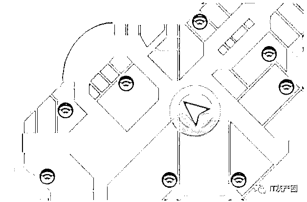

**Wi-Fi 室内定位**

我们介绍几个比较典型的吧。

首先，**蓝牙定位**。

蓝牙，大家都很熟悉，是一种短距离低功耗无线传输技术。

蓝牙定位，就是通过在指定区域安装信标（可以发出蓝牙信号），实现精确定位。这些比手机要小信标，每隔几米放置一个，能够与所有装有蓝牙模块移动设备进行通信。

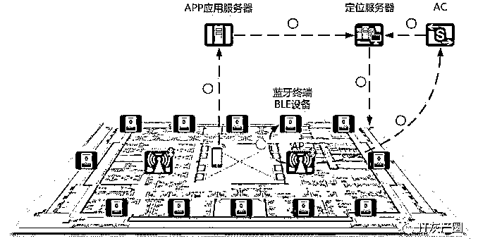

**蓝牙定位组网**

蓝牙定位优点是设备体积小、短距离、低功耗，易集成在手机等移动设备中。只要设备蓝牙功能开启，就能够对其进行定位。 

说到蓝牙定位，就要提一下**iBeacon**，这是苹果公司 2013 年推出一种低功耗精准微定位服务。它比以往普通蓝牙技术传输距离更远，精度更高。

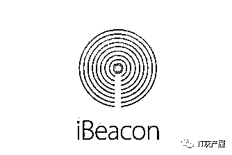          

限于篇幅，其它几种室内定位技术，就不一一介绍啦。

像 GPS 定位、基站定位这样方式，搭建系统有很高门槛，不管是技术，还是资金，都不是一般企业能够承受。

室内定位技术完全不同，它并不需要很大投资，而且技术难度也小得多，所以，现在很多公司都在研究，也做出不少成熟产品。这一块市场前景，还是非常广阔。

好啦，以上，就是灰产圈对常用定位技术介绍。

    如何避免被定位？

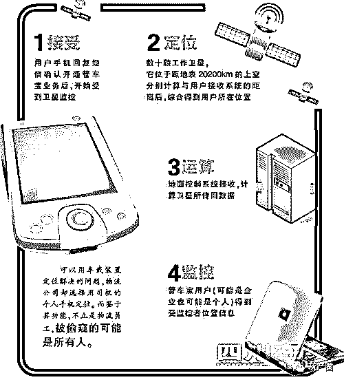

　你在手机中，打开手机隐私—定位服务，手机就会有定位服务，这时候，你只要通过地图 APP，就能够实现定位，这是你主动定位。

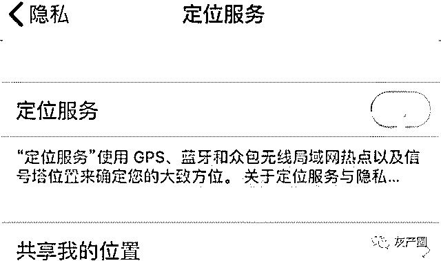

　　如果你是正规渠道购买，不存在购买时候被植入病毒可能性，那就拷贝好数据，恢复出厂设置，别人就不会追踪定位。

   不过，要提前搞清楚，是不是你在某第三方 APP 中曾经有过确定行为，如果那样，恢复出厂，如果这个 APP 是手机厂商自带软件，那就没用。你得自己找出来，关掉它。

有人是购买二手手机，其中被人安装定位软件或者追踪软件，有人会被安装监听软件，这是不合法。

> **    为防止自己被定位：**

   **最关键不要随意安装 APP**，这些 APP 可能搜集个人隐私信息、位置信息，上传到对方云端数据库，实现“被定位”。

 **   恢复手机出厂设置**，在手机使用过程中，可能会因为各种原因，安装一些 APP，被第三方 APP 定位。这时，恢复出厂设置，所有数据就清空。

  **  虚拟定位**，现在很多手机带有“穿越功能”，可以将手机定位达到各种地点，用来迷惑对方。

    以上就是自己手机被定位原因和解决方式，在平时使用手机过程中，慎重安装第三方 APP，在使用 APP 过程中，谨慎授权“位置”服务。，对于 WiFi 定位，很可能防不胜防，尽量不要连接公共 WiFi。

结尾

最后，听听梁宏达老梁讲述关于私人侦探故事：

[`v.qq.com/iframe/preview.html?width=500&height=375&auto=0&vid=u0562z9d6no`](https://v.qq.com/iframe/preview.html?width=500&height=375&auto=0&vid=u0562z9d6no)

← 向右滑动与灰产圈互动交流 →

**阅读原文加入灰产圈高端社群**