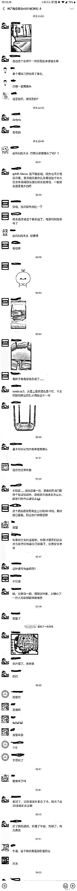
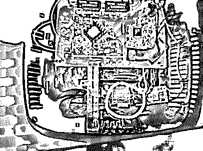
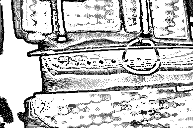

# “教科书式反偷拍”事件：我的生活,不是你的 A/V！

> 原文：[`mp.weixin.qq.com/s?__biz=MzIyMDYwMTk0Mw==&mid=2247495297&idx=1&sn=992d712defacb3aa0b679b4610ecd06f&chksm=97cb25b9a0bcacafbe2866c080ff7ecebd9db9edbf8a98e462289e9d81befaefbaa8b3d7162c&scene=27#wechat_redirect`](http://mp.weixin.qq.com/s?__biz=MzIyMDYwMTk0Mw==&mid=2247495297&idx=1&sn=992d712defacb3aa0b679b4610ecd06f&chksm=97cb25b9a0bcacafbe2866c080ff7ecebd9db9edbf8a98e462289e9d81befaefbaa8b3d7162c&scene=27#wechat_redirect)

**点击上方蓝色字体免费订阅“灰产圈”**

民宿偷拍事件

五一假期大家都出去玩没？

最近有一位网友外出住名宿的时候，居然大晚上发现房价路由器被偷偷装了摄像头，而且正对着卧室！！

这位游客是咋发现的呢？

原来，发现房间内藏着路由器的是一名从事信息安全工作的游客，他此前曾通过商业安全和隐私保护培训了解到如何检查偷拍设备。

他发现房间的路由器之后，拆开看了。果然路由器里有摄像头。

**↑路由器内部安装着一张储存卡**

**↑从外部可以看到显示灯有异样**

他发现路由器有异常后，第一时间选择报警、换酒店。民宿房主被行政拘留 20 日，并处罚金 500 元。

整个过程一气呵成，被一些网友称为“教科书式反偷拍”。

据这名游客说，他在定的这件名宿，3 晚的价格大约 1700 多元，我看到这个房子过去的接待量还不少，而且评价都不错。房东还是平台认定的‘超赞房东’。没想到居然遇到这种事情了。

**大家以后出去玩要格外小心了，这位游客的做法很值得参考。**

这名游客说，他平时就有注意检查环境安全的习惯，租房时也会很关心住所周边的治安情况，每次入住酒店时，也会在房间内先大致翻一翻，**看看有没有什么隐患，比如反锁的门是否容易从外部开启等等。**

比如住这家民宿，很快就发现了问题：“这屋子一进门玄关边上就有一个动态感应器，两个卧室也各安装了一个。我大概看了一下，整个屋子并不存在智能家居改造的痕迹，这几个动态感应器就很奇怪，于是我把它们转到面朝墙，又找了贴纸给贴上了。”

动态感应器可以监测到周边是否有人的活动，一般用于安全保护或者在人靠近时启动智能家居等。

随后，他拿着一个小的**强光手电一间房一间房确认安全**，“检查到二楼卧室时，我先**重点检查了烟感装置和电视机，因为这两个地方是偷放针孔摄像头的高发区域。**检查完毕后我还顺手将电视机的电源拔掉了。

随后在检查放在桌面上的路由器时，发现了问题。于是马上将路由器指示灯朝向地面放置，仔细地检查了整个路由器。

**对照了一下该设备的官方图片，后发现这个该路由器的确被改造了。**

在打开路由器后他看到了路由器里插着一个普通路由器绝不会有的数据储存卡，然后立马报警了。

这位游客的整个流程非常专业了，大家外出游玩住宿，大家可以借鉴一下

**偷拍事件调查视频**

[`v.qq.com/iframe/preview.html?width=500&height=375&auto=0&vid=o0867vuy8vt`](https://v.qq.com/iframe/preview.html?width=500&height=375&auto=0&vid=o0867vuy8vt)

偷拍设备剪辑：教你如何防偷拍

[`v.qq.com/iframe/preview.html?width=500&height=375&auto=0&vid=v07354652v5`](https://v.qq.com/iframe/preview.html?width=500&height=375&auto=0&vid=v07354652v5)

●[深度 | 偷拍黑色产业链：“我的生活不是你的色情片！”](http://mp.weixin.qq.com/s?__biz=MzIyMDYwMTk0Mw==&mid=2247494117&idx=1&sn=bbc400d9baf938c07b725b0710f2e16f&chksm=97cb22dda0bcabcb1b87e2a2b5d030fc4a0d0c7fee1140ff5d8cafb39cbcf54685c62d49b0e5&scene=21#wechat_redirect)

●[别人卖手机拍照课程，撩妹变现赚百万](http://mp.weixin.qq.com/s?__biz=MzIyMDYwMTk0Mw==&mid=2247483709&idx=3&sn=52c658d9ec808984b7a13a39270dc767&chksm=97c8ca05a0bf43130fab37b8e5f785f6e36135c1b76eb0a482e7f9c0a88cc3c307990cc1235f&scene=21#wechat_redirect)

●[黑客、色情、黑公关——管窥中国互联网的地下世界](http://mp.weixin.qq.com/s?__biz=MzIyMDYwMTk0Mw==&mid=2247494131&idx=1&sn=18a38448d066a42e53ed8edd3ba1aed4&chksm=97cb22cba0bcabdd1d2ba053ed81f24635cca52982e53ca05bcc430052e7b3267103e8fb952c&scene=21#wechat_redirect)

●[揭秘智能摄像头之下的“偷窥”灰色产业链，隐私何在？](http://mp.weixin.qq.com/s?__biz=MzIyMDYwMTk0Mw==&mid=2247494697&idx=1&sn=44f4b323ae224e647b45e074d79a8467&chksm=97cb2711a0bcae0706ec85e1e4ce122ae53d7bab141f005a9705200f46529c9bd5cbaa44fa97&scene=21#wechat_redirect)

← 向右滑动与灰产圈互动交流 →

**阅读原文加入灰产圈高端社群**