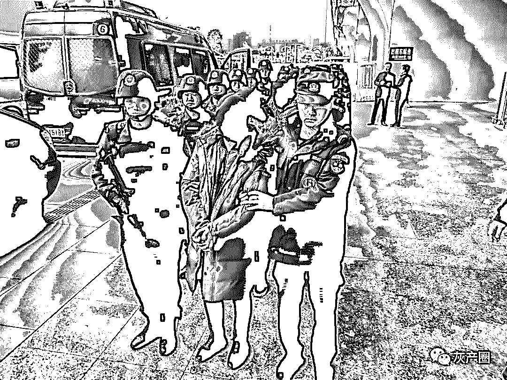
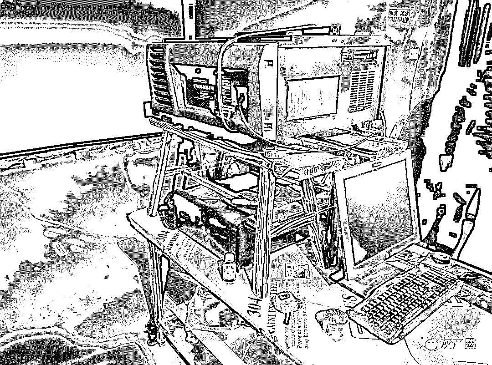
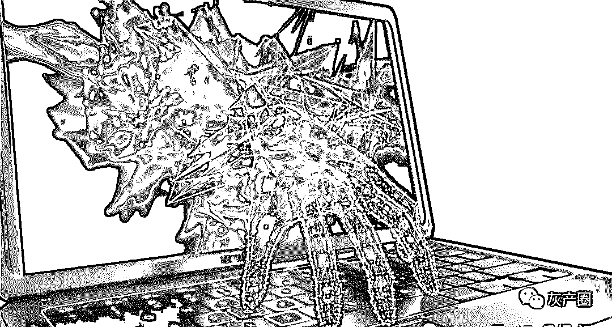
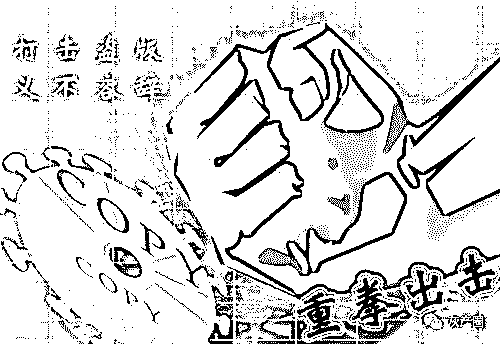

# 热门电影遭高清盗版背后：黑产猖獗，盗版影片“加密”防盗

> 原文：[`mp.weixin.qq.com/s?__biz=MzIyMDYwMTk0Mw==&mid=2247495221&idx=1&sn=cff89a48d8f00b978a3b901fea64ad3d&chksm=97cb250da0bcac1b375c4e95c38bad545c7792d559227313bdb2b148bb981e65bbb4b4fb49af&scene=27#wechat_redirect`](http://mp.weixin.qq.com/s?__biz=MzIyMDYwMTk0Mw==&mid=2247495221&idx=1&sn=cff89a48d8f00b978a3b901fea64ad3d&chksm=97cb250da0bcac1b375c4e95c38bad545c7792d559227313bdb2b148bb981e65bbb4b4fb49af&scene=27#wechat_redirect)

**点击上方蓝色字体免费订阅“灰产圈”**

导语

编号**A15591**电影放映服务器，中宣部电影质量检测所（以下简称电影质检所）盗版追查工作组将它命名为“幽灵一号”。

 过去三年，利用“幽灵一号”制作的高清盗版电影一直在市场上不断出现，电影质检所力图通过对盗版影片技术检测发现它，但由于该服务器已被改造，致使始终无法定位查找到。 

**犯罪嫌疑人被押解回扬州。本文图片均警方供图**  

直到今年春节再次“作案”，潜伏的“幽灵一号”终于被公安机关查获。

 今年春节，《流浪地球》等 8 部春节档电影集体遭高清盗版，盗版电影流至网络，一度出现“携片拜年”的“盛况”。

中国版权协会监测数据显示，截至 3 月 6 日，春节档 8 部影片高清版侵权链接 3.89 万条，点击播放总量约 8288.2 万人次，初步预估票房损失和正片视频平台损失约 7.87 亿元。

 在公安部的部署指挥下，江苏扬州、河南南阳等地公安机关破获了系列春节档电影盗版侵权专案。调查发现，在过去的几年内，盗版团伙利用“幽灵一号”等放映服务器播放正版电影然后高清翻拍，发展出一条集制作、发行、加密等为一体的高清盗版的产业链，拥有着遍及全国 20 省 300 余家加盟私人影吧。

 4 月 29 日，公安部在江苏省扬州市召开新闻发布会通报，截至目前，公安机关共侦破影视侵权盗版系列案件 25 起，抓获犯罪嫌疑人 251 人，打掉盗版影视网站 361 个、涉案 APP 57 个，查缴高清电影盗录服务器 7 台。

“幽灵一号”：换了身份的服务器

影院播放正版电影必须具备放映服务器、影片拷贝、以及用于解密影片的密钥。和所有电影放映服务器一样，“幽灵一号”也有两个关键元素，一个是数字证书，一个是水印芯片。

数字证书就是放映服务器的身份信息。水印芯片与数字证书对应，在播放影片时生成水印，通过水印可以溯源影片的播放时间和播放机器。正规影院需要把放映服务器在国内三大影片发行平台注册备案，获取影院的账户和密码，用于获取片源相对应的密钥。

 电影质检所盗版溯源工程师周令非告诉我们，早在 2016 年，他就发现市场上陆续有带有序列号**A15591**电影放映服务器专有水印的盗版电影，但服务器下载电影密钥时绑定的是空壳影院，无法对该服务器进行定位。

调查人员便通知影片发行机构将该服务器的数字证书列入了黑名单，这也就意味着凭借**A15591**的数字身份证书不再能从电影发行方获取密钥。

 但带有**A15591**专有水印的盗版电影并未从市场上消失，电影质检所当时就判断“它已经不是它了”。也就是说**A15591**这台服务器还在获取密钥播放电影，但是用的已是别的经备案的服务器的数字身份，这导致监管部门无法定位 A15591 放映服务器，也因此它被命名为“幽灵一号”。

 今年春节档电影大规模的高清盗版乱象引发了社会广泛关注，我们从公安部获悉，中央领导同志高度重视。国务委员、公安部部长赵克志多次召开专题会议研究工作措施，要求迅速侦办、依法严惩。

公安部成立孙力军副部长任组长的打击春节档电影侵权盗版系列专案工作组，梳理重点线索，部署江苏、浙江、河南等地强力推进案件侦办，集中力量破案攻坚。

 扬州市公安局治安支队行动大队大队长 TT 介绍，办案民警通过化妆侦查、摸排小影吧院线高清盗版影片来源，落地锁定了为江苏、河南等多地影吧提供春节档高清盗版片源的 CC 团伙。

 2019 年 3 月 1 日夜，公安部指挥多省市集中收网，截至目前，在辽宁、黑龙江、湖南、河北等地抓获 CC 等 50 名犯罪嫌疑人，扣押盗版影片制作、播放、加密等设备 13673 件，其中放映服务器 4 台，4 台服务器当中就包括追踪已久的“幽灵一号”。

 据中国版权协会版权检测中心监测并取样，经送中宣部电影技术质量检测所对互联网上春节档 8 部影片共 27 个盗版版本进行检测发现，所有的高清盗版影片水印，分别来自 CC 团伙编号为 A15591 和 A11032 的放映服务器。春节档电影集体遭高清盗版案告破。 

同步上映：失控的克隆机和片源拷贝

**盗版团伙工作室内制作盗版电影的设备。**

 “幽灵一号”是 CC 从一名叫霍某雷的男子处购得的。霍某雷在此之前曾开设文化传媒公司，为正规影院售卖电影播放设备，提供装修维护服务。在此案中，就是他帮着 CC 让“幽灵一号”有了另外一个身份。

 据霍某雷供述，2017 年他带着技术人员刘某到河北唐县一家影城，这家影城的设备是霍某雷售卖并维护的，所以他轻易的接触到了影城的放映服务器。随后刘某进行了刷机，拥有了正规影院放映服务器的身份。CC 手里的另外几台放映服务器也是通过此种方式实现“克隆”。

 系列案中的河南南阳破获的王某军等人侵犯影视作品著作权案中，南阳市公安局治安支队管理大队副大队长张栋介绍，团伙成员则是通过放映服务器生产公司的离职员工克隆了一家影院的放映服务器。

 办案民警介绍，系列案中涉案放映服务器均为香港 GDC 品牌，大都是生产厂家的离职维修人员进行克隆刷机。经查，目前此品牌的放映服务器在中国内地市场占有量达百分之六七十。

除此之外，上述技术人员刘某还提到，此放映服务器还有一个漏洞，旧的版本可以更改放映服务器的时间。而盗版团伙利用这点，就能提前实现电影翻录盗版制作，使得线下的影吧也能跟正规影院一样，同步上映新影片。

 正版电影拷贝是 CC 从影院的放映工作人员处拿到的，他会支付 500 到 1000 元的好处费。据一名曾借电影拷贝硬盘给 CC 的影院工作人员称，行业内影院之间互借硬盘很常见，因为发行方提供给影院的硬盘可能会出现问题，有的时候为了保证电影如期正常上映就会互借硬盘，影院也没有相关限制规定。办案民警表示，片源管理不严，一定程度上使得一些不法分子轻易从正规影院获得正版拷贝硬盘用于盗版。

 王某军案中嫌疑人获取片源的方式更直接，王某军的姐姐经营着一家影院，王某军直接可以获得电影拷贝。

 有了片源和放映服务器，还需要登录发行方网站下载密钥的账号和密码，霍某雷供述，账号和初始密码都有一定的规律，有一些他提供设备和维护的影院，他本人也知道账号密码，只要问放映人员也会告诉他，霍某雷将这些账号和密码告诉了 CC 用于下载密钥。张栋介绍，王某军团伙同样掌握了下载密钥的用户账号编织方式和登录初始密码，破解了河南内乡一家影院的账号。

加密发行：私人影吧加盟

实现了正版影片的放映之后，通过高清摄像机的翻拍以及声音的收录，编辑合成以及修正，一部高清盗版的影片就制作成了。

 为了防止制作的盗版影片外泄，CC 团伙还对影片进行了加密处置。系列案中，一名叫 KK 的给多个团伙制作售卖“加密狗”，一种软硬件结合的加密工具。

 KK 介绍，将加密狗插在电脑上，用自己开发的绑定软件对电脑上的硬件数据进行绑定，从而加密的影片只能在绑定对应“加密狗“的电脑上播放。

KK 说：“CC 他们将盗版影片通过我的加密程序进行加密，然后再发给他们的下线影吧客户，影吧只有在绑定了加密程序和加密狗的电脑上才能播放这些盗版影片，单独将影片拷贝到其他设备上是播放不了的，影吧只能依赖于他们”。

 TT 告诉我们，盗版影片通过重新加密、打水印，上传至百度云盘，发布给下线。此时，为了防止线下影吧客户在放映时再次翻录，CC 团伙会在进行授权解密盗版影片的同时，远程控制对方的电脑安装一款名为“大势至”的软件，这款软件能管理电脑软件运行，可以实现安装之后无法下载任何播放器，下载器，录屏软件等功能。

CC 团伙的主要客户是私人小影吧，一些影吧对新上映影片有强烈需求，但缺乏合法获取渠道, 最终为盗版影片产业链提供了土壤。对于私人影吧，CC 团伙采取加盟的方式，一般加盟费是两万元，每月再交片源费 3000 元。因为片源稳定、质量高、管理严格，CC 等人短短两年时间里在全国 20 省发展了 330 家私人影吧下线。

 但 CC 团伙在今年春节期间给一名叫做肖某平的私人影吧老板安装“大势至”软件时出现了纰漏。肖某平发现，他的一台电脑上“大势至”软件未能正常安装，自己便点了退出，用录屏软件，翻录了电影。TT 介绍，随后肖某平将从 CC 团伙处获得的春节档高清盗版片源盗录，未经加密，通过百度云盘发给 6 个下家，并通过微信收款 5900 元。

 此后，未加密的盗版影片便一发不可收拾，迅速传遍网络。

网络黑产：为赌博、色情网站导流

办案民警介绍，此次春节档盗版影片在大中网站基本未出现，大量传播的盗版链接主要来自非法小网站。此类小网站多注册境外域名，无需实名备案登记，建站便捷，由其背后链接的资源网站提供大量侵权作品，成本低、运行快、封堵难，多通过广告投放与为赌博、色情网站导流等方式牟利。

此类网站通常采取微信、QQ 圈群分享链接即可免费观看的传播方式，导致春节期间出现盗版影片“携片拜年”现象，盗版影片链接呈现“病毒式”传播蔓延。

 “麻花影视”APP 是春节档电影权利人反映最强烈、侵权播放量最大的平台，注册用户 100 余万人，春节期间春节档电影侵权点击量达 526.2 万次。

公安部部署浙江公安机关查清了“麻花影视”APP 犯罪团伙组织架构，指挥开展收网行动，截至目前境内抓获蔡某羿等 8 名犯罪嫌疑人，境外抓获禹某等 9 名犯罪嫌疑人。

 经查，“麻花影视”APP 服务器架设在境外，在国内虚假注册空壳公司，实际办公地点及负责运营管理、技术维护等主要成员均在境外，在境内雇佣人员通过微信、QQ 等社交平台进行推广。

春节期间，“麻花影视”APP 通过犯罪嫌疑人张某华（其片源来自互联网）获得春节档影片高清盗版资源，采取用户转发、分享链接即可免费观看的方式广泛传播扩散，以推送广告及赌博网站强制链接方式进行牟利。为坚决查清打掉这一犯罪团伙，公安部专门派出工作组赴境外开展联合调查取证和抓捕解回工作。

 经中宣部电影质检所对“麻花影视”APP 线上 8 部春节档高清盗版影片进行水印检测，发现与 CC 犯罪团伙线下制作的盗版影片版本一致。

结尾

盗版一时爽，一直盗版进班房！ 

打击盗版，刻不容缓！

重拳出击，保护版权！

更多推荐[警惕：“山寨微信”留“后门”，盗取语音来诈骗！](https://mp.weixin.qq.com/s?__biz=MzIyMDYwMTk0Mw==&mid=2247495204&idx=4&sn=a43c2f595d73f2f9c748f92a04bd2911&chksm=97cb251ca0bcac0ae8b67a7ff00f65f787332cb9391ecd4cac23c20d4b8ce256c3ec8b6d9e1b&scene=21#wechat_redirect)[趣步：“骗局”永不止步！“传销”不走寻常路！](https://mp.weixin.qq.com/s?__biz=MzIyMDYwMTk0Mw==&mid=2247495204&idx=1&sn=4b87e6bab52fdaddb1c8c2017125380c&chksm=97cb251ca0bcac0aee310d6aeb28749274f948a89a2098a8fdf18a62bb1ce59cafe3b20bfb27&scene=21#wechat_redirect)[网络诈骗村|笑贫不笑骗](https://mp.weixin.qq.com/s?__biz=MzIyMDYwMTk0Mw==&mid=2247495204&idx=2&sn=bf9357072064c78ca8b088df5e0ed8ba&chksm=97cb251ca0bcac0a3259041efa657e47e26b1f8d9d5a1315ac31403e590560e4a632bbc2ac70&scene=21#wechat_redirect)[美丽欲望下的毒刺|医美套路贷详解](https://mp.weixin.qq.com/s?__biz=MzIyMDYwMTk0Mw==&mid=2247495194&idx=1&sn=c249536868895b7e033bd5c743c0c6e2&chksm=97cb2522a0bcac3416cee221060131401c3ee9716529bd5a9aaae7be4e78708d53485529a6dd&scene=21#wechat_redirect)

← 向右滑动与灰产圈互动交流 →

**阅读原文加入灰产圈高端社群**