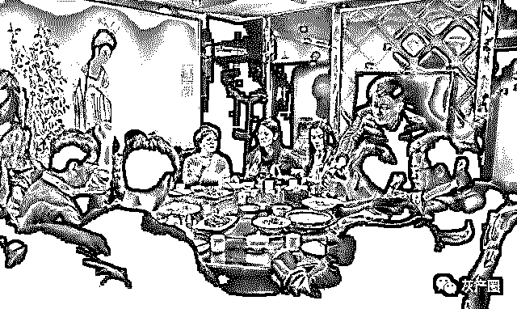
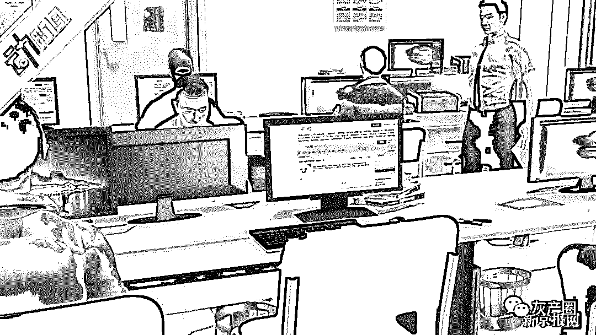
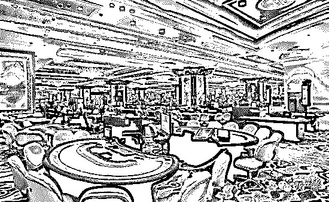
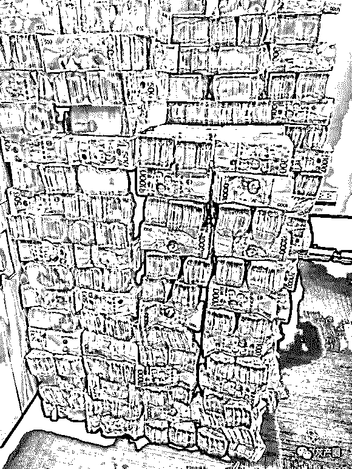
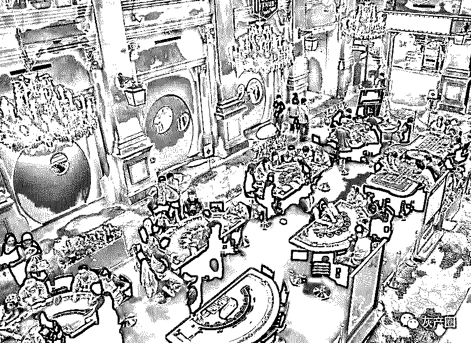
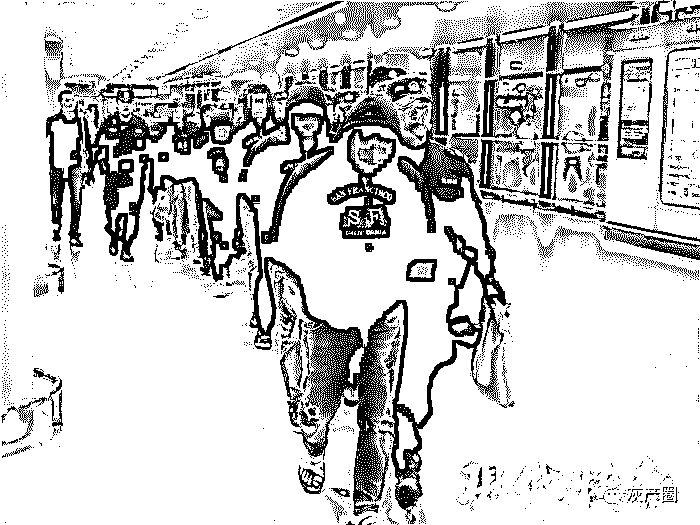
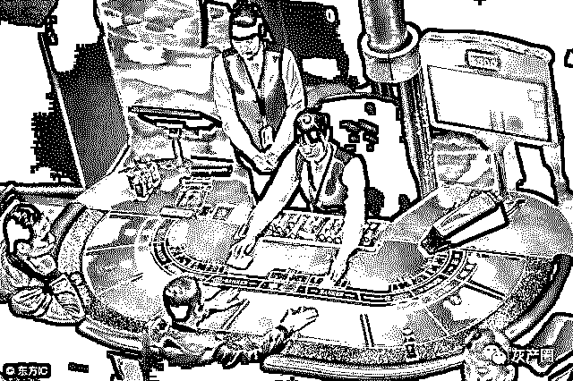
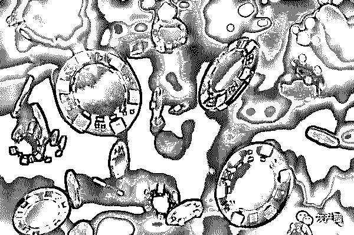

# 菲律宾博彩内幕：40 万业者，75 亿流水，几千个“黑盘”，构成华人网络博彩生态

> 原文：[`mp.weixin.qq.com/s?__biz=MzIyMDYwMTk0Mw==&mid=2247495218&idx=1&sn=4abe1a20b1797417ba0110f99ee2e9ee&chksm=97cb250aa0bcac1c669837645ce10123da1545ff37a6053aaea19aaf11dc8b5861dbeaeb3512&scene=27#wechat_redirect`](http://mp.weixin.qq.com/s?__biz=MzIyMDYwMTk0Mw==&mid=2247495218&idx=1&sn=4abe1a20b1797417ba0110f99ee2e9ee&chksm=97cb250aa0bcac1c669837645ce10123da1545ff37a6053aaea19aaf11dc8b5861dbeaeb3512&scene=27#wechat_redirect)

**点击上方蓝色字体免费订阅“灰产圈”**

“自述”

2018 年 12 月，年关已至，“我”回到了老家福建。很多在外地/国外打拼的游子，都已经回到家乡，准备和家人一起过个团员的春节。

刚回到家乡的我，参加了朋友们的聚会，而在菲律宾从事博彩（菠菜）行业的 CC，也在其中。虽然“我”也在菲律宾，和 CC 有加微信，但是不知道他是从事这个行业，也并没有过多的深入交流。

这次朋友聚会是他牵头做东，从他身上的装扮，和“豪言壮语”看得出来是赚了些钱。

哥几个对这行不了解，处于好奇就想了解一番，酒过三巡之后，听到他自述在菲律宾的工作描述，我才明白，这里面的的故事，原来和我们想象的不一样…..

CC 在菲律宾呆了 1 年，刚出去的时候也是通过中介找的路子，机票和签证大约花了 1 万多。后来到了当地，才知道其实自己被骗了，其实根本不用花钱，连机票和签证都是公司出的。那一万多块是被中介赚了。

在当地中国人大部分是做互联网相关的行业，说是说网络游戏，其实就也是网络菠菜。去菲律宾打工的年轻国人，绝大部分都是从事这个行业。

那么究竟网络博彩（菠菜）在菲律宾合法吗？

CC 的解释是：菲律宾政府确实发放了正规的菠菜执照给一些公司，究竟有多少，他也不得而知。目前不少中国人开的公司，是挂靠这些有牌照的名下。还有的则没有挂靠，偷偷的运营。当地政府也会抓这些无牌照的菠菜公司。

去菲律宾打工的人，大部分是做推广，简称“狗推”！CC 也是其中一员，他主要的工作就是在网上找顾客来网站下注，如果顾客输了，他有抽成。而抽成也是有阶梯的，从 3%到 10%

多的时候，他一个月能挣 5-6 万，少的时候一月也有 1 万多！

听了他的工资收入，我们不禁调侃他，你这是害了多少人？拿到这样的工资？

他说，正常每个月拿 1 万多，业绩其实并不好，因为这里的底薪是叠加制，刚入职是 6000 底薪，每个月增加 500，第二个月就是 6500 底薪，以此类推，封底是 1 万的底薪。所以干满 8 个月，底薪就 1 万了。就算业绩不好，多少也有点抽成，加起来就一万多了….

听完他的描述，感觉去那里工作跟玩似的！我们感觉他在夸大其词。

但是 CC 又说了不少细节…

其实菲律宾工作压力是很大的，没有业绩是不可能在公司长待。当地的公司全部是包吃住，而且底薪还高，如果你真的没业绩，是会被开除的！而且新人进公司，特别是从国内去的，还要压护照，毕竟公司给你出机票，和签证，住宿，伙食费等一切费用。如果你干一个月就不干了，就要赔付 5-6000 块！有些黑公司，甚至更高。如果你赔付不起，没有护照，就回不了国，就算你去大使馆，重新办护照，也要等半个月左右，你在那边的吃住也要花几千块。。。

所以正常去当地打工的人，大部分都是欠债，或无特长想要拼一把的人，也有不少干不了多久时间，就交钱赎护照走人的..........

“深度”

菲律宾的博彩公司，包括无执照的非法博彩公司，雇佣的员工全部都是中国人，他们制度完善，员工数量众多，部门也相当齐全

包括：SEO，前端，美工，推广，人事，电销，客服…等等一系列部门，稍大的公司，都是大几十人起。

而那些没有合法博彩执照的黑公司，则只有 10 几人！

公司内大部分的员工都是推广者，就是俗称的“狗推”！他们一天工作 10 小时，经常加班陪客户聊天，引导客户下注等事宜！

据小编朋友的述说，他们主要通过 QQ，贴吧，微信群，陌陌，等平台发布网赚信息，利用人们的贪念，来参与网赌！
为什么是利用“网赚”两字来引导客户入盘呢？因为只有让你这两个字才能引起大部分人的贪念！
他们通过软件，或扫群的方式大量加人，发布信息：“每天稳赚 2-300” 等诱惑手段来打开客户的心门！

一旦加上好友，前期的对话之后，很多人都已明白这是网赌，选择拉黑不参与！但还有些经不住诱惑，听信了推广者的话，充值 100 元尝试….
为什么人们会觉得投 100 元参与就能稳赚 2-300 元？其实这里面有个他们内部人才知道套路，叫做“数据变动” 。
所谓的“数据变动”，就是盘口每隔段时间就吐水，这个时段是可以通过后台数据预计的！

一个老练的狗推，会预判吐水的时段，带领玩家参与高胜率的玩法，所以客户尝到甜头之后，通常都会一发不可收拾！
相信不少参与网赌的朋友，曾经就试过前期在狗推的带领下赢了不少，后期却输得一发不可收拾！这就是所谓的原因了…
当然，也并非每个狗推对数据判断都准确，有时候也会失手！这只是一个概率，所以前期客户只要听话，多参与几次自然是会赢一些。

这是盘口特意放出的稳定放水模式，他们也不怕顾客赢，原因有三！

> **1：刚进来的客户不会大额下注，让你赢个几百几千没关系。
> 2：人都是有贪念的，让你赢了，你也不会收手，想要更多！
> 3：放水的数据，只有狗推才能预计，所以狗推也不会让你赢太多！否则要自己背的。**

所以，一个老练的狗推，通常都能把控客户的心理，让其尝到甜头，之后让其自生自灭。自己却赚个盆满钵满！这就是为什么这么多人到菲律宾从事狗推的职业了，因为，人性是贪婪的……..

“黑盘”

继续深挖这博彩行业里，最肮脏，最黑心，和打击不尽的一个群体：黑盘！！

什么是黑盘？我们先从简单开始说。

大家知道咱们澳门博彩行业是合法的，因为当地政府批了正规的博彩牌照（只许实体，不许网络博彩），而菲律宾国家政府，也同样批出了五十几个博彩牌照（基本允许网络博彩），这些执照大部分都在国人手上。

虽然菲律宾政府只批了五十几个博彩牌照，可是在菲律宾的博彩盘口（庄家），却多达几千个！

这几千个盘口，分两种。

一：正规盘口，有正规牌照，或授权运营，需要缴税，员工必须办理 9G 签证等正规劳务手续。

二：黑盘口，没有任何授权，独自暗箱操作，大部分也不会给员办理 9G 签证，因为要缴税。

## 黑盘口的特征

成本小，利润高，风险大，通常都躲在别墅区，和小岛上偷偷摸摸的开盘！

黑盘口的工作人员不会太多，7-8 个人就能开始操作，他们的标配是：

> **人事（偶尔要充当客服）**
> 
> **程序员（会解析域名，和基本的网站维护）**
> 
> **推广员（狗推）**

有这三类人就可以开始运作！

黑盘口的运营成本极低，网站和 APP，模板花几千上万块就能重复使用，租房子，伙食，和员工工资，加起来，有小几十万就能开盘，纯靠狗推去拉客户进盘。

有点资金实力的黑盘，会高薪应聘 SEO 黑帽，利用站群的技术，提升百度博彩关键字来获取流量。

这类黑盘大部分不会让客户提现，特别是在你赢钱的情况下！能不能成功提现，要看狗推对你的分析，如果知道客户还有钱可以投入，就会向主管申请让客户提现，当然提现的金额也不会太大，几千到小几万。如果狗推发现你已经榨不出油水，自然也不会同意你的提现，用各种方法阻扰你，甚至直接把你拉黑了！

这些黑盘当服务器获得不错的流量，和充值之后，甚至直接关站断链，重新开盘！原因就是怕被抓，和吸纳客户资金。

菲律宾的黑盘为什么会屡禁不止？因为太隐蔽了，而且客户来自中国，菲律宾当地政府不可能一间一间去排查！

## 黑盘的存在，无论是玩家参与，还是老板或应聘者，都是极为危险的。

## 

> 黑盘玩家

玩家想要在黑盘赢到钱？那是不可能的，运气好小几百，或几千让你提现了，那说明是狗推判断你会继续更大的投入。

> 黑盘老板

老板开黑盘，涉及到诈骗，一旦国内掌握了证据，会以诈骗名义跨国追捕，菲律宾当地如果接到举报，也会追查，所以是很麻烦的！

> 黑盘从业者

黑盘的狗推，由于客户不能提现，谁还会大额充值？正规的盘口，客户是要养的，相互信任才会加大注码。黑盘口只进不出，就算依靠黑帽 SEO 流量做大，流水也是做不起来的！

所以赚不到钱，大部分是混底薪，和正规盘口比起来，黑盘工作轻松些，但收入低，被抓的风险也高……

结尾

看了上述的内幕，相信大家对菲律宾博彩产业有了更深入的认识，灰产圈近期发布的关于博彩的文章比较多，有粉丝反应说“视觉疲劳”了。

为什么如此频繁的推送这类文章，因为近期很多粉丝联系到我们，讲述了自己的赌徒心路历程以及经历，无一例外，结局都是：输！至今还没有人反馈过说自己通过网赌赚了多少，可能只有“代理”诱导别人的时候这么说吧。

据统计，每年因为赌博流入国外的资金达到几百亿人民币，这都是赌徒的“血汗钱”，我们不能帮他们追回资金，我们能做的只能通过自己的微薄力量，通过让大家了解博彩内幕，从而拒绝赌博，不参与，不组织，不接触！

愿赌徒能浪子回头，愿“天下无赌”！

← 向右滑动与灰产圈互动交流 →

**阅读原文加入灰产圈高端社群**